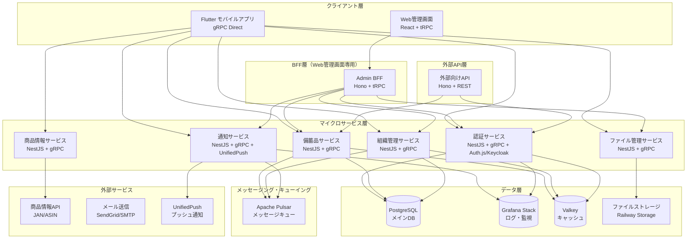
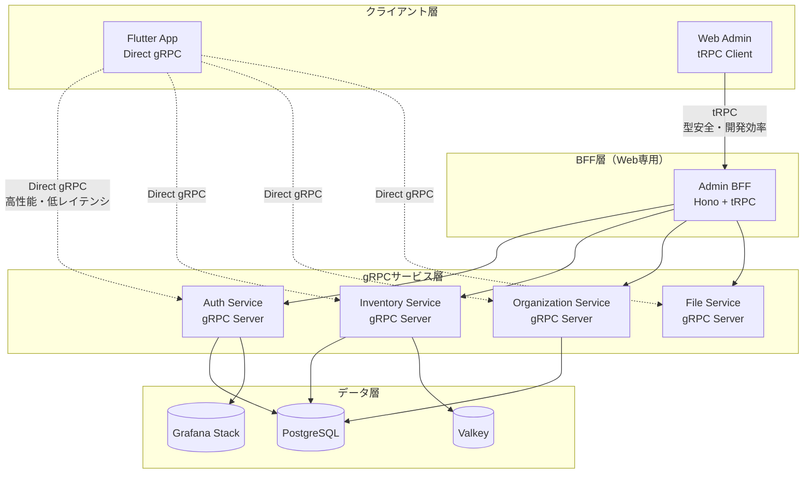
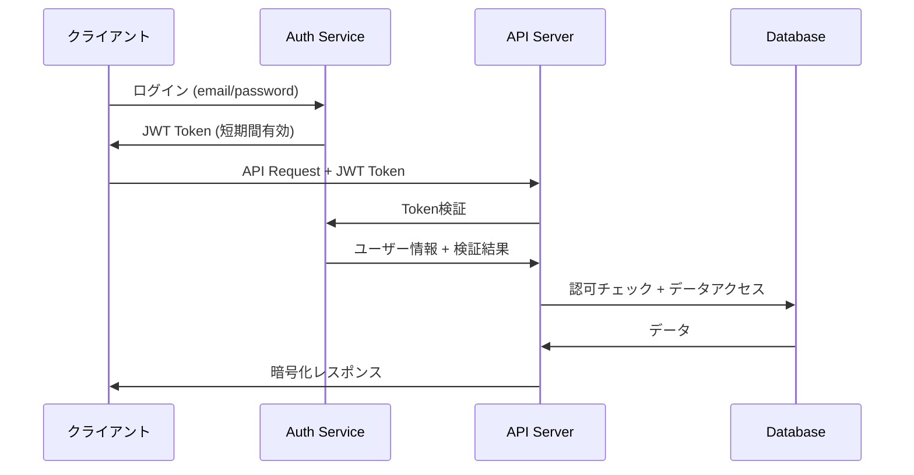

# 設計書

## 概要

備蓄管理用クロスプラットフォームアプリケーションの技術設計書。Android・iOS対応のモバイルアプリ、Web管理画面、バックエンドAPI、クラウドインフラストラクチャを含む包括的なシステム設計。

## アーキテクチャ

### システム全体構成



### 技術スタック選択理由

**フロントエンド:**
- **Flutter + Dart**: 高性能クロスプラットフォーム、ネイティブコンパイル、60fps UI、豊富なウィジェット
- **React + Vite + React Router + React Query + TypeScript**: Web管理画面、高速ビルド、宣言的ルーティング、強力なキャッシュ機能
- **TailwindCSS + shadcn/ui**: ユーティリティファースト、高品質コンポーネント、ダークモード対応
- **Riverpod**: Flutter推奨状態管理、型安全、テスト容易性、リアクティブプログラミング
- **MSW (Mock Service Worker)**: Web管理画面API モック、開発・テスト環境支援

**BFF・API層:**
- **gRPC**: Flutter直接通信、高性能バイナリ通信、Protocol Buffers、型安全性、ストリーミング対応
- **Hono**: Web管理画面専用BFF、軽量高速、Edge Runtime対応、高速ビルド
- **tRPC**: Web管理画面専用、エンドツーエンド型安全性、優れた開発体験

**マイクロサービス:**
- **NestJS + TypeScript + SWC**: DDD/Clean Architecture対応、高速ビルド、依存性注入
- **DDD (Domain Driven Design)**: ドメイン中心設計、ビジネスロジックの分離
- **Clean Architecture**: 依存関係の逆転、レイヤー分離、テスタビリティ向上

**認証:**
- **Auth.js (NextAuth.js)**: 多様なプロバイダー対応、セキュア、オープンソース
- **Keycloak**: エンタープライズ認証、OIDC/SAML対応、自己ホスト可能

**データベース:**
- **PostgreSQL + Prisma ORM**: ACID準拠、データ整合性保証、型安全なクエリ、統一されたデータアクセス
- **Grafana Stack (Loki + Grafana)**: ログ集約・分析・可視化

**キャッシュ・メッセージング:**
- **Valkey**: Redis互換、オープンソース、高性能
- **Apache Pulsar**: 多テナント、地理的レプリケーション、高可用性

**通知:**
- **UnifiedPush**: オープンスタンダード、プライバシー重視、ベンダーロックイン回避

**型安全性・開発ツール:**
- **TypeScript-Go (tsgo)**: Go言語ベースの高速TypeScriptコンパイラ、従来のtscより10倍高速
- **Zod**: ランタイム型検証、スキーマファーストバリデーション
- **zod-prisma-types**: Prismaスキーマから自動Zod型生成
- **tsgolint**: tsgo専用リンター、高速静的解析
- **Biome**: 統一フォーマッター・リンター、Rust製高速ツール
- **lefthook**: Git hooks管理、品質ゲート強制
- **neverthrow**: 関数型エラーハンドリング、Result型による安全なエラー処理
- **type-fest**: 高度なTypeScriptユーティリティ型、型レベルプログラミング支援
- **Prisma**: データベーススキーマからの型生成
- **tRPC**: API契約の型レベル保証

## コンポーネントとインターフェース

### Flutter モバイルアプリ構成

```
lib/
├── core/                # コア機能
│   ├── constants/       # 定数定義
│   ├── errors/          # エラー処理
│   ├── network/         # gRPC クライアント
│   └── utils/           # ユーティリティ
├── data/                # データ層
│   ├── datasources/     # データソース（gRPC、ローカル）
│   ├── models/          # データモデル
│   └── repositories/    # リポジトリ実装
├── domain/              # ドメイン層
│   ├── entities/        # エンティティ
│   ├── repositories/    # リポジトリインターフェース
│   └── usecases/        # ユースケース
├── presentation/        # プレゼンテーション層
│   ├── pages/           # 画面
│   ├── widgets/         # ウィジェット
│   ├── providers/       # Riverpod プロバイダー
│   └── theme/           # テーマ・スタイル
└── generated/           # 自動生成ファイル
    ├── grpc/            # gRPC 生成コード
    └── l10n/            # 国際化
```

### API通信プロトコル選択

#### プロトコル比較分析

**gRPC (モバイル推奨選択)**
- **パフォーマンス**: Protocol Buffers、高速バイナリ通信、ストリーミング対応
- **型安全性**: .protoファイルからの自動コード生成、コンパイル時型チェック
- **効率性**: バイナリシリアライゼーション、HTTP/2多重化
- **ストリーミング**: リアルタイム通知、大容量データ転送
- **言語サポート**: Dart/Flutter完全対応

**tRPC (Web管理画面推奨選択)**
- **型安全性**: TypeScriptネイティブ、エンドツーエンド型安全性
- **開発効率**: 自動型生成、優れたDX
- **Web最適化**: HTTP/JSON、React Query統合
- **エコシステム**: 豊富なミドルウェア、開発ツール

#### 最適化されたハイブリッドアーキテクチャ設計



#### Protocol Buffers 定義

**共通型定義 (proto/common.proto)**
```protobuf
syntax = "proto3";

package inventory.common;

option dart_package = "inventory_grpc";

// 共通メッセージ
message Empty {}

message Timestamp {
  int64 seconds = 1;
  int32 nanos = 2;
}

message Money {
  double amount = 1;
  Currency currency = 2;
}

enum Currency {
  CURRENCY_UNSPECIFIED = 0;
  JPY = 1;
  USD = 2;
  EUR = 3;
}

enum InventoryCategory {
  CATEGORY_UNSPECIFIED = 0;
  FOOD = 1;
  DAILY_GOODS = 2;
  MEDICINE = 3;
  OTHER = 4;
}

enum ExpiryType {
  EXPIRY_TYPE_UNSPECIFIED = 0;
  EXPIRY = 1;        // 消費期限
  BEST_BEFORE = 2;   // 賞味期限
  BOTH = 3;          // 両方
}

enum UserRole {
  USER_ROLE_UNSPECIFIED = 0;
  ADMIN = 1;
  EDITOR = 2;
  VIEWER = 3;
}

// ページネーション
message PageRequest {
  int32 page = 1;
  int32 limit = 2;
}

message PageResponse {
  int32 page = 1;
  int32 limit = 2;
  int64 total = 3;
  bool has_next = 4;
  bool has_prev = 5;
}
```

**認証サービス (proto/auth.proto)**
```protobuf
syntax = "proto3";

package inventory.auth;

import "common.proto";

option dart_package = "inventory_grpc";

service AuthService {
  rpc Register(RegisterRequest) returns (RegisterResponse);
  rpc Login(LoginRequest) returns (LoginResponse);
  rpc RefreshToken(RefreshTokenRequest) returns (RefreshTokenResponse);
  rpc Logout(LogoutRequest) returns (common.Empty);
  rpc ResetPassword(ResetPasswordRequest) returns (common.Empty);
}

message User {
  string id = 1;
  string email = 2;
  string display_name = 3;
  string profile_image = 4;
  bool is_active = 5;
  common.Timestamp created_at = 6;
  common.Timestamp updated_at = 7;
}

message RegisterRequest {
  string email = 1;
  string password = 2;
  string display_name = 3;
}

message RegisterResponse {
  User user = 1;
  string access_token = 2;
  string refresh_token = 3;
  int64 expires_in = 4;
}

message LoginRequest {
  string email = 1;
  string password = 2;
}

message LoginResponse {
  User user = 1;
  string access_token = 2;
  string refresh_token = 3;
  int64 expires_in = 4;
}

message RefreshTokenRequest {
  string refresh_token = 1;
}

message RefreshTokenResponse {
  string access_token = 1;
  string refresh_token = 2;
  int64 expires_in = 3;
}

message LogoutRequest {
  string refresh_token = 1;
}

message ResetPasswordRequest {
  string email = 1;
}
```

**備蓄品サービス (proto/inventory.proto)**
```protobuf
syntax = "proto3";

package inventory.inventory;

import "common.proto";

option dart_package = "inventory_grpc";

service InventoryService {
  rpc ListItems(ListItemsRequest) returns (ListItemsResponse);
  rpc GetItem(GetItemRequest) returns (InventoryItem);
  rpc CreateItem(CreateItemRequest) returns (InventoryItem);
  rpc UpdateItem(UpdateItemRequest) returns (InventoryItem);
  rpc DeleteItem(DeleteItemRequest) returns (common.Empty);
  rpc ConsumeItem(ConsumeItemRequest) returns (ConsumeItemResponse);
  rpc SearchItems(SearchItemsRequest) returns (SearchItemsResponse);
  rpc GetExpiringItems(GetExpiringItemsRequest) returns (GetExpiringItemsResponse);
  rpc GetLowStockItems(GetLowStockItemsRequest) returns (GetLowStockItemsResponse);
}

message InventoryItem {
  string id = 1;
  string organization_id = 2;
  string name = 3;
  string brand = 4;
  common.InventoryCategory category = 5;
  double quantity = 6;
  string unit = 7;
  double min_quantity = 8;
  common.Timestamp expiry_date = 9;
  common.Timestamp best_before_date = 10;
  common.ExpiryType expiry_type = 11;
  string storage_location = 12;
  common.Money price = 13;
  string barcode = 14;
  string asin = 15;
  repeated string tags = 16;
  repeated string images = 17;
  string notes = 18;
  string created_by = 19;
  string updated_by = 20;
  common.Timestamp created_at = 21;
  common.Timestamp updated_at = 22;
}

message ListItemsRequest {
  string organization_id = 1;
  common.PageRequest page = 2;
}

message ListItemsResponse {
  repeated InventoryItem items = 1;
  common.PageResponse page = 2;
}

message CreateItemRequest {
  string organization_id = 1;
  string name = 2;
  string brand = 3;
  common.InventoryCategory category = 4;
  double quantity = 5;
  string unit = 6;
  double min_quantity = 7;
  common.Timestamp expiry_date = 8;
  common.Timestamp best_before_date = 9;
  common.ExpiryType expiry_type = 10;
  string storage_location = 11;
  common.Money price = 12;
  string barcode = 13;
  string asin = 14;
  repeated string tags = 15;
  string notes = 16;
}

message UpdateItemRequest {
  string id = 1;
  string organization_id = 2;
  // 更新可能なフィールド（optional）
  optional string name = 3;
  optional string brand = 4;
  optional common.InventoryCategory category = 5;
  optional double quantity = 6;
  optional string unit = 7;
  optional double min_quantity = 8;
  optional common.Timestamp expiry_date = 9;
  optional common.Timestamp best_before_date = 10;
  optional common.ExpiryType expiry_type = 11;
  optional string storage_location = 12;
  optional common.Money price = 13;
  optional string barcode = 14;
  optional string asin = 15;
  repeated string tags = 16;
  optional string notes = 17;
}

message DeleteItemRequest {
  string id = 1;
  string organization_id = 2;
}

message GetItemRequest {
  string id = 1;
  string organization_id = 2;
}

message ConsumeItemRequest {
  string item_id = 1;
  string organization_id = 2;
  double quantity = 3;
  string reason = 4;
}

message ConsumeItemResponse {
  InventoryItem item = 1;
  double remaining_quantity = 2;
}

message SearchItemsRequest {
  string organization_id = 1;
  string query = 2;
  common.InventoryCategory category = 3;
  string storage_location = 4;
  repeated string tags = 5;
  common.Timestamp expiry_date_from = 6;
  common.Timestamp expiry_date_to = 7;
  string sort_by = 8;
  string sort_order = 9;
  common.PageRequest page = 10;
}

message SearchItemsResponse {
  repeated InventoryItem items = 1;
  common.PageResponse page = 2;
}

message GetExpiringItemsRequest {
  string organization_id = 1;
  int32 days = 2;
  common.PageRequest page = 3;
}

message GetExpiringItemsResponse {
  repeated InventoryItem items = 1;
  common.PageResponse page = 2;
}

message GetLowStockItemsRequest {
  string organization_id = 1;
  common.PageRequest page = 2;
}

message GetLowStockItemsResponse {
  repeated InventoryItem items = 1;
  common.PageResponse page = 2;
}
```

#### tRPC ルーター定義（Web管理画面専用）

**サーバーサイド (server/trpc/router.ts)**
```typescript
import { z } from 'zod';
import { router, publicProcedure, protectedProcedure } from './trpc';
import { TRPCError } from '@trpc/server';

// 入力バリデーションスキーマ
const createInventoryItemSchema = z.object({
  name: z.string().min(1).max(100),
  brand: z.string().optional(),
  category: z.enum(['food', 'daily_goods', 'medicine', 'other']),
  quantity: z.number().min(0),
  unit: z.string().min(1),
  minQuantity: z.number().min(0).optional(),
  expiryDate: z.date().optional(),
  bestBeforeDate: z.date().optional(),
  expiryType: z.enum(['expiry', 'bestBefore', 'both']),
  storageLocation: z.string().optional(),
  price: z.object({
    amount: z.number().min(0),
    currency: z.enum(['JPY', 'USD', 'EUR'])
  }).optional(),
  barcode: z.string().optional(),
  asin: z.string().optional(),
  tags: z.array(z.string()).default([]),
  notes: z.string().optional()
});

const inventorySearchSchema = z.object({
  query: z.string().optional(),
  category: z.enum(['food', 'daily_goods', 'medicine', 'other']).optional(),
  storageLocation: z.string().optional(),
  expiryType: z.enum(['expiry', 'bestBefore', 'both']).optional(),
  tags: z.array(z.string()).optional(),
  expiryDateFrom: z.date().optional(),
  expiryDateTo: z.date().optional(),
  page: z.number().min(1).default(1),
  limit: z.number().min(1).max(100).default(20),
  sortBy: z.enum(['name', 'expiryDate', 'createdAt', 'quantity']).default('createdAt'),
  sortOrder: z.enum(['asc', 'desc']).default('desc')
});

// メインルーター
export const appRouter = router({
  // 認証関連
  auth: router({
    register: publicProcedure
      .input(z.object({
        email: z.string().email(),
        password: z.string().min(8),
        displayName: z.string().min(1)
      }))
      .mutation(async ({ input, ctx }) => {
        // 認証サービス呼び出し + ユーザー作成
        const user = await ctx.authService.register(input);
        return { user, message: 'Registration successful' };
      }),

    login: publicProcedure
      .input(z.object({
        email: z.string().email(),
        password: z.string()
      }))
      .mutation(async ({ input, ctx }) => {
        const result = await ctx.authService.login(input);
        return result;
      }),

    refresh: protectedProcedure
      .mutation(async ({ ctx }) => {
        const tokens = await ctx.authService.refreshTokens(ctx.user.id);
        return tokens;
      })
  }),

  // 組織管理
  organization: router({
    list: protectedProcedure
      .query(async ({ ctx }) => {
        const organizations = await ctx.organizationService.getUserOrganizations(ctx.user.id);
        return organizations;
      }),

    create: protectedProcedure
      .input(z.object({
        name: z.string().min(1).max(50),
        description: z.string().optional(),
        privacy: z.enum(['public', 'private']).default('private')
      }))
      .mutation(async ({ input, ctx }) => {
        const organization = await ctx.organizationService.create({
          ...input,
          createdBy: ctx.user.id
        });
        return organization;
      }),

    invite: protectedProcedure
      .input(z.object({
        organizationId: z.string(),
        email: z.string().email(),
        role: z.enum(['admin', 'editor', 'viewer']).default('editor')
      }))
      .mutation(async ({ input, ctx }) => {
        // 権限チェック
        await ctx.organizationService.checkPermission(
          input.organizationId, 
          ctx.user.id, 
          'invite'
        );
        
        const invitation = await ctx.organizationService.inviteMember(input);
        return invitation;
      })
  }),

  // 備蓄品管理
  inventory: router({
    list: protectedProcedure
      .input(z.object({
        organizationId: z.string()
      }))
      .query(async ({ input, ctx }) => {
        // 組織アクセス権チェック
        await ctx.organizationService.checkMembership(input.organizationId, ctx.user.id);
        
        const items = await ctx.inventoryService.getItems(input.organizationId);
        return items;
      }),

    search: protectedProcedure
      .input(inventorySearchSchema.extend({
        organizationId: z.string()
      }))
      .query(async ({ input, ctx }) => {
        await ctx.organizationService.checkMembership(input.organizationId, ctx.user.id);
        
        const result = await ctx.inventoryService.search(input);
        return result;
      }),

    create: protectedProcedure
      .input(createInventoryItemSchema.extend({
        organizationId: z.string()
      }))
      .mutation(async ({ input, ctx }) => {
        // 書き込み権限チェック
        await ctx.organizationService.checkPermission(
          input.organizationId, 
          ctx.user.id, 
          'write'
        );

        const item = await ctx.inventoryService.create({
          ...input,
          createdBy: ctx.user.id,
          updatedBy: ctx.user.id
        });
        
        // 活動ログ記録
        await ctx.activityService.log({
          organizationId: input.organizationId,
          userId: ctx.user.id,
          action: 'add',
          targetType: 'inventory',
          targetId: item._id,
          details: { name: item.name }
        });

        return item;
      }),

    update: protectedProcedure
      .input(createInventoryItemSchema.partial().extend({
        id: z.string(),
        organizationId: z.string()
      }))
      .mutation(async ({ input, ctx }) => {
        await ctx.organizationService.checkPermission(
          input.organizationId, 
          ctx.user.id, 
          'write'
        );

        const { id, organizationId, ...updateData } = input;
        const item = await ctx.inventoryService.update(id, {
          ...updateData,
          updatedBy: ctx.user.id
        });

        await ctx.activityService.log({
          organizationId,
          userId: ctx.user.id,
          action: 'update',
          targetType: 'inventory',
          targetId: id,
          details: updateData
        });

        return item;
      }),

    consume: protectedProcedure
      .input(z.object({
        itemId: z.string(),
        organizationId: z.string(),
        quantity: z.number().min(0.1),
        reason: z.string().optional()
      }))
      .mutation(async ({ input, ctx }) => {
        await ctx.organizationService.checkPermission(
          input.organizationId, 
          ctx.user.id, 
          'write'
        );

        const result = await ctx.inventoryService.consume({
          ...input,
          userId: ctx.user.id
        });

        await ctx.activityService.log({
          organizationId: input.organizationId,
          userId: ctx.user.id,
          action: 'consume',
          targetType: 'inventory',
          targetId: input.itemId,
          details: { quantity: input.quantity, reason: input.reason }
        });

        return result;
      }),

    getExpiring: protectedProcedure
      .input(z.object({
        organizationId: z.string(),
        days: z.number().min(1).max(365).default(30)
      }))
      .query(async ({ input, ctx }) => {
        await ctx.organizationService.checkMembership(input.organizationId, ctx.user.id);
        
        const items = await ctx.inventoryService.getExpiringItems(
          input.organizationId, 
          input.days
        );
        return items;
      })
  }),

  // 商品情報・バーコード
  product: router({
    getByBarcode: protectedProcedure
      .input(z.object({
        barcode: z.string().min(8).max(13)
      }))
      .query(async ({ input, ctx }) => {
        const product = await ctx.productService.getByBarcode(input.barcode);
        return product;
      }),

    getByAsin: protectedProcedure
      .input(z.object({
        asin: z.string().length(10)
      }))
      .query(async ({ input, ctx }) => {
        const product = await ctx.productService.getByAsin(input.asin);
        return product;
      })
  }),

  // 画像管理
  image: router({
    getUploadUrl: protectedProcedure
      .input(z.object({
        fileName: z.string(),
        contentType: z.string(),
        organizationId: z.string()
      }))
      .mutation(async ({ input, ctx }) => {
        await ctx.organizationService.checkPermission(
          input.organizationId, 
          ctx.user.id, 
          'write'
        );

        const uploadUrl = await ctx.imageService.getUploadUrl(input);
        return uploadUrl;
      }),

    delete: protectedProcedure
      .input(z.object({
        imageId: z.string(),
        organizationId: z.string()
      }))
      .mutation(async ({ input, ctx }) => {
        await ctx.organizationService.checkPermission(
          input.organizationId, 
          ctx.user.id, 
          'delete'
        );

        await ctx.imageService.delete(input.imageId);
        return { success: true };
      })
  })
});

export type AppRouter = typeof appRouter;
```

#### Flutter gRPC クライアント統合

**gRPC クライアント設定 (lib/core/network/grpc_client.dart)**
```dart
import 'package:grpc/grpc.dart';
import 'package:inventory_grpc/inventory_grpc.dart';

class GrpcClient {
  static const String _host = 'api.inventory-app.com';
  static const int _port = 443;
  
  late ClientChannel _channel;
  late AuthServiceClient _authClient;
  late InventoryServiceClient _inventoryClient;
  late OrganizationServiceClient _organizationClient;
  
  // シングルトンパターン
  static final GrpcClient _instance = GrpcClient._internal();
  factory GrpcClient() => _instance;
  GrpcClient._internal();
  
  Future<void> initialize() async {
    _channel = ClientChannel(
      _host,
      port: _port,
      options: const ChannelOptions(
        credentials: ChannelCredentials.secure(),
        keepAlive: ClientKeepAliveOptions(
          keepAliveInterval: Duration(seconds: 30),
          keepAliveTimeout: Duration(seconds: 5),
          keepAliveWithoutCalls: true,
        ),
      ),
    );
    
    _authClient = AuthServiceClient(_channel);
    _inventoryClient = InventoryServiceClient(_channel);
    _organizationClient = OrganizationServiceClient(_channel);
  }
  
  // 認証付きコールオプション
  CallOptions _getAuthCallOptions(String? token) {
    if (token == null) return CallOptions();
    
    return CallOptions(
      metadata: {'authorization': 'Bearer $token'},
      timeout: const Duration(seconds: 30),
    );
  }
  
  // 認証サービス
  AuthServiceClient get auth => _authClient;
  
  // 備蓄品サービス（認証付き）
  InventoryServiceClient inventoryWithAuth(String token) {
    return InventoryServiceClient(
      _channel,
      options: _getAuthCallOptions(token),
    );
  }
  
  // 組織サービス（認証付き）
  OrganizationServiceClient organizationWithAuth(String token) {
    return OrganizationServiceClient(
      _channel,
      options: _getAuthCallOptions(token),
    );
  }
  
  Future<void> dispose() async {
    await _channel.shutdown();
  }
}
```

**リポジトリ実装例 (lib/data/repositories/inventory_repository_impl.dart)**
```dart
import 'package:inventory_grpc/inventory_grpc.dart';
import '../../core/network/grpc_client.dart';
import '../../domain/entities/inventory_item.dart';
import '../../domain/repositories/inventory_repository.dart';
import '../models/inventory_item_model.dart';

class InventoryRepositoryImpl implements InventoryRepository {
  final GrpcClient _grpcClient;
  final String _authToken;
  
  InventoryRepositoryImpl(this._grpcClient, this._authToken);
  
  @override
  Future<List<InventoryItemEntity>> getItems(String organizationId) async {
    try {
      final request = ListItemsRequest()
        ..organizationId = organizationId
        ..page = (PageRequest()
          ..page = 1
          ..limit = 50);
      
      final response = await _grpcClient
          .inventoryWithAuth(_authToken)
          .listItems(request);
      
      return response.items
          .map((item) => InventoryItemModel.fromGrpc(item).toEntity())
          .toList();
    } on GrpcError catch (e) {
      throw _handleGrpcError(e);
    }
  }
  
  @override
  Future<InventoryItemEntity> createItem(CreateInventoryItemRequest request) async {
    try {
      final grpcRequest = CreateItemRequest()
        ..organizationId = request.organizationId
        ..name = request.name
        ..category = _mapCategory(request.category)
        ..quantity = request.quantity
        ..unit = request.unit
        ..expiryType = _mapExpiryType(request.expiryType);
      
      if (request.expiryDate != null) {
        grpcRequest.expiryDate = _mapTimestamp(request.expiryDate!);
      }
      
      final response = await _grpcClient
          .inventoryWithAuth(_authToken)
          .createItem(grpcRequest);
      
      return InventoryItemModel.fromGrpc(response).toEntity();
    } on GrpcError catch (e) {
      throw _handleGrpcError(e);
    }
  }
  
  @override
  Stream<List<InventoryItemEntity>> watchItems(String organizationId) async* {
    // gRPC ストリーミングを使用したリアルタイム更新
    // 実装は要件に応じて
    yield* Stream.periodic(
      const Duration(seconds: 30),
      (_) => getItems(organizationId),
    ).asyncMap((future) => future);
  }
  
  // エラーハンドリング
  Exception _handleGrpcError(GrpcError error) {
    switch (error.code) {
      case StatusCode.unauthenticated:
        return UnauthorizedException(error.message);
      case StatusCode.permissionDenied:
        return ForbiddenException(error.message);
      case StatusCode.notFound:
        return NotFoundException(error.message);
      case StatusCode.invalidArgument:
        return ValidationException(error.message);
      default:
        return ServerException(error.message ?? 'Unknown error');
    }
  }
  
  // 型変換ヘルパー
  InventoryCategory _mapCategory(InventoryItemCategory category) {
    switch (category) {
      case InventoryItemCategory.food:
        return InventoryCategory.FOOD;
      case InventoryItemCategory.dailyGoods:
        return InventoryCategory.DAILY_GOODS;
      case InventoryItemCategory.medicine:
        return InventoryCategory.MEDICINE;
      case InventoryItemCategory.other:
        return InventoryCategory.OTHER;
    }
  }
  
  ExpiryType _mapExpiryType(InventoryItemExpiryType type) {
    switch (type) {
      case InventoryItemExpiryType.expiry:
        return ExpiryType.EXPIRY;
      case InventoryItemExpiryType.bestBefore:
        return ExpiryType.BEST_BEFORE;
      case InventoryItemExpiryType.both:
        return ExpiryType.BOTH;
    }
  }
  
  Timestamp _mapTimestamp(DateTime dateTime) {
    return Timestamp()
      ..seconds = dateTime.millisecondsSinceEpoch ~/ 1000
      ..nanos = (dateTime.millisecondsSinceEpoch % 1000) * 1000000;
  }
}
```

**Riverpod プロバイダー (lib/presentation/providers/inventory_provider.dart)**
```dart
import 'package:flutter_riverpod/flutter_riverpod.dart';
import '../../domain/entities/inventory_item.dart';
import '../../domain/usecases/get_inventory_items.dart';
import '../../domain/usecases/create_inventory_item.dart';

// 備蓄品一覧プロバイダー
final inventoryItemsProvider = FutureProvider.family<List<InventoryItemEntity>, String>(
  (ref, organizationId) async {
    final useCase = ref.read(getInventoryItemsUseCaseProvider);
    return await useCase(organizationId);
  },
);

// 備蓄品作成プロバイダー
final createInventoryItemProvider = Provider<CreateInventoryItem>(
  (ref) => ref.read(createInventoryItemUseCaseProvider),
);

// 選択された備蓄品プロバイダー
final selectedInventoryItemProvider = StateProvider<InventoryItemEntity?>(
  (ref) => null,
);

// 検索クエリプロバイダー
final inventorySearchQueryProvider = StateProvider<String>(
  (ref) => '',
);

// フィルタリングされた備蓄品プロバイダー
final filteredInventoryItemsProvider = Provider<AsyncValue<List<InventoryItemEntity>>>(
  (ref) {
    final itemsAsync = ref.watch(inventoryItemsProvider('current_org_id'));
    final searchQuery = ref.watch(inventorySearchQueryProvider);
    
    return itemsAsync.when(
      data: (items) {
        if (searchQuery.isEmpty) {
          return AsyncValue.data(items);
        }
        
        final filtered = items.where((item) =>
          item.name.toLowerCase().contains(searchQuery.toLowerCase()) ||
          (item.brand?.toLowerCase().contains(searchQuery.toLowerCase()) ?? false)
        ).toList();
        
        return AsyncValue.data(filtered);
      },
      loading: () => const AsyncValue.loading(),
      error: (error, stack) => AsyncValue.error(error, stack),
    );
  },
);
```

**Flutter ウィジェット使用例 (lib/presentation/pages/inventory_list_page.dart)**
```dart
import 'package:flutter/material.dart';
import 'package:flutter_riverpod/flutter_riverpod.dart';
import '../providers/inventory_provider.dart';
import '../widgets/inventory_item_card.dart';

class InventoryListPage extends ConsumerWidget {
  const InventoryListPage({super.key});
  
  @override
  Widget build(BuildContext context, WidgetRef ref) {
    final inventoryItemsAsync = ref.watch(filteredInventoryItemsProvider);
    
    return Scaffold(
      appBar: AppBar(
        title: const Text('備蓄品一覧'),
        actions: [
          IconButton(
            icon: const Icon(Icons.search),
            onPressed: () => _showSearchDialog(context, ref),
          ),
        ],
      ),
      body: inventoryItemsAsync.when(
        data: (items) => ListView.builder(
          itemCount: items.length,
          itemBuilder: (context, index) {
            final item = items[index];
            return InventoryItemCard(
              item: item,
              onTap: () => _navigateToDetail(context, item),
              onConsume: () => _showConsumeDialog(context, ref, item),
            );
          },
        ),
        loading: () => const Center(
          child: CircularProgressIndicator(),
        ),
        error: (error, stack) => Center(
          child: Column(
            mainAxisAlignment: MainAxisAlignment.center,
            children: [
              Text('エラーが発生しました: $error'),
              ElevatedButton(
                onPressed: () => ref.refresh(inventoryItemsProvider('current_org_id')),
                child: const Text('再試行'),
              ),
            ],
          ),
        ),
      ),
      floatingActionButton: FloatingActionButton(
        onPressed: () => _navigateToCreate(context),
        child: const Icon(Icons.add),
      ),
    );
  }
  
  void _showSearchDialog(BuildContext context, WidgetRef ref) {
    showDialog(
      context: context,
      builder: (context) => AlertDialog(
        title: const Text('検索'),
        content: TextField(
          onChanged: (value) {
            ref.read(inventorySearchQueryProvider.notifier).state = value;
          },
          decoration: const InputDecoration(
            hintText: '商品名またはブランド名を入力',
          ),
        ),
        actions: [
          TextButton(
            onPressed: () => Navigator.pop(context),
            child: const Text('閉じる'),
          ),
        ],
      ),
    );
  }
  
  void _navigateToDetail(BuildContext context, InventoryItemEntity item) {
    // 詳細画面への遷移
  }
  
  void _navigateToCreate(BuildContext context) {
    // 作成画面への遷移
  }
  
  void _showConsumeDialog(BuildContext context, WidgetRef ref, InventoryItemEntity item) {
    // 消費ダイアログの表示
  }
}
```

#### Web管理画面 tRPC クライアント

**React クライアント (client/trpc.ts)**
```typescript
import { createTRPCReact } from '@trpc/react-query';
import { createTRPCMsw } from 'msw-trpc';
import type { AppRouter } from '../server/trpc/router';

// tRPC React フック
export const trpc = createTRPCReact<AppRouter>();

// MSW モック (テスト用)
export const trpcMsw = createTRPCMsw<AppRouter>();

// クライアント設定
import { httpBatchLink } from '@trpc/client';
import { createTRPCClient } from '@trpc/client';

export const trpcClient = createTRPCClient<AppRouter>({
  links: [
    httpBatchLink({
      url: 'https://api.inventory-app.com/trpc',
      headers: async () => {
        const token = await getAuthToken();
        return {
          authorization: token ? `Bearer ${token}` : '',
        };
      },
    }),
  ],
});
```

#### 型安全性の利点

**コンパイル時保証**
- API契約の自動同期
- 型不整合の即座検出
- リファクタリング安全性

**開発体験向上**
- 自動補完・IntelliSense
- エラーの早期発見
- ドキュメント不要

## データベース設計

### Prisma スキーマ定義 (prisma/schema.prisma)

```prisma
generator client {
  provider = "prisma-client-js"
}

generator kysely {
  provider = "prisma-kysely"
}

datasource db {
  provider = "postgresql"
  url      = env("DATABASE_URL")
}

// ユーザー
model User {
  id          String   @id @default(cuid())
  email       String   @unique
  displayName String
  authId      String   @unique // Auth.js/Keycloak ID
  profileImage String?
  isActive    Boolean  @default(true)
  createdAt   DateTime @default(now())
  updatedAt   DateTime @updatedAt

  // リレーション
  organizationMembers OrganizationMember[]
  createdOrganizations Organization[] @relation("OrganizationCreator")
  createdInventoryItems InventoryItem[] @relation("InventoryItemCreator")
  updatedInventoryItems InventoryItem[] @relation("InventoryItemUpdater")
  consumptionLogs ConsumptionLog[]
  activityLogs    ActivityLog[]

  @@map("users")
}

// 組織
model Organization {
  id          String   @id @default(cuid())
  name        String
  description String?
  inviteCode  String   @unique @default(cuid())
  privacy     Privacy  @default(PRIVATE)
  isActive    Boolean  @default(true)
  createdById String
  createdAt   DateTime @default(now())
  updatedAt   DateTime @updatedAt

  // リレーション
  createdBy     User                 @relation("OrganizationCreator", fields: [createdById], references: [id])
  members       OrganizationMember[]
  inventoryItems InventoryItem[]
  consumptionLogs ConsumptionLog[]
  activityLogs  ActivityLog[]

  @@map("organizations")
}

// 組織メンバー
model OrganizationMember {
  id             String   @id @default(cuid())
  organizationId String
  userId         String
  role           UserRole @default(EDITOR)
  permissions    Permission[]
  joinedAt       DateTime @default(now())
  isActive       Boolean  @default(true)

  // リレーション
  organization Organization @relation(fields: [organizationId], references: [id], onDelete: Cascade)
  user         User         @relation(fields: [userId], references: [id], onDelete: Cascade)

  @@unique([organizationId, userId])
  @@map("organization_members")
}

// 備蓄品
model InventoryItem {
  id             String            @id @default(cuid())
  organizationId String
  name           String
  brand          String?
  category       InventoryCategory
  quantity       Decimal           @db.Decimal(10, 3)
  unit           String
  minQuantity    Decimal?          @db.Decimal(10, 3)
  
  // 期限管理
  expiryDate     DateTime?
  bestBeforeDate DateTime?
  expiryType     ExpiryType
  
  // 保管・価格情報
  storageLocation String?
  priceAmount     Decimal?  @db.Decimal(10, 2)
  priceCurrency   Currency?
  
  // 商品識別
  barcode        String?
  asin           String?
  
  // メタデータ
  tags           String[]
  images         String[]
  notes          String?
  
  // 履歴
  createdById    String
  updatedById    String
  createdAt      DateTime @default(now())
  updatedAt      DateTime @updatedAt

  // リレーション
  organization    Organization     @relation(fields: [organizationId], references: [id], onDelete: Cascade)
  createdBy       User             @relation("InventoryItemCreator", fields: [createdById], references: [id])
  updatedBy       User             @relation("InventoryItemUpdater", fields: [updatedById], references: [id])
  consumptionLogs ConsumptionLog[]

  // インデックス
  @@index([organizationId, name])
  @@index([organizationId, expiryDate])
  @@index([organizationId, category])
  @@index([barcode])
  @@map("inventory_items")
}

// 消費履歴
model ConsumptionLog {
  id              String    @id @default(cuid())
  inventoryItemId String
  organizationId  String
  userId          String
  quantity        Decimal   @db.Decimal(10, 3)
  reason          String?
  consumedAt      DateTime
  createdAt       DateTime  @default(now())

  // リレーション
  inventoryItem InventoryItem @relation(fields: [inventoryItemId], references: [id], onDelete: Cascade)
  organization  Organization  @relation(fields: [organizationId], references: [id], onDelete: Cascade)
  user          User          @relation(fields: [userId], references: [id])

  @@index([organizationId, consumedAt])
  @@index([inventoryItemId, consumedAt])
  @@map("consumption_logs")
}

// 活動ログ
model ActivityLog {
  id             String       @id @default(cuid())
  organizationId String
  userId         String
  action         ActivityAction
  targetType     String
  targetId       String
  details        Json
  createdAt      DateTime     @default(now())

  // リレーション
  organization Organization @relation(fields: [organizationId], references: [id], onDelete: Cascade)
  user         User         @relation(fields: [userId], references: [id])

  @@index([organizationId, createdAt])
  @@index([userId, createdAt])
  @@map("activity_logs")
}

// 列挙型定義
enum UserRole {
  ADMIN
  EDITOR
  VIEWER
}

enum Permission {
  READ
  WRITE
  DELETE
  INVITE
  MANAGE
}

enum Privacy {
  PUBLIC
  PRIVATE
}

enum ExpiryType {
  EXPIRY      // 消費期限
  BEST_BEFORE // 賞味期限
  BOTH        // 両方
}

enum InventoryCategory {
  FOOD
  DAILY_GOODS
  MEDICINE
  OTHER
}

enum Currency {
  JPY
  USD
  EUR
}

enum ActivityAction {
  ADD
  UPDATE
  DELETE
  CONSUME
}
```

### Prisma Repository Pattern (DDD)

**ドメインリポジトリ実装 (infrastructure/persistence/prisma/)**
```typescript
// domain/entities/inventory-item.entity.ts
export class InventoryItem {
  constructor(
    private readonly id: string,
    private readonly organizationId: string,
    private name: string,
    private quantity: number,
    private readonly expiryDate?: Date,
    private readonly bestBeforeDate?: Date
  ) {}

  public updateQuantity(newQuantity: number): void {
    if (newQuantity < 0) {
      throw new Error('Quantity cannot be negative');
    }
    this.quantity = newQuantity;
  }

  public isExpiring(days: number): boolean {
    const futureDate = new Date();
    futureDate.setDate(futureDate.getDate() + days);
    
    return (this.expiryDate && this.expiryDate <= futureDate) ||
           (this.bestBeforeDate && this.bestBeforeDate <= futureDate);
  }

  // Getters
  public getId(): string { return this.id; }
  public getName(): string { return this.name; }
  public getQuantity(): number { return this.quantity; }
  public getOrganizationId(): string { return this.organizationId; }
}

// application/ports/inventory.repository.ts
export interface InventoryRepository {
  findByOrganization(organizationId: string): Promise<InventoryItem[]>;
  findExpiring(organizationId: string, days: number): Promise<InventoryItem[]>;
  save(item: InventoryItem): Promise<void>;
  findById(id: string): Promise<InventoryItem | null>;
}

// infrastructure/persistence/prisma/inventory.repository.ts
@Injectable()
export class PrismaInventoryRepository implements InventoryRepository {
  constructor(private readonly prisma: PrismaService) {}

  async findByOrganization(organizationId: string): Promise<InventoryItem[]> {
    const items = await this.prisma.inventoryItem.findMany({
      where: { 
        organizationId,
        quantity: { gt: 0 }
      },
      orderBy: { expiryDate: 'asc' }
    });

    return items.map(item => this.toDomain(item));
  }

  async findExpiring(organizationId: string, days: number): Promise<InventoryItem[]> {
    const futureDate = new Date();
    futureDate.setDate(futureDate.getDate() + days);

    const items = await this.prisma.inventoryItem.findMany({
      where: {
        organizationId,
        OR: [
          { expiryDate: { lte: futureDate } },
          { bestBeforeDate: { lte: futureDate } }
        ]
      },
      orderBy: { expiryDate: 'asc' }
    });

    return items.map(item => this.toDomain(item));
  }

  async save(item: InventoryItem): Promise<void> {
    await this.prisma.inventoryItem.upsert({
      where: { id: item.getId() },
      update: {
        name: item.getName(),
        quantity: item.getQuantity(),
        updatedAt: new Date()
      },
      create: {
        id: item.getId(),
        organizationId: item.getOrganizationId(),
        name: item.getName(),
        quantity: item.getQuantity(),
        category: 'FOOD', // デフォルト値
        unit: '個',
        expiryType: 'BOTH',
        createdById: 'system',
        updatedById: 'system'
      }
    });
  }

  async findById(id: string): Promise<InventoryItem | null> {
    const item = await this.prisma.inventoryItem.findUnique({
      where: { id }
    });

    return item ? this.toDomain(item) : null;
  }

  private toDomain(prismaItem: any): InventoryItem {
    return new InventoryItem(
      prismaItem.id,
      prismaItem.organizationId,
      prismaItem.name,
      Number(prismaItem.quantity),
      prismaItem.expiryDate,
      prismaItem.bestBeforeDate
    );
  }
}

// application/use-cases/get-inventory-items.use-case.ts
@Injectable()
export class GetInventoryItemsUseCase {
  constructor(
    private readonly inventoryRepository: InventoryRepository
  ) {}

  async execute(organizationId: string): Promise<InventoryItem[]> {
    return await this.inventoryRepository.findByOrganization(organizationId);
  }
}
```

### Grafana Stack ログ・分析データ

**ログ設定 (Grafana Loki)**
```typescript
// infrastructure/logging/loki.config.ts
export const lokiConfig = {
  url: process.env.LOKI_URL || 'http://loki:3100',
  labels: {
    app: 'inventory-management',
    environment: process.env.NODE_ENV || 'development',
  },
  batching: {
    batchSize: 1000,
    batchInterval: 5000, // 5秒
  },
};

// infrastructure/logging/logger.service.ts
import { Injectable } from '@nestjs/common';
import { createLogger, format, transports } from 'winston';
import LokiTransport from 'winston-loki';

@Injectable()
export class LoggerService {
  private logger;

  constructor() {
    this.logger = createLogger({
      format: format.combine(
        format.timestamp(),
        format.json(),
      ),
      transports: [
        new LokiTransport({
          host: lokiConfig.url,
          labels: lokiConfig.labels,
          json: true,
          batching: true,
          interval: lokiConfig.batching.batchInterval,
          replaceTimestamp: true,
        }),
        new transports.Console({
          format: format.combine(
            format.colorize(),
            format.simple(),
          ),
        }),
      ],
    });
  }

  log(level: string, message: string, metadata?: any) {
    this.logger.log(level, message, metadata);
  }

  error(message: string, trace?: string, metadata?: any) {
    this.logger.error(message, { trace, ...metadata });
  }

  warn(message: string, metadata?: any) {
    this.logger.warn(message, metadata);
  }

  info(message: string, metadata?: any) {
    this.logger.info(message, metadata);
  }

  debug(message: string, metadata?: any) {
    this.logger.debug(message, metadata);
  }
}

// 使用例
@Injectable()
export class InventoryService {
  constructor(private readonly logger: LoggerService) {}

  async createItem(data: CreateInventoryItemDto): Promise<InventoryItem> {
    this.logger.info('Creating inventory item', {
      organizationId: data.organizationId,
      itemName: data.name,
      userId: data.createdBy,
    });

    try {
      const item = await this.repository.create(data);
      
      this.logger.info('Inventory item created successfully', {
        itemId: item.id,
        organizationId: item.organizationId,
      });

      return item;
    } catch (error) {
      this.logger.error('Failed to create inventory item', error.stack, {
        organizationId: data.organizationId,
        error: error.message,
      });
      throw error;
    }
  }
}
```

## エラーハンドリング

### エラー分類と対応

**認証エラー (4xx)**
- 401 Unauthorized: トークン無効・期限切れ → 再ログイン促進
- 403 Forbidden: 権限不足 → 適切な権限レベル表示

**バリデーションエラー (400)**
- 必須フィールド不足
- データ形式不正
- 業務ルール違反

**サーバーエラー (5xx)**
- 500 Internal Server Error: 一般的なサーバーエラー
- 503 Service Unavailable: メンテナンス中

### オフライン対応

**データ同期戦略:**
1. **楽観的更新**: ローカル変更を即座に反映
2. **バックグラウンド同期**: 接続復旧時に自動同期
3. **競合解決**: タイムスタンプベースの最新優先

**ローカルストレージ:**
- Hive/SQLite (Flutter): オフラインデータ保存
- SharedPreferences: アプリ状態の永続化

## テスト戦略

### テスト階層

**Unit Tests (単体テスト)**
- ユーティリティ関数
- データ変換ロジック
- バリデーション関数

**Integration Tests (統合テスト)**
- API エンドポイントテスト
- **Testcontainers**: PostgreSQL/Valkey テスト環境
- データベース操作
- 外部サービス連携

**E2E Tests (エンドツーエンドテスト)**
- 主要ユーザーフロー
- 認証・組織作成・備蓄品管理

### テストツール
- **Vitest**: 高速単体テスト
- **Supertest**: API統合テスト
- **Stagehand**: Flutter E2Eテスト
- **Testcontainers**: 統合テスト用コンテナ環境

### テストデータ管理
- **Fixtures**: 標準テストデータセット
- **Factory Pattern**: 動的テストデータ生成
- **Database Seeding**: 開発環境データ投入

## セキュリティ考慮事項

### 通信セキュリティ

**HTTPS/TLS 1.3 強制**
- 全ての通信でTLS 1.3を強制
- Certificate Pinning: アプリに証明書を埋め込み、中間者攻撃を防止
- HSTS (HTTP Strict Transport Security) ヘッダーで強制HTTPS

**API認証フロー**


**トークン管理戦略**
- **Access Token**: 15分有効期限、API認証用
- **Refresh Token**: 7日有効期限、セキュアストレージ保存
- **Token Rotation**: リフレッシュ時に新しいRefresh Tokenを発行
- **Revocation**: 不正アクセス検知時の即座トークン無効化

### 認証・認可

**多層認証システム**
1. **Auth.js/Keycloak**: 初期認証
2. **Custom Claims**: 組織・権限情報をトークンに埋め込み
3. **API Level Authorization**: エンドポイント毎の権限チェック
4. **Resource Level Authorization**: データレベルでの所有権確認

**権限管理モデル**
```javascript
// Custom Claims 構造
{
  organizations: {
    "org_id_1": {
      role: "admin",        // admin/editor/viewer
      permissions: ["read", "write", "delete", "invite"]
    },
    "org_id_2": {
      role: "viewer",
      permissions: ["read"]
    }
  }
}
```

### データ保護

**エンドツーエンド暗号化**
- **AES-256-GCM**: 機密データの暗号化
- **Key Derivation**: PBKDF2 + Salt でユーザー固有キー生成
- **Key Management**: Railway Secrets でキー管理

**データ分類と保護レベル**
```javascript
// データ分類例
const DATA_CLASSIFICATION = {
  PUBLIC: {
    encryption: false,
    examples: ["商品カテゴリ", "公開統計"]
  },
  INTERNAL: {
    encryption: "transit",
    examples: ["商品名", "保管場所"]
  },
  CONFIDENTIAL: {
    encryption: "end-to-end",
    examples: ["個人メモ", "価格情報"]
  },
  RESTRICTED: {
    encryption: "end-to-end",
    audit: true,
    examples: ["ユーザー個人情報", "組織招待コード"]
  }
};
```

**入力検証・サニタイゼーション**
- **Schema Validation**: Zod による厳密な入力検証
- **SQL Injection 防止**: Parameterized Queries
- **XSS 防止**: Content Security Policy + 入力エスケープ
- **File Upload 検証**: ファイル形式・サイズ・内容検証

### API セキュリティ

**レート制限・DDoS対策**
```javascript
// レート制限設定例
const RATE_LIMITS = {
  authentication: "5 requests per minute",
  search: "100 requests per minute",
  upload: "10 requests per minute",
  general: "1000 requests per hour"
};
```

**API セキュリティヘッダー**
```javascript
// セキュリティヘッダー設定
const SECURITY_HEADERS = {
  "Strict-Transport-Security": "max-age=31536000; includeSubDomains",
  "Content-Security-Policy": "default-src 'self'",
  "X-Frame-Options": "DENY",
  "X-Content-Type-Options": "nosniff",
  "Referrer-Policy": "strict-origin-when-cross-origin",
  "Permissions-Policy": "camera=(), microphone=(), geolocation=()"
};
```

**リクエスト署名検証**
- **HMAC-SHA256**: リクエストボディの署名検証
- **Timestamp Validation**: リプレイ攻撃防止 (5分以内の有効期限)
- **Nonce**: 一意性保証でリプレイ攻撃防止

### 監査・ログ

**セキュリティ監査ログ**
```javascript
// 監査ログ構造
{
  timestamp: "2024-01-01T00:00:00Z",
  userId: "user_id",
  organizationId: "org_id",
  action: "inventory.delete",
  resource: "item_id",
  ipAddress: "192.168.1.1",
  userAgent: "...",
  result: "success|failure",
  riskScore: 0.2,        // 0-1 のリスクスコア
  metadata: {
    previousValue: "...",
    newValue: "..."
  }
}
```

**異常検知・アラート**
- **ログイン異常**: 地理的位置・時間・デバイスの変化
- **大量操作**: 短時間での大量データ変更
- **権限昇格**: 通常と異なる権限での操作
- **データ流出**: 大量データダウンロード

### プライバシー・コンプライアンス

**GDPR/個人情報保護法対応**
- **データ最小化**: 必要最小限のデータ収集
- **同意管理**: 明示的な同意取得・管理
- **忘れられる権利**: 完全なデータ削除機能
- **データポータビリティ**: データエクスポート機能

**データ保持ポリシー**
```javascript
const DATA_RETENTION = {
  userAccount: "アカウント削除後30日で完全削除",
  inventoryData: "組織退会後90日で匿名化",
  auditLogs: "7年間保持（法的要件）",
  images: "参照されなくなった後1年で削除"
};
```

### セキュリティテスト

**ペネトレーションテスト**
- **OWASP Top 10**: 定期的な脆弱性スキャン
- **API Security**: 認証・認可の抜け穴チェック
- **Mobile Security**: アプリの逆解析・改ざん対策

**セキュリティ監視**
- **SIEM**: セキュリティ情報・イベント管理
- **WAF**: Web Application Firewall
- **IDS/IPS**: 侵入検知・防止システム

## パフォーマンス最適化

### フロントエンド最適化
- **画像最適化**: WebP形式、適切なサイズ変換
- **遅延読み込み**: 大量リストの仮想化
- **キャッシュ戦略**: API レスポンスキャッシュ

### バックエンド最適化
- **データベースインデックス**: 検索・ソート性能向上
- **Valkey キャッシュ**: 頻繁アクセスデータ
- **CDN**: 画像配信最適化

### モニタリング
- **APM**: Jaeger + Prometheus によるアプリケーション性能監視
- **ログ集約**: Grafana Stack による構造化ログ、エラー追跡
- **メトリクス**: レスポンス時間、エラー率

## デプロイメント・インフラ

### 開発環境
- **Docker**: 開発環境統一
- **Docker Compose**: ローカル開発スタック

### 本番環境 (Railway)
- **Railway Services**: コンテナデプロイメント
- **Railway Database**: PostgreSQL マネージドサービス
- **Railway Storage**: ファイルストレージ
- **Railway Networking**: 負荷分散・DNS管理

### CI/CD パイプライン
- **GitHub Actions**: 自動テスト・デプロイ
- **Staging環境**: 本番前検証
- **Blue-Green デプロイ**: ゼロダウンタイム更新

## ビルドツール・モノレポ構成

### Turborepo モノレポ構成

```
inventory-app/
├── apps/
│   ├── mobile/                 # Flutter アプリ
│   ├── web-admin/             # React 管理画面
│   ├── admin-bff/             # Hono Admin BFF
│   ├── external-api/          # Hono 外部API
│   └── services/
│       ├── auth-service/      # NestJS 認証サービス
│       ├── inventory-service/ # NestJS 備蓄品サービス
│       ├── org-service/       # NestJS 組織サービス
│       ├── notify-service/    # NestJS 通知サービス
│       ├── file-service/      # NestJS ファイルサービス
│       └── product-service/   # NestJS 商品情報サービス
├── packages/
│   ├── shared-types/          # 共有型定義 (type-fest活用)
│   ├── trpc-router/          # tRPC ルーター定義
│   ├── database/             # Prisma スキーマ・マイグレーション
│   ├── ui-components/        # 共有UIコンポーネント (shadcn/ui)
│   ├── state-management/     # Zustand + Immer 状態管理
│   ├── utils/                # 共通ユーティリティ (neverthrow活用)
│   ├── error-handling/       # エラーハンドリング共通ライブラリ
│   ├── mocks/                # MSW モック定義
│   └── config/               # 共通設定
├── tools/
│   ├── biome-config/         # Biome 設定
│   ├── tsgo-config/          # tsgo TypeScript 設定
│   ├── tsgolint-config/      # tsgolint 設定
│   ├── vitest-config/        # Vitest 設定
│   └── lefthook-config/      # lefthook Git hooks 設定
└── turbo.json                # Turborepo 設定
```

### Turborepo 設定 (turbo.json)

```json
{
  "$schema": "https://turbo.build/schema.json",
  "globalDependencies": ["**/.env.*local"],
  "pipeline": {
    "build": {
      "dependsOn": ["^build"],
      "outputs": ["dist/**", ".next/**", "build/**"]
    },
    "test": {
      "dependsOn": ["^build"],
      "outputs": ["coverage/**"]
    },
    "test:unit": {
      "dependsOn": ["^build"]
    },
    "test:integration": {
      "dependsOn": ["^build", "db:migrate"]
    },
    "test:e2e": {
      "dependsOn": ["^build", "db:migrate", "dev"]
    },
    "lint": {
      "outputs": []
    },
    "lint:tsgolint": {
      "outputs": []
    },
    "format": {
      "outputs": []
    },
    "format:check": {
      "outputs": []
    },
    "type-check": {
      "dependsOn": ["^build"],
      "outputs": []
    },
    "dev": {
      "cache": false,
      "persistent": true
    },
    "db:migrate": {
      "cache": false
    },
    "db:generate": {
      "dependsOn": ["^db:generate"],
      "outputs": ["node_modules/.prisma/**"]
    }
  }
}
```

### ビルドツール統合

**tsgo + Biome 設定**

```json
// tools/tsgo-config/tsconfig.base.json
{
  "compilerOptions": {
    "target": "ES2022",
    "module": "ESNext",
    "moduleResolution": "bundler",
    "strict": true,
    "exactOptionalPropertyTypes": true,
    "noUncheckedIndexedAccess": true,
    "noImplicitOverride": true,
    "declaration": true,
    "declarationMap": true,
    "sourceMap": true,
    "composite": true,
    "skipLibCheck": true,
    "allowSyntheticDefaultImports": true,
    "esModuleInterop": true,
    "forceConsistentCasingInFileNames": true
  },
  "exclude": ["node_modules", "dist", "build"]
}
```

```json
// tools/biome-config/biome.json
{
  "$schema": "https://biomejs.dev/schemas/1.4.1/schema.json",
  "organizeImports": {
    "enabled": true
  },
  "linter": {
    "enabled": true,
    "rules": {
      "recommended": true,
      "complexity": {
        "noExtraBooleanCast": "error",
        "noMultipleSpacesInRegularExpressionLiterals": "error",
        "noUselessCatch": "error",
        "noUselessTypeConstraint": "error"
      },
      "correctness": {
        "noConstAssign": "error",
        "noConstantCondition": "error",
        "noEmptyCharacterClassInRegex": "error",
        "noEmptyPattern": "error",
        "noGlobalObjectCalls": "error",
        "noInvalidConstructorSuper": "error",
        "noInvalidNewBuiltin": "error",
        "noNonoctalDecimalEscape": "error",
        "noPrecisionLoss": "error",
        "noSelfAssign": "error",
        "noSetterReturn": "error",
        "noSwitchDeclarations": "error",
        "noUndeclaredVariables": "error",
        "noUnreachable": "error",
        "noUnreachableSuper": "error",
        "noUnsafeFinally": "error",
        "noUnsafeOptionalChaining": "error",
        "noUnusedLabels": "error",
        "noUnusedVariables": "error",
        "useIsNan": "error",
        "useValidForDirection": "error",
        "useYield": "error"
      },
      "suspicious": {
        "noAsyncPromiseExecutor": "error",
        "noCatchAssign": "error",
        "noClassAssign": "error",
        "noCompareNegZero": "error",
        "noControlCharactersInRegex": "error",
        "noDebugger": "error",
        "noDuplicateCase": "error",
        "noDuplicateClassMembers": "error",
        "noDuplicateObjectKeys": "error",
        "noDuplicateParameters": "error",
        "noEmptyBlockStatements": "error",
        "noExplicitAny": "warn",
        "noExtraNonNullAssertion": "error",
        "noFallthroughSwitchClause": "error",
        "noFunctionAssign": "error",
        "noGlobalAssign": "error",
        "noImportAssign": "error",
        "noMisleadingCharacterClass": "error",
        "noPrototypeBuiltins": "error",
        "noRedeclare": "error",
        "noShadowedVariables": "error",
        "noUnsafeNegation": "error",
        "useGetterReturn": "error",
        "useValidTypeof": "error"
      }
    }
  },
  "formatter": {
    "enabled": true,
    "formatWithErrors": false,
    "indentStyle": "space",
    "indentWidth": 2,
    "lineWidth": 100,
    "lineEnding": "lf"
  },
  "javascript": {
    "formatter": {
      "jsxQuoteStyle": "double",
      "quoteProperties": "asNeeded",
      "trailingComma": "es5",
      "semicolons": "always",
      "arrowParentheses": "always",
      "bracketSpacing": true,
      "bracketSameLine": false,
      "quoteStyle": "single",
      "attributePosition": "auto"
    }
  },
  "json": {
    "formatter": {
      "trailingCommas": "none"
    }
  }
}
```

```yaml
# tools/tsgolint-config/.tsgolint.yml
rules:
  # TypeScript specific rules
  no-any: error
  no-explicit-any: warn
  prefer-readonly: error
  prefer-readonly-parameter-types: error
  
  # Import/Export rules
  no-default-export: warn
  prefer-namespace-keyword: error
  
  # Function rules
  prefer-function-type: error
  no-unnecessary-type-assertion: error
  
  # Class rules
  no-parameter-properties: off
  prefer-readonly-array: error
  
  # Generic rules
  no-inferrable-types: error
  no-unnecessary-qualifier: error
  
  # Promise rules
  no-floating-promises: error
  prefer-promise-shorthand: error

extends:
  - "@tsgolint/recommended"
  - "@tsgolint/strict"
```

**Vite (BFF・外部API)**
```typescript
// apps/bff/vite.config.ts
import { defineConfig } from 'vite';
import { resolve } from 'path';

export default defineConfig({
  build: {
    lib: {
      entry: resolve(__dirname, 'src/index.ts'),
      name: 'BFF',
      fileName: 'index'
    },
    rollupOptions: {
      external: ['hono', '@trpc/server']
    }
  },
  test: {
    globals: true,
    environment: 'node'
  },
  esbuild: false, // tsgoを使用するためesbuildを無効化
  plugins: [
    // tsgo plugin for Vite
    {
      name: 'tsgo',
      buildStart() {
        // tsgo compilation logic
      }
    }
  ]
});
```

**Flutter設定**
```yaml
# apps/mobile/pubspec.yaml
name: inventory_management_app
description: 備蓄管理アプリケーション

publish_to: 'none'

version: 1.0.0+1

environment:
  sdk: '>=3.0.0 <4.0.0'

dependencies:
  flutter:
    sdk: flutter
  
  # Core
  flutter_riverpod: ^2.4.0
  freezed_annotation: ^2.4.0
  json_annotation: ^4.8.0
  
  # gRPC
  grpc: ^3.2.0
  protobuf: ^3.1.0
  
  # Storage
  hive: ^2.2.3
  hive_flutter: ^1.1.0
  shared_preferences: ^2.2.0
  
  # UI
  flutter_hooks: ^0.20.0
  cached_network_image: ^3.3.0
  
  # Utils
  dio: ^5.3.0
  image_picker: ^1.0.0
  barcode_scan2: ^4.2.0

dev_dependencies:
  flutter_test:
    sdk: flutter
  
  build_runner: ^2.4.0
  freezed: ^2.4.0
  json_serializable: ^6.7.0
  flutter_lints: ^3.0.0

flutter:
  uses-material-design: true
  
  assets:
    - assets/images/
    - assets/icons/
```

**SWC (NestJS サービス)**
```typescript
// apps/services/auth-service/nest-cli.json
{
  "collection": "@nestjs/schematics",
  "sourceRoot": "src",
  "compilerOptions": {
    "deleteOutDir": true,
    "builder": "swc",
    "typeCheck": true
  }
}
```

```json
// apps/services/auth-service/.swcrc
{
  "jsc": {
    "parser": {
      "syntax": "typescript",
      "decorators": true,
      "dynamicImport": true
    },
    "target": "es2022",
    "keepClassNames": true,
    "transform": {
      "legacyDecorator": true,
      "decoratorMetadata": true
    }
  },
  "module": {
    "type": "commonjs"
  },
  "sourceMaps": true
}
```

**Vite (React Web管理画面)**
```typescript
// apps/web-admin/vite.config.ts
import { defineConfig } from 'vite';
import react from '@vitejs/plugin-react-swc';
import { resolve } from 'path';

export default defineConfig({
  plugins: [react()],
  resolve: {
    alias: {
      '@': resolve(__dirname, 'src'),
      '@shared': resolve(__dirname, '../../packages/shared-types/src')
    }
  },
  build: {
    outDir: 'dist',
    sourcemap: true,
    rollupOptions: {
      output: {
        manualChunks: {
          vendor: ['react', 'react-dom'],
          router: ['react-router-dom'],
          query: ['@tanstack/react-query']
        }
      }
    }
  },
  test: {
    globals: true,
    environment: 'jsdom',
    setupFiles: ['./src/test/setup.ts']
  }
});
```

### 開発環境・CI/CD

**開発環境**
- **Docker Compose**: ローカル開発スタック（PostgreSQL, Valkey, Pulsar）
- **Turborepo**: 並列ビルド・テスト実行
- **Hot Reload**: 全サービス対応

**CI/CD パイプライン**
```yaml
# .github/workflows/ci.yml
name: CI
on: [push, pull_request]

jobs:
  test:
    runs-on: ubuntu-latest
    steps:
      - uses: actions/checkout@v3
      - uses: actions/setup-node@v3
        with:
          node-version: '18'
          cache: 'pnpm'
      
      - run: pnpm install
      - run: pnpm turbo run build
      - run: pnpm turbo run test
      - run: pnpm turbo run lint
      - run: pnpm turbo run type-check

  e2e:
    runs-on: ubuntu-latest
    needs: test
    steps:
      - uses: actions/checkout@v3
      - run: pnpm install
      - run: pnpm turbo run test:e2e
```

## デプロイメント・インフラ

### 開発環境
- **Docker Compose**: ローカル開発スタック統一
- **Turborepo**: モノレポ管理・並列実行
- **Testcontainers**: 統合テスト環境

### 本番環境 (Railway)

**Railway デプロイメント設定**
```yaml
# railway.yml
version: 1

services:
  # BFF
  admin-bff:
    build:
      dockerfile: ./apps/admin-bff/Dockerfile
    environment:
      - NODE_ENV=production
    healthcheck:
      path: /health
      interval: 30s

  # マイクロサービス
  auth-service:
    build:
      dockerfile: ./apps/services/auth-service/Dockerfile
    environment:
      - NODE_ENV=production
    depends_on:
      - postgres
      - valkey

  inventory-service:
    build:
      dockerfile: ./apps/services/inventory-service/Dockerfile
    environment:
      - NODE_ENV=production
    depends_on:
      - postgres
      - valkey

  # データベース
  postgres:
    image: postgres:16
    volumes:
      - postgres_data:/var/lib/postgresql/data
    environment:
      - POSTGRES_DB=inventory
      - POSTGRES_USER=${{ secrets.DB_USER }}
      - POSTGRES_PASSWORD=${{ secrets.DB_PASSWORD }}

  # キャッシュ
  valkey:
    image: valkey/valkey:7
    volumes:
      - valkey_data:/data

volumes:
  postgres_data:
  valkey_data:
```

**デプロイメント戦略**
- **Railway デプロイ**: 簡単設定による初期デプロイ
- **Docker コンテナ**: 環境統一・ポータビリティ
- **CI/CD パイプライン**: GitHub Actions による自動化
- **環境分離**: development/staging/production の段階的デプロイ

**監視・可観測性**
- **Prometheus**: メトリクス収集
- **Grafana**: ダッシュボード・アラート
- **Jaeger**: 分散トレーシング
- **Grafana Stack (Loki + Grafana)**: ログ集約・可視化
- **Railway Notifications**: デプロイメント通知

## エラーハンドリング・型安全性強化

### neverthrow による関数型エラーハンドリング

**Result型の活用**
```typescript
// packages/error-handling/src/result.ts
import { Result, ok, err } from 'neverthrow';
import type { Simplify } from 'type-fest';

// アプリケーション固有のエラー型
export type AppError = 
  | ValidationError
  | AuthenticationError
  | AuthorizationError
  | NotFoundError
  | DatabaseError
  | ExternalServiceError;

export interface ValidationError {
  readonly type: 'ValidationError';
  readonly message: string;
  readonly field?: string;
  readonly code: string;
}

export interface AuthenticationError {
  readonly type: 'AuthenticationError';
  readonly message: string;
  readonly code: string;
}

export interface AuthorizationError {
  readonly type: 'AuthorizationError';
  readonly message: string;
  readonly requiredPermission: string;
  readonly code: string;
}

export interface NotFoundError {
  readonly type: 'NotFoundError';
  readonly message: string;
  readonly resource: string;
  readonly id: string;
  readonly code: string;
}

export interface DatabaseError {
  readonly type: 'DatabaseError';
  readonly message: string;
  readonly operation: string;
  readonly code: string;
}

export interface ExternalServiceError {
  readonly type: 'ExternalServiceError';
  readonly message: string;
  readonly service: string;
  readonly code: string;
}

// Result型のエイリアス
export type AppResult<T> = Result<T, AppError>;

// エラー作成ヘルパー
export const createValidationError = (message: string, field?: string): ValidationError => ({
  type: 'ValidationError',
  message,
  field,
  code: 'VALIDATION_ERROR'
});

export const createNotFoundError = (resource: string, id: string): NotFoundError => ({
  type: 'NotFoundError',
  message: `${resource} with id ${id} not found`,
  resource,
  id,
  code: 'NOT_FOUND'
});
```

**サービス層でのResult型活用**
```typescript
// apps/services/inventory-service/src/inventory.service.ts
import { Injectable } from '@nestjs/common';
import { Result, ok, err } from 'neverthrow';
import type { AppResult } from '@packages/error-handling';
import type { InventoryItem, CreateInventoryItemRequest } from '@packages/shared-types';

@Injectable()
export class InventoryService {
  async createItem(
    request: CreateInventoryItemRequest
  ): Promise<AppResult<InventoryItem>> {
    // バリデーション
    const validationResult = this.validateCreateRequest(request);
    if (validationResult.isErr()) {
      return err(validationResult.error);
    }

    // データベース操作
    const dbResult = await this.saveToDatabase(request);
    if (dbResult.isErr()) {
      return err(dbResult.error);
    }

    // 成功時
    return ok(dbResult.value);
  }

  private validateCreateRequest(
    request: CreateInventoryItemRequest
  ): AppResult<void> {
    if (!request.name || request.name.trim().length === 0) {
      return err(createValidationError('Name is required', 'name'));
    }

    if (request.quantity < 0) {
      return err(createValidationError('Quantity must be non-negative', 'quantity'));
    }

    return ok(undefined);
  }

  private async saveToDatabase(
    request: CreateInventoryItemRequest
  ): Promise<AppResult<InventoryItem>> {
    try {
      const item = await this.prisma.inventoryItem.create({
        data: request
      });
      return ok(item as InventoryItem);
    } catch (error) {
      return err({
        type: 'DatabaseError',
        message: 'Failed to save inventory item',
        operation: 'create',
        code: 'DB_CREATE_ERROR'
      });
    }
  }
}
```

**tRPCでのResult型統合**
```typescript
// packages/trpc-router/src/inventory.router.ts
import { z } from 'zod';
import { router, protectedProcedure } from './trpc';
import { TRPCError } from '@trpc/server';

export const inventoryRouter = router({
  create: protectedProcedure
    .input(createInventoryItemSchema)
    .mutation(async ({ input, ctx }) => {
      const result = await ctx.inventoryService.createItem(input);
      
      // Result型からtRPCエラーへの変換
      if (result.isErr()) {
        const error = result.error;
        throw new TRPCError({
          code: mapErrorToTRPCCode(error.type),
          message: error.message,
          cause: error
        });
      }

      return result.value;
    })
});

// エラー型からtRPCエラーコードへのマッピング
function mapErrorToTRPCCode(errorType: AppError['type']): TRPCError['code'] {
  switch (errorType) {
    case 'ValidationError':
      return 'BAD_REQUEST';
    case 'AuthenticationError':
      return 'UNAUTHORIZED';
    case 'AuthorizationError':
      return 'FORBIDDEN';
    case 'NotFoundError':
      return 'NOT_FOUND';
    case 'DatabaseError':
    case 'ExternalServiceError':
      return 'INTERNAL_SERVER_ERROR';
    default:
      return 'INTERNAL_SERVER_ERROR';
  }
}
```

### type-fest による高度な型プログラミング

**共有型定義の強化**
```typescript
// packages/shared-types/src/base.ts
import type { 
  Opaque, 
  Simplify, 
  RequireAtLeastOne, 
  PartialDeep,
  ReadonlyDeep,
  SetOptional,
  SetRequired
} from 'type-fest';

// Opaque型による識別子の型安全性
export type UserId = Opaque<string, 'UserId'>;
export type OrganizationId = Opaque<string, 'OrganizationId'>;
export type InventoryItemId = Opaque<string, 'InventoryItemId'>;

// 識別子作成ヘルパー
export const createUserId = (id: string): UserId => id as UserId;
export const createOrganizationId = (id: string): OrganizationId => id as OrganizationId;
export const createInventoryItemId = (id: string): InventoryItemId => id as InventoryItemId;

// 柔軟な更新型
export type UpdateInventoryItemRequest = Simplify<
  RequireAtLeastOne<
    PartialDeep<Omit<InventoryItem, '_id' | 'createdAt' | 'updatedAt'>>,
    'name' | 'quantity' | 'expiryDate'
  > & {
    readonly _id: InventoryItemId;
  }
>;

// 検索フィルター型
export type InventorySearchFilters = Simplify<
  SetOptional<{
    readonly query?: string;
    readonly category?: InventoryCategory;
    readonly storageLocation?: string;
    readonly expiryType?: ExpiryType;
    readonly tags?: readonly string[];
    readonly expiryDateFrom?: Date;
    readonly expiryDateTo?: Date;
  }, 'query'>
>;

// 深い読み取り専用型
export type ReadonlyInventoryItem = ReadonlyDeep<InventoryItem>;

// 必須フィールド指定型
export type CreateInventoryItemRequest = Simplify<
  SetRequired<
    Omit<InventoryItem, '_id' | 'createdAt' | 'updatedAt' | 'createdBy' | 'updatedBy'>,
    'name' | 'category' | 'quantity' | 'unit' | 'expiryType'
  >
>;
```

## フロントエンド状態管理 (Zustand + Immer)

### 型安全なZustandストア設計

**共通ストア型定義**
```typescript
// packages/state-management/src/types.ts
import type { StateCreator } from 'zustand';
import type { 
  User, 
  Organization, 
  InventoryItem, 
  UserId, 
  OrganizationId 
} from '@packages/shared-types';

// ベースストア型
export interface BaseStore {
  // 共通状態
  isLoading: boolean;
  error: string | null;
  
  // 共通アクション
  setLoading: (loading: boolean) => void;
  setError: (error: string | null) => void;
  reset: () => void;
}

// 認証ストア
export interface AuthStore extends BaseStore {
  // 状態
  user: User | null;
  isAuthenticated: boolean;
  organizations: Organization[];
  currentOrganizationId: OrganizationId | null;
  
  // アクション
  login: (user: User, organizations: Organization[]) => void;
  logout: () => void;
  setCurrentOrganization: (organizationId: OrganizationId) => void;
  updateUser: (updates: Partial<User>) => void;
  addOrganization: (organization: Organization) => void;
}

// 備蓄品ストア
export interface InventoryStore extends BaseStore {
  // 状態
  items: Record<string, InventoryItem>;
  filteredItems: InventoryItem[];
  searchQuery: string;
  filters: InventoryFilters;
  selectedItems: Set<string>;
  
  // アクション
  setItems: (items: InventoryItem[]) => void;
  addItem: (item: InventoryItem) => void;
  updateItem: (id: string, updates: Partial<InventoryItem>) => void;
  removeItem: (id: string) => void;
  setSearchQuery: (query: string) => void;
  setFilters: (filters: Partial<InventoryFilters>) => void;
  toggleItemSelection: (id: string) => void;
  clearSelection: () => void;
  applyFilters: () => void;
}

export interface InventoryFilters {
  category?: string;
  storageLocation?: string;
  expiryType?: string;
  tags?: string[];
  expiryDateFrom?: Date;
  expiryDateTo?: Date;
}

// Immer対応のStateCreator型
export type ImmerStateCreator<T> = StateCreator<
  T,
  [['zustand/immer', never]],
  [],
  T
>;
```

**認証ストア実装**
```typescript
// packages/state-management/src/auth.store.ts
import { create } from 'zustand';
import { immer } from 'zustand/middleware/immer';
import { persist } from 'zustand/middleware';
import type { AuthStore, ImmerStateCreator } from './types';

const createAuthStore: ImmerStateCreator<AuthStore> = (set, get) => ({
  // 初期状態
  user: null,
  isAuthenticated: false,
  organizations: [],
  currentOrganizationId: null,
  isLoading: false,
  error: null,

  // 認証アクション
  login: (user, organizations) => set((state) => {
    state.user = user;
    state.isAuthenticated = true;
    state.organizations = organizations;
    state.currentOrganizationId = organizations[0]?._id || null;
    state.error = null;
  }),

  logout: () => set((state) => {
    state.user = null;
    state.isAuthenticated = false;
    state.organizations = [];
    state.currentOrganizationId = null;
    state.error = null;
  }),

  setCurrentOrganization: (organizationId) => set((state) => {
    state.currentOrganizationId = organizationId;
  }),

  updateUser: (updates) => set((state) => {
    if (state.user) {
      Object.assign(state.user, updates);
    }
  }),

  addOrganization: (organization) => set((state) => {
    state.organizations.push(organization);
  }),

  // 共通アクション
  setLoading: (loading) => set((state) => {
    state.isLoading = loading;
  }),

  setError: (error) => set((state) => {
    state.error = error;
  }),

  reset: () => set((state) => {
    state.user = null;
    state.isAuthenticated = false;
    state.organizations = [];
    state.currentOrganizationId = null;
    state.isLoading = false;
    state.error = null;
  })
});

export const useAuthStore = create<AuthStore>()(
  persist(
    immer(createAuthStore),
    {
      name: 'auth-store',
      partialize: (state) => ({
        user: state.user,
        isAuthenticated: state.isAuthenticated,
        organizations: state.organizations,
        currentOrganizationId: state.currentOrganizationId
      })
    }
  )
);

// セレクター関数
export const useCurrentUser = () => useAuthStore((state) => state.user);
export const useIsAuthenticated = () => useAuthStore((state) => state.isAuthenticated);
export const useCurrentOrganization = () => useAuthStore((state) => {
  const { organizations, currentOrganizationId } = state;
  return organizations.find(org => org._id === currentOrganizationId) || null;
});
```

**Web管理画面での使用例**
```typescript
// apps/web-admin/src/components/InventoryTable.tsx
import React from 'react';
import { useInventoryStore, useInventoryItems } from '@packages/state-management';

export const InventoryTable: React.FC = () => {
  const items = useInventoryItems();
  const { setSearchQuery, setFilters, toggleItemSelection } = useInventoryStore();

  return (
    <div>
      <input
        type="text"
        placeholder="検索..."
        onChange={(e) => setSearchQuery(e.target.value)}
      />
      
      <select onChange={(e) => setFilters({ category: e.target.value })}>
        <option value="">全カテゴリ</option>
        <option value="food">食品</option>
        <option value="daily_goods">日用品</option>
      </select>

      <table>
        <thead>
          <tr>
            <th>選択</th>
            <th>商品名</th>
            <th>数量</th>
            <th>期限</th>
          </tr>
        </thead>
        <tbody>
          {items.map((item) => (
            <tr key={item._id}>
              <td>
                <input
                  type="checkbox"
                  onChange={() => toggleItemSelection(item._id)}
                />
              </td>
              <td>{item.name}</td>
              <td>{item.quantity}{item.unit}</td>
              <td>{item.expiryDate?.toLocaleDateString()}</td>
            </tr>
          ))}
        </tbody>
      </table>
    </div>
  );
};
```