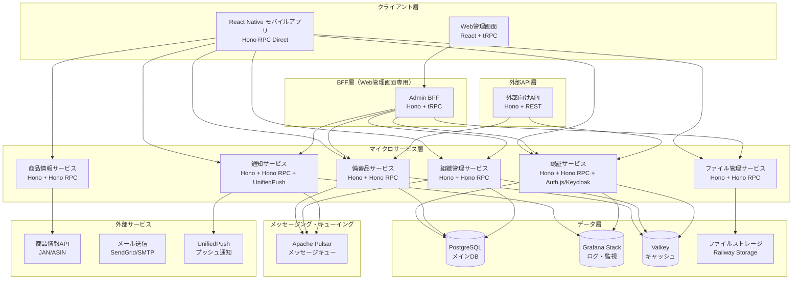
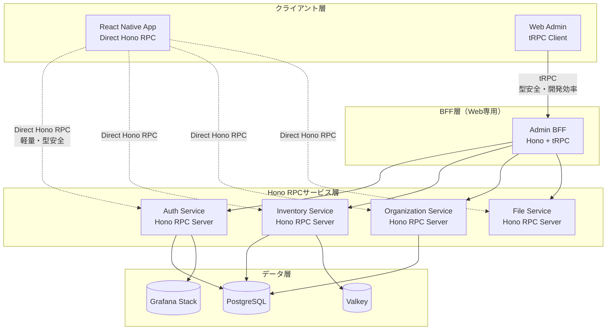
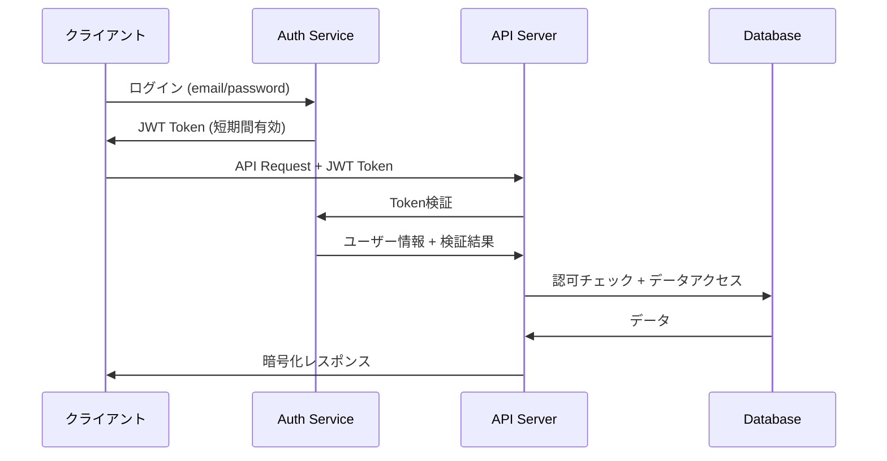

# 設計書

## 概要

備蓄管理用クロスプラットフォームアプリケーションの技術設計書。Android・iOS対応のモバイルアプリ、Web管理画面、バックエンドAPI、クラウドインフラストラクチャを含む包括的なシステム設計。

## アーキテクチャ

### システム全体構成



### 技術スタック選択理由

**フロントエンド:**
- **React Native + Expo + TypeScript**: 高性能クロスプラットフォーム、豊富なネイティブ機能、優れた開発体験
- **React + Vite + React Router + React Query + TypeScript**: Web管理画面、高速ビルド、宣言的ルーティング、強力なキャッシュ機能
- **TailwindCSS + shadcn/ui**: ユーティリティファースト、高品質コンポーネント、ダークモード対応
- **Zustand + Immer**: React Native推奨状態管理、軽量、TypeScript完全対応、イミュータブル更新
- **MSW (Mock Service Worker)**: Web管理画面API モック、開発・テスト環境支援

**BFF・API層:**
- **Hono RPC**: React Native直接通信、軽量高速、型安全性、Edge Runtime対応
- **Hono**: Web管理画面専用BFF、軽量高速、Edge Runtime対応、高速ビルド
- **tRPC**: Web管理画面専用、エンドツーエンド型安全性、優れた開発体験

**マイクロサービス:**
- **Hono + TypeScript + SWC**: 軽量高速、Edge Runtime対応、高速ビルド、依存性注入
- **Hono RPC**: 型安全なサービス間通信、シンプルなAPI定義
- **DDD (Domain Driven Design)**: ドメイン中心設計、ビジネスロジックの分離
- **Clean Architecture**: 依存関係の逆転、レイヤー分離、テスタビリティ向上

**認証:**
- **Auth.js (NextAuth.js)**: 多様なプロバイダー対応、セキュア、オープンソース
- **Keycloak**: エンタープライズ認証、OIDC/SAML対応、自己ホスト可能

**データベース:**
- **PostgreSQL + Prisma ORM**: ACID準拠、データ整合性保証、型安全なクエリ、統一されたデータアクセス
- **Grafana Stack (Loki + Grafana)**: ログ集約・分析・可視化

**キャッシュ・メッセージング:**
- **Valkey**: Redis互換、オープンソース、高性能
- **Apache Pulsar**: 多テナント、地理的レプリケーション、高可用性

**通知:**
- **UnifiedPush**: オープンスタンダード、プライバシー重視、ベンダーロックイン回避

**型安全性・開発ツール:**
- **TypeScript-Go (tsgo)**: Go言語ベースの高速TypeScriptコンパイラ、従来のtscより10倍高速
- **Zod**: ランタイム型検証、スキーマファーストバリデーション
- **zod-prisma-types**: Prismaスキーマから自動Zod型生成
- **tsgolint**: tsgo専用リンター、高速静的解析
- **Biome**: 統一フォーマッター・リンター、Rust製高速ツール
- **lefthook**: Git hooks管理、品質ゲート強制
- **neverthrow**: 関数型エラーハンドリング、Result型による安全なエラー処理
- **type-fest**: 高度なTypeScriptユーティリティ型、型レベルプログラミング支援
- **Prisma**: データベーススキーマからの型生成
- **tRPC**: API契約の型レベル保証

## コンポーネントとインターフェース

### React Native モバイルアプリ構成

```
src/
├── core/                # コア機能
│   ├── constants/       # 定数定義
│   ├── errors/          # エラー処理
│   ├── network/         # Hono RPC クライアント
│   └── utils/           # ユーティリティ
├── data/                # データ層
│   ├── datasources/     # データソース（Hono RPC、ローカル）
│   ├── models/          # データモデル
│   └── repositories/    # リポジトリ実装
├── domain/              # ドメイン層
│   ├── entities/        # エンティティ
│   ├── repositories/    # リポジトリインターフェース
│   └── usecases/        # ユースケース
├── presentation/        # プレゼンテーション層
│   ├── screens/         # 画面コンポーネント
│   ├── components/      # 再利用可能コンポーネント
│   ├── navigation/      # ナビゲーション設定
│   ├── hooks/           # カスタムフック
│   ├── store/           # Zustand状態管理
│   └── theme/           # テーマ・スタイル
└── types/               # 型定義
    ├── api/             # API型定義
    ├── navigation/      # ナビゲーション型定義
    └── store/           # ストア型定義
```

### API通信プロトコル選択

#### プロトコル比較分析

**Hono RPC (モバイル推奨選択)**
- **パフォーマンス**: HTTP/JSON、軽量プロトコル、高速通信
- **型安全性**: TypeScript型定義、エンドツーエンド型安全性
- **効率性**: JSONシリアライゼーション、HTTP/2対応
- **簡単統合**: HTTPベース、RESTful APIスタイル
- **言語サポート**: TypeScript/JavaScript完全対応

**tRPC (Web管理画面推奨選択)**
- **型安全性**: TypeScriptネイティブ、エンドツーエンド型安全性
- **開発効率**: 自動型生成、優れたDX
- **Web最適化**: HTTP/JSON、React Query統合
- **エコシステム**: 豊富なミドルウェア、開発ツール

#### 最適化されたハイブリッドアーキテクチャ設計



#### Hono RPC 型定義

**共通型定義 (packages/shared-types/src/common.ts)**
```typescript
import { z } from 'zod';

// 共通型定義
export const MoneySchema = z.object({
  amount: z.number().min(0),
  currency: z.enum(['JPY', 'USD', 'EUR']),
});

export const InventoryCategorySchema = z.enum([
  'FOOD',
  'DAILY_GOODS', 
  'MEDICINE',
  'OTHER'
]);

export const ExpiryTypeSchema = z.enum([
  'EXPIRY',      // 消費期限
  'BEST_BEFORE', // 賞味期限
  'BOTH'         // 両方
]);

export const UserRoleSchema = z.enum([
  'ADMIN',
  'EDITOR', 
  'VIEWER'
]);

// ページネーション
export const PageRequestSchema = z.object({
  page: z.number().min(1).default(1),
  limit: z.number().min(1).max(100).default(20),
});

export const PageResponseSchema = z.object({
  page: z.number(),
  limit: z.number(),
  total: z.number(),
  hasNext: z.boolean(),
  hasPrev: z.boolean(),
});

// 型エクスポート
export type Money = z.infer<typeof MoneySchema>;
export type InventoryCategory = z.infer<typeof InventoryCategorySchema>;
export type ExpiryType = z.infer<typeof ExpiryTypeSchema>;
export type UserRole = z.infer<typeof UserRoleSchema>;
export type PageRequest = z.infer<typeof PageRequestSchema>;
export type PageResponse = z.infer<typeof PageResponseSchema>;
```

**認証サービス (services/auth-service/src/routes.ts)**
```typescript
import { Hono } from 'hono';
import { zValidator } from '@hono/zod-validator';
import { z } from 'zod';

// 型定義
export const UserSchema = z.object({
  id: z.string(),
  email: z.string().email(),
  displayName: z.string(),
  profileImage: z.string().optional(),
  isActive: z.boolean(),
  createdAt: z.date(),
  updatedAt: z.date(),
});

export const RegisterRequestSchema = z.object({
  email: z.string().email(),
  password: z.string().min(8),
  displayName: z.string().min(1),
});

export const RegisterResponseSchema = z.object({
  user: UserSchema,
  accessToken: z.string(),
  refreshToken: z.string(),
  expiresIn: z.number(),
});

export const LoginRequestSchema = z.object({
  email: z.string().email(),
  password: z.string(),
});

export const LoginResponseSchema = z.object({
  user: UserSchema,
  accessToken: z.string(),
  refreshToken: z.string(),
  expiresIn: z.number(),
});

export const RefreshTokenRequestSchema = z.object({
  refreshToken: z.string(),
});

export const RefreshTokenResponseSchema = z.object({
  accessToken: z.string(),
  refreshToken: z.string(),
  expiresIn: z.number(),
});

// Hono RPC ルート定義
const app = new Hono();

// 認証サービス
export const authRoutes = app
  .post('/register', 
    zValidator('json', RegisterRequestSchema),
    async (c) => {
      const request = c.req.valid('json');
      
      // ビジネスロジック実行
      const result = await authService.register(request);
      
      if (result.isErr()) {
        return c.json({ error: result.error }, 400);
      }
      
      return c.json(result.value);
    }
  )
  .post('/login',
    zValidator('json', LoginRequestSchema), 
    async (c) => {
      const request = c.req.valid('json');
      
      const result = await authService.login(request);
      
      if (result.isErr()) {
        return c.json({ error: result.error }, 401);
      }
      
      return c.json(result.value);
    }
  )
  .post('/refresh',
    zValidator('json', RefreshTokenRequestSchema),
    async (c) => {
      const request = c.req.valid('json');
      
      const result = await authService.refreshToken(request.refreshToken);
      
      if (result.isErr()) {
        return c.json({ error: result.error }, 401);
      }
      
      return c.json(result.value);
    }
  )
  .post('/logout',
    zValidator('json', RefreshTokenRequestSchema),
    async (c) => {
      const request = c.req.valid('json');
      
      await authService.logout(request.refreshToken);
      
      return c.json({ success: true });
    }
  )
  .post('/reset-password',
    zValidator('json', z.object({ email: z.string().email() })),
    async (c) => {
      const { email } = c.req.valid('json');
      
      await authService.resetPassword(email);
      
      return c.json({ success: true });
    }
  );

// 型エクスポート（Hono RPC用）
export type AuthRoutes = typeof authRoutes;
export type User = z.infer<typeof UserSchema>;
export type RegisterRequest = z.infer<typeof RegisterRequestSchema>;
export type RegisterResponse = z.infer<typeof RegisterResponseSchema>;
export type LoginRequest = z.infer<typeof LoginRequestSchema>;
export type LoginResponse = z.infer<typeof LoginResponseSchema>;
```

**備蓄品サービス (services/inventory-service/src/routes.ts)**
```typescript
import { Hono } from 'hono';
import { zValidator } from '@hono/zod-validator';
import { z } from 'zod';
import { 
  InventoryCategorySchema, 
  ExpiryTypeSchema, 
  MoneySchema, 
  PageRequestSchema, 
  PageResponseSchema 
} from '@repo/shared-types';

// 型定義
export const InventoryItemSchema = z.object({
  id: z.string(),
  organizationId: z.string(),
  name: z.string(),
  brand: z.string().optional(),
  category: InventoryCategorySchema,
  quantity: z.number().min(0),
  unit: z.string(),
  minQuantity: z.number().min(0).optional(),
  expiryDate: z.date().optional(),
  bestBeforeDate: z.date().optional(),
  expiryType: ExpiryTypeSchema,
  storageLocation: z.string().optional(),
  price: MoneySchema.optional(),
  barcode: z.string().optional(),
  asin: z.string().optional(),
  tags: z.array(z.string()).default([]),
  images: z.array(z.string()).default([]),
  notes: z.string().optional(),
  createdBy: z.string(),
  updatedBy: z.string(),
  createdAt: z.date(),
  updatedAt: z.date(),
});

export const CreateItemRequestSchema = z.object({
  organizationId: z.string(),
  name: z.string().min(1).max(100),
  brand: z.string().optional(),
  category: InventoryCategorySchema,
  quantity: z.number().min(0),
  unit: z.string().min(1),
  minQuantity: z.number().min(0).optional(),
  expiryDate: z.date().optional(),
  bestBeforeDate: z.date().optional(),
  expiryType: ExpiryTypeSchema,
  storageLocation: z.string().optional(),
  price: MoneySchema.optional(),
  barcode: z.string().optional(),
  asin: z.string().optional(),
  tags: z.array(z.string()).default([]),
  notes: z.string().optional(),
});

export const UpdateItemRequestSchema = z.object({
  id: z.string(),
  organizationId: z.string(),
  name: z.string().min(1).max(100).optional(),
  brand: z.string().optional(),
  category: InventoryCategorySchema.optional(),
  quantity: z.number().min(0).optional(),
  unit: z.string().min(1).optional(),
  minQuantity: z.number().min(0).optional(),
  expiryDate: z.date().optional(),
  bestBeforeDate: z.date().optional(),
  expiryType: ExpiryTypeSchema.optional(),
  storageLocation: z.string().optional(),
  price: MoneySchema.optional(),
  barcode: z.string().optional(),
  asin: z.string().optional(),
  tags: z.array(z.string()).optional(),
  notes: z.string().optional(),
});

export const ConsumeItemRequestSchema = z.object({
  itemId: z.string(),
  organizationId: z.string(),
  quantity: z.number().min(0.1),
  reason: z.string().optional(),
});

export const SearchItemsRequestSchema = z.object({
  organizationId: z.string(),
  query: z.string().optional(),
  category: InventoryCategorySchema.optional(),
  storageLocation: z.string().optional(),
  tags: z.array(z.string()).optional(),
  expiryDateFrom: z.date().optional(),
  expiryDateTo: z.date().optional(),
  sortBy: z.enum(['name', 'expiryDate', 'createdAt', 'quantity']).default('createdAt'),
  sortOrder: z.enum(['asc', 'desc']).default('desc'),
  page: PageRequestSchema,
});

// Hono RPC ルート定義
const app = new Hono();

export const inventoryRoutes = app
  .get('/items/:organizationId',
    zValidator('param', z.object({ organizationId: z.string() })),
    zValidator('query', PageRequestSchema),
    async (c) => {
      const { organizationId } = c.req.valid('param');
      const page = c.req.valid('query');
      
      // 権限チェック
      const hasAccess = await checkOrganizationAccess(
        c.get('userId'), 
        organizationId
      );
      if (!hasAccess) {
        return c.json({ error: 'Forbidden' }, 403);
      }
      
      const result = await inventoryService.listItems(organizationId, page);
      
      if (result.isErr()) {
        return c.json({ error: result.error }, 400);
      }
      
      return c.json(result.value);
    }
  )
  .get('/items/:organizationId/:id',
    zValidator('param', z.object({ 
      organizationId: z.string(),
      id: z.string() 
    })),
    async (c) => {
      const { organizationId, id } = c.req.valid('param');
      
      const hasAccess = await checkOrganizationAccess(
        c.get('userId'), 
        organizationId
      );
      if (!hasAccess) {
        return c.json({ error: 'Forbidden' }, 403);
      }
      
      const result = await inventoryService.getItem(id, organizationId);
      
      if (result.isErr()) {
        return c.json({ error: result.error }, 404);
      }
      
      return c.json(result.value);
    }
  )
  .post('/items',
    zValidator('json', CreateItemRequestSchema),
    async (c) => {
      const request = c.req.valid('json');
      
      const hasWriteAccess = await checkOrganizationWriteAccess(
        c.get('userId'), 
        request.organizationId
      );
      if (!hasWriteAccess) {
        return c.json({ error: 'Forbidden' }, 403);
      }
      
      const result = await inventoryService.createItem({
        ...request,
        createdBy: c.get('userId'),
        updatedBy: c.get('userId'),
      });
      
      if (result.isErr()) {
        return c.json({ error: result.error }, 400);
      }
      
      return c.json(result.value, 201);
    }
  )
  .put('/items/:id',
    zValidator('param', z.object({ id: z.string() })),
    zValidator('json', UpdateItemRequestSchema),
    async (c) => {
      const { id } = c.req.valid('param');
      const request = c.req.valid('json');
      
      const hasWriteAccess = await checkOrganizationWriteAccess(
        c.get('userId'), 
        request.organizationId
      );
      if (!hasWriteAccess) {
        return c.json({ error: 'Forbidden' }, 403);
      }
      
      const result = await inventoryService.updateItem(id, {
        ...request,
        updatedBy: c.get('userId'),
      });
      
      if (result.isErr()) {
        return c.json({ error: result.error }, 400);
      }
      
      return c.json(result.value);
    }
  )
  .delete('/items/:organizationId/:id',
    zValidator('param', z.object({ 
      organizationId: z.string(),
      id: z.string() 
    })),
    async (c) => {
      const { organizationId, id } = c.req.valid('param');
      
      const hasWriteAccess = await checkOrganizationWriteAccess(
        c.get('userId'), 
        organizationId
      );
      if (!hasWriteAccess) {
        return c.json({ error: 'Forbidden' }, 403);
      }
      
      const result = await inventoryService.deleteItem(id, organizationId);
      
      if (result.isErr()) {
        return c.json({ error: result.error }, 400);
      }
      
      return c.json({ success: true });
    }
  )
  .post('/items/:id/consume',
    zValidator('param', z.object({ id: z.string() })),
    zValidator('json', ConsumeItemRequestSchema),
    async (c) => {
      const { id } = c.req.valid('param');
      const request = c.req.valid('json');
      
      const hasWriteAccess = await checkOrganizationWriteAccess(
        c.get('userId'), 
        request.organizationId
      );
      if (!hasWriteAccess) {
        return c.json({ error: 'Forbidden' }, 403);
      }
      
      const result = await inventoryService.consumeItem({
        ...request,
        itemId: id,
        userId: c.get('userId'),
      });
      
      if (result.isErr()) {
        return c.json({ error: result.error }, 400);
      }
      
      return c.json(result.value);
    }
  )
  .post('/items/search',
    zValidator('json', SearchItemsRequestSchema),
    async (c) => {
      const request = c.req.valid('json');
      
      const hasAccess = await checkOrganizationAccess(
        c.get('userId'), 
        request.organizationId
      );
      if (!hasAccess) {
        return c.json({ error: 'Forbidden' }, 403);
      }
      
      const result = await inventoryService.searchItems(request);
      
      if (result.isErr()) {
        return c.json({ error: result.error }, 400);
      }
      
      return c.json(result.value);
    }
  )
  .get('/items/:organizationId/expiring',
    zValidator('param', z.object({ organizationId: z.string() })),
    zValidator('query', z.object({ 
      days: z.number().min(1).max(365).default(30),
      ...PageRequestSchema.shape 
    })),
    async (c) => {
      const { organizationId } = c.req.valid('param');
      const { days, ...page } = c.req.valid('query');
      
      const hasAccess = await checkOrganizationAccess(
        c.get('userId'), 
        organizationId
      );
      if (!hasAccess) {
        return c.json({ error: 'Forbidden' }, 403);
      }
      
      const result = await inventoryService.getExpiringItems(
        organizationId, 
        days, 
        page
      );
      
      if (result.isErr()) {
        return c.json({ error: result.error }, 400);
      }
      
      return c.json(result.value);
    }
  );

// 型エクスポート（Hono RPC用）
export type InventoryRoutes = typeof inventoryRoutes;
export type InventoryItem = z.infer<typeof InventoryItemSchema>;
export type CreateItemRequest = z.infer<typeof CreateItemRequestSchema>;
export type UpdateItemRequest = z.infer<typeof UpdateItemRequestSchema>;
export type ConsumeItemRequest = z.infer<typeof ConsumeItemRequestSchema>;
export type SearchItemsRequest = z.infer<typeof SearchItemsRequestSchema>;
```

#### tRPC ルーター定義（Web管理画面専用）

**サーバーサイド (server/trpc/router.ts)**
```typescript
import { z } from 'zod';
import { router, publicProcedure, protectedProcedure } from './trpc';
import { TRPCError } from '@trpc/server';

// 入力バリデーションスキーマ
const createInventoryItemSchema = z.object({
  name: z.string().min(1).max(100),
  brand: z.string().optional(),
  category: z.enum(['food', 'daily_goods', 'medicine', 'other']),
  quantity: z.number().min(0),
  unit: z.string().min(1),
  minQuantity: z.number().min(0).optional(),
  expiryDate: z.date().optional(),
  bestBeforeDate: z.date().optional(),
  expiryType: z.enum(['expiry', 'bestBefore', 'both']),
  storageLocation: z.string().optional(),
  price: z.object({
    amount: z.number().min(0),
    currency: z.enum(['JPY', 'USD', 'EUR'])
  }).optional(),
  barcode: z.string().optional(),
  asin: z.string().optional(),
  tags: z.array(z.string()).default([]),
  notes: z.string().optional()
});

const inventorySearchSchema = z.object({
  query: z.string().optional(),
  category: z.enum(['food', 'daily_goods', 'medicine', 'other']).optional(),
  storageLocation: z.string().optional(),
  expiryType: z.enum(['expiry', 'bestBefore', 'both']).optional(),
  tags: z.array(z.string()).optional(),
  expiryDateFrom: z.date().optional(),
  expiryDateTo: z.date().optional(),
  page: z.number().min(1).default(1),
  limit: z.number().min(1).max(100).default(20),
  sortBy: z.enum(['name', 'expiryDate', 'createdAt', 'quantity']).default('createdAt'),
  sortOrder: z.enum(['asc', 'desc']).default('desc')
});

// メインルーター
export const appRouter = router({
  // 認証関連
  auth: router({
    register: publicProcedure
      .input(z.object({
        email: z.string().email(),
        password: z.string().min(8),
        displayName: z.string().min(1)
      }))
      .mutation(async ({ input, ctx }) => {
        // 認証サービス呼び出し + ユーザー作成
        const user = await ctx.authService.register(input);
        return { user, message: 'Registration successful' };
      }),

    login: publicProcedure
      .input(z.object({
        email: z.string().email(),
        password: z.string()
      }))
      .mutation(async ({ input, ctx }) => {
        const result = await ctx.authService.login(input);
        return result;
      }),

    refresh: protectedProcedure
      .mutation(async ({ ctx }) => {
        const tokens = await ctx.authService.refreshTokens(ctx.user.id);
        return tokens;
      })
  }),

  // 組織管理
  organization: router({
    list: protectedProcedure
      .query(async ({ ctx }) => {
        const organizations = await ctx.organizationService.getUserOrganizations(ctx.user.id);
        return organizations;
      }),

    create: protectedProcedure
      .input(z.object({
        name: z.string().min(1).max(50),
        description: z.string().optional(),
        privacy: z.enum(['public', 'private']).default('private')
      }))
      .mutation(async ({ input, ctx }) => {
        const organization = await ctx.organizationService.create({
          ...input,
          createdBy: ctx.user.id
        });
        return organization;
      }),

    invite: protectedProcedure
      .input(z.object({
        organizationId: z.string(),
        email: z.string().email(),
        role: z.enum(['admin', 'editor', 'viewer']).default('editor')
      }))
      .mutation(async ({ input, ctx }) => {
        // 権限チェック
        await ctx.organizationService.checkPermission(
          input.organizationId, 
          ctx.user.id, 
          'invite'
        );
        
        const invitation = await ctx.organizationService.inviteMember(input);
        return invitation;
      })
  }),

  // 備蓄品管理
  inventory: router({
    list: protectedProcedure
      .input(z.object({
        organizationId: z.string()
      }))
      .query(async ({ input, ctx }) => {
        // 組織アクセス権チェック
        await ctx.organizationService.checkMembership(input.organizationId, ctx.user.id);
        
        const items = await ctx.inventoryService.getItems(input.organizationId);
        return items;
      }),

    search: protectedProcedure
      .input(inventorySearchSchema.extend({
        organizationId: z.string()
      }))
      .query(async ({ input, ctx }) => {
        await ctx.organizationService.checkMembership(input.organizationId, ctx.user.id);
        
        const result = await ctx.inventoryService.search(input);
        return result;
      }),

    create: protectedProcedure
      .input(createInventoryItemSchema.extend({
        organizationId: z.string()
      }))
      .mutation(async ({ input, ctx }) => {
        // 書き込み権限チェック
        await ctx.organizationService.checkPermission(
          input.organizationId, 
          ctx.user.id, 
          'write'
        );

        const item = await ctx.inventoryService.create({
          ...input,
          createdBy: ctx.user.id,
          updatedBy: ctx.user.id
        });
        
        // 活動ログ記録
        await ctx.activityService.log({
          organizationId: input.organizationId,
          userId: ctx.user.id,
          action: 'add',
          targetType: 'inventory',
          targetId: item._id,
          details: { name: item.name }
        });

        return item;
      }),

    update: protectedProcedure
      .input(createInventoryItemSchema.partial().extend({
        id: z.string(),
        organizationId: z.string()
      }))
      .mutation(async ({ input, ctx }) => {
        await ctx.organizationService.checkPermission(
          input.organizationId, 
          ctx.user.id, 
          'write'
        );

        const { id, organizationId, ...updateData } = input;
        const item = await ctx.inventoryService.update(id, {
          ...updateData,
          updatedBy: ctx.user.id
        });

        await ctx.activityService.log({
          organizationId,
          userId: ctx.user.id,
          action: 'update',
          targetType: 'inventory',
          targetId: id,
          details: updateData
        });

        return item;
      }),

    consume: protectedProcedure
      .input(z.object({
        itemId: z.string(),
        organizationId: z.string(),
        quantity: z.number().min(0.1),
        reason: z.string().optional()
      }))
      .mutation(async ({ input, ctx }) => {
        await ctx.organizationService.checkPermission(
          input.organizationId, 
          ctx.user.id, 
          'write'
        );

        const result = await ctx.inventoryService.consume({
          ...input,
          userId: ctx.user.id
        });

        await ctx.activityService.log({
          organizationId: input.organizationId,
          userId: ctx.user.id,
          action: 'consume',
          targetType: 'inventory',
          targetId: input.itemId,
          details: { quantity: input.quantity, reason: input.reason }
        });

        return result;
      }),

    getExpiring: protectedProcedure
      .input(z.object({
        organizationId: z.string(),
        days: z.number().min(1).max(365).default(30)
      }))
      .query(async ({ input, ctx }) => {
        await ctx.organizationService.checkMembership(input.organizationId, ctx.user.id);
        
        const items = await ctx.inventoryService.getExpiringItems(
          input.organizationId, 
          input.days
        );
        return items;
      })
  }),

  // 商品情報・バーコード
  product: router({
    getByBarcode: protectedProcedure
      .input(z.object({
        barcode: z.string().min(8).max(13)
      }))
      .query(async ({ input, ctx }) => {
        const product = await ctx.productService.getByBarcode(input.barcode);
        return product;
      }),

    getByAsin: protectedProcedure
      .input(z.object({
        asin: z.string().length(10)
      }))
      .query(async ({ input, ctx }) => {
        const product = await ctx.productService.getByAsin(input.asin);
        return product;
      })
  }),

  // 画像管理
  image: router({
    getUploadUrl: protectedProcedure
      .input(z.object({
        fileName: z.string(),
        contentType: z.string(),
        organizationId: z.string()
      }))
      .mutation(async ({ input, ctx }) => {
        await ctx.organizationService.checkPermission(
          input.organizationId, 
          ctx.user.id, 
          'write'
        );

        const uploadUrl = await ctx.imageService.getUploadUrl(input);
        return uploadUrl;
      }),

    delete: protectedProcedure
      .input(z.object({
        imageId: z.string(),
        organizationId: z.string()
      }))
      .mutation(async ({ input, ctx }) => {
        await ctx.organizationService.checkPermission(
          input.organizationId, 
          ctx.user.id, 
          'delete'
        );

        await ctx.imageService.delete(input.imageId);
        return { success: true };
      })
  })
});

export type AppRouter = typeof appRouter;
```

#### React Native Hono RPC クライアント統合

**Hono RPC クライアント設定 (src/core/network/hono-rpc-client.ts)**
```typescript
import { z } from 'zod';

export class HonoRpcClient {
  private static readonly BASE_URL = 'https://api.inventory-app.com';
  
  constructor(private authToken?: string) {}
  
  // 認証付きクライアント作成
  withAuth(token: string): HonoRpcClient {
    return new HonoRpcClient(token);
  }
  
  // 共通HTTPヘッダー
  private get headers(): Record<string, string> {
    const headers: Record<string, string> = {
      'Content-Type': 'application/json',
      'Accept': 'application/json',
    };
    
    if (this.authToken) {
      headers['Authorization'] = `Bearer ${this.authToken}`;
    }
    
    return headers;
  }
  
  // GET リクエスト
  async get<T>(
    path: string,
    options: {
      queryParams?: Record<string, string>;
      schema: z.ZodSchema<T>;
    }
  ): Promise<T> {
    const url = new URL(path, HonoRpcClient.BASE_URL);
    
    if (options.queryParams) {
      Object.entries(options.queryParams).forEach(([key, value]) => {
        url.searchParams.append(key, value);
      });
    }
    
    const response = await fetch(url.toString(), {
      method: 'GET',
      headers: this.headers,
    });
    
    return this.handleResponse(response, options.schema);
  }
  
  // POST リクエスト
  async post<T>(
    path: string,
    options: {
      body?: unknown;
      schema: z.ZodSchema<T>;
    }
  ): Promise<T> {
    const url = new URL(path, HonoRpcClient.BASE_URL);
    
    const response = await fetch(url.toString(), {
      method: 'POST',
      headers: this.headers,
      body: options.body ? JSON.stringify(options.body) : undefined,
    });
    
    return this.handleResponse(response, options.schema);
  }
  
  // PUT リクエスト
  async put<T>(
    path: string,
    options: {
      body?: unknown;
      schema: z.ZodSchema<T>;
    }
  ): Promise<T> {
    const url = new URL(path, HonoRpcClient.BASE_URL);
    
    const response = await fetch(url.toString(), {
      method: 'PUT',
      headers: this.headers,
      body: options.body ? JSON.stringify(options.body) : undefined,
    });
    
    return this.handleResponse(response, options.schema);
  }
  
  // DELETE リクエスト
  async delete(path: string): Promise<void> {
    const url = new URL(path, HonoRpcClient.BASE_URL);
    
    const response = await fetch(url.toString(), {
      method: 'DELETE',
      headers: this.headers,
    });
    
    if (!response.ok) {
      throw new HonoRpcError(
        response.status,
        `Delete request failed: ${response.statusText}`
      );
    }
  }
  
  // レスポンス処理
  private async handleResponse<T>(
    response: Response,
    schema: z.ZodSchema<T>
  ): Promise<T> {
    if (!response.ok) {
      const errorText = await response.text();
      let errorMessage = `HTTP ${response.status}: ${response.statusText}`;
      
      try {
        const errorJson = JSON.parse(errorText);
        errorMessage = errorJson.error || errorMessage;
      } catch {
        // JSON解析失敗時はそのまま
      }
      
      throw new HonoRpcError(response.status, errorMessage);
    }
    
    const responseText = await response.text();
    const responseJson = JSON.parse(responseText);
    
    // Zodスキーマでバリデーション
    const parseResult = schema.safeParse(responseJson);
    if (!parseResult.success) {
      throw new HonoRpcValidationError(
        'Response validation failed',
        parseResult.error
      );
    }
    
    return parseResult.data;
  }
}

// エラークラス
export class HonoRpcError extends Error {
  constructor(
    public readonly statusCode: number,
    message: string
  ) {
    super(message);
    this.name = 'HonoRpcError';
  }
}

export class HonoRpcValidationError extends Error {
  constructor(
    message: string,
    public readonly zodError: z.ZodError
  ) {
    super(message);
    this.name = 'HonoRpcValidationError';
  }
}

// React Native用のクライアントインスタンス作成
export const createHonoRpcClient = (authToken?: string) => {
  return new HonoRpcClient(authToken);
};
```

**リポジトリ実装例 (src/data/repositories/inventory-repository-impl.ts)**
```typescript
import { z } from 'zod';
import { HonoRpcClient, HonoRpcError } from '../../core/network/hono-rpc-client';
import { InventoryRepository } from '../../domain/repositories/inventory-repository';
import { InventoryItem } from '../../domain/entities/inventory-item';
import { CreateInventoryItemRequest, UpdateInventoryItemRequest } from '../../domain/types';
import { InventoryFailure } from '../../domain/failures/inventory-failure';

// APIレスポンススキーマ
const InventoryItemSchema = z.object({
  id: z.string(),
  organizationId: z.string(),
  name: z.string(),
  brand: z.string().optional(),
  category: z.enum(['FOOD', 'DAILY_GOODS', 'MEDICINE', 'OTHER']),
  quantity: z.number(),
  unit: z.string(),
  minQuantity: z.number().optional(),
  expiryDate: z.string().optional(),
  bestBeforeDate: z.string().optional(),
  expiryType: z.enum(['EXPIRY', 'BEST_BEFORE', 'BOTH']),
  storageLocation: z.string().optional(),
  price: z.object({
    amount: z.number(),
    currency: z.enum(['JPY', 'USD', 'EUR'])
  }).optional(),
  barcode: z.string().optional(),
  asin: z.string().optional(),
  tags: z.array(z.string()),
  images: z.array(z.string()),
  notes: z.string().optional(),
  createdBy: z.string(),
  updatedBy: z.string(),
  createdAt: z.string(),
  updatedAt: z.string(),
});

const InventoryItemListSchema = z.object({
  items: z.array(InventoryItemSchema),
  total: z.number(),
  page: z.number(),
  limit: z.number(),
  hasNext: z.boolean(),
  hasPrev: z.boolean(),
});

export class InventoryRepositoryImpl implements InventoryRepository {
  constructor(private rpcClient: HonoRpcClient) {}
  
  async getItems(
    organizationId: string,
    options: { page?: number; limit?: number } = {}
  ): Promise<{ items: InventoryItem[]; total: number }> {
    try {
      const response = await this.rpcClient.get(`/items/${organizationId}`, {
        queryParams: {
          page: (options.page || 1).toString(),
          limit: (options.limit || 20).toString(),
        },
        schema: InventoryItemListSchema,
      });
      
      const items = response.items.map(item => this.mapToEntity(item));
      return { items, total: response.total };
    } catch (error) {
      throw this.mapErrorToFailure(error);
    }
  }
  
  async getItem(id: string, organizationId: string): Promise<InventoryItem> {
    try {
      const response = await this.rpcClient.get(`/items/${organizationId}/${id}`, {
        schema: InventoryItemSchema,
      });
      
      return this.mapToEntity(response);
    } catch (error) {
      throw this.mapErrorToFailure(error);
    }
  }
  
  async createItem(request: CreateInventoryItemRequest): Promise<InventoryItem> {
    try {
      const response = await this.rpcClient.post('/items', {
        body: {
          organizationId: request.organizationId,
          name: request.name,
          brand: request.brand,
          category: request.category,
          quantity: request.quantity,
          unit: request.unit,
          minQuantity: request.minQuantity,
          expiryDate: request.expiryDate?.toISOString(),
          bestBeforeDate: request.bestBeforeDate?.toISOString(),
          expiryType: request.expiryType,
          storageLocation: request.storageLocation,
          price: request.price,
          barcode: request.barcode,
          asin: request.asin,
          tags: request.tags,
          notes: request.notes,
        },
        schema: InventoryItemSchema,
      });
      
      return this.mapToEntity(response);
    } catch (error) {
      throw this.mapErrorToFailure(error);
    }
  }
  
  async updateItem(id: string, request: UpdateInventoryItemRequest): Promise<InventoryItem> {
    try {
      const body: Record<string, unknown> = {
        id,
        organizationId: request.organizationId,
      };
      
      // null でない値のみ追加
      if (request.name !== undefined) body.name = request.name;
      if (request.brand !== undefined) body.brand = request.brand;
      if (request.category !== undefined) body.category = request.category;
      if (request.quantity !== undefined) body.quantity = request.quantity;
      if (request.unit !== undefined) body.unit = request.unit;
      if (request.minQuantity !== undefined) body.minQuantity = request.minQuantity;
      if (request.expiryDate !== undefined) body.expiryDate = request.expiryDate?.toISOString();
      if (request.bestBeforeDate !== undefined) body.bestBeforeDate = request.bestBeforeDate?.toISOString();
      if (request.expiryType !== undefined) body.expiryType = request.expiryType;
      if (request.storageLocation !== undefined) body.storageLocation = request.storageLocation;
      if (request.price !== undefined) body.price = request.price;
      if (request.barcode !== undefined) body.barcode = request.barcode;
      if (request.asin !== undefined) body.asin = request.asin;
      if (request.tags !== undefined) body.tags = request.tags;
      if (request.notes !== undefined) body.notes = request.notes;
      
      const response = await this.rpcClient.put(`/items/${id}`, {
        body,
        schema: InventoryItemSchema,
      });
      
      return this.mapToEntity(response);
    } catch (error) {
      throw this.mapErrorToFailure(error);
    }
  }
  
  async deleteItem(id: string, organizationId: string): Promise<void> {
    try {
      await this.rpcClient.delete(`/items/${organizationId}/${id}`);
    } catch (error) {
      throw this.mapErrorToFailure(error);
    }
  }
  
  async consumeItem(
    id: string,
    request: { organizationId: string; quantity: number; reason?: string }
  ): Promise<InventoryItem> {
    try {
      const response = await this.rpcClient.post(`/items/${id}/consume`, {
        body: {
          itemId: id,
          organizationId: request.organizationId,
          quantity: request.quantity,
          reason: request.reason,
        },
        schema: InventoryItemSchema,
      });
      
      return this.mapToEntity(response);
    } catch (error) {
      throw this.mapErrorToFailure(error);
    }
  }
  
  async searchItems(request: {
    organizationId: string;
    query?: string;
    category?: string;
    storageLocation?: string;
    tags?: string[];
    page?: number;
    limit?: number;
  }): Promise<{ items: InventoryItem[]; total: number }> {
    try {
      const response = await this.rpcClient.post('/items/search', {
        body: {
          organizationId: request.organizationId,
          query: request.query,
          category: request.category,
          storageLocation: request.storageLocation,
          tags: request.tags,
          page: {
            page: request.page || 1,
            limit: request.limit || 20,
          },
        },
        schema: InventoryItemListSchema,
      });
      
      const items = response.items.map(item => this.mapToEntity(item));
      return { items, total: response.total };
    } catch (error) {
      throw this.mapErrorToFailure(error);
    }
  }
  
  async getExpiringItems(
    organizationId: string,
    days: number,
    options: { page?: number; limit?: number } = {}
  ): Promise<{ items: InventoryItem[]; total: number }> {
    try {
      const response = await this.rpcClient.get(`/items/${organizationId}/expiring`, {
        queryParams: {
          days: days.toString(),
          page: (options.page || 1).toString(),
          limit: (options.limit || 20).toString(),
        },
        schema: InventoryItemListSchema,
      });
      
      const items = response.items.map(item => this.mapToEntity(item));
      return { items, total: response.total };
    } catch (error) {
      throw this.mapErrorToFailure(error);
    }
  }
  
  // エンティティマッピング
  private mapToEntity(data: z.infer<typeof InventoryItemSchema>): InventoryItem {
    return new InventoryItem({
      id: data.id,
      organizationId: data.organizationId,
      name: data.name,
      brand: data.brand,
      category: data.category as any,
      quantity: data.quantity,
      unit: data.unit,
      minQuantity: data.minQuantity,
      expiryDate: data.expiryDate ? new Date(data.expiryDate) : undefined,
      bestBeforeDate: data.bestBeforeDate ? new Date(data.bestBeforeDate) : undefined,
      expiryType: data.expiryType as any,
      storageLocation: data.storageLocation,
      price: data.price,
      barcode: data.barcode,
      asin: data.asin,
      tags: data.tags,
      images: data.images,
      notes: data.notes,
      createdBy: data.createdBy,
      updatedBy: data.updatedBy,
      createdAt: new Date(data.createdAt),
      updatedAt: new Date(data.updatedAt),
    });
  }
  
  // エラーマッピング
  private mapErrorToFailure(error: unknown): InventoryFailure {
    if (error instanceof HonoRpcError) {
      switch (error.statusCode) {
        case 401:
          return new InventoryFailure('UNAUTHENTICATED', 'Authentication required');
        case 403:
          return new InventoryFailure('PERMISSION_DENIED', 'Permission denied');
        case 404:
          return new InventoryFailure('NOT_FOUND', 'Item not found');
        case 400:
          return new InventoryFailure('VALIDATION_ERROR', error.message);
        case 409:
          return new InventoryFailure('DUPLICATE_BARCODE', 'Barcode already exists');
        default:
          return new InventoryFailure('SERVER_ERROR', 'Server error occurred');
      }
    }
    
    return new InventoryFailure('UNEXPECTED_ERROR', 'Unexpected error occurred');
  }
}
```

**Zustand状態管理実装例 (src/presentation/store/inventory-store.ts)**
```typescript
import { create } from 'zustand';
import { immer } from 'zustand/middleware/immer';
import { subscribeWithSelector } from 'zustand/middleware';
import { InventoryItem } from '../../domain/entities/inventory-item';
import { InventoryRepository } from '../../domain/repositories/inventory-repository';

export interface InventoryState {
  // 状態
  items: InventoryItem[];
  selectedItem: InventoryItem | null;
  isLoading: boolean;
  error: string | null;
  searchQuery: string;
  filters: {
    category?: string;
    storageLocation?: string;
    tags: string[];
  };
  pagination: {
    page: number;
    limit: number;
    total: number;
    hasNext: boolean;
    hasPrev: boolean;
  };
  
  // アクション
  setItems: (items: InventoryItem[]) => void;
  setSelectedItem: (item: InventoryItem | null) => void;
  setLoading: (loading: boolean) => void;
  setError: (error: string | null) => void;
  setSearchQuery: (query: string) => void;
  setFilters: (filters: Partial<InventoryState['filters']>) => void;
  setPagination: (pagination: Partial<InventoryState['pagination']>) => void;
  
  // 非同期アクション
  fetchItems: (organizationId: string) => Promise<void>;
  createItem: (request: any) => Promise<void>;
  updateItem: (id: string, request: any) => Promise<void>;
  deleteItem: (id: string, organizationId: string) => Promise<void>;
  consumeItem: (id: string, request: any) => Promise<void>;
  searchItems: (request: any) => Promise<void>;
  
  // 計算プロパティ
  filteredItems: InventoryItem[];
  expiringItems: InventoryItem[];
  lowStockItems: InventoryItem[];
}

export const useInventoryStore = create<InventoryState>()(
  subscribeWithSelector(
    immer((set, get) => ({
      // 初期状態
      items: [],
      selectedItem: null,
      isLoading: false,
      error: null,
      searchQuery: '',
      filters: {
        tags: [],
      },
      pagination: {
        page: 1,
        limit: 20,
        total: 0,
        hasNext: false,
        hasPrev: false,
      },
      
      // 基本アクション
      setItems: (items) => set((state) => {
        state.items = items;
      }),
      
      setSelectedItem: (item) => set((state) => {
        state.selectedItem = item;
      }),
      
      setLoading: (loading) => set((state) => {
        state.isLoading = loading;
      }),
      
      setError: (error) => set((state) => {
        state.error = error;
      }),
      
      setSearchQuery: (query) => set((state) => {
        state.searchQuery = query;
      }),
      
      setFilters: (filters) => set((state) => {
        state.filters = { ...state.filters, ...filters };
      }),
      
      setPagination: (pagination) => set((state) => {
        state.pagination = { ...state.pagination, ...pagination };
      }),
      
      // 非同期アクション
      fetchItems: async (organizationId: string) => {
        const { setLoading, setError, setItems, setPagination, pagination } = get();
        
        setLoading(true);
        setError(null);
        
        try {
          const repository = get().repository; // DIで注入されたリポジトリ
          const result = await repository.getItems(organizationId, {
            page: pagination.page,
            limit: pagination.limit,
          });
          
          setItems(result.items);
          setPagination({
            total: result.total,
            hasNext: result.items.length === pagination.limit,
            hasPrev: pagination.page > 1,
          });
        } catch (error) {
          setError(error instanceof Error ? error.message : 'Failed to fetch items');
        } finally {
          setLoading(false);
        }
      },
      
      createItem: async (request) => {
        const { setLoading, setError, fetchItems } = get();
        
        setLoading(true);
        setError(null);
        
        try {
          const repository = get().repository;
          await repository.createItem(request);
          
          // リストを再取得
          await fetchItems(request.organizationId);
        } catch (error) {
          setError(error instanceof Error ? error.message : 'Failed to create item');
          throw error;
        } finally {
          setLoading(false);
        }
      },
      
      updateItem: async (id: string, request) => {
        const { setLoading, setError, items, setItems } = get();
        
        setLoading(true);
        setError(null);
        
        try {
          const repository = get().repository;
          const updatedItem = await repository.updateItem(id, request);
          
          // 楽観的更新
          const newItems = items.map(item => 
            item.id === id ? updatedItem : item
          );
          setItems(newItems);
        } catch (error) {
          setError(error instanceof Error ? error.message : 'Failed to update item');
          throw error;
        } finally {
          setLoading(false);
        }
      },
      
      deleteItem: async (id: string, organizationId: string) => {
        const { setLoading, setError, items, setItems } = get();
        
        setLoading(true);
        setError(null);
        
        try {
          const repository = get().repository;
          await repository.deleteItem(id, organizationId);
          
          // 楽観的更新
          const newItems = items.filter(item => item.id !== id);
          setItems(newItems);
        } catch (error) {
          setError(error instanceof Error ? error.message : 'Failed to delete item');
          throw error;
        } finally {
          setLoading(false);
        }
      },
      
      consumeItem: async (id: string, request) => {
        const { setLoading, setError, items, setItems } = get();
        
        setLoading(true);
        setError(null);
        
        try {
          const repository = get().repository;
          const updatedItem = await repository.consumeItem(id, request);
          
          // 楽観的更新
          const newItems = items.map(item => 
            item.id === id ? updatedItem : item
          );
          setItems(newItems);
        } catch (error) {
          setError(error instanceof Error ? error.message : 'Failed to consume item');
          throw error;
        } finally {
          setLoading(false);
        }
      },
      
      searchItems: async (request) => {
        const { setLoading, setError, setItems, setPagination } = get();
        
        setLoading(true);
        setError(null);
        
        try {
          const repository = get().repository;
          const result = await repository.searchItems(request);
          
          setItems(result.items);
          setPagination({
            total: result.total,
            hasNext: result.items.length === request.limit,
            hasPrev: (request.page || 1) > 1,
          });
        } catch (error) {
          setError(error instanceof Error ? error.message : 'Failed to search items');
        } finally {
          setLoading(false);
        }
      },
      
      // 計算プロパティ
      get filteredItems() {
        const { items, searchQuery, filters } = get();
        
        return items.filter(item => {
          // 検索クエリフィルタ
          if (searchQuery && !item.name.toLowerCase().includes(searchQuery.toLowerCase())) {
            return false;
          }
          
          // カテゴリフィルタ
          if (filters.category && item.category !== filters.category) {
            return false;
          }
          
          // 保管場所フィルタ
          if (filters.storageLocation && item.storageLocation !== filters.storageLocation) {
            return false;
          }
          
          // タグフィルタ
          if (filters.tags.length > 0 && !filters.tags.some(tag => item.tags.includes(tag))) {
            return false;
          }
          
          return true;
        });
      },
      
      get expiringItems() {
        const { items } = get();
        const now = new Date();
        const thirtyDaysFromNow = new Date(now.getTime() + 30 * 24 * 60 * 60 * 1000);
        
        return items.filter(item => {
          const expiryDate = item.expiryDate || item.bestBeforeDate;
          return expiryDate && expiryDate <= thirtyDaysFromNow;
        });
      },
      
      get lowStockItems() {
        const { items } = get();
        
        return items.filter(item => 
          item.minQuantity !== undefined && item.quantity <= item.minQuantity
        );
      },
    }))
  )
);

// リポジトリ注入用のヘルパー
export const injectInventoryRepository = (repository: InventoryRepository) => {
  useInventoryStore.setState({ repository } as any);
};
```

**リポジトリ実装例 (src/data/repositories/inventory-repository-impl.ts)**
```typescript
import { z } from 'zod';
import { HonoRpcClient, HonoRpcError } from '../../core/network/hono-rpc-client';
import { InventoryRepository } from '../../domain/repositories/inventory-repository';
import { InventoryItem } from '../../domain/entities/inventory-item';
import { CreateInventoryItemRequest, UpdateInventoryItemRequest } from '../../domain/types';

// APIレスポンススキーマ
const InventoryItemSchema = z.object({
  id: z.string(),
  organizationId: z.string(),
  name: z.string(),
  brand: z.string().optional(),
  category: z.enum(['FOOD', 'DAILY_GOODS', 'MEDICINE', 'OTHER']),
  quantity: z.number(),
  unit: z.string(),
  minQuantity: z.number().optional(),
  expiryDate: z.string().optional().transform(val => val ? new Date(val) : undefined),
  bestBeforeDate: z.string().optional().transform(val => val ? new Date(val) : undefined),
  expiryType: z.enum(['EXPIRY', 'BEST_BEFORE', 'BOTH']),
  storageLocation: z.string().optional(),
  price: z.object({
    amount: z.number(),
    currency: z.enum(['JPY', 'USD', 'EUR'])
  }).optional(),
  barcode: z.string().optional(),
  asin: z.string().optional(),
  tags: z.array(z.string()),
  images: z.array(z.string()),
  notes: z.string().optional(),
  createdBy: z.string(),
  updatedBy: z.string(),
  createdAt: z.string().transform(val => new Date(val)),
  updatedAt: z.string().transform(val =rinew Date(val)),
});

const InventoryItemListSchema = z.object({
  items: z.array(InventoryItemSchema),
  total: z.number(),
  page: z.object({
    page: z.number(),
    limit: z.number(),
    hasNext: z.boolean(),
    hasPrev: z.boolean(),
  }),
});

export class InventoryRepositoryImpl implements InventoryRepository {
  constructor(private rpcClient: HonoRpcClient) {}
  
  async getItems(
    organizationId: string,
    options: { page?: number; limit?: number } = {}
  ): Promise<{ items: InventoryItem[]; total: number }> {
    try {
      const response = await this.rpcClient.get(`/items/${organizationId}`, {
        queryParams: {
          page: String(options.page || 1),
       g, dynami String(options.limit || 20),
        },
        schema: InventoryItemListSchema,
      });
      
      const items = response.items.map(item => this.mapToEntity(item));
      return { items, total: response.total };
    } catch (error) {
      if (error instanceof HonoRpcError) {
        throw this.mapToRepositoryError(error);
      }
      throw error;
    }
  }
  
  async getItem(id: string, organizationId: string): Promise<InventoryItem | null> {
    try {
      const response = await this.rpcClient.get(`/items/${organizationId}/${id}`, {
        schema: InventoryItemSchema,
      });
      
      return this.mapToEntity(response);
    } catch (error) {
      if (error instanceof HonoRpcError && error.statusCode === 404) {
        return null;
      }
      if (error instanceof HonoRpcError) {
        throw this.mapToRepositoryError(error);
      }
      throw error;
    }
  }
  
  async createItem(request: CreateInventoryItemRequest): Promise<InventoryItem> {
    try {
      const response = await this.rpcClient.post('/items', {
        body: {
          organizationId: request.organizationId,
          name: request.name,
          brand: request.brand,
          category: request.category,
          quantity: request.quantity,
          unit: request.unit,
          minQuantity: request.minQuantity,
          expiryDate: request.expiryDate?.toISOString(),
          bestBeforeDate: request.bestBeforeDate?.toISOString(),
          expiryType: request.expiryType,
          storageLocation: request.storageLocation,
          price: request.price,
          barcode: request.barcode,
          asin: request.asin,
          tags: request.tags,
          notes: request.notes,
        },
        schema: InventoryItemSchema,
      });
      
      return this.mapToEntity(response);
    } catch (error) {
      if (error instanceof HonoRpcError) {
        throw this.mapToRepositoryError(error);
      }
      throw error;
    }
  }
  
  async updateItem(id: string, request: UpdateInventoryItemRequest): Promise<InventoryItem> {
    try {
      const body: Record<string, unknown> = {
        id,
        organizationId: request.organizationId,
      };
      
      // null でない値のみ追加
      if (request.name !== undefined) body.name = request.name;
      if (request.brand !== undefined) body.brand = request.brand;
      if (request.category !== undefined) body.category = request.category;
      if (request.quantity !== undefined) body.quantity = request.quantity;
      if (request.unit !== undefined) body.unit = request.unit;
      if (request.minQuantity !== undefined) body.minQuantity = request.minQuantity;
      if (request.expiryDate !== undefined) body.expiryDate = request.expiryDate?.toISOString();
      if (request.bestBeforeDate !== undefined) body.bestBeforeDate = request.bestBeforeDate?.toISOString();
      if (request.expiryType !== undefined) body.expiryType = request.expiryType;
      if (request.storageLocation !== undefined) body.storageLocation = request.storageLocation;
      if (request.price !== undefined) body.price = request.price;
      if (request.barcode !== undefined) body.barcode = request.barcode;
      if (request.asin !== undefined) body.asin = request.asin;
      if (request.tags !== undefined) body.tags = request.tags;
      if (request.notes !== undefined) body.notes = request.notes;
      
      const response = await this.rpcClient.put(`/items/${id}`, {
        body,
        schema: InventoryItemSchema,
      });
      
      return this.mapToEntity(response);
    } catch (error) {
      if (error instanceof HonoRpcError) {
        throw this.mapToRepositoryError(error);
      }
      throw error;
    }
  }
  
  async deleteItem(id: string, organizationId: string): Promise<void> {
    try {
      await this.rpcClient.delete(`/items/${organizationId}/${id}`);
    } catch (error) {
      if (error instanceof HonoRpcError) {
        throw this.mapToRepositoryError(error);
      }
      throw error;
    }
  }
  
  async consumeItem(
    id: string,
    request: { organizationId: string; quantity: number; reason?: string }
  ): Promise<InventoryItem> {
    try {
      const response = await this.rpcClient.post(`/items/${id}/consume`, {
        body: {
          itemId: id,
          organizationId: request.organizationId,
          quantity: request.quantity,
          reason: request.reason,
        },
        schema: z.object({ item: InventoryItemSchema }),
      });
      
      return this.mapToEntity(response.item);
    } catch (error) {
      if (error instanceof HonoRpcError) {
        throw this.mapToRepositoryError(error);
      }
      throw error;
    }
  }
  
  async searchItems(request: {
    organizationId: string;
    query?: string;
    category?: string;
    storageLocation?: string;
    tags?: string[];
    page?: number;
    limit?: number;
  }): Promise<{ items: InventoryItem[]; total: number }> {
    try {
      const response = await this.rpcClient.post('/items/search', {
        body: {
          organizationId: request.organizationId,
          query: request.query,
          category: request.category,
          storageLocation: request.storageLocation,
          tags: request.tags,
          page: {
            page: request.page || 1,
            limit: request.limit || 20,
          },
        },
        schema: InventoryItemListSchema,
      });
      
      const items = response.items.map(item => this.mapToEntity(item));
      return { items, total: response.total };
    } catch (error) {
      if (error instanceof HonoRpcError) {
        throw this.mapToRepositoryError(error);
      }
      throw error;
    }
  }
  
  async getExpiringItems(
    organizationId: string,
    days: number,
    options: { page?: number; limit?: number } = {}
  ): Promise<{ items: InventoryItem[]; total: number }> {
    try {
      const response = await this.rpcClient.get(`/items/${organizationId}/expiring`, {
        queryParams: {
          days: String(days),
          page: String(options.page || 1),
          limit: String(options.limit || 20),
        },
        schema: InventoryItemListSchema,
      });
      
      const items = response.items.map(item => this.mapToEntity(item));
      return { items, total: response.total };
    } catch (error) {
      if (error instanceof HonoRpcError) {
        throw this.mapToRepositoryError(error);
      }
      throw error;
    }
  }
  
  // エンティティマッピング
  private mapToEntity(data: z.infer<typeof InventoryItemSchema>): InventoryItem {
    return new InventoryItem({
      id: data.id,
      organizationId: data.organizationId,
      name: data.name,
      brand: data.brand,
      category: data.category,
      quantity: data.quantity,
      unit: data.unit,
      minQuantity: data.minQuantity,
      expiryDate: data.expiryDate,
      bestBeforeDate: data.bestBeforeDate,
      expiryType: data.expiryType,
      storageLocation: data.storageLocation,
      price: data.price,
      barcode: data.barcode,
      asin: data.asin,
      tags: data.tags,
      images: data.images,
      notes: data.notes,
      createdBy: data.createdBy,
      updatedBy: data.updatedBy,
      createdAt: data.createdAt,
      updatedAt: data.updatedAt,
    });
  }
  
  // エラーマッピング
  private mapToRepositoryError(error: HonoRpcError): Error {
    switch (error.statusCode) {
      case 401:
        return new Error('Unauthorized');
      case 403:
        return new Error('Permission denied');
      case 404:
        return new Error('Not found');
      case 400:
        return new Error(`Validation error: ${error.message}`);
      case 409:
        return new Error('Duplicate barcode');
      default:
        return new Error(`Server error: ${error.message}`);
    }
  }
}
```

**Zustand状態管理実装例 (src/presentation/store/inventory-store.ts)**
```typescript
import { create } from 'zustand';
import { immer } from 'zustand/middleware/immer';
import { persist } from 'zustand/middleware';
import { InventoryItem } from '../../domain/entities/inventory-item';
import { InventoryRepository } from '../../domain/repositories/inventory-repository';

export interface InventoryState {
  // 状態
  items: InventoryItem[];
  selectedItem: InventoryItem | null;
  isLoading: boolean;
  error: string | null;
  searchQuery: string;
  filters: {
    category?: string;
    storageLocation?: string;
    tags?: string[];
  };
  pagination: {
    page: number;
    limit: number;
    total: number;
    hasNext: boolean;
  };
  
  // アクション
  setItems: (items: InventoryItem[]) => void;
  addItem: (item: InventoryItem) => void;
  updateItem: (id: string, updates: Partial<InventoryItem>) => void;
  removeItem: (id: string) => void;
  setSelectedItem: (item: InventoryItem | null) => void;
  setLoading: (loading: boolean) => void;
  setError: (error: string | null) => void;
  setSearchQuery: (query: string) => void;
  setFilters: (filters: Partial<InventoryState['filters']>) => void;
  setPagination: (pagination: Partial<InventoryState['pagination']>) => void;
  clearFilters: () => void;
  reset: () => void;
}

const initialState = {
  items: [],
  selectedItem: null,
  isLoading: false,
  error: null,
  searchQuery: '',
  filters: {},
  pagination: {
    page: 1,
    limit: 20,
    total: 0,
    hasNext: false,
  },
};

export const useInventoryStore = create<InventoryState>()(
  persist(
    immer((set) => ({
      ...initialState,
      
      setItems: (items) => set((state) => {
        state.items = items;
      }),
      
      addItem: (item) => set((state) => {
        state.items.unshift(item);
      }),
      
      updateItem: (id, updates) => set((state) => {
        const index = state.items.findIndex(item => item.id === id);
        if (index !== -1) {
          state.items[index] = { ...state.items[index], ...updates };
        }
        if (state.selectedItem?.id === id) {
          state.selectedItem = { ...state.selectedItem, ...updates };
        }
      }),
      
      removeItem: (id) => set((state) => {
        state.items = state.items.filter(item => item.id !== id);
        if (state.selectedItem?.id === id) {
          state.selectedItem = null;
        }
      }),
      
      setSelectedItem: (item) => set((state) => {
        state.selectedItem = item;
      }),
      
      setLoading: (loading) => set((state) => {
        state.isLoading = loading;
      }),
      
      setError: (error) => set((state) => {
        state.error = error;
      }),
      
      setSearchQuery: (query) => set((state) => {
        state.searchQuery = query;
      }),
      
      setFilters: (filters) => set((state) => {
        state.filters = { ...state.filters, ...filters };
      }),
      
      setPagination: (pagination) => set((state) => {
        state.pagination = { ...state.pagination, ...pagination };
      }),
      
      clearFilters: () => set((state) => {
        state.filters = {};
        state.searchQuery = '';
      }),
      
      reset: () => set(() => ({ ...initialState })),
    })),
    {
      name: 'inventory-store',
      partialize: (state) => ({
        // 永続化する状態を選択
        searchQuery: state.searchQuery,
        filters: state.filters,
        pagination: state.pagination,
      }),
    }
  )
);

// カスタムフック
export const useInventoryActions = () => {
  const store = useInventoryStore();
  
  return {
    setItems: store.setItems,
    addItem: store.addItem,
    updateItem: store.updateItem,
    removeItem: store.removeItem,
    setSelectedItem: store.setSelectedItem,
    setLoading: store.setLoading,
    setError: store.setError,
    setSearchQuery: store.setSearchQuery,
    setFilters: store.setFilters,
    setPagination: store.setPagination,
    clearFilters: store.clearFilters,
    reset: store.reset,
  };
};

// セレクター
export const useInventorySelectors = () => {
  const items = useInventoryStore(state => state.items);
  const selectedItem = useInventoryStore(state => state.selectedItem);
  const isLoading = useInventoryStore(state => state.isLoading);
  const error = useInventoryStore(state => state.error);
  const searchQuery = useInventoryStore(state => state.searchQuery);
  const filters = useInventoryStore(state => state.filters);
  const pagination = useInventoryStore(state => state.pagination);
  
  // フィルタリングされたアイテム
  const filteredItems = items.filter(item => {
    if (searchQuery && !item.name.toLowerCase().includes(searchQuery.toLowerCase())) {
      return false;
    }
    if (filters.category && item.category !== filters.category) {
      return false;
    }
    if (filters.storageLocation && item.storageLocation !== filters.storageLocation) {
      return false;
    }
    if (filters.tags && filters.tags.length > 0) {
      const hasMatchingTag = filters.tags.some(tag => item.tags.includes(tag));
      if (!hasMatchingTag) {
        return false;
      }
    }
    return true;
  });
  
  return {
    items,
    filteredItems,
    selectedItem,
    isLoading,
    error,
    searchQuery,
    filters,
    pagination,
  };
};
```c>) fromJson,
  }) async {
    final uri = Uri.parse('$_baseUrl$path');
    
    final response = await _httpClient.post(
      uri,
      headers: _headers,
      body: body != null ? jsonEncode(body) : null,
    );
    
    return _handleResponse(response, fromJson);
  }
  
  // PUT リクエスト
  Future<T> put<T>(
    String path, {
    Map<String, dynamic>? body,
    required T Function(Map<String, dynamic>) fromJson,
  }) async {
    final uri = Uri.parse('$_baseUrl$path');
    
    final response = await _httpClient.put(
      uri,
      headers: _headers,
      body: body != null ? jsonEncode(body) : null,
    );
    
    return _handleResponse(response, fromJson);
  }
  
  // DELETE リクエスト
  Future<void> delete(String path) async {
    final uri = Uri.parse('$_baseUrl$path');
    
    final response = await _httpClient.delete(uri, headers: _headers);
    
    if (response.statusCode < 200 || response.statusCode >= 300) {
      throw HonoRpcException(
        statusCode: response.statusCode,
        message: 'Delete request failed',
      );
    }
  }
  
  // レスポンス処理
  T _handleResponse<T>(
    http.Response response,
    T Function(Map<String, dynamic>) fromJson,
  ) {
    if (response.statusCode < 200 || response.statusCode >= 300) {
      final errorBody = jsonDecode(response.body) as Map<String, dynamic>;
      throw HonoRpcException(
        statusCode: response.statusCode,
        message: errorBody['error'] ?? 'Request failed',
        details: errorBody,
      );
    }
    
    final responseBody = jsonDecode(response.body) as Map<String, dynamic>;
    return fromJson(responseBody);
  }
}

// エラークラス
class HonoRpcException implements Exception {
  final int statusCode;
  final String message;
  final Map<String, dynamic>? details;
  
  const HonoRpcException({
    required this.statusCode,
    required this.message,
    this.details,
  });
  
  @override
  String toString() => 'HonoRpcException($statusCode): $message';
}

// Riverpod プロバイダー
final httpClientProvider = Provider<http.Client>((ref) => http.Client());

final honoRpcClientProvider = Provider<HonoRpcClient>((ref) {
  final httpClient = ref.read(httpClientProvider);
  return HonoRpcClient(httpClient);
});

final authenticatedHonoRpcClientProvider = Provider<HonoRpcClient>((ref) {
  final baseClient = ref.read(honoRpcClientProvider);
  final authToken = ref.read(authTokenProvider);
  
  if (authToken == null) {
    throw Exception('Authentication token not available');
  }
  
  return baseClient.withAuth(authToken);
});
```

**リポジトリ実装例 (src/data/repositories/inventory-repository-impl.ts)**
```typescript
import { z } from 'zod';
import { Result, ok, err } from 'neverthrow';
import { HonoRpcClient, HonoRpcError } from '../../core/network/hono-rpc-client';
import { InventoryItem, CreateInventoryItemRequest, UpdateInventoryItemRequest } from '../../domain/entities/inventory-item';
import { InventoryRepository } from '../../domain/repositories/inventory-repository';
import { InventoryFailure } from '../../domain/failures/inventory-failure';

// レスポンススキーマ定義
const InventoryItemSchema = z.object({
  id: z.string(),
  organizationId: z.string(),
  name: z.string(),
  brand: z.string().optional(),
  category: z.enum(['FOOD', 'DAILY_GOODS', 'MEDICINE', 'OTHER']),
  quantity: z.number(),
  unit: z.string(),
  minQuantity: z.number().optional(),
  expiryDate: z.string().optional(),
  bestBeforeDate: z.string().optional(),
  expiryType: z.enum(['EXPIRY', 'BEST_BEFORE', 'BOTH']),
  storageLocation: z.string().optional(),
  price: z.object({
    amount: z.number(),
    currency: z.enum(['JPY', 'USD', 'EUR'])
  }).optional(),
  barcode: z.string().optional(),
  asin: z.string().optional(),
  tags: z.array(z.string()),
  images: z.array(z.string()),
  notes: z.string().optional(),
  createdBy: z.string(),
  updatedBy: z.string(),
  createdAt: z.string(),
  updatedAt: z.string(),
});

const InventoryItemListSchema = z.object({
  items: z.array(InventoryItemSchema),
  total: z.number(),
  page: z.object({
    page: z.number(),
    limit: z.number(),
    hasNext: z.boolean(),
    hasPrev: z.boolean(),
  }),
});

export class InventoryRepositoryImpl implements InventoryRepository {
  constructor(private rpcClient: HonoRpcClient) {}
  
  async getItems(
    organizationId: string,
    options: { page?: number; limit?: number } = {}
  ): Promise<Result<InventoryItem[], InventoryFailure>> {
    try {
      const response = await this.rpcClient.get('/items/' + organizationId, {
        queryParams: {
          page: (options.page || 1).toString(),
          limit: (options.limit || 50).toString(),
        },
        schema: InventoryItemListSchema,
      });
      
      const items = response.items.map(this.mapToEntity);
      return ok(items);
    } catch (error) {
      return err(this.mapErrorToFailure(error));
    }
  }
  
  async getItem(
    id: string,
    organizationId: string
  ): Promise<Result<InventoryItem, InventoryFailure>> {
    try {
      const response = await this.rpcClient.get(`/items/${organizationId}/${id}`, {
        schema: InventoryItemSchema,
      });
      
      const item = this.mapToEntity(response);
      return ok(item);
    } catch (error) {
      return err(this.mapErrorToFailure(error));
    }
  }
  
  async createItem(
    request: CreateInventoryItemRequest
  ): Promise<Result<InventoryItem, InventoryFailure>> {
    try {
      const response = await this.rpcClient.post('/items', {
        body: {
          organizationId: request.organizationId,
          name: request.name,
          brand: request.brand,
          category: request.category,
          quantity: request.quantity,
          unit: request.unit,
          minQuantity: request.minQuantity,
          expiryDate: request.expiryDate?.toISOString(),
          bestBeforeDate: request.bestBeforeDate?.toISOString(),
          expiryType: request.expiryType,
          storageLocation: request.storageLocation,
          price: request.price,
          barcode: request.barcode,
          asin: request.asin,
          tags: request.tags,
          notes: request.notes,
        },
        schema: InventoryItemSchema,
      });
      
      const item = this.mapToEntity(response);
      return ok(item);
    } catch (error) {
      return err(this.mapErrorToFailure(error));
    }
  }
  
  async updateItem(
    id: string,
    request: UpdateInventoryItemRequest
  ): Promise<Result<InventoryItem, InventoryFailure>> {
    try {
      const body: Record<string, unknown> = {
        id,
        organizationId: request.organizationId,
      };
      
      // null でない値のみ追加
      if (request.name !== undefined) body.name = request.name;
      if (request.brand !== undefined) body.brand = request.brand;
      if (request.category !== undefined) body.category = request.category;
      if (request.quantity !== undefined) body.quantity = request.quantity;
      if (request.unit !== undefined) body.unit = request.unit;
      if (request.minQuantity !== undefined) body.minQuantity = request.minQuantity;
      if (request.expiryDate !== undefined) body.expiryDate = request.expiryDate?.toISOString();
      if (request.bestBeforeDate !== undefined) body.bestBeforeDate = request.bestBeforeDate?.toISOString();
      if (request.expiryType !== undefined) body.expiryType = request.expiryType;
      if (request.storageLocation !== undefined) body.storageLocation = request.storageLocation;
      if (request.price !== undefined) body.price = request.price;
      if (request.barcode !== undefined) body.barcode = request.barcode;
      if (request.asin !== undefined) body.asin = request.asin;
      if (request.tags !== undefined) body.tags = request.tags;
      if (request.notes !== undefined) body.notes = request.notes;
      
      const response = await this.rpcClient.put(`/items/${id}`, {
        body,
        schema: InventoryItemSchema,
      });
      
      const item = this.mapToEntity(response);
      return ok(item);
    } catch (error) {
      return err(this.mapErrorToFailure(error));
    }
  }
  
  async deleteItem(
    id: string,
    organizationId: string
  ): Promise<Result<void, InventoryFailure>> {
    try {
      await this.rpcClient.delete(`/items/${organizationId}/${id}`);
      return ok(undefined);
    } catch (error) {
      return err(this.mapErrorToFailure(error));
    }
  }
  
  async consumeItem(
    id: string,
    request: { organizationId: string; quantity: number; reason?: string }
  ): Promise<Result<InventoryItem, InventoryFailur
    }ry {
      c   reason: request.reason,
        },
        schema: z.object({ item: InventoryItemSchema }),
      
      const item = this.mapToEntity(response.item);
    } catch (error) {
    }
  }: data.notes,updatedAt),
    };
  }
  ングror:erreturn 'UNAUTHENTICATED';
        caseturn 'PERMISSION_DENIED';
        caseturn 'NOT_FOUND';
        case 400:IDATION_ERROR';
        case 409
          return 'SERVER_ERROR';
      }
    }
    urn 'UNEXPECTED_ERROR';
  }
}
```
    ret:ATE_BARCODE';
        default:
          return 'DUPLIC
          return 'VALe 404:
          re 403:
          r 401:
          reh (error.statusCode) {
        casor instanceof HonoRpcError) {
      switc unknown): InventoryFailure {
    if (
  private mapErrorToFailure(er
  // エラーマッピ
      createdAt: new Date(data.w Date(data.createdAt),
      updatedAt: ne   createdBy: data.createdBy,
   ,
      updatedBy: data.updatedBy
  ing;?: string; sg[];Date;rageLocation,
      prtesice: data.prbarcode,
      asines: data.images,
      no: data.asin,
      imag
      tags: data.tags,ice,
      barcode: data.
      e);k(items);dat: data.stoa.expiryType,
      storageLocationreDate ? new Date(data.bestBeforeDate) : undefined,
      expiryType: 
      bestBeforeDate: data.bestBefo
    } caDate(data.expiryDate) : undefined,
      brand: data.braa.expiryDate ? new nd,tity,
      unit:yDate: dat data.unit,ity,
      expir
      minQuantity: data.minQuant   quantityId,
      id: data.id,nizati
      organizationId: data.orgay,
          'category': request.category?.name.toUpperCase(),
          'storageLocation': request.storageLocation,
          'tags': request.tags,
          'expiryDateFrom': request.expiryDateFrom?.toIso8601String(),
          'expiryDateTo': request.expiryDateTo?.toIso8601String(),
          'sortBy': request.sortBy,
          'sortOrder': request.sortOrder,
          'page': {
            'page': request.page,
            'limit': request.limit,
          },
        },
        fromJson: (json) => json,
      );
      
      final items = (response['items'] as List)
          .map((item) => InventoryItemModel.fromJson(item).toEntity())
          .toList();
      
      return Right(items);
    } on HonoRpcException catch (e) {
      return Left(_mapHonoRpcErrorToFailure(e));
    } catch (e) {
      return Left(const InventoryFailure.unexpected());
    }
  }
  
  @override
  Future<Either<InventoryFailure, List<InventoryItemEntity>>> getExpiringItems(
    String organizationId,
    int days, {
    int page = 1,
    int limit = 50,
  }) async {
    try {
      final response = await _rpcClient.get<Map<String, dynamic>>(
        '/items/$organizationId/expiring',
        queryParams: {
          'days': days.toString(),
          'page': page.toString(),
          'limit': limit.toString(),
        },
        fromJson: (json) => json,
      );
      
      final items = (response['items'] as List)
          .map((item) => InventoryItemModel.fromJson(item).toEntity())
          .toList();
      
      return Right(items);
    } on HonoRpcException catch (e) {
      return Left(_mapHonoRpcErrorToFailure(e));
    } catch (e) {
      return Left(const InventoryFailure.unexpected());
    }
  }
  
  // エラーマッピング
  InventoryFailure _mapHonoRpcErrorToFailure(HonoRpcException error) {
    switch (error.statusCode) {
      case 401:
        return const InventoryFailure.unauthenticated();
      case 403:
        return const InventoryFailure.permissionDenied();
      case 404:
        return const InventoryFailure.notFound();
      case 400:
        return InventoryFailure.validationError(error.message);
      case 409:
        return const InventoryFailure.duplicateBarcode();
      default:
        return const InventoryFailure.serverError();
    }
  }
}
```

**Zustand ストア (src/stores/inventory-store.ts)**
```typescript
import { create } from 'zustand';
import { immer } from 'zustand/middleware/immer';
import { persist } from 'zustand/middleware';
import AsyncStorage from '@react-native-async-storage/async-storage';
import { InventoryItemEntity } from '../../domain/entities/inventory-item';
import { GetInventoryItems } from '../../domain/usecases/get-inventory-items';
import { CreateInventoryItem } from '../../domain/usecases/create-inventory-item';

type InventoryStore = {
  items: InventoryItemEntity[];
  loading: boolean;
  error: string | null;
  selectedItem: InventoryItemEntity | null;
  searchQuery: string;
  
  // Actions
  setItems: (items: InventoryItemEntity[]) => void;
  setLoading: (loading: boolean) => void;
  setError: (error: string | null) => void;
  setSelectedItem: (item: InventoryItemEntity | null) => void;
  setSearchQuery: (query: string) => void;
  
  // Async actions
  fetchItems: (organizationId: string) => Promise<void>;
  createItem: (item: Omit<InventoryItemEntity, 'id'>) => Promise<void>;
  
  // Computed
  filteredItems: () => InventoryItemEntity[];
};

export const useInventoryStore = create<InventoryStore>()(  
  persist(
    immer((set, get) => ({
      items: [],
      loading: false,
      error: null,
      selectedItem: null,
      searchQuery: '',
      
      setItems: (items) => set({ items }),
      setLoading: (loading) => set({ loading }),
      setError: (error) => set({ error }),
      setSelectedItem: (selectedItem) => set({ selectedItem }),
      setSearchQuery: (searchQuery) => set({ searchQuery }),
      
      fetchItems: async (organizationId) => {
        set({ loading: true, error: null });
        try {
          const getInventoryItems = new GetInventoryItems();
          const result = await getInventoryItems.execute(organizationId);
          if (result.isOk()) {
            set({ items: result.value, loading: false });
          } else {
            set({ error: result.error.message, loading: false });
          }
        } catch (error) {
          set({ error: (error as Error).message, loading: false });
        }
      },
      
      createItem: async (item) => {
        set({ loading: true, error: null });
        try {
          const createInventoryItem = new CreateInventoryItem();
          const result = await createInventoryItem.execute(item);
          if (result.isOk()) {
            set((state) => {
              state.items.push(result.value);
              state.loading = false;
            });
          } else {
            set({ error: result.error.message, loading: false });
          }
        } catch (error) {
          set({ error: (error as Error).message, loading: false });
        }
      },
      
      filteredItems: () => {
        const { items, searchQuery } = get();
        if (!searchQuery) return items;
        
        return items.filter((item) =>
          item.name.toLowerCase().includes(searchQuery.toLowerCase()) ||
          (item.brand?.toLowerCase().includes(searchQuery.toLowerCase()) ?? false)
        );
      },
    })),
    {
      name: 'inventory-store',
      storage: {
        getItem: (name) => AsyncStorage.getItem(name).then((value) => value ? JSON.parse(value) : null),
        setItem: (name, value) => AsyncStorage.setItem(name, JSON.stringify(value)),
        removeItem: (name) => AsyncStorage.removeItem(name),
      },
    }
  )
);
```

**React Native 画面コンポーネント (src/screens/InventoryListScreen.tsx)**
```typescript
import React, { useEffect, useState } from 'react';
import {
  View,
  Text,
  FlatList,
  StyleSheet,
  ActivityIndicator,
  TouchableOpacity,
  Alert,
  Modal,
  TextInput,
} from 'react-native';
import { SafeAreaView } from 'react-native-safe-area-context';
import { Ionicons } from '@expo/vector-icons';
import { useInventoryStore } from '../stores/inventory-store';
import { InventoryItemCard } from '../components/InventoryItemCard';
import { InventoryItemEntity } from '../../domain/entities/inventory-item';

type InventoryListScreenProps = {
  navigation: any;
  route: {
    params: {
      organizationId: string;
    };
  };
};

export const InventoryListScreen: React.FC<InventoryListScreenProps> = ({
  navigation,
  route,
}) => {
  const [searchModalVisible, setSearchModalVisible] = useState(false);
  const {
    loading,
    error,
    searchQuery,
    setSearchQuery,
    fetchItems,
    filteredItems,
  } = useInventoryStore();
  
  const { organizationId } = route.params;
  
  useEffect(() => {
    fetchItems(organizationId);
  }, [organizationId]);
  
  const handleItemPress = (item: InventoryItemEntity) => {
    navigation.navigate('InventoryDetail', { item });
  };
  
  const handleConsumePress = (item: InventoryItemEntity) => {
    Alert.alert(
      '消費記録',
      `${item.name}を消費しますか？`,
      [
        { text: 'キャンセル', style: 'cancel' },
        { text: '消費', onPress: () => handleConsume(item) },
      ]
    );
  };
  
  const handleConsume = async (item: InventoryItemEntity) => {
    // TODO: 消費ロジック実装
    console.log('Consuming item:', item.id);
  };
  
  const handleAddPress = () => {
    navigation.navigate('InventoryCreate', { organizationId });
  };
  
  const handleRetry = () => {
    fetchItems(organizationId);
  };
  
  const renderItem = ({ item }: { item: InventoryItemEntity }) => (
    <InventoryItemCard
      item={item}
      onPress={() => handleItemPress(item)}
      onConsumePress={() => handleConsumePress(item)}
    />
  );
  
  if (loading) {
    return (
      <SafeAreaView style={styles.container}>
        <View style={styles.loadingContainer}>
          <ActivityIndicator size="large" color="#007AFF" />
        </View>
      </SafeAreaView>
    );
  }
  
  if (error) {
    return (
      <SafeAreaView style={styles.container}>
        <View style={styles.errorContainer}>
          <Text style={styles.errorText}>エラーが発生しました: {error}</Text>
          <TouchableOpacity style={styles.retryButton} onPress={handleRetry}>
            <Text style={styles.retryButtonText}>再試行</Text>
          </TouchableOpacity>
        </View>
      </SafeAreaView>
    );
  }
  
  return (
    <SafeAreaView style={styles.container}>
      <View style={styles.header}>
        <Text style={styles.title}>備蓄品一覧</Text>
        <TouchableOpacity
          style={styles.searchButton}
          onPress={() => setSearchModalVisible(true)}
        >
          <Ionicons name="search" size={24} color="#007AFF" />
        </TouchableOpacity>
      </View>
      
      <FlatList
        data={filteredItems()}
        renderItem={renderItem}
        keyExtractor={(item) => item.id}
        contentContainerStyle={styles.listContainer}
      />
      
      <TouchableOpacity style={styles.fab} onPress={handleAddPress}>
        <Ionicons name="add" size={24} color="white" />
      </TouchableOpacity>
      
      <Modal
        animationType="slide"
        transparent={true}
        visible={searchModalVisible}
        onRequestClose={() => setSearchModalVisible(false)}
      >
        <View style={styles.modalContainer}>
          <View style={styles.modalContent}>
            <Text style={styles.modalTitle}>検索</Text>
            <TextInput
              style={styles.searchInput}
              placeholder="商品名またはブランド名を入力"
              value={searchQuery}
              onChangeText={setSearchQuery}
              autoFocus
            />
            <View style={styles.modalButtons}>
              <TouchableOpacity
                style={[styles.modalButton, styles.cancelButton]}
                onPress={() => setSearchModalVisible(false)}
              >
                <Text style={styles.cancelButtonText}>キャンセル</Text>
              </TouchableOpacity>
              <TouchableOpacity
                style={[styles.modalButton, styles.okButton]}
                onPress={() => setSearchModalVisible(false)}
              >
                <Text style={styles.okButtonText}>OK</Text>
              </TouchableOpacity>
            </View>
          </View>
        </View>
      </Modal>
    </SafeAreaView>
  );
};

const styles = StyleSheet.create({
  container: {
    flex: 1,
    backgroundColor: '#f5f5f5',
  },
  header: {
    flexDirection: 'row',
    justifyContent: 'space-between',
    alignItems: 'center',
    paddingHorizontal: 16,
    paddingVertical: 12,
    backgroundColor: 'white',
    borderBottomWidth: 1,
    borderBottomColor: '#e0e0e0',
  },
  title: {
    fontSize: 18,
    fontWeight: 'bold',
  },
  searchButton: {
    padding: 8,
  },
  loadingContainer: {
    flex: 1,
    justifyContent: 'center',
    alignItems: 'center',
  },
  errorContainer: {
    flex: 1,
    justifyContent: 'center',
    alignItems: 'center',
    padding: 16,
  },
  errorText: {
    fontSize: 16,
    textAlign: 'center',
    marginBottom: 16,
  },
  retryButton: {
    backgroundColor: '#007AFF',
    paddingHorizontal: 16,
    paddingVertical: 8,
    borderRadius: 8,
  },
  retryButtonText: {
    color: 'white',
    fontWeight: 'bold',
  },
  listContainer: {
    padding: 16,
  },
  fab: {
    position: 'absolute',
    bottom: 16,
    right: 16,
    width: 56,
    height: 56,
    borderRadius: 28,
    backgroundColor: '#007AFF',
    justifyContent: 'center',
    alignItems: 'center',
    elevation: 4,
    shadowColor: '#000',
    shadowOffset: { width: 0, height: 2 },
    shadowOpacity: 0.25,
    shadowRadius: 4,
  },
  modalContainer: {
    flex: 1,
    justifyContent: 'center',
    alignItems: 'center',
    backgroundColor: 'rgba(0, 0, 0, 0.5)',
  },
  modalContent: {
    backgroundColor: 'white',
    padding: 20,
    borderRadius: 8,
    width: '80%',
  },
  modalTitle: {
    fontSize: 18,
    fontWeight: 'bold',
    marginBottom: 16,
  },
  searchInput: {
    borderWidth: 1,
    borderColor: '#ccc',
    borderRadius: 4,
    paddingHorizontal: 12,
    paddingVertical: 8,
    marginBottom: 16,
  },
  modalButtons: {
    flexDirection: 'row',
    justifyContent: 'flex-end',
  },
  modalButton: {
    paddingHorizontal: 16,
    paddingVertical: 8,
    borderRadius: 4,
    marginLeft: 8,
  },
  cancelButton: {
    backgroundColor: '#f0f0f0',
  },
  cancelButtonText: {
    color: '#333',
  },
  okButton: {
    backgroundColor: '#007AFF',
  },
  okButtonText: {
    color: 'white',
  },
          onChanged: (value) {
            ref.read(inventorySearchQueryProvider.notifier).state = value;
          },
          decoration: const InputDecoration(
            hintText: '商品名またはブランド名を入力',
          ),
        ),
        actions: [
          TextButton(
            onPressed: () => Navigator.pop(context),
            child: const Text('閉じる'),
          ),
        ],
      ),
    );
  }
  
  void _navigateToDetail(BuildContext context, InventoryItemEntity item) {
    // 詳細画面への遷移
  }
  
  void _navigateToCreate(BuildContext context) {
    // 作成画面への遷移
  }
  
  void _showConsumeDialog(BuildContext context, WidgetRef ref, InventoryItemEntity item) {
    // 消費ダイアログの表示
  }
}
```

#### Web管理画面 tRPC クライアント

**React クライアント (client/trpc.ts)**
```typescript
import { createTRPCReact } from '@trpc/react-query';
import { createTRPCMsw } from 'msw-trpc';
import type { AppRouter } from '../server/trpc/router';

// tRPC React フック
export const trpc = createTRPCReact<AppRouter>();

// MSW モック (テスト用)
export const trpcMsw = createTRPCMsw<AppRouter>();

// クライアント設定
import { httpBatchLink } from '@trpc/client';
import { createTRPCClient } from '@trpc/client';

export const trpcClient = createTRPCClient<AppRouter>({
  links: [
    httpBatchLink({
      url: 'https://api.inventory-app.com/trpc',
      headers: async () => {
        const token = await getAuthToken();
        return {
          authorization: token ? `Bearer ${token}` : '',
        };
      },
    }),
  ],
});
```

#### 型安全性の利点

**コンパイル時保証**
- API契約の自動同期
- 型不整合の即座検出
- リファクタリング安全性

**開発体験向上**
- 自動補完・IntelliSense
- エラーの早期発見
- ドキュメント不要

## データベース設計

### Prisma スキーマ定義 (prisma/schema.prisma)

```prisma
generator client {
  provider = "prisma-client-js"
}

generator kysely {
  provider = "prisma-kysely"
}

datasource db {
  provider = "postgresql"
  url      = env("DATABASE_URL")
}

// ユーザー
model User {
  id          String   @id @default(cuid())
  email       String   @unique
  displayName String
  authId      String   @unique // Auth.js/Keycloak ID
  profileImage String?
  isActive    Boolean  @default(true)
  createdAt   DateTime @default(now())
  updatedAt   DateTime @updatedAt

  // リレーション
  organizationMembers OrganizationMember[]
  createdOrganizations Organization[] @relation("OrganizationCreator")
  createdInventoryItems InventoryItem[] @relation("InventoryItemCreator")
  updatedInventoryItems InventoryItem[] @relation("InventoryItemUpdater")
  consumptionLogs ConsumptionLog[]
  activityLogs    ActivityLog[]

  @@map("users")
}

// 組織
model Organization {
  id          String   @id @default(cuid())
  name        String
  description String?
  inviteCode  String   @unique @default(cuid())
  privacy     Privacy  @default(PRIVATE)
  isActive    Boolean  @default(true)
  createdById String
  createdAt   DateTime @default(now())
  updatedAt   DateTime @updatedAt

  // リレーション
  createdBy     User                 @relation("OrganizationCreator", fields: [createdById], references: [id])
  members       OrganizationMember[]
  inventoryItems InventoryItem[]
  consumptionLogs ConsumptionLog[]
  activityLogs  ActivityLog[]

  @@map("organizations")
}

// 組織メンバー
model OrganizationMember {
  id             String   @id @default(cuid())
  organizationId String
  userId         String
  role           UserRole @default(EDITOR)
  permissions    Permission[]
  joinedAt       DateTime @default(now())
  isActive       Boolean  @default(true)

  // リレーション
  organization Organization @relation(fields: [organizationId], references: [id], onDelete: Cascade)
  user         User         @relation(fields: [userId], references: [id], onDelete: Cascade)

  @@unique([organizationId, userId])
  @@map("organization_members")
}

// 備蓄品
model InventoryItem {
  id             String            @id @default(cuid())
  organizationId String
  name           String
  brand          String?
  category       InventoryCategory
  quantity       Decimal           @db.Decimal(10, 3)
  unit           String
  minQuantity    Decimal?          @db.Decimal(10, 3)
  
  // 期限管理
  expiryDate     DateTime?
  bestBeforeDate DateTime?
  expiryType     ExpiryType
  
  // 保管・価格情報
  storageLocation String?
  priceAmount     Decimal?  @db.Decimal(10, 2)
  priceCurrency   Currency?
  
  // 商品識別
  barcode        String?
  asin           String?
  
  // メタデータ
  tags           String[]
  images         String[]
  notes          String?
  
  // 履歴
  createdById    String
  updatedById    String
  createdAt      DateTime @default(now())
  updatedAt      DateTime @updatedAt

  // リレーション
  organization    Organization     @relation(fields: [organizationId], references: [id], onDelete: Cascade)
  createdBy       User             @relation("InventoryItemCreator", fields: [createdById], references: [id])
  updatedBy       User             @relation("InventoryItemUpdater", fields: [updatedById], references: [id])
  consumptionLogs ConsumptionLog[]

  // インデックス
  @@index([organizationId, name])
  @@index([organizationId, expiryDate])
  @@index([organizationId, category])
  @@index([barcode])
  @@map("inventory_items")
}

// 消費履歴
model ConsumptionLog {
  id              String    @id @default(cuid())
  inventoryItemId String
  organizationId  String
  userId          String
  quantity        Decimal   @db.Decimal(10, 3)
  reason          String?
  consumedAt      DateTime
  createdAt       DateTime  @default(now())

  // リレーション
  inventoryItem InventoryItem @relation(fields: [inventoryItemId], references: [id], onDelete: Cascade)
  organization  Organization  @relation(fields: [organizationId], references: [id], onDelete: Cascade)
  user          User          @relation(fields: [userId], references: [id])

  @@index([organizationId, consumedAt])
  @@index([inventoryItemId, consumedAt])
  @@map("consumption_logs")
}

// 活動ログ
model ActivityLog {
  id             String       @id @default(cuid())
  organizationId String
  userId         String
  action         ActivityAction
  targetType     String
  targetId       String
  details        Json
  createdAt      DateTime     @default(now())

  // リレーション
  organization Organization @relation(fields: [organizationId], references: [id], onDelete: Cascade)
  user         User         @relation(fields: [userId], references: [id])

  @@index([organizationId, createdAt])
  @@index([userId, createdAt])
  @@map("activity_logs")
}

// 列挙型定義
enum UserRole {
  ADMIN
  EDITOR
  VIEWER
}

enum Permission {
  READ
  WRITE
  DELETE
  INVITE
  MANAGE
}

enum Privacy {
  PUBLIC
  PRIVATE
}

enum ExpiryType {
  EXPIRY      // 消費期限
  BEST_BEFORE // 賞味期限
  BOTH        // 両方
}

enum InventoryCategory {
  FOOD
  DAILY_GOODS
  MEDICINE
  OTHER
}

enum Currency {
  JPY
  USD
  EUR
}

enum ActivityAction {
  ADD
  UPDATE
  DELETE
  CONSUME
}
```

### Prisma Repository Pattern (DDD)

**ドメインリポジトリ実装 (infrastructure/persistence/prisma/)**
```typescript
// domain/entities/inventory-item.entity.ts
export class InventoryItem {
  constructor(
    private readonly id: string,
    private readonly organizationId: string,
    private name: string,
    private quantity: number,
    private readonly expiryDate?: Date,
    private readonly bestBeforeDate?: Date
  ) {}

  public updateQuantity(newQuantity: number): void {
    if (newQuantity < 0) {
      throw new Error('Quantity cannot be negative');
    }
    this.quantity = newQuantity;
  }

  public isExpiring(days: number): boolean {
    const futureDate = new Date();
    futureDate.setDate(futureDate.getDate() + days);
    
    return (this.expiryDate && this.expiryDate <= futureDate) ||
           (this.bestBeforeDate && this.bestBeforeDate <= futureDate);
  }

  // Getters
  public getId(): string { return this.id; }
  public getName(): string { return this.name; }
  public getQuantity(): number { return this.quantity; }
  public getOrganizationId(): string { return this.organizationId; }
}

// application/ports/inventory.repository.ts
export interface InventoryRepository {
  findByOrganization(organizationId: string): Promise<InventoryItem[]>;
  findExpiring(organizationId: string, days: number): Promise<InventoryItem[]>;
  save(item: InventoryItem): Promise<void>;
  findById(id: string): Promise<InventoryItem | null>;
}

// infrastructure/persistence/prisma/inventory.repository.ts
@Injectable()
export class PrismaInventoryRepository implements InventoryRepository {
  constructor(private readonly prisma: PrismaService) {}

  async findByOrganization(organizationId: string): Promise<InventoryItem[]> {
    const items = await this.prisma.inventoryItem.findMany({
      where: { 
        organizationId,
        quantity: { gt: 0 }
      },
      orderBy: { expiryDate: 'asc' }
    });

    return items.map(item => this.toDomain(item));
  }

  async findExpiring(organizationId: string, days: number): Promise<InventoryItem[]> {
    const futureDate = new Date();
    futureDate.setDate(futureDate.getDate() + days);

    const items = await this.prisma.inventoryItem.findMany({
      where: {
        organizationId,
        OR: [
          { expiryDate: { lte: futureDate } },
          { bestBeforeDate: { lte: futureDate } }
        ]
      },
      orderBy: { expiryDate: 'asc' }
    });

    return items.map(item => this.toDomain(item));
  }

  async save(item: InventoryItem): Promise<void> {
    await this.prisma.inventoryItem.upsert({
      where: { id: item.getId() },
      update: {
        name: item.getName(),
        quantity: item.getQuantity(),
        updatedAt: new Date()
      },
      create: {
        id: item.getId(),
        organizationId: item.getOrganizationId(),
        name: item.getName(),
        quantity: item.getQuantity(),
        category: 'FOOD', // デフォルト値
        unit: '個',
        expiryType: 'BOTH',
        createdById: 'system',
        updatedById: 'system'
      }
    });
  }

  async findById(id: string): Promise<InventoryItem | null> {
    const item = await this.prisma.inventoryItem.findUnique({
      where: { id }
    });

    return item ? this.toDomain(item) : null;
  }

  private toDomain(prismaItem: any): InventoryItem {
    return new InventoryItem(
      prismaItem.id,
      prismaItem.organizationId,
      prismaItem.name,
      Number(prismaItem.quantity),
      prismaItem.expiryDate,
      prismaItem.bestBeforeDate
    );
  }
}

// application/use-cases/get-inventory-items.use-case.ts
@Injectable()
export class GetInventoryItemsUseCase {
  constructor(
    private readonly inventoryRepository: InventoryRepository
  ) {}

  async execute(organizationId: string): Promise<InventoryItem[]> {
    return await this.inventoryRepository.findByOrganization(organizationId);
  }
}
```

### Grafana Stack ログ・分析データ

**ログ設定 (Grafana Loki)**
```typescript
// infrastructure/logging/loki.config.ts
export const lokiConfig = {
  url: process.env.LOKI_URL || 'http://loki:3100',
  labels: {
    app: 'inventory-management',
    environment: process.env.NODE_ENV || 'development',
  },
  batching: {
    batchSize: 1000,
    batchInterval: 5000, // 5秒
  },
};

// infrastructure/logging/logger.service.ts
import { createLogger, format, transports } from 'winston';
import LokiTransport from 'winston-loki';

export class LoggerService {
  private logger;

  constructor() {
    this.logger = createLogger({
      format: format.combine(
        format.timestamp(),
        format.json(),
      ),
      transports: [
        new LokiTransport({
          host: lokiConfig.url,
          labels: lokiConfig.labels,
          json: true,
          batching: true,
          interval: lokiConfig.batching.batchInterval,
          replaceTimestamp: true,
        }),
        new transports.Console({
          format: format.combine(
            format.colorize(),
            format.simple(),
          ),
        }),
      ],
    });
  }

  log(level: string, message: string, metadata?: any) {
    this.logger.log(level, message, metadata);
  }

  error(message: string, trace?: string, metadata?: any) {
    this.logger.error(message, { trace, ...metadata });
  }

  warn(message: string, metadata?: any) {
    this.logger.warn(message, metadata);
  }

  info(message: string, metadata?: any) {
    this.logger.info(message, metadata);
  }

  debug(message: string, metadata?: any) {
    this.logger.debug(message, metadata);
  }
}

// 使用例
@Injectable()
export class InventoryService {
  constructor(private readonly logger: LoggerService) {}

  async createItem(data: CreateInventoryItemDto): Promise<InventoryItem> {
    this.logger.info('Creating inventory item', {
      organizationId: data.organizationId,
      itemName: data.name,
      userId: data.createdBy,
    });

    try {
      const item = await this.repository.create(data);
      
      this.logger.info('Inventory item created successfully', {
        itemId: item.id,
        organizationId: item.organizationId,
      });

      return item;
    } catch (error) {
      this.logger.error('Failed to create inventory item', error.stack, {
        organizationId: data.organizationId,
        error: error.message,
      });
      throw error;
    }
  }
}
```

## エラーハンドリング

### エラー分類と対応

**認証エラー (4xx)**
- 401 Unauthorized: トークン無効・期限切れ → 再ログイン促進
- 403 Forbidden: 権限不足 → 適切な権限レベル表示

**バリデーションエラー (400)**
- 必須フィールド不足
- データ形式不正
- 業務ルール違反

**サーバーエラー (5xx)**
- 500 Internal Server Error: 一般的なサーバーエラー
- 503 Service Unavailable: メンテナンス中

### オフライン対応

**データ同期戦略:**
1. **楽観的更新**: ローカル変更を即座に反映
2. **バックグラウンド同期**: 接続復旧時に自動同期
3. **競合解決**: タイムスタンプベースの最新優先

**ローカルストレージ:**
- AsyncStorage/SQLite (React Native): オフラインデータ保存
- SharedPreferences: アプリ状態の永続化

## テスト戦略

### テスト階層

**Unit Tests (単体テスト)**
- ユーティリティ関数
- データ変換ロジック
- バリデーション関数

**Integration Tests (統合テスト)**
- API エンドポイントテスト
- **Testcontainers**: PostgreSQL/Valkey テスト環境
- データベース操作
- 外部サービス連携

**E2E Tests (エンドツーエンドテスト)**
- 主要ユーザーフロー
- 認証・組織作成・備蓄品管理

### テストツール
- **Vitest**: 高速単体テスト
- **Supertest**: API統合テスト
- **Detox**: React Native E2Eテスト
- **Testcontainers**: 統合テスト用コンテナ環境

### テストデータ管理
- **Fixtures**: 標準テストデータセット
- **Factory Pattern**: 動的テストデータ生成
- **Database Seeding**: 開発環境データ投入

## セキュリティ考慮事項

### 通信セキュリティ

**HTTPS/TLS 1.3 強制**
- 全ての通信でTLS 1.3を強制
- Certificate Pinning: アプリに証明書を埋め込み、中間者攻撃を防止
- HSTS (HTTP Strict Transport Security) ヘッダーで強制HTTPS

**API認証フロー**


**トークン管理戦略**
- **Access Token**: 15分有効期限、API認証用
- **Refresh Token**: 7日有効期限、セキュアストレージ保存
- **Token Rotation**: リフレッシュ時に新しいRefresh Tokenを発行
- **Revocation**: 不正アクセス検知時の即座トークン無効化

### 認証・認可

**多層認証システム**
1. **Auth.js/Keycloak**: 初期認証
2. **Custom Claims**: 組織・権限情報をトークンに埋め込み
3. **API Level Authorization**: エンドポイント毎の権限チェック
4. **Resource Level Authorization**: データレベルでの所有権確認

**権限管理モデル**
```javascript
// Custom Claims 構造
{
  organizations: {
    "org_id_1": {
      role: "admin",        // admin/editor/viewer
      permissions: ["read", "write", "delete", "invite"]
    },
    "org_id_2": {
      role: "viewer",
      permissions: ["read"]
    }
  }
}
```

### データ保護

**エンドツーエンド暗号化**
- **AES-256-GCM**: 機密データの暗号化
- **Key Derivation**: PBKDF2 + Salt でユーザー固有キー生成
- **Key Management**: Railway Secrets でキー管理

**データ分類と保護レベル**
```javascript
// データ分類例
const DATA_CLASSIFICATION = {
  PUBLIC: {
    encryption: false,
    examples: ["商品カテゴリ", "公開統計"]
  },
  INTERNAL: {
    encryption: "transit",
    examples: ["商品名", "保管場所"]
  },
  CONFIDENTIAL: {
    encryption: "end-to-end",
    examples: ["個人メモ", "価格情報"]
  },
  RESTRICTED: {
    encryption: "end-to-end",
    audit: true,
    examples: ["ユーザー個人情報", "組織招待コード"]
  }
};
```

**入力検証・サニタイゼーション**
- **Schema Validation**: Zod による厳密な入力検証
- **SQL Injection 防止**: Parameterized Queries
- **XSS 防止**: Content Security Policy + 入力エスケープ
- **File Upload 検証**: ファイル形式・サイズ・内容検証

### API セキュリティ

**レート制限・DDoS対策**
```javascript
// レート制限設定例
const RATE_LIMITS = {
  authentication: "5 requests per minute",
  search: "100 requests per minute",
  upload: "10 requests per minute",
  general: "1000 requests per hour"
};
```

**API セキュリティヘッダー**
```javascript
// セキュリティヘッダー設定
const SECURITY_HEADERS = {
  "Strict-Transport-Security": "max-age=31536000; includeSubDomains",
  "Content-Security-Policy": "default-src 'self'",
  "X-Frame-Options": "DENY",
  "X-Content-Type-Options": "nosniff",
  "Referrer-Policy": "strict-origin-when-cross-origin",
  "Permissions-Policy": "camera=(), microphone=(), geolocation=()"
};
```

**リクエスト署名検証**
- **HMAC-SHA256**: リクエストボディの署名検証
- **Timestamp Validation**: リプレイ攻撃防止 (5分以内の有効期限)
- **Nonce**: 一意性保証でリプレイ攻撃防止

### 監査・ログ

**セキュリティ監査ログ**
```javascript
// 監査ログ構造
{
  timestamp: "2024-01-01T00:00:00Z",
  userId: "user_id",
  organizationId: "org_id",
  action: "inventory.delete",
  resource: "item_id",
  ipAddress: "192.168.1.1",
  userAgent: "...",
  result: "success|failure",
  riskScore: 0.2,        // 0-1 のリスクスコア
  metadata: {
    previousValue: "...",
    newValue: "..."
  }
}
```

**異常検知・アラート**
- **ログイン異常**: 地理的位置・時間・デバイスの変化
- **大量操作**: 短時間での大量データ変更
- **権限昇格**: 通常と異なる権限での操作
- **データ流出**: 大量データダウンロード

### プライバシー・コンプライアンス

**GDPR/個人情報保護法対応**
- **データ最小化**: 必要最小限のデータ収集
- **同意管理**: 明示的な同意取得・管理
- **忘れられる権利**: 完全なデータ削除機能
- **データポータビリティ**: データエクスポート機能

**データ保持ポリシー**
```javascript
const DATA_RETENTION = {
  userAccount: "アカウント削除後30日で完全削除",
  inventoryData: "組織退会後90日で匿名化",
  auditLogs: "7年間保持（法的要件）",
  images: "参照されなくなった後1年で削除"
};
```

### セキュリティテスト

**ペネトレーションテスト**
- **OWASP Top 10**: 定期的な脆弱性スキャン
- **API Security**: 認証・認可の抜け穴チェック
- **Mobile Security**: アプリの逆解析・改ざん対策

**セキュリティ監視**
- **SIEM**: セキュリティ情報・イベント管理
- **WAF**: Web Application Firewall
- **IDS/IPS**: 侵入検知・防止システム

## パフォーマンス最適化

### フロントエンド最適化
- **画像最適化**: WebP形式、適切なサイズ変換
- **遅延読み込み**: 大量リストの仮想化
- **キャッシュ戦略**: API レスポンスキャッシュ

### バックエンド最適化
- **データベースインデックス**: 検索・ソート性能向上
- **Valkey キャッシュ**: 頻繁アクセスデータ
- **CDN**: 画像配信最適化

### モニタリング
- **APM**: Jaeger + Prometheus によるアプリケーション性能監視
- **ログ集約**: Grafana Stack による構造化ログ、エラー追跡
- **メトリクス**: レスポンス時間、エラー率

## デプロイメント・インフラ

### 開発環境
- **Docker**: 開発環境統一
- **Docker Compose**: ローカル開発スタック

### 本番環境 (Railway)
- **Railway Services**: コンテナデプロイメント
- **Railway Database**: PostgreSQL マネージドサービス
- **Railway Storage**: ファイルストレージ
- **Railway Networking**: 負荷分散・DNS管理

### CI/CD パイプライン
- **GitHub Actions**: 自動テスト・デプロイ
- **Staging環境**: 本番前検証
- **Blue-Green デプロイ**: ゼロダウンタイム更新

## ビルドツール・モノレポ構成

### Turborepo モノレポ構成

```
inventory-app/
├── apps/
│   ├── mobile/                 # React Native + Expo アプリ
│   ├── web-admin/             # React 管理画面
│   ├── admin-bff/             # Hono Admin BFF
│   ├── external-api/          # Hono 外部API
│   └── services/
│       ├── auth-service/      # Hono 認証サービス
│       ├── inventory-service/ # Hono 備蓄品サービス
│       ├── org-service/       # Hono 組織サービス
│       ├── notify-service/    # Hono 通知サービス
│       ├── file-service/      # Hono ファイルサービス
│       └── product-service/   # Hono 商品情報サービス
├── packages/
│   ├── shared-types/          # 共有型定義 (type-fest活用)
│   ├── trpc-router/          # tRPC ルーター定義
│   ├── database/             # Prisma スキーマ・マイグレーション
│   ├── ui-components/        # 共有UIコンポーネント (shadcn/ui)
│   ├── state-management/     # Zustand + Immer 状態管理
│   ├── utils/                # 共通ユーティリティ (neverthrow活用)
│   ├── error-handling/       # エラーハンドリング共通ライブラリ
│   ├── mocks/                # MSW モック定義
│   └── config/               # 共通設定
├── tools/
│   ├── biome-config/         # Biome 設定
│   ├── tsgo-config/          # tsgo TypeScript 設定
│   ├── tsgolint-config/      # tsgolint 設定
│   ├── vitest-config/        # Vitest 設定
│   └── lefthook-config/      # lefthook Git hooks 設定
└── turbo.json                # Turborepo 設定
```

### Turborepo 設定 (turbo.json)

```json
{
  "$schema": "https://turbo.build/schema.json",
  "globalDependencies": ["**/.env.*local"],
  "pipeline": {
    "build": {
      "dependsOn": ["^build"],
      "outputs": ["dist/**", ".next/**", "build/**"]
    },
    "test": {
      "dependsOn": ["^build"],
      "outputs": ["coverage/**"]
    },
    "test:unit": {
      "dependsOn": ["^build"]
    },
    "test:integration": {
      "dependsOn": ["^build", "db:migrate"]
    },
    "test:e2e": {
      "dependsOn": ["^build", "db:migrate", "dev"]
    },
    "lint": {
      "outputs": []
    },
    "lint:tsgolint": {
      "outputs": []
    },
    "format": {
      "outputs": []
    },
    "format:check": {
      "outputs": []
    },
    "type-check": {
      "dependsOn": ["^build"],
      "outputs": []
    },
    "dev": {
      "cache": false,
      "persistent": true
    },
    "db:migrate": {
      "cache": false
    },
    "db:generate": {
      "dependsOn": ["^db:generate"],
      "outputs": ["node_modules/.prisma/**"]
    }
  }
}
```

### ビルドツール統合

**tsgo + Biome 設定**

```json
// tools/tsgo-config/tsconfig.base.json
{
  "compilerOptions": {
    "target": "ES2022",
    "module": "ESNext",
    "moduleResolution": "bundler",
    "strict": true,
    "exactOptionalPropertyTypes": true,
    "noUncheckedIndexedAccess": true,
    "noImplicitOverride": true,
    "declaration": true,
    "declarationMap": true,
    "sourceMap": true,
    "composite": true,
    "skipLibCheck": true,
    "allowSyntheticDefaultImports": true,
    "esModuleInterop": true,
    "forceConsistentCasingInFileNames": true
  },
  "exclude": ["node_modules", "dist", "build"]
}
```

```json
// tools/biome-config/biome.json
{
  "$schema": "https://biomejs.dev/schemas/1.4.1/schema.json",
  "organizeImports": {
    "enabled": true
  },
  "linter": {
    "enabled": true,
    "rules": {
      "recommended": true,
      "complexity": {
        "noExtraBooleanCast": "error",
        "noMultipleSpacesInRegularExpressionLiterals": "error",
        "noUselessCatch": "error",
        "noUselessTypeConstraint": "error"
      },
      "correctness": {
        "noConstAssign": "error",
        "noConstantCondition": "error",
        "noEmptyCharacterClassInRegex": "error",
        "noEmptyPattern": "error",
        "noGlobalObjectCalls": "error",
        "noInvalidConstructorSuper": "error",
        "noInvalidNewBuiltin": "error",
        "noNonoctalDecimalEscape": "error",
        "noPrecisionLoss": "error",
        "noSelfAssign": "error",
        "noSetterReturn": "error",
        "noSwitchDeclarations": "error",
        "noUndeclaredVariables": "error",
        "noUnreachable": "error",
        "noUnreachableSuper": "error",
        "noUnsafeFinally": "error",
        "noUnsafeOptionalChaining": "error",
        "noUnusedLabels": "error",
        "noUnusedVariables": "error",
        "useIsNan": "error",
        "useValidForDirection": "error",
        "useYield": "error"
      },
      "suspicious": {
        "noAsyncPromiseExecutor": "error",
        "noCatchAssign": "error",
        "noClassAssign": "error",
        "noCompareNegZero": "error",
        "noControlCharactersInRegex": "error",
        "noDebugger": "error",
        "noDuplicateCase": "error",
        "noDuplicateClassMembers": "error",
        "noDuplicateObjectKeys": "error",
        "noDuplicateParameters": "error",
        "noEmptyBlockStatements": "error",
        "noExplicitAny": "warn",
        "noExtraNonNullAssertion": "error",
        "noFallthroughSwitchClause": "error",
        "noFunctionAssign": "error",
        "noGlobalAssign": "error",
        "noImportAssign": "error",
        "noMisleadingCharacterClass": "error",
        "noPrototypeBuiltins": "error",
        "noRedeclare": "error",
        "noShadowedVariables": "error",
        "noUnsafeNegation": "error",
        "useGetterReturn": "error",
        "useValidTypeof": "error"
      }
    }
  },
  "formatter": {
    "enabled": true,
    "formatWithErrors": false,
    "indentStyle": "space",
    "indentWidth": 2,
    "lineWidth": 100,
    "lineEnding": "lf"
  },
  "javascript": {
    "formatter": {
      "jsxQuoteStyle": "double",
      "quoteProperties": "asNeeded",
      "trailingComma": "es5",
      "semicolons": "always",
      "arrowParentheses": "always",
      "bracketSpacing": true,
      "bracketSameLine": false,
      "quoteStyle": "single",
      "attributePosition": "auto"
    }
  },
  "json": {
    "formatter": {
      "trailingCommas": "none"
    }
  }
}
```

```yaml
# tools/tsgolint-config/.tsgolint.yml
rules:
  # TypeScript specific rules
  no-any: error
  no-explicit-any: warn
  prefer-readonly: error
  prefer-readonly-parameter-types: error
  
  # Import/Export rules
  no-default-export: warn
  prefer-namespace-keyword: error
  
  # Function rules
  prefer-function-type: error
  no-unnecessary-type-assertion: error
  
  # Class rules
  no-parameter-properties: off
  prefer-readonly-array: error
  
  # Generic rules
  no-inferrable-types: error
  no-unnecessary-qualifier: error
  
  # Promise rules
  no-floating-promises: error
  prefer-promise-shorthand: error

extends:
  - "@tsgolint/recommended"
  - "@tsgolint/strict"
```

**Vite (BFF・外部API)**
```typescript
// apps/bff/vite.config.ts
import { defineConfig } from 'vite';
import { resolve } from 'path';

export default defineConfig({
  build: {
    lib: {
      entry: resolve(__dirname, 'src/index.ts'),
      name: 'BFF',
      fileName: 'index'
    },
    rollupOptions: {
      external: ['hono', '@trpc/server']
    }
  },
  test: {
    globals: true,
    environment: 'node'
  },
  esbuild: false, // tsgoを使用するためesbuildを無効化
  plugins: [
    // tsgo plugin for Vite
    {
      name: 'tsgo',
      buildStart() {
        // tsgo compilation logic
      }
    }
  ]
});
```

**React Native + Expo設定**
```json
// apps/mobile/package.json
{
  "name": "inventory-management-app",
  "version": "1.0.0",
  "description": "備蓄管理アプリケーション",
  "main": "expo/AppEntry.js",
  "scripts": {
    "start": "expo start",
    "android": "expo start --android",
    "ios": "expo start --ios",
    "web": "expo start --web",
    "build:android": "eas build --platform android",
    "build:ios": "eas build --platform ios",
    "test": "jest",
    "lint": "eslint . --ext .js,.jsx,.ts,.tsx",
    "type-check": "tsc --noEmit"
  },
  "dependencies": {
    "expo": "~50.0.0",
    "react": "^18.2.0",
    "react-native": "0.73.0",
    
    // Core
    "zustand": "^4.4.0",
    "immer": "^10.0.0",
    
    // Navigation
    "@react-navigation/native": "^6.1.0",
    "@react-navigation/stack": "^6.3.0",
    "react-native-screens": "~3.29.0",
    "react-native-safe-area-context": "4.8.0",
    
    // HTTP Client
    "@hono/node-server": "^1.8.0",
    "hono": "^4.0.0",
    
    // Storage
    "@react-native-async-storage/async-storage": "1.21.0",
    "expo-sqlite": "~13.0.0",
    
    // Camera & Scanner
    "expo-camera": "~14.0.0",
    "expo-barcode-scanner": "~12.7.0",
    "expo-image-picker": "~14.7.0",
    
    // UI
    "@expo/vector-icons": "^14.0.0",
    "react-native-elements": "^3.4.0",
    "react-native-paper": "^5.11.0",
    
    // Utils
    "neverthrow": "^6.1.0",
    "zod": "^3.22.0",
    "date-fns": "^3.0.0"
  },
  "devDependencies": {
    "@babel/core": "^7.20.0",
    "@types/react": "~18.2.45",
    "@types/react-native": "^0.72.0",
    "typescript": "^5.1.0",
    "jest": "^29.2.1",
    "@testing-library/react-native": "^12.4.0",
    "detox": "^20.13.0",
    "eslint": "^8.57.0",
    "@typescript-eslint/eslint-plugin": "^6.0.0"
  }
}
```

```json
// apps/mobile/app.json
{
  "expo": {
    "name": "備蓄管理アプリ",
    "slug": "inventory-management-app",
    "version": "1.0.0",
    "orientation": "portrait",
    "icon": "./assets/icon.png",
    "userInterfaceStyle": "light",
    "splash": {
      "image": "./assets/splash.png",
      "resizeMode": "contain",
      "backgroundColor": "#ffffff"
    },
    "assetBundlePatterns": [
      "**/*"
    ],
    "ios": {
      "supportsTablet": true,
      "bundleIdentifier": "com.company.inventory-management"
    },
    "android": {
      "adaptiveIcon": {
        "foregroundImage": "./assets/adaptive-icon.png",
        "backgroundColor": "#FFFFFF"
      },
      "package": "com.company.inventorymanagement",
      "permissions": [
        "CAMERA",
        "READ_EXTERNAL_STORAGE",
        "WRITE_EXTERNAL_STORAGE"
      ]
    },
    "web": {
      "favicon": "./assets/favicon.png"
    },
    "plugins": [
      "expo-camera",
      "expo-barcode-scanner",
      "expo-image-picker"
    ]
  }
}
```

**SWC (Hono サービス)**
```typescript
// apps/services/auth-service/tsconfig.json
{
  "extends": "@repo/typescript-config/base.json",
  "compilerOptions": {
    "outDir": "dist",
    "types": ["node", "@cloudflare/workers-types"]
  }
}
```

```json
// apps/services/auth-service/.swcrc
{
  "jsc": {
    "parser": {
      "syntax": "typescript",
      "decorators": true,
      "dynamicImport": true
    },
    "target": "es2022",
    "keepClassNames": true,
    "transform": {
      "legacyDecorator": true,
      "decoratorMetadata": true
    }
  },
  "module": {
    "type": "commonjs"
  },
  "sourceMaps": true
}
```

**Vite (React Web管理画面)**
```typescript
// apps/web-admin/vite.config.ts
import { defineConfig } from 'vite';
import react from '@vitejs/plugin-react-swc';
import { resolve } from 'path';

export default defineConfig({
  plugins: [react()],
  resolve: {
    alias: {
      '@': resolve(__dirname, 'src'),
      '@shared': resolve(__dirname, '../../packages/shared-types/src')
    }
  },
  build: {
    outDir: 'dist',
    sourcemap: true,
    rollupOptions: {
      output: {
        manualChunks: {
          vendor: ['react', 'react-dom'],
          router: ['react-router-dom'],
          query: ['@tanstack/react-query']
        }
      }
    }
  },
  test: {
    globals: true,
    environment: 'jsdom',
    setupFiles: ['./src/test/setup.ts']
  }
});
```

### 開発環境・CI/CD

**開発環境**
- **Docker Compose**: ローカル開発スタック（PostgreSQL, Valkey, Pulsar）
- **Turborepo**: 並列ビルド・テスト実行
- **Hot Reload**: 全サービス対応

**CI/CD パイプライン**
```yaml
# .github/workflows/ci.yml
name: CI
on: [push, pull_request]

jobs:
  test:
    runs-on: ubuntu-latest
    steps:
      - uses: actions/checkout@v3
      - uses: actions/setup-node@v3
        with:
          node-version: '18'
          cache: 'pnpm'
      
      - run: pnpm install
      - run: pnpm turbo run build
      - run: pnpm turbo run test
      - run: pnpm turbo run lint
      - run: pnpm turbo run type-check

  e2e:
    runs-on: ubuntu-latest
    needs: test
    steps:
      - uses: actions/checkout@v3
      - run: pnpm install
      - run: pnpm turbo run test:e2e
```

## デプロイメント・インフラ

### 開発環境
- **Docker Compose**: ローカル開発スタック統一
- **Turborepo**: モノレポ管理・並列実行
- **Testcontainers**: 統合テスト環境

### 本番環境 (Railway)

**Railway デプロイメント設定**
```yaml
# railway.yml
version: 1

services:
  # BFF
  admin-bff:
    build:
      dockerfile: ./apps/admin-bff/Dockerfile
    environment:
      - NODE_ENV=production
    healthcheck:
      path: /health
      interval: 30s

  # マイクロサービス
  auth-service:
    build:
      dockerfile: ./apps/services/auth-service/Dockerfile
    environment:
      - NODE_ENV=production
    depends_on:
      - postgres
      - valkey

  inventory-service:
    build:
      dockerfile: ./apps/services/inventory-service/Dockerfile
    environment:
      - NODE_ENV=production
    depends_on:
      - postgres
      - valkey

  # データベース
  postgres:
    image: postgres:16
    volumes:
      - postgres_data:/var/lib/postgresql/data
    environment:
      - POSTGRES_DB=inventory
      - POSTGRES_USER=${{ secrets.DB_USER }}
      - POSTGRES_PASSWORD=${{ secrets.DB_PASSWORD }}

  # キャッシュ
  valkey:
    image: valkey/valkey:7
    volumes:
      - valkey_data:/data

volumes:
  postgres_data:
  valkey_data:
```

**デプロイメント戦略**
- **Railway デプロイ**: 簡単設定による初期デプロイ
- **Docker コンテナ**: 環境統一・ポータビリティ
- **CI/CD パイプライン**: GitHub Actions による自動化
- **環境分離**: development/staging/production の段階的デプロイ

**監視・可観測性**
- **Prometheus**: メトリクス収集
- **Grafana**: ダッシュボード・アラート
- **Jaeger**: 分散トレーシング
- **Grafana Stack (Loki + Grafana)**: ログ集約・可視化
- **Railway Notifications**: デプロイメント通知

## エラーハンドリング・型安全性強化

### neverthrow による関数型エラーハンドリング

**Result型の活用**
```typescript
// packages/error-handling/src/result.ts
import { Result, ok, err } from 'neverthrow';
import type { Simplify } from 'type-fest';

// アプリケーション固有のエラー型
export type AppError = 
  | ValidationError
  | AuthenticationError
  | AuthorizationError
  | NotFoundError
  | DatabaseError
  | ExternalServiceError;

export interface ValidationError {
  readonly type: 'ValidationError';
  readonly message: string;
  readonly field?: string;
  readonly code: string;
}

export interface AuthenticationError {
  readonly type: 'AuthenticationError';
  readonly message: string;
  readonly code: string;
}

export interface AuthorizationError {
  readonly type: 'AuthorizationError';
  readonly message: string;
  readonly requiredPermission: string;
  readonly code: string;
}

export interface NotFoundError {
  readonly type: 'NotFoundError';
  readonly message: string;
  readonly resource: string;
  readonly id: string;
  readonly code: string;
}

export interface DatabaseError {
  readonly type: 'DatabaseError';
  readonly message: string;
  readonly operation: string;
  readonly code: string;
}

export interface ExternalServiceError {
  readonly type: 'ExternalServiceError';
  readonly message: string;
  readonly service: string;
  readonly code: string;
}

// Result型のエイリアス
export type AppResult<T> = Result<T, AppError>;

// エラー作成ヘルパー
export const createValidationError = (message: string, field?: string): ValidationError => ({
  type: 'ValidationError',
  message,
  field,
  code: 'VALIDATION_ERROR'
});

export const createNotFoundError = (resource: string, id: string): NotFoundError => ({
  type: 'NotFoundError',
  message: `${resource} with id ${id} not found`,
  resource,
  id,
  code: 'NOT_FOUND'
});
```

**サービス層でのResult型活用**
```typescript
// apps/services/inventory-service/src/inventory.service.ts
import { Result, ok, err } from 'neverthrow';
import type { AppResult } from '@packages/error-handling';
import type { InventoryItem, CreateInventoryItemRequest } from '@packages/shared-types';

export class InventoryService {
  async createItem(
    request: CreateInventoryItemRequest
  ): Promise<AppResult<InventoryItem>> {
    // バリデーション
    const validationResult = this.validateCreateRequest(request);
    if (validationResult.isErr()) {
      return err(validationResult.error);
    }

    // データベース操作
    const dbResult = await this.saveToDatabase(request);
    if (dbResult.isErr()) {
      return err(dbResult.error);
    }

    // 成功時
    return ok(dbResult.value);
  }

  private validateCreateRequest(
    request: CreateInventoryItemRequest
  ): AppResult<void> {
    if (!request.name || request.name.trim().length === 0) {
      return err(createValidationError('Name is required', 'name'));
    }

    if (request.quantity < 0) {
      return err(createValidationError('Quantity must be non-negative', 'quantity'));
    }

    return ok(undefined);
  }

  private async saveToDatabase(
    request: CreateInventoryItemRequest
  ): Promise<AppResult<InventoryItem>> {
    try {
      const item = await this.prisma.inventoryItem.create({
        data: request
      });
      return ok(item as InventoryItem);
    } catch (error) {
      return err({
        type: 'DatabaseError',
        message: 'Failed to save inventory item',
        operation: 'create',
        code: 'DB_CREATE_ERROR'
      });
    }
  }
}
```

**tRPCでのResult型統合**
```typescript
// packages/trpc-router/src/inventory.router.ts
import { z } from 'zod';
import { router, protectedProcedure } from './trpc';
import { TRPCError } from '@trpc/server';

export const inventoryRouter = router({
  create: protectedProcedure
    .input(createInventoryItemSchema)
    .mutation(async ({ input, ctx }) => {
      const result = await ctx.inventoryService.createItem(input);
      
      // Result型からtRPCエラーへの変換
      if (result.isErr()) {
        const error = result.error;
        throw new TRPCError({
          code: mapErrorToTRPCCode(error.type),
          message: error.message,
          cause: error
        });
      }

      return result.value;
    })
});

// エラー型からtRPCエラーコードへのマッピング
function mapErrorToTRPCCode(errorType: AppError['type']): TRPCError['code'] {
  switch (errorType) {
    case 'ValidationError':
      return 'BAD_REQUEST';
    case 'AuthenticationError':
      return 'UNAUTHORIZED';
    case 'AuthorizationError':
      return 'FORBIDDEN';
    case 'NotFoundError':
      return 'NOT_FOUND';
    case 'DatabaseError':
    case 'ExternalServiceError':
      return 'INTERNAL_SERVER_ERROR';
    default:
      return 'INTERNAL_SERVER_ERROR';
  }
}
```

### type-fest による高度な型プログラミング

**共有型定義の強化**
```typescript
// packages/shared-types/src/base.ts
import type { 
  Opaque, 
  Simplify, 
  RequireAtLeastOne, 
  PartialDeep,
  ReadonlyDeep,
  SetOptional,
  SetRequired
} from 'type-fest';

// Opaque型による識別子の型安全性
export type UserId = Opaque<string, 'UserId'>;
export type OrganizationId = Opaque<string, 'OrganizationId'>;
export type InventoryItemId = Opaque<string, 'InventoryItemId'>;

// 識別子作成ヘルパー
export const createUserId = (id: string): UserId => id as UserId;
export const createOrganizationId = (id: string): OrganizationId => id as OrganizationId;
export const createInventoryItemId = (id: string): InventoryItemId => id as InventoryItemId;

// 柔軟な更新型
export type UpdateInventoryItemRequest = Simplify<
  RequireAtLeastOne<
    PartialDeep<Omit<InventoryItem, '_id' | 'createdAt' | 'updatedAt'>>,
    'name' | 'quantity' | 'expiryDate'
  > & {
    readonly _id: InventoryItemId;
  }
>;

// 検索フィルター型
export type InventorySearchFilters = Simplify<
  SetOptional<{
    readonly query?: string;
    readonly category?: InventoryCategory;
    readonly storageLocation?: string;
    readonly expiryType?: ExpiryType;
    readonly tags?: readonly string[];
    readonly expiryDateFrom?: Date;
    readonly expiryDateTo?: Date;
  }, 'query'>
>;

// 深い読み取り専用型
export type ReadonlyInventoryItem = ReadonlyDeep<InventoryItem>;

// 必須フィールド指定型
export type CreateInventoryItemRequest = Simplify<
  SetRequired<
    Omit<InventoryItem, '_id' | 'createdAt' | 'updatedAt' | 'createdBy' | 'updatedBy'>,
    'name' | 'category' | 'quantity' | 'unit' | 'expiryType'
  >
>;
```

## フロントエンド状態管理 (Zustand + Immer)

### 型安全なZustandストア設計

**共通ストア型定義**
```typescript
// packages/state-management/src/types.ts
import type { StateCreator } from 'zustand';
import type { 
  User, 
  Organization, 
  InventoryItem, 
  UserId, 
  OrganizationId 
} from '@packages/shared-types';

// ベースストア型
export interface BaseStore {
  // 共通状態
  isLoading: boolean;
  error: string | null;
  
  // 共通アクション
  setLoading: (loading: boolean) => void;
  setError: (error: string | null) => void;
  reset: () => void;
}

// 認証ストア
export interface AuthStore extends BaseStore {
  // 状態
  user: User | null;
  isAuthenticated: boolean;
  organizations: Organization[];
  currentOrganizationId: OrganizationId | null;
  
  // アクション
  login: (user: User, organizations: Organization[]) => void;
  logout: () => void;
  setCurrentOrganization: (organizationId: OrganizationId) => void;
  updateUser: (updates: Partial<User>) => void;
  addOrganization: (organization: Organization) => void;
}

// 備蓄品ストア
export interface InventoryStore extends BaseStore {
  // 状態
  items: Record<string, InventoryItem>;
  filteredItems: InventoryItem[];
  searchQuery: string;
  filters: InventoryFilters;
  selectedItems: Set<string>;
  
  // アクション
  setItems: (items: InventoryItem[]) => void;
  addItem: (item: InventoryItem) => void;
  updateItem: (id: string, updates: Partial<InventoryItem>) => void;
  removeItem: (id: string) => void;
  setSearchQuery: (query: string) => void;
  setFilters: (filters: Partial<InventoryFilters>) => void;
  toggleItemSelection: (id: string) => void;
  clearSelection: () => void;
  applyFilters: () => void;
}

export interface InventoryFilters {
  category?: string;
  storageLocation?: string;
  expiryType?: string;
  tags?: string[];
  expiryDateFrom?: Date;
  expiryDateTo?: Date;
}

// Immer対応のStateCreator型
export type ImmerStateCreator<T> = StateCreator<
  T,
  [['zustand/immer', never]],
  [],
  T
>;
```

**認証ストア実装**
```typescript
// packages/state-management/src/auth.store.ts
import { create } from 'zustand';
import { immer } from 'zustand/middleware/immer';
import { persist } from 'zustand/middleware';
import type { AuthStore, ImmerStateCreator } from './types';

const createAuthStore: ImmerStateCreator<AuthStore> = (set, get) => ({
  // 初期状態
  user: null,
  isAuthenticated: false,
  organizations: [],
  currentOrganizationId: null,
  isLoading: false,
  error: null,

  // 認証アクション
  login: (user, organizations) => set((state) => {
    state.user = user;
    state.isAuthenticated = true;
    state.organizations = organizations;
    state.currentOrganizationId = organizations[0]?._id || null;
    state.error = null;
  }),

  logout: () => set((state) => {
    state.user = null;
    state.isAuthenticated = false;
    state.organizations = [];
    state.currentOrganizationId = null;
    state.error = null;
  }),

  setCurrentOrganization: (organizationId) => set((state) => {
    state.currentOrganizationId = organizationId;
  }),

  updateUser: (updates) => set((state) => {
    if (state.user) {
      Object.assign(state.user, updates);
    }
  }),

  addOrganization: (organization) => set((state) => {
    state.organizations.push(organization);
  }),

  // 共通アクション
  setLoading: (loading) => set((state) => {
    state.isLoading = loading;
  }),

  setError: (error) => set((state) => {
    state.error = error;
  }),

  reset: () => set((state) => {
    state.user = null;
    state.isAuthenticated = false;
    state.organizations = [];
    state.currentOrganizationId = null;
    state.isLoading = false;
    state.error = null;
  })
});

export const useAuthStore = create<AuthStore>()(
  persist(
    immer(createAuthStore),
    {
      name: 'auth-store',
      partialize: (state) => ({
        user: state.user,
        isAuthenticated: state.isAuthenticated,
        organizations: state.organizations,
        currentOrganizationId: state.currentOrganizationId
      })
    }
  )
);

// セレクター関数
export const useCurrentUser = () => useAuthStore((state) => state.user);
export const useIsAuthenticated = () => useAuthStore((state) => state.isAuthenticated);
export const useCurrentOrganization = () => useAuthStore((state) => {
  const { organizations, currentOrganizationId } = state;
  return organizations.find(org => org._id === currentOrganizationId) || null;
});
```

**Web管理画面での使用例**
```typescript
// apps/web-admin/src/components/InventoryTable.tsx
import React from 'react';
import { useInventoryStore, useInventoryItems } from '@packages/state-management';

export const InventoryTable: React.FC = () => {
  const items = useInventoryItems();
  const { setSearchQuery, setFilters, toggleItemSelection } = useInventoryStore();

  return (
    <div>
      <input
        type="text"
        placeholder="検索..."
        onChange={(e) => setSearchQuery(e.target.value)}
      />
      
      <select onChange={(e) => setFilters({ category: e.target.value })}>
        <option value="">全カテゴリ</option>
        <option value="food">食品</option>
        <option value="daily_goods">日用品</option>
      </select>

      <table>
        <thead>
          <tr>
            <th>選択</th>
            <th>商品名</th>
            <th>数量</th>
            <th>期限</th>
          </tr>
        </thead>
        <tbody>
          {items.map((item) => (
            <tr key={item._id}>
              <td>
                <input
                  type="checkbox"
                  onChange={() => toggleItemSelection(item._id)}
                />
              </td>
              <td>{item.name}</td>
              <td>{item.quantity}{item.unit}</td>
              <td>{item.expiryDate?.toLocaleDateString()}</td>
            </tr>
          ))}
        </tbody>
      </table>
    </div>
  );
};
```