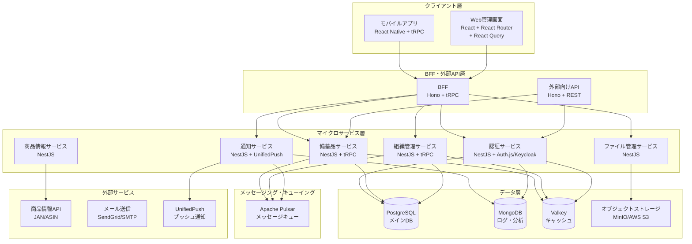
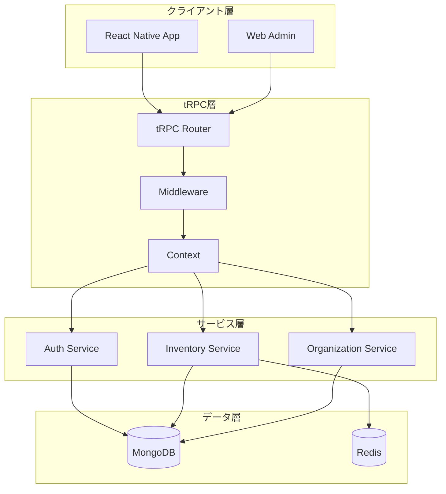
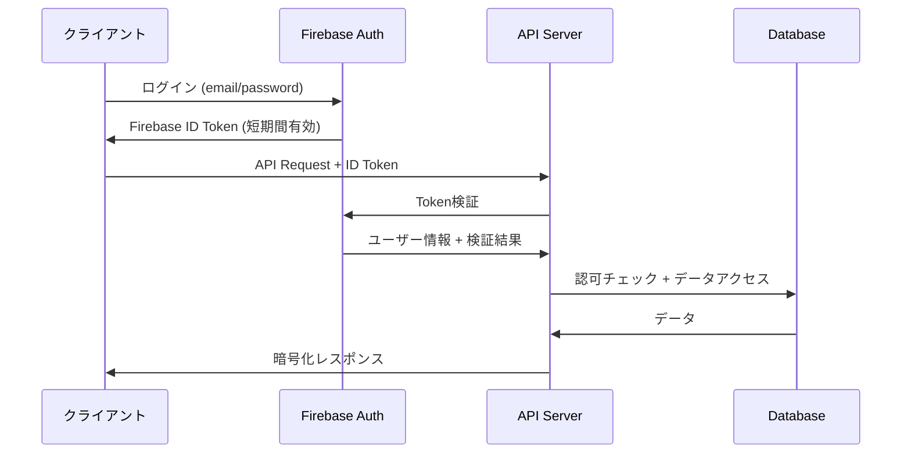
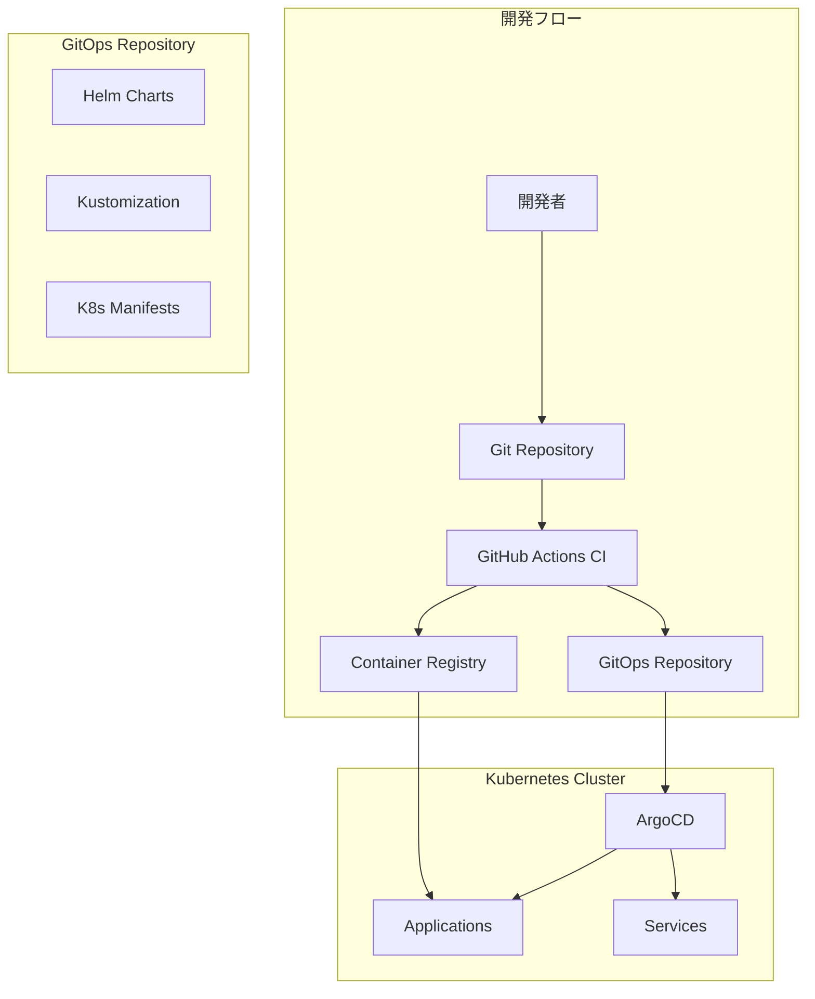

# 設計書

## 概要

備蓄管理用クロスプラットフォームアプリケーションの技術設計書。Android・iOS対応のモバイルアプリ、Web管理画面、バックエンドAPI、クラウドインフラストラクチャを含む包括的なシステム設計。

## アーキテクチャ

### システム全体構成



### 技術スタック選択理由

**フロントエンド:**
- **React Native + Expo SDK + TypeScript**: クロスプラットフォーム開発効率、豊富なネイティブ機能、型安全性
- **React + Vite + React Router + React Query + TypeScript**: Web管理画面、高速ビルド、宣言的ルーティング、強力なキャッシュ機能
- **TailwindCSS + shadcn/ui**: ユーティリティファースト、高品質コンポーネント、ダークモード対応
- **Zustand + Immer**: 軽量状態管理、イミュータブル更新、TypeScript完全対応
- **MSW (Mock Service Worker)**: API モック、開発・テスト環境支援

**BFF・API層:**
- **Hono**: 軽量高速、Edge Runtime対応、Tyme対応、高速ビルド
- **tRPC**: エンドツーエンド型安全性、優れた開発体験

**マイクロサービス:**
- **NestJS + TypeScript + SWC**: エンタープライズ級アーキテクチャ、高速ビルド、依存性注入
- **モジュラー設計**: サービス間疎結合、独立デプロイ可能

**認証:**
- **Auth.js (NextAuth.js)**: 多様なプロバイダー対応、セキュア、オープンソース
- **Keycloak**: エンタープライズ認証、OIDC/SAML対応、自己ホスト可能

**データベース:**
- **PostgreSQL + Prisma + Kysely**: ACID準拠、データ整合性保証、型安全なクエリ
- **MongoDB**: ログ・分析データ、柔軟なスキーマ

**キャッシュ・メッセージング:**
- **Valkey**: Redis互換、オープンソース、高性能
- **Apache Pulsar**: 多テナント、地理的レプリケーション、高可用性

**通知:**
- **UnifiedPush**: オープンスタンダード、プライバシー重視、ベンダーロックイン回避

**型安全性・開発ツール:**
- **TypeScript-Go (tsgo)**: Go言語ベースの高速TypeScriptコンパイラ、従来のtscより10倍高速
- **Zod**: ランタイム型検証、スキーマファーストバリデーション
- **zod-prisma-types**: Prismaスキーマから自動Zod型生成
- **tsgolint**: tsgo専用リンター、高速静的解析
- **Biome**: 統一フォーマッター・リンター、Rust製高速ツール
- **lefthook**: Git hooks管理、品質ゲート強制
- **neverthrow**: 関数型エラーハンドリング、Result型による安全なエラー処理
- **type-fest**: 高度なTypeScriptユーティリティ型、型レベルプログラミング支援
- **Prisma**: データベーススキーマからの型生成
- **tRPC**: API契約の型レベル保証

## コンポーネントとインターフェース

### モバイルアプリ構成

```
src/
├── components/           # 再利用可能コンポーネント
│   ├── common/          # 共通UI部品
│   ├── forms/           # フォーム関連
│   └── lists/           # リスト表示
├── screens/             # 画面コンポーネント
│   ├── auth/            # 認証関連画面
│   ├── inventory/       # 備蓄品管理画面
│   ├── organization/    # 組織管理画面
│   └── settings/        # 設定画面
├── services/            # API通信・外部サービス
├── store/               # 状態管理 (Redux Toolkit)
├── utils/               # ユーティリティ関数
└── navigation/          # ナビゲーション設定
```

### API通信プロトコル選択

#### プロトコル比較分析

**tRPC (推奨選択)**
- **型安全性**: TypeScriptネイティブ、エンドツーエンド型安全性
- **開発効率**: 自動型生成、優れたDX
- **パフォーマンス**: HTTP/JSON、適度な軽量性
- **エコシステム**: React Query統合、豊富なミドルウェア

**GraphQL**
- **柔軟性**: クエリの柔軟性、Over/Under-fetching解決
- **型安全性**: スキーマファースト、コード生成必要
- **複雑性**: 学習コスト高、キャッシュ戦略複雑
- **オーバーヘッド**: 小規模アプリには過剰

**gRPC**
- **パフォーマンス**: Protocol Buffers、高速バイナリ通信
- **型安全性**: .protoファイルからの型生成
- **制約**: ブラウザサポート限定、HTTP/2必須
- **複雑性**: 設定・デバッグが複雑

**REST API**
- **シンプル性**: 理解しやすい、標準的
- **型安全性**: 手動型定義、同期が困難
- **柔軟性**: 低い、Over-fetching問題

#### tRPC アーキテクチャ設計



#### tRPC ルーター定義

**サーバーサイド (server/trpc/router.ts)**
```typescript
import { z } from 'zod';
import { router, publicProcedure, protectedProcedure } from './trpc';
import { TRPCError } from '@trpc/server';

// 入力バリデーションスキーマ
const createInventoryItemSchema = z.object({
  name: z.string().min(1).max(100),
  brand: z.string().optional(),
  category: z.enum(['food', 'daily_goods', 'medicine', 'other']),
  quantity: z.number().min(0),
  unit: z.string().min(1),
  minQuantity: z.number().min(0).optional(),
  expiryDate: z.date().optional(),
  bestBeforeDate: z.date().optional(),
  expiryType: z.enum(['expiry', 'bestBefore', 'both']),
  storageLocation: z.string().optional(),
  price: z.object({
    amount: z.number().min(0),
    currency: z.enum(['JPY', 'USD', 'EUR'])
  }).optional(),
  barcode: z.string().optional(),
  asin: z.string().optional(),
  tags: z.array(z.string()).default([]),
  notes: z.string().optional()
});

const inventorySearchSchema = z.object({
  query: z.string().optional(),
  category: z.enum(['food', 'daily_goods', 'medicine', 'other']).optional(),
  storageLocation: z.string().optional(),
  expiryType: z.enum(['expiry', 'bestBefore', 'both']).optional(),
  tags: z.array(z.string()).optional(),
  expiryDateFrom: z.date().optional(),
  expiryDateTo: z.date().optional(),
  page: z.number().min(1).default(1),
  limit: z.number().min(1).max(100).default(20),
  sortBy: z.enum(['name', 'expiryDate', 'createdAt', 'quantity']).default('createdAt'),
  sortOrder: z.enum(['asc', 'desc']).default('desc')
});

// メインルーター
export const appRouter = router({
  // 認証関連
  auth: router({
    register: publicProcedure
      .input(z.object({
        email: z.string().email(),
        password: z.string().min(8),
        displayName: z.string().min(1)
      }))
      .mutation(async ({ input, ctx }) => {
        // Firebase認証 + ユーザー作成
        const user = await ctx.authService.register(input);
        return { user, message: 'Registration successful' };
      }),

    login: publicProcedure
      .input(z.object({
        email: z.string().email(),
        password: z.string()
      }))
      .mutation(async ({ input, ctx }) => {
        const result = await ctx.authService.login(input);
        return result;
      }),

    refresh: protectedProcedure
      .mutation(async ({ ctx }) => {
        const tokens = await ctx.authService.refreshTokens(ctx.user.id);
        return tokens;
      })
  }),

  // 組織管理
  organization: router({
    list: protectedProcedure
      .query(async ({ ctx }) => {
        const organizations = await ctx.organizationService.getUserOrganizations(ctx.user.id);
        return organizations;
      }),

    create: protectedProcedure
      .input(z.object({
        name: z.string().min(1).max(50),
        description: z.string().optional(),
        privacy: z.enum(['public', 'private']).default('private')
      }))
      .mutation(async ({ input, ctx }) => {
        const organization = await ctx.organizationService.create({
          ...input,
          createdBy: ctx.user.id
        });
        return organization;
      }),

    invite: protectedProcedure
      .input(z.object({
        organizationId: z.string(),
        email: z.string().email(),
        role: z.enum(['admin', 'editor', 'viewer']).default('editor')
      }))
      .mutation(async ({ input, ctx }) => {
        // 権限チェック
        await ctx.organizationService.checkPermission(
          input.organizationId, 
          ctx.user.id, 
          'invite'
        );
        
        const invitation = await ctx.organizationService.inviteMember(input);
        return invitation;
      })
  }),

  // 備蓄品管理
  inventory: router({
    list: protectedProcedure
      .input(z.object({
        organizationId: z.string()
      }))
      .query(async ({ input, ctx }) => {
        // 組織アクセス権チェック
        await ctx.organizationService.checkMembership(input.organizationId, ctx.user.id);
        
        const items = await ctx.inventoryService.getItems(input.organizationId);
        return items;
      }),

    search: protectedProcedure
      .input(inventorySearchSchema.extend({
        organizationId: z.string()
      }))
      .query(async ({ input, ctx }) => {
        await ctx.organizationService.checkMembership(input.organizationId, ctx.user.id);
        
        const result = await ctx.inventoryService.search(input);
        return result;
      }),

    create: protectedProcedure
      .input(createInventoryItemSchema.extend({
        organizationId: z.string()
      }))
      .mutation(async ({ input, ctx }) => {
        // 書き込み権限チェック
        await ctx.organizationService.checkPermission(
          input.organizationId, 
          ctx.user.id, 
          'write'
        );

        const item = await ctx.inventoryService.create({
          ...input,
          createdBy: ctx.user.id,
          updatedBy: ctx.user.id
        });
        
        // 活動ログ記録
        await ctx.activityService.log({
          organizationId: input.organizationId,
          userId: ctx.user.id,
          action: 'add',
          targetType: 'inventory',
          targetId: item._id,
          details: { name: item.name }
        });

        return item;
      }),

    update: protectedProcedure
      .input(createInventoryItemSchema.partial().extend({
        id: z.string(),
        organizationId: z.string()
      }))
      .mutation(async ({ input, ctx }) => {
        await ctx.organizationService.checkPermission(
          input.organizationId, 
          ctx.user.id, 
          'write'
        );

        const { id, organizationId, ...updateData } = input;
        const item = await ctx.inventoryService.update(id, {
          ...updateData,
          updatedBy: ctx.user.id
        });

        await ctx.activityService.log({
          organizationId,
          userId: ctx.user.id,
          action: 'update',
          targetType: 'inventory',
          targetId: id,
          details: updateData
        });

        return item;
      }),

    consume: protectedProcedure
      .input(z.object({
        itemId: z.string(),
        organizationId: z.string(),
        quantity: z.number().min(0.1),
        reason: z.string().optional()
      }))
      .mutation(async ({ input, ctx }) => {
        await ctx.organizationService.checkPermission(
          input.organizationId, 
          ctx.user.id, 
          'write'
        );

        const result = await ctx.inventoryService.consume({
          ...input,
          userId: ctx.user.id
        });

        await ctx.activityService.log({
          organizationId: input.organizationId,
          userId: ctx.user.id,
          action: 'consume',
          targetType: 'inventory',
          targetId: input.itemId,
          details: { quantity: input.quantity, reason: input.reason }
        });

        return result;
      }),

    getExpiring: protectedProcedure
      .input(z.object({
        organizationId: z.string(),
        days: z.number().min(1).max(365).default(30)
      }))
      .query(async ({ input, ctx }) => {
        await ctx.organizationService.checkMembership(input.organizationId, ctx.user.id);
        
        const items = await ctx.inventoryService.getExpiringItems(
          input.organizationId, 
          input.days
        );
        return items;
      })
  }),

  // 商品情報・バーコード
  product: router({
    getByBarcode: protectedProcedure
      .input(z.object({
        barcode: z.string().min(8).max(13)
      }))
      .query(async ({ input, ctx }) => {
        const product = await ctx.productService.getByBarcode(input.barcode);
        return product;
      }),

    getByAsin: protectedProcedure
      .input(z.object({
        asin: z.string().length(10)
      }))
      .query(async ({ input, ctx }) => {
        const product = await ctx.productService.getByAsin(input.asin);
        return product;
      })
  }),

  // 画像管理
  image: router({
    getUploadUrl: protectedProcedure
      .input(z.object({
        fileName: z.string(),
        contentType: z.string(),
        organizationId: z.string()
      }))
      .mutation(async ({ input, ctx }) => {
        await ctx.organizationService.checkPermission(
          input.organizationId, 
          ctx.user.id, 
          'write'
        );

        const uploadUrl = await ctx.imageService.getUploadUrl(input);
        return uploadUrl;
      }),

    delete: protectedProcedure
      .input(z.object({
        imageId: z.string(),
        organizationId: z.string()
      }))
      .mutation(async ({ input, ctx }) => {
        await ctx.organizationService.checkPermission(
          input.organizationId, 
          ctx.user.id, 
          'delete'
        );

        await ctx.imageService.delete(input.imageId);
        return { success: true };
      })
  })
});

export type AppRouter = typeof appRouter;
```

#### クライアントサイド統合

**React Native クライアント (client/trpc.ts)**
```typescript
import { createTRPCReact } from '@trpc/react-query';
import { createTRPCMsw } from 'msw-trpc';
import type { AppRouter } from '../server/trpc/router';

// tRPC React フック
export const trpc = createTRPCReact<AppRouter>();

// MSW モック (テスト用)
export const trpcMsw = createTRPCMsw<AppRouter>();

// クライアント設定
import { httpBatchLink } from '@trpc/client';
import { createTRPCClient } from '@trpc/client';

export const trpcClient = createTRPCClient<AppRouter>({
  links: [
    httpBatchLink({
      url: 'https://api.inventory-app.com/trpc',
      headers: async () => {
        const token = await getAuthToken();
        return {
          authorization: token ? `Bearer ${token}` : '',
        };
      },
    }),
  ],
});
```

**React Native コンポーネント使用例**
```typescript
import React from 'react';
import { View, Text, Button } from 'react-native';
import { trpc } from '../trpc';

export const InventoryList: React.FC<{ organizationId: string }> = ({ organizationId }) => {
  // 型安全なクエリ
  const { data: items, isLoading, error } = trpc.inventory.list.useQuery({
    organizationId
  });

  // 型安全なミューテーション
  const createMutation = trpc.inventory.create.useMutation({
    onSuccess: () => {
      // キャッシュ無効化
      trpc.inventory.list.invalidate({ organizationId });
    }
  });

  const handleCreate = () => {
    createMutation.mutate({
      organizationId,
      name: '新しい商品',
      category: 'food',
      quantity: 1,
      unit: '個',
      expiryType: 'bestBefore'
    });
  };

  if (isLoading) return <Text>Loading...</Text>;
  if (error) return <Text>Error: {error.message}</Text>;

  return (
    <View>
      {items?.map(item => (
        <Text key={item._id}>{item.name} - {item.quantity}{item.unit}</Text>
      ))}
      <Button title="商品追加" onPress={handleCreate} />
    </View>
  );
};
```

#### 型安全性の利点

**コンパイル時保証**
- API契約の自動同期
- 型不整合の即座検出
- リファクタリング安全性

**開発体験向上**
- 自動補完・IntelliSense
- エラーの早期発見
- ドキュメント不要

## データベース設計

### Prisma スキーマ定義 (prisma/schema.prisma)

```prisma
generator client {
  provider = "prisma-client-js"
}

generator kysely {
  provider = "prisma-kysely"
}

datasource db {
  provider = "postgresql"
  url      = env("DATABASE_URL")
}

// ユーザー
model User {
  id          String   @id @default(cuid())
  email       String   @unique
  displayName String
  authId      String   @unique // Auth.js/Keycloak ID
  profileImage String?
  isActive    Boolean  @default(true)
  createdAt   DateTime @default(now())
  updatedAt   DateTime @updatedAt

  // リレーション
  organizationMembers OrganizationMember[]
  createdOrganizations Organization[] @relation("OrganizationCreator")
  createdInventoryItems InventoryItem[] @relation("InventoryItemCreator")
  updatedInventoryItems InventoryItem[] @relation("InventoryItemUpdater")
  consumptionLogs ConsumptionLog[]
  activityLogs    ActivityLog[]

  @@map("users")
}

// 組織
model Organization {
  id          String   @id @default(cuid())
  name        String
  description String?
  inviteCode  String   @unique @default(cuid())
  privacy     Privacy  @default(PRIVATE)
  isActive    Boolean  @default(true)
  createdById String
  createdAt   DateTime @default(now())
  updatedAt   DateTime @updatedAt

  // リレーション
  createdBy     User                 @relation("OrganizationCreator", fields: [createdById], references: [id])
  members       OrganizationMember[]
  inventoryItems InventoryItem[]
  consumptionLogs ConsumptionLog[]
  activityLogs  ActivityLog[]

  @@map("organizations")
}

// 組織メンバー
model OrganizationMember {
  id             String   @id @default(cuid())
  organizationId String
  userId         String
  role           UserRole @default(EDITOR)
  permissions    Permission[]
  joinedAt       DateTime @default(now())
  isActive       Boolean  @default(true)

  // リレーション
  organization Organization @relation(fields: [organizationId], references: [id], onDelete: Cascade)
  user         User         @relation(fields: [userId], references: [id], onDelete: Cascade)

  @@unique([organizationId, userId])
  @@map("organization_members")
}

// 備蓄品
model InventoryItem {
  id             String            @id @default(cuid())
  organizationId String
  name           String
  brand          String?
  category       InventoryCategory
  quantity       Decimal           @db.Decimal(10, 3)
  unit           String
  minQuantity    Decimal?          @db.Decimal(10, 3)
  
  // 期限管理
  expiryDate     DateTime?
  bestBeforeDate DateTime?
  expiryType     ExpiryType
  
  // 保管・価格情報
  storageLocation String?
  priceAmount     Decimal?  @db.Decimal(10, 2)
  priceCurrency   Currency?
  
  // 商品識別
  barcode        String?
  asin           String?
  
  // メタデータ
  tags           String[]
  images         String[]
  notes          String?
  
  // 履歴
  createdById    String
  updatedById    String
  createdAt      DateTime @default(now())
  updatedAt      DateTime @updatedAt

  // リレーション
  organization    Organization     @relation(fields: [organizationId], references: [id], onDelete: Cascade)
  createdBy       User             @relation("InventoryItemCreator", fields: [createdById], references: [id])
  updatedBy       User             @relation("InventoryItemUpdater", fields: [updatedById], references: [id])
  consumptionLogs ConsumptionLog[]

  // インデックス
  @@index([organizationId, name])
  @@index([organizationId, expiryDate])
  @@index([organizationId, category])
  @@index([barcode])
  @@map("inventory_items")
}

// 消費履歴
model ConsumptionLog {
  id              String    @id @default(cuid())
  inventoryItemId String
  organizationId  String
  userId          String
  quantity        Decimal   @db.Decimal(10, 3)
  reason          String?
  consumedAt      DateTime
  createdAt       DateTime  @default(now())

  // リレーション
  inventoryItem InventoryItem @relation(fields: [inventoryItemId], references: [id], onDelete: Cascade)
  organization  Organization  @relation(fields: [organizationId], references: [id], onDelete: Cascade)
  user          User          @relation(fields: [userId], references: [id])

  @@index([organizationId, consumedAt])
  @@index([inventoryItemId, consumedAt])
  @@map("consumption_logs")
}

// 活動ログ (MongoDB用は別途定義)
model ActivityLog {
  id             String       @id @default(cuid())
  organizationId String
  userId         String
  action         ActivityAction
  targetType     String
  targetId       String
  details        Json
  createdAt      DateTime     @default(now())

  // リレーション
  organization Organization @relation(fields: [organizationId], references: [id], onDelete: Cascade)
  user         User         @relation(fields: [userId], references: [id])

  @@index([organizationId, createdAt])
  @@index([userId, createdAt])
  @@map("activity_logs")
}

// 列挙型定義
enum UserRole {
  ADMIN
  EDITOR
  VIEWER
}

enum Permission {
  READ
  WRITE
  DELETE
  INVITE
  MANAGE
}

enum Privacy {
  PUBLIC
  PRIVATE
}

enum ExpiryType {
  EXPIRY      // 消費期限
  BEST_BEFORE // 賞味期限
  BOTH        // 両方
}

enum InventoryCategory {
  FOOD
  DAILY_GOODS
  MEDICINE
  OTHER
}

enum Currency {
  JPY
  USD
  EUR
}

enum ActivityAction {
  ADD
  UPDATE
  DELETE
  CONSUME
}
```

### Kysely 型安全クエリ

**データベースアクセス層 (db/kysely.ts)**
```typescript
import { Kysely, PostgresDialect } from 'kysely';
import { Pool } from 'pg';
import { DB } from './types'; // Prisma生成型

const dialect = new PostgresDialect({
  pool: new Pool({
    connectionString: process.env.DATABASE_URL,
    max: 20,
  }),
});

export const db = new Kysely<DB>({
  dialect,
  log: process.env.NODE_ENV === 'development' ? ['query'] : [],
});

// 型安全なクエリ例
export class InventoryRepository {
  async findByOrganization(organizationId: string) {
    return await db
      .selectFrom('inventory_items')
      .selectAll()
      .where('organizationId', '=', organizationId)
      .where('quantity', '>', 0)
      .orderBy('expiryDate', 'asc')
      .execute();
  }

  async findExpiring(organizationId: string, days: number) {
    const futureDate = new Date();
    futureDate.setDate(futureDate.getDate() + days);

    return await db
      .selectFrom('inventory_items')
      .selectAll()
      .where('organizationId', '=', organizationId)
      .where((eb) => eb.or([
        eb('expiryDate', '<=', futureDate),
        eb('bestBeforeDate', '<=', futureDate)
      ]))
      .orderBy('expiryDate', 'asc')
      .execute();
  }

  async searchItems(params: {
    organizationId: string;
    query?: string;
    category?: string;
    storageLocation?: string;
    limit: number;
    offset: number;
  }) {
    let query = db
      .selectFrom('inventory_items')
      .selectAll()
      .where('organizationId', '=', params.organizationId);

    if (params.query) {
      query = query.where((eb) => eb.or([
        eb('name', 'ilike', `%${params.query}%`),
        eb('brand', 'ilike', `%${params.query}%`)
      ]));
    }

    if (params.category) {
      query = query.where('category', '=', params.category as any);
    }

    if (params.storageLocation) {
      query = query.where('storageLocation', 'ilike', `%${params.storageLocation}%`);
    }

    

### API 型定義 (shared/api-type
      .execute();
  }

  async updateQuantity(id: string, quantity: number, updatedById: string) {
    return await db
      .updateTable('inventory_items')
      .set({
        quantity: quantity.toString(),
        updatedById,
        updatedAt: new Date()
      })
      .where('id', '=', id)
      .returningAll()
      .executeTakeFirstOrThrow();
  }
}
```

### MongoDB ログ・分析データ

**活動ログ・分析用 (MongoDB)**
```typescript
// MongoDB スキーマ (Mongoose)
import { Schema, model } from 'mongoose';

// 詳細活動ログ
const DetailedActivityLogSchema = new Schema({
  organizationId: { type: String, required: true, index: true },
  userId: { type: String, required: true, index: true },
  action: { type: String, required: true },
  targetType: { type: String, required: true },
  targetId: { type: String, required: true },
  details: { type: Schema.Types.Mixed },
  metadata: {
    userAgent: String,
    ipAddress: String,
    sessionId: String,
    deviceInfo: Schema.Types.Mixed
  },
  timestamp: { type: Date, default: Date.now, index: true }
}, {
  timeseries: {
    timeField: 'timestamp',
    metaField: 'organizationId',
    granularity: 'hours'
  }
});

// 使用統計
const UsageStatsSchema = new Schema({
  organizationId: { type: String, required: true },
  date: { type: Date, required: true },
  metrics: {
    itemsAdded: { type: Number, default: 0 },
    itemsConsumed: { type: Number, default: 0 },
    itemsExpired: { type: Number, default: 0 },
    activeUsers: { type: Number, default: 0 },
    totalValue: { type: Number, default: 0 }
  }
}, {
  index: { organizationId: 1, date: 1 }
});

export const DetailedActivityLog = model('DetailedActivityLog', DetailedActivityLogSchema);
export const UsageStats = model('UsageStats', UsageStatsSchema);
```s.ts)

**リクエスト・レスポンス型**
```typescript
// 共通レスポンス型
export interface ApiResponse<T> {
  readonly success: boolean;
  readonly data?: T;
  readonly error?: ApiError;
  readonly timestamp: string;
}

export interface ApiError {
  readonly code: string;
  readonly message: string;
  readonly details?: Record<string, unknown>;
}

// ページネーション
export interface PaginatedResponse<T> extends ApiResponse<T[]> {
  readonly pagination: {
    readonly page: number;
    readonly limit: number;
    readonly total: number;
    readonly hasNext: boolean;
    readonly hasPrev: boolean;
  };
}

// 認証関連
export interface LoginRequest {
  readonly email: string;
  readonly password: string;
}

export interface LoginResponse {
  readonly user: User;
  readonly accessToken: string;
  readonly refreshToken: string;
  readonly expiresIn: number;
}

// 備蓄品関連
export interface CreateInventoryItemRequest {
  readonly name: string;
  readonly brand?: string;
  readonly category: InventoryCategory;
  readonly quantity: number;
  readonly unit: string;
  readonly minQuantity?: number;
  readonly expiryDate?: string; // ISO date string
  readonly bestBeforeDate?: string;
  readonly expiryType: ExpiryType;
  readonly storageLocation?: string;
  readonly price?: Money;
  readonly barcode?: string;
  readonly asin?: string;
  readonly tags?: readonly string[];
  readonly notes?: string;
}

export interface UpdateInventoryItemRequest extends Partial<CreateInventoryItemRequest> {
  readonly _id: InventoryItemId;
}

export interface ConsumeInventoryRequest {
  readonly inventoryItemId: InventoryItemId;
  readonly quantity: number;
  readonly reason?: string;
}

// 検索・フィルタ
export interface InventorySearchRequest {
  readonly query?: string;
  readonly category?: InventoryCategory;
  readonly storageLocation?: string;
  readonly expiryType?: ExpiryType;
  readonly tags?: readonly string[];
  readonly expiryDateFrom?: string;
  readonly expiryDateTo?: string;
  readonly page?: number;
  readonly limit?: number;
  readonly sortBy?: 'name' | 'expiryDate' | 'createdAt' | 'quantity';
  readonly sortOrder?: 'asc' | 'desc';
}
```

### Mongoose スキーマ型安全性

**型安全なスキーマ定義**
```typescript
import { Schema, model, Document } from 'mongoose';
import { User, Organization, InventoryItem } from '../shared/types';

// Document型の拡張
export interface UserDocument extends User, Document {}
export interface OrganizationDocument extends Organization, Document {}
export interface InventoryItemDocument extends InventoryItem, Document {}

// スキーマ定義
const UserSchema = new Schema<UserDocument>({
  email: { type: String, required: true, unique: true },
  displayName: { type: String, required: true },
  firebaseUid: { type: String, required: true, unique: true },
  profileImage: { type: String },
}, {
  timestamps: true,
  toJSON: { virtuals: true },
  toObject: { virtuals: true }
});

const InventoryItemSchema = new Schema<InventoryItemDocument>({
  organizationId: { type: Schema.Types.ObjectId, required: true, ref: 'Organization' },
  name: { type: String, required: true },
  brand: { type: String },
  category: { 
    type: String, 
    required: true, 
    enum: Object.values(InventoryCategory) 
  },
  quantity: { type: Number, required: true, min: 0 },
  unit: { type: String, required: true },
  minQuantity: { type: Number, min: 0 },
  expiryDate: { type: Date },
  bestBeforeDate: { type: Date },
  expiryType: { 
    type: String, 
    required: true, 
    enum: Object.values(ExpiryType) 
  },
  storageLocation: { type: String },
  price: {
    amount: { type: Number, min: 0 },
    currency: { type: String, enum: ['JPY', 'USD', 'EUR'] }
  },
  barcode: { type: String },
  asin: { type: String },
  tags: [{ type: String }],
  images: [{ type: String }],
  notes: { type: String },
  createdBy: { type: Schema.Types.ObjectId, required: true, ref: 'User' },
  updatedBy: { type: Schema.Types.ObjectId, required: true, ref: 'User' }
}, {
  timestamps: true
});

// インデックス定義
InventoryItemSchema.index({ organizationId: 1, name: 1 });
InventoryItemSchema.index({ organizationId: 1, expiryDate: 1 });
InventoryItemSchema.index({ organizationId: 1, category: 1 });
InventoryItemSchema.index({ barcode: 1 });

export const UserModel = model<UserDocument>('User', UserSchema);
export const InventoryItemModel = model<InventoryItemDocument>('InventoryItem', InventoryItemSchema);
```

### API エンドポイント型安全性

**Express + TypeScript 型安全なルーター**
```typescript
import { Request, Response } from 'express';
import { CreateInventoryItemRequest, ApiResponse, InventoryItem } from '../shared/api-types';

// 型安全なリクエストハンドラー
export interface TypedRequest<T = {}> extends Request {
  body: T;
}

export interface TypedResponse<T = {}> extends Response {
  json(body: ApiResponse<T>): this;
}

// 備蓄品作成エンドポイント
export const createInventoryItem = async (
  req: TypedRequest<CreateInventoryItemRequest>,
  res: TypedResponse<InventoryItem>
): Promise<void> => {
  try {
    // リクエストボディは型安全
    const { name, category, quantity, expiryType } = req.body;
    
    // バリデーション（コンパイル時に型チェック）
    if (!name || !category || quantity < 0) {
      res.status(400).json({
        success: false,
        error: {
          code: 'VALIDATION_ERROR',
          message: 'Invalid request data'
        },
        timestamp: new Date().toISOString()
      });
      return;
    }

    // データベース操作も型安全
    const item = new InventoryItemModel({
      ...req.body,
      organizationId: req.user.organizationId,
      createdBy: req.user.id,
      updatedBy: req.user.id
    });

    await item.save();

    // レスポンスも型安全
    res.json({
      success: true,
      data: item.toObject(),
      timestamp: new Date().toISOString()
    });
  } catch (error) {
    res.status(500).json({
      success: false,
      error: {
        code: 'INTERNAL_ERROR',
        message: 'Internal server error'
      },
      timestamp: new Date().toISOString()
    });
  }
};
```

### フロントエンド型安全性

**React Native + TypeScript**
```typescript
import React from 'react';
import { InventoryItem, CreateInventoryItemRequest } from '../shared/api-types';
import { useCreateInventoryItem } from '../hooks/useInventoryApi';

interface InventoryFormProps {
  onSuccess: (item: InventoryItem) => void;
}

export const InventoryForm: React.FC<InventoryFormProps> = ({ onSuccess }) => {
  const createMutation = useCreateInventoryItem();

  const handleSubmit = (formData: CreateInventoryItemRequest) => {
    // フォームデータは型安全
    createMutation.mutate(formData, {
      onSuccess: (response) => {
        // レスポンスも型安全
        if (response.success && response.data) {
          onSuccess(response.data);
        }
      }
    });
  };

  // JSX内でも型安全な補完が効く
  return (
    <View>
      {/* フォームコンポーネント */}
    </View>
  );
};
```

## エラーハンドリング

### エラー分類と対応

**認証エラー (4xx)**
- 401 Unauthorized: トークン無効・期限切れ → 再ログイン促進
- 403 Forbidden: 権限不足 → 適切な権限レベル表示

**バリデーションエラー (400)**
- 必須フィールド不足
- データ形式不正
- 業務ルール違反

**サーバーエラー (5xx)**
- 500 Internal Server Error: 一般的なサーバーエラー
- 503 Service Unavailable: メンテナンス中

### オフライン対応

**データ同期戦略:**
1. **楽観的更新**: ローカル変更を即座に反映
2. **バックグラウンド同期**: 接続復旧時に自動同期
3. **競合解決**: タイムスタンプベースの最新優先

**ローカルストレージ:**
- SQLite (React Native): オフラインデータ保存
- Redux Persist: アプリ状態の永続化

## テスト戦略

### テスト階層

**Unit Tests (単体テスト)**
- ユーティリティ関数
- データ変換ロジック
- バリデーション関数

**Integration Tests (統合テスト)**
- API エンドポt Naイントtive E2Eテスト
- **Testcontainers**: PostgreSQL/MongoDB テスト環境
- データベース操作
- 外部サービス連携

**E2E Tests (エンドツーエンドテスト)**
- 主要ユーザーフロー
- 認証・組織作成・備蓄品管理

### テストツール
- **Jest**: JavaScript単体テスト
- **Supertest**: API統合テスト
- **Detox**: React Native E2Eテスト
- **MongoDB Memory Server**: テスト用DB

### テストデータ管理
- **Fixtures**: 標準テストデータセット
- **Factory Pattern**: 動的テストデータ生成
- **Database Seeding**: 開発環境データ投入

## セキュリティ考慮事項

### 通信セキュリティ

**HTTPS/TLS 1.3 強制**
- 全ての通信でTLS 1.3を強制
- Certificate Pinning: アプリに証明書を埋め込み、中間者攻撃を防止
- HSTS (HTTP Strict Transport Security) ヘッダーで強制HTTPS

**API認証フロー**


**トークン管理戦略**
- **Access Token**: 15分有効期限、API認証用
- **Refresh Token**: 7日有効期限、セキュアストレージ保存
- **Token Rotation**: リフレッシュ時に新しいRefresh Tokenを発行
- **Revocation**: 不正アクセス検知時の即座トークン無効化

### 認証・認可

**多層認証システム**
1. **Firebase Authentication**: 初期認証
2. **Custom Claims**: 組織・権限情報をトークンに埋め込み
3. **API Level Authorization**: エンドポイント毎の権限チェック
4. **Resource Level Authorization**: データレベルでの所有権確認

**権限管理モデル**
```javascript
// Custom Claims 構造
{
  organizations: {
    "org_id_1": {
      role: "admin",        // admin/editor/viewer
      permissions: ["read", "write", "delete", "invite"]
    },
    "org_id_2": {
      role: "viewer",
      permissions: ["read"]
    }
  }
}
```

### データ保護

**エンドツーエンド暗号化**
- **AES-256-GCM**: 機密データの暗号化
- **Key Derivation**: PBKDF2 + Salt でユーザー固有キー生成
- **Key Management**: AWS KMS でマスターキー管理

**データ分類と保護レベル**
```javascript
// データ分類例
const DATA_CLASSIFICATION = {
  PUBLIC: {
    encryption: false,
    examples: ["商品カテゴリ", "公開統計"]
  },
  INTERNAL: {
    encryption: "transit",
    examples: ["商品名", "保管場所"]
  },
  CONFIDENTIAL: {
    encryption: "end-to-end",
    examples: ["個人メモ", "価格情報"]
  },
  RESTRICTED: {
    encryption: "end-to-end",
    audit: true,
    examples: ["ユーザー個人情報", "組織招待コード"]
  }
};
```

**入力検証・サニタイゼーション**
- **Schema Validation**: Joi/Yup による厳密な入力検証
- **SQL Injection 防止**: Parameterized Queries
- **XSS 防止**: Content Security Policy + 入力エスケープ
- **File Upload 検証**: ファイル形式・サイズ・内容検証

### API セキュリティ

**レート制限・DDoS対策**
```javascript
// レート制限設定例
const RATE_LIMITS = {
  authentication: "5 requests per minute",
  search: "100 requests per minute",
  upload: "10 requests per minute",
  general: "1000 requests per hour"
};
```

**API セキュリティヘッダー**
```javascript
// セキュリティヘッダー設定
const SECURITY_HEADERS = {
  "Strict-Transport-Security": "max-age=31536000; includeSubDomains",
  "Content-Security-Policy": "default-src 'self'",
  "X-Frame-Options": "DENY",
  "X-Content-Type-Options": "nosniff",
  "Referrer-Policy": "strict-origin-when-cross-origin",
  "Permissions-Policy": "camera=(), microphone=(), geolocation=()"
};
```

**リクエスト署名検証**
- **HMAC-SHA256**: リクエストボディの署名検証
- **Timestamp Validation**: リプレイ攻撃防止 (5分以内の有効期限)
- **Nonce**: 一意性保証でリプレイ攻撃防止

### 監査・ログ

**セキュリティ監査ログ**
```javascript
// 監査ログ構造
{
  timestamp: "2024-01-01T00:00:00Z",
  userId: "user_id",
  organizationId: "org_id",
  action: "inventory.delete",
  resource: "item_id",
  ipAddress: "192.168.1.1",
  userAgent: "...",
  result: "success|failure",
  riskScore: 0.2,        // 0-1 のリスクスコア
  metadata: {
    previousValue: "...",
    newValue: "..."
  }
}
```

**異常検知・アラート**
- **ログイン異常**: 地理的位置・時間・デバイスの変化
- **大量操作**: 短時間での大量データ変更
- **権限昇格**: 通常と異なる権限での操作
- **データ流出**: 大量データダウンロード

### プライバシー・コンプライアンス

**GDPR/個人情報保護法対応**
- **データ最小化**: 必要最小限のデータ収集
- **同意管理**: 明示的な同意取得・管理
- **忘れられる権利**: 完全なデータ削除機能
- **データポータビリティ**: データエクスポート機能

**データ保持ポリシー**
```javascript
const DATA_RETENTION = {
  userAccount: "アカウント削除後30日で完全削除",
  inventoryData: "組織退会後90日で匿名化",
  auditLogs: "7年間保持（法的要件）",
  images: "参照されなくなった後1年で削除"
};
```

### セキュリティテスト

**ペネトレーションテスト**
- **OWASP Top 10**: 定期的な脆弱性スキャン
- **API Security**: 認証・認可の抜け穴チェック
- **Mobile Security**: アプリの逆解析・改ざん対策

**セキュリティ監視**
- **SIEM**: セキュリティ情報・イベント管理
- **WAF**: Web Application Firewall
- **IDS/IPS**: 侵入検知・防止システム

## パフォーマンス最適化

### フロントエンド最適化
- **画像最適化**: WebP形式、適切なサイズ変換
- **遅延読み込み**: 大量リストの仮想化
- **キャッシュ戦略**: API レスポンスキャッシュ

### バックエンド最適化
- **データベースインデックス**: 検索・ソート性能向上
- **Redis キャッシュ**: 頻繁アクセスデータ
- **CDN**: 画像配信最適化

### モニタリング
- **APM**: アプリケーション性能監視
- **ログ集約**: 構造化ログ、エラー追跡
- **メトリクス**: レスポンス時間、エラー率

## デプロイメント・インフラ

### 開発環境
- **Docker**: 開発環境統一
- **Docker Compose**: ローカル開発スタック

### 本番環境 (AWS)
- **ECS Fargate**: コンテナオーケストレーション
- **Application Load Balancer**: 負荷分散
- **RDS MongoDB**: マネージドデータベース
- **S3**: 画像ストレージ
- **CloudFront**: CDN
- **Route 53**: DNS管理

### CI/CD パイプライン
- **GitHub Actions**: 自動テスト・デプロイ
- **Staging環境**: 本番前検証
- **Blue-Green デプロイ**: ゼロダウンタイム更新
## ビルドツ
ール・モノレポ構成

### Turborepo モノレポ構成

```
inventory-app/
├── apps/
│   ├── mobile/                 # React Native アプリ
│   ├── web-admin/             # React 管理画面
│   ├── bff/                   # Hono BFF
│   ├── external-api/          # Hono 外部API
│   └── services/
│       ├── auth-service/      # NestJS 認証サービス
│       ├── inventory-service/ # NestJS 備蓄品サービス
│       ├── org-service/       # NestJS 組織サービス
│       ├── notify-service/    # NestJS 通知サービス
│       ├── file-service/      # NestJS ファイルサービス
│       └── product-service/   # NestJS 商品情報サービス
├── packages/
│   ├── shared-types/          # 共有型定義 (type-fest活用)
│   ├── trpc-router/          # tRPC ルーター定義
│   ├── database/             # Prisma スキーマ・マイグレーション
│   ├── ui-components/        # 共有UIコンポーネント (shadcn/ui)
│   ├── state-management/     # Zustand + Immer 状態管理
│   ├── utils/                # 共通ユーティリティ (neverthrow活用)
│   ├── error-handling/       # エラーハンドリング共通ライブラリ
│   ├── mocks/                # MSW モック定義
│   └── config/               # 共通設定
├── tools/
│   ├── biome-config/         # Biome 設定
│   ├── tsgo-config/          # tsgo TypeScript 設定
│   ├── tsgolint-config/      # tsgolint 設定
│   ├── vitest-config/        # Vitest 設定
│   └── lefthook-config/      # lefthook Git hooks 設定
└── turbo.json                # Turborepo 設定
```

### Turborepo 設定 (turbo.json)

```json
{
  "$schema": "https://turbo.build/schema.json",
  "globalDependencies": ["**/.env.*local"],
  "pipeline": {
    "build": {
      "dependsOn": ["^build"],
      "outputs": ["dist/**", ".next/**", "build/**"]
    },
    "test": {
      "dependsOn": ["^build"],
      "outputs": ["coverage/**"]
    },
    "test:unit": {
      "dependsOn": ["^build"]
    },
    "test:integration": {
      "dependsOn": ["^build", "db:migrate"]
    },
    "test:e2e": {
      "dependsOn": ["^build", "db:migrate", "dev"]
    },
    "lint": {
      "outputs": []
    },
    "lint:tsgolint": {
      "outputs": []
    },
    "format": {
      "outputs": []
    },
    "format:check": {
      "outputs": []
    },
    "type-check": {
      "dependsOn": ["^build"],
      "outputs": []
    },
    "dev": {
      "cache": false,
      "persistent": true
    },
    "db:migrate": {
      "cache": false
    },
    "db:generate": {
      "dependsOn": ["^db:generate"],
      "outputs": ["node_modules/.prisma/**"]
    }
  }
}
```

### ビルドツール統合

**tsgo + Biome 設定**

```json
// tools/tsgo-config/tsconfig.base.json
{
  "compilerOptions": {
    "target": "ES2022",
    "module": "ESNext",
    "moduleResolution": "bundler",
    "strict": true,
    "exactOptionalPropertyTypes": true,
    "noUncheckedIndexedAccess": true,
    "noImplicitOverride": true,
    "declaration": true,
    "declarationMap": true,
    "sourceMap": true,
    "composite": true,
    "skipLibCheck": true,
    "allowSyntheticDefaultImports": true,
    "esModuleInterop": true,
    "forceConsistentCasingInFileNames": true
  },
  "exclude": ["node_modules", "dist", "build"]
}
```

```json
// tools/biome-config/biome.json
{
  "$schema": "https://biomejs.dev/schemas/1.4.1/schema.json",
  "organizeImports": {
    "enabled": true
  },
  "linter": {
    "enabled": true,
    "rules": {
      "recommended": true,
      "complexity": {
        "noExtraBooleanCast": "error",
        "noMultipleSpacesInRegularExpressionLiterals": "error",
        "noUselessCatch": "error",
        "noUselessTypeConstraint": "error"
      },
      "correctness": {
        "noConstAssign": "error",
        "noConstantCondition": "error",
        "noEmptyCharacterClassInRegex": "error",
        "noEmptyPattern": "error",
        "noGlobalObjectCalls": "error",
        "noInvalidConstructorSuper": "error",
        "noInvalidNewBuiltin": "error",
        "noNonoctalDecimalEscape": "error",
        "noPrecisionLoss": "error",
        "noSelfAssign": "error",
        "noSetterReturn": "error",
        "noSwitchDeclarations": "error",
        "noUndeclaredVariables": "error",
        "noUnreachable": "error",
        "noUnreachableSuper": "error",
        "noUnsafeFinally": "error",
        "noUnsafeOptionalChaining": "error",
        "noUnusedLabels": "error",
        "noUnusedVariables": "error",
        "useIsNan": "error",
        "useValidForDirection": "error",
        "useYield": "error"
      },
      "suspicious": {
        "noAsyncPromiseExecutor": "error",
        "noCatchAssign": "error",
        "noClassAssign": "error",
        "noCompareNegZero": "error",
        "noControlCharactersInRegex": "error",
        "noDebugger": "error",
        "noDuplicateCase": "error",
        "noDuplicateClassMembers": "error",
        "noDuplicateObjectKeys": "error",
        "noDuplicateParameters": "error",
        "noEmptyBlockStatements": "error",
        "noExplicitAny": "warn",
        "noExtraNonNullAssertion": "error",
        "noFallthroughSwitchClause": "error",
        "noFunctionAssign": "error",
        "noGlobalAssign": "error",
        "noImportAssign": "error",
        "noMisleadingCharacterClass": "error",
        "noPrototypeBuiltins": "error",
        "noRedeclare": "error",
        "noShadotedNames": "error",
        "noUnsafeNegation": "error",
        "useGetterReturn": "error",
        "useValidTypeof": "error"
      }
    }
  },
  "formatter": {
    "enabled": true,
    "formatWithErrors": false,
    "indentStyle": "space",
    "indentWidth": 2,
    "lineWidth": 100,
    "lineEnding": "lf"
  },
  "javascript": {
    "formatter": {
      "jsxQuoteStyle": "double",
      "quoteProperties": "asNeeded",
      "trailingComma": "es5",
      "semicolons": "always",
      "arrowParentheses": "always",
      "bracketSpacing": true,
      "bracketSameLine": false,
      "quoteStyle": "single",
      "attributePosition": "auto"
    }
  },
  "json": {
    "formatter": {
      "trailingCommas": "none"
    }
  }
}
```

```yaml
# tools/tsgolint-config/.tsgolint.yml
rules:
  # TypeScript specific rules
  no-any: error
  no-explicit-any: warn
  prefer-readonly: error
  prefer-readonly-parameter-types: error
  
  # Import/Export rules
  no-default-export: warn
  prefer-namespace-keyword: error
  
  # Function rules
  prefer-function-type: error
  no-unnecessary-type-assertion: error
  
  # Class rules
  no-parameter-properties: off
  prefer-readonly-array: error
  
  # Generic rules
  no-inferrable-types: error
  no-unnecessary-qualifier: error
  
  # Promise rules
  no-floating-promises: error
  prefer-promise-shorthand: error

extends:
  - "@tsgolint/recommended"
  - "@tsgolint/strict"
```

**Vite (BFF・外部API)**
```typescript
// apps/bff/vite.config.ts
import { defineConfig } from 'vite';
import { resolve } from 'path';

export default defineConfig({
  build: {
    lib: {
      entry: resolve(__dirname, 'src/index.ts'),
      name: 'BFF',
      fileName: 'index'
    },
    rollupOptions: {
      external: ['hono', '@trpc/server']
    }
  },
  test: {
    globals: true,
    environment: 'node'
  },
  esbuild: false, // tsgoを使用するためesbuildを無効化
  plugins: [
    // tsgo plugin for Vite
    {
      name: 'tsgo',
      buildStart() {
        // tsgo compilation logic
      }
    }
  ]
});
```

**Expo + Metro (React Native)**
```javascript
// apps/mobile/metro.config.js
const { getDefaultConfig } = require('expo/metro-config');
const path = require('path');

const config = getDefaultConfig(__dirname);

// モノレポ対応
const projectRoot = __dirname;
const workspaceRoot = path.resolve(projectRoot, '../..');

config.watchFolders = [workspaceRoot];
config.resolver.nodeModulesPaths = [
  path.resolve(projectRoot, 'node_modules'),
  path.resolve(workspaceRoot, 'node_modules'),
];

// Expo SDK対応
config.resolver.assetExts.push('db', 'mp3', 'ttf', 'obj', 'png', 'jpg');

module.exports = config;
```

**Expo設定**
```json
// apps/mobile/app.json
{
  "expo": {
    "name": "備蓄管理アプリ",
    "slug": "inventory-management-app",
    "version": "1.0.0",
    "orientation": "portrait",
    "icon": "./assets/icon.png",
    "userInterfaceStyle": "automatic",
    "splash": {
      "image": "./assets/splash.png",
      "resizeMode": "contain",
      "backgroundColor": "#ffffff"
    },
    "assetBundlePatterns": ["**/*"],
    "ios": {
      "supportsTablet": true,
      "bundleIdentifier": "com.inventoryapp.mobile",
      "infoPlist": {
        "NSCameraUsageDescription": "バーコードスキャンのためにカメラを使用します",
        "NSPhotoLibraryUsageDescription": "商品画像の保存のために写真ライブラリにアクセスします"
      }
    },
    "android": {
      "adaptiveIcon": {
        "foregroundImage": "./assets/adaptive-icon.png",
        "backgroundColor": "#FFFFFF"
      },
      "package": "com.inventoryapp.mobile",
      "permissions": [
        "android.permission.CAMERA",
        "android.permission.READ_EXTERNAL_STORAGE",
        "android.permission.WRITE_EXTERNAL_STORAGE"
      ]
    },
    "web": {
      "favicon": "./assets/favicon.png"
    },
    "plugins": [
      "expo-camera",
      "expo-barcode-scanner",
      "expo-image-picker",
      "expo-notifications",
      "expo-secure-store",
      "expo-sqlite"
    ],
    "extra": {
      "eas": {
        "projectId": "your-project-id"
      }
    }
  }
}
```

**SWC (NestJS サービス)**
```typescript
// apps/services/auth-service/nest-cli.json
{
  "collection": "@nestjs/schematics",
  "sourceRoot": "src",
  "compilerOptions": {
    "deleteOutDir": true,
    "builder": "swc",
    "typeCheck": true
  }
}
```

```json
// apps/services/auth-service/.swcrc
{
  "jsc": {
    "parser": {
      "syntax": "typescript",
      "decorators": true,
      "dynamicImport": true
    },
    "target": "es2022",
    "keepClassNames": true,
    "transform": {
      "legacyDecorator": true,
      "decoratorMetadata": true
    }
  },
  "module": {
    "type": "commonjs"
  },
  "sourceMaps": true
}
```

**Vite (React Web管理画面)**
```typescript
// apps/web-admin/vite.config.ts
import { defineConfig } from 'vite';
import react from '@vitejs/plugin-react-swc';
import { resolve } from 'path';

export default defineConfig({
  plugins: [react()],
  resolve: {
    alias: {
      '@': resolve(__dirname, 'src'),
      '@shared': resolve(__dirname, '../../packages/shared-types/src')
    }
  },
  build: {
    outDir: 'dist',
    sourcemap: true,
    rollupOptions: {
      output: {
        manualChunks: {
          vendor: ['react', 'react-dom'],
          router: ['react-router-dom'],
          query: ['@tanstack/react-query']
        }
      }
    }
  },
  test: {
    globals: true,
    environment: 'jsdom',
    setupFiles: ['./src/test/setup.ts']
  }
});
```

### 開発環境・CI/CD

**開発環境**
- **Docker Compose**: ローカル開発スタック（PostgreSQL, MongoDB, Valkey, Pulsar）
- **Turborepo**: 並列ビルド・テスト実行
- **Hot Reload**: 全サービス対応

**CI/CD パイプライン**
```yaml
# .github/workflows/ci.yml
name: CI
on: [push, pull_request]

jobs:
  test:
    runs-on: ubuntu-latest
    steps:
      - uses: actions/checkout@v3
      - uses: actions/setup-node@v3
        with:
          node-version: '18'
          cache: 'npm'
      
      - run: npm ci
      - run: npx turbo run build
      - run: npx turbo run test
      - run: npx turbo run lint
      - run: npx turbo run type-check

  e2e:
    runs-on: ubuntu-latest
    needs: test
    steps:
      - uses: actions/checkout@v3
      - run: npm ci
      - run: npx turbo run test:e2e
```

## デプロイメント・インフラ

### 開発環境
- **Docker Compose**: ローカル開発スタック統一
- **Turborepo**: モノレポ管理・並列実行
- **Testcontainers**: 統合テスト環境

### 本番環境 (Kubernetes + GitOps)

**Kubernetes クラスター構成**
- **Kubernetes**: マイクロサービスオーケストレーション
- **Istio**: サービスメッシュ、トラフィック管理、セキュリティ
- **Cert-Manager**: 自動SSL証明書管理
- **NGINX Ingress**: 外部トラフィック制御

**GitOps with ArgoCD**


**ArgoCD アプリケーション構成**
```yaml
# gitops/applications/inventory-app.yaml
apiVersion: argoproj.io/v1alpha1
kind: Application
metadata:
  name: inventory-app
  namespace: argocd
spec:
  project: default
  source:
    repoURL: https://github.com/org/inventory-app-gitops
    targetRevision: HEAD
    path: environments/production
  destination:
    server: https://kubernetes.default.svc
    namespace: inventory-app
  syncPolicy:
    automated:
      prune: true
      selfHeal: true
    syncOptions:
    - CreateNamespace=true
  revisionHistoryLimit: 10
```

**Helm Charts 構成**
```yaml
# gitops/helm/inventory-app/values.yaml
global:
  imageRegistry: ghcr.io/org/inventory-app
  imageTag: "1.0.0"
  
services:
  authService:
    enabled: true
    replicas: 3
    image: auth-service
    resources:
      requests:
        memory: "256Mi"
        cpu: "250m"
      limits:
        memory: "512Mi"
        cpu: "500m"
    
  inventoryService:
    enabled: true
    replicas: 3
    image: inventory-service
    resources:
      requests:
        memory: "512Mi"
        cpu: "500m"
      limits:
        memory: "1Gi"
        cpu: "1000m"

  bff:
    enabled: true
    replicas: 2
    image: bff
    resources:
      requests:
        memory: "256Mi"
        cpu: "250m"
      limits:
        memory: "512Mi"
        cpu: "500m"

databases:
  postgresql:
    enabled: true
    operator: cloudnative-pg
    cluster:
      instances: 3
      storage: 100Gi
      storageClass: fast-ssd
    backup:
      enabled: true
      schedule: "0 2 * * *"
      retention: "30d"
  
  mongodb:
    enabled: true
    operator: mongodb-community
    replicas: 3
    storage: 50Gi
    
  valkey:
    enabled: true
    operator: valkey-operator
    replicas: 3
    memory: 2Gi

messaging:
  pulsar:
    enabled: true
    operator: pulsar-operator
    brokers: 3
    bookkeepers: 3
    storage: 100Gi

ingress:
  enabled: true
  className: nginx
  annotations:
    cert-manager.io/cluster-issuer: letsencrypt-prod
    nginx.ingress.kubernetes.io/rate-limit: "100"
  hosts:
    - host: api.inventory-app.com
      paths:
        - path: /
          pathType: Prefix
          service: bff
    - host: admin.inventory-app.com
      paths:
        - path: /
          pathType: Prefix
          service: web-admin
  tls:
    - secretName: inventory-app-tls
      hosts:
        - api.inventory-app.com
        - admin.inventory-app.com

monitoring:
  prometheus:
    enabled: true
  grafana:
    enabled: true
  jaeger:
    enabled: true
  
security:
  networkPolicies:
    enabled: true
  podSecurityStandards:
    enforce: restricted
  serviceAccounts:
    create: true
    annotations:
      eks.amazonaws.com/role-arn: arn:aws:iam::ACCOUNT:role/inventory-app-role
```

**Kustomization 環境別設定**
```yaml
# gitops/environments/production/kustomization.yaml
apiVersion: kustomize.config.k8s.io/v1beta1
kind: Kustomization

resources:
  - ../../base

helmCharts:
  - name: inventory-app
    repo: oci://ghcr.io/org/helm-charts
    version: 1.0.0
    releaseName: inventory-app
    namespace: inventory-app
    valuesFile: values.yaml

patchesStrategicMerge:
  - production-patches.yaml

images:
  - name: ghcr.io/org/inventory-app/auth-service
    newTag: v1.2.3
  - name: ghcr.io/org/inventory-app/inventory-service
    newTag: v1.2.3
  - name: ghcr.io/org/inventory-app/bff
    newTag: v1.2.3

configMapGenerator:
  - name: app-config
    files:
      - config.yaml
    options:
      disableNameSuffixHash: true
```

### CI/CD パイプライン (GitOps統合)

**GitHub Actions CI/CD**
```yaml
# .github/workflows/deploy.yml
name: Deploy
on:
  push:
    branches: [main]
    tags: ['v*']

jobs:
  build-and-push:
    runs-on: ubuntu-latest
    strategy:
      matrix:
        service: [auth-service, inventory-service, bff, web-admin]
    steps:
      - uses: actions/checkout@v3
      
      - name: Build and Push
        uses: docker/build-push-action@v4
        with:
          context: ./apps/${{ matrix.service }}
          push: true
          tags: |
            ghcr.io/org/inventory-app/${{ matrix.service }}:${{ github.sha }}
            ghcr.io/org/inventory-app/${{ matrix.service }}:latest

  update-gitops:
    needs: build-and-push
    runs-on: ubuntu-latest
    steps:
      - name: Checkout GitOps repo
        uses: actions/checkout@v3
        with:
          repository: org/inventory-app-gitops
          token: ${{ secrets.GITOPS_TOKEN }}
          
      - name: Update image tags
        run: |
          cd environments/production
          kustomize edit set image \
            ghcr.io/org/inventory-app/auth-service:${{ github.sha }} \
            ghcr.io/org/inventory-app/inventory-service:${{ github.sha }} \
            ghcr.io/org/inventory-app/bff:${{ github.sha }}
            
      - name: Commit and push
        run: |
          git config user.name "GitHub Actions"
          git config user.email "actions@github.com"
          git add .
          git commit -m "Update images to ${{ github.sha }}"
          git push
```

**デプロイメント戦略**
- **Blue-Green デプロイ**: Istio VirtualService による段階的切り替え
- **Canary デプロイ**: Flagger による自動カナリア分析
- **Rollback**: ArgoCD による即座のロールバック機能
- **Multi-Environment**: dev/staging/production 環境の自動同期

**監視・可観測性**
- **Prometheus**: メトリクス収集
- **Grafana**: ダッシュボード・アラート
- **Jaeger**: 分散トレーシング
- **Loki**: ログ集約
- **ArgoCD Notifications**: デプロイメント通知
## エラ
ーハンドリング・型安全性強化

### neverthrow による関数型エラーハンドリング

**Result型の活用**
```typescript
// packages/error-handling/src/result.ts
import { Result, ok, err } from 'neverthrow';
import type { Simplify } from 'type-fest';

// アプリケーション固有のエラー型
export type AppError = 
  | ValidationError
  | AuthenticationError
  | AuthorizationError
  | NotFoundError
  | DatabaseError
  | ExternalServiceError;

export interface ValidationError {
  readonly type: 'ValidationError';
  readonly message: string;
  readonly field?: string;
  readonly code: string;
}

export interface AuthenticationError {
  readonly type: 'AuthenticationError';
  readonly message: string;
  readonly code: string;
}

export interface AuthorizationError {
  readonly type: 'AuthorizationError';
  readonly message: string;
  readonly requiredPermission: string;
  readonly code: string;
}

export interface NotFoundError {
  readonly type: 'NotFoundError';
  readonly message: string;
  readonly resource: string;
  readonly id: string;
  readonly code: string;
}

export interface DatabaseError {
  readonly type: 'DatabaseError';
  readonly message: string;
  readonly operation: string;
  readonly code: string;
}

export interface ExternalServiceError {
  readonly type: 'ExternalServiceError';
  readonly message: string;
  readonly service: string;
  readonly code: string;
}

// Result型のエイリアス
export type AppResult<T> = Result<T, AppError>;

// エラー作成ヘルパー
export const createValidationError = (message: string, field?: string): ValidationError => ({
  type: 'ValidationError',
  message,
  field,
  code: 'VALIDATION_ERROR'
});

export const createNotFoundError = (resource: string, id: string): NotFoundError => ({
  type: 'NotFoundError',
  message: `${resource} with id ${id} not found`,
  resource,
  id,
  code: 'NOT_FOUND'
});
```

**サービス層でのResult型活用**
```typescript
// apps/services/inventory-service/src/inventory.service.ts
import { Injectable } from '@nestjs/common';
import { Result, ok, err } from 'neverthrow';
import type { AppResult } from '@packages/error-handling';
import type { InventoryItem, CreateInventoryItemRequest } from '@packages/shared-types';

@Injectable()
export class InventoryService {
  async createItem(
    request: CreateInventoryItemRequest
  ): Promise<AppResult<InventoryItem>> {
    // バリデーション
    const validationResult = this.validateCreateRequest(request);
    if (validationResult.isErr()) {
      return err(validationResult.error);
    }

    // データベース操作
    const dbResult = await this.saveToDatabase(request);
    if (dbResult.isErr()) {
      return err(dbResult.error);
    }

    // 成功時
    return ok(dbResult.value);
  }

  private validateCreateRequest(
    request: CreateInventoryItemRequest
  ): AppResult<void> {
    if (!request.name || request.name.trim().length === 0) {
      return err(createValidationError('Name is required', 'name'));
    }

    if (request.quantity < 0) {
      return err(createValidationError('Quantity must be non-negative', 'quantity'));
    }

    return ok(undefined);
  }

  private async saveToDatabase(
    request: CreateInventoryItemRequest
  ): Promise<AppResult<InventoryItem>> {
    try {
      const item = await this.prisma.inventoryItem.create({
        data: request
      });
      return ok(item as InventoryItem);
    } catch (error) {
      return err({
        type: 'DatabaseError',
        message: 'Failed to save inventory item',
        operation: 'create',
        code: 'DB_CREATE_ERROR'
      });
    }
  }
}
```

**tRPCでのResult型統合**
```typescript
// packages/trpc-router/src/inventory.router.ts
import { z } from 'zod';
import { router, protectedProcedure } from './trpc';
import { TRPCError } from '@trpc/server';

export const inventoryRouter = router({
  create: protectedProcedure
    .input(createInventoryItemSchema)
    .mutation(async ({ input, ctx }) => {
      const result = await ctx.inventoryService.createItem(input);
      
      // Result型からtRPCエラーへの変換
      if (result.isErr()) {
        const error = result.error;
        throw new TRPCError({
          code: mapErrorToTRPCCode(error.type),
          message: error.message,
          cause: error
        });
      }

      return result.value;
    })
});

// エラー型からtRPCエラーコードへのマッピング
function mapErrorToTRPCCode(errorType: AppError['type']): TRPCError['code'] {
  switch (errorType) {
    case 'ValidationError':
      return 'BAD_REQUEST';
    case 'AuthenticationError':
      return 'UNAUTHORIZED';
    case 'AuthorizationError':
      return 'FORBIDDEN';
    case 'NotFoundError':
      return 'NOT_FOUND';
    case 'DatabaseError':
    case 'ExternalServiceError':
      return 'INTERNAL_SERVER_ERROR';
    default:
      return 'INTERNAL_SERVER_ERROR';
  }
}
```

### type-fest による高度な型プログラミング

**共有型定義の強化**
```typescript
// packages/shared-types/src/base.ts
import type { 
  Opaque, 
  Simplify, 
  RequireAtLeastOne, 
  PartialDeep,
  ReadonlyDeep,
  SetOptional,
  SetRequired
} from 'type-fest';

// Opaque型による識別子の型安全性
export type UserId = Opaque<string, 'UserId'>;
export type OrganizationId = Opaque<string, 'OrganizationId'>;
export type InventoryItemId = Opaque<string, 'InventoryItemId'>;

// 識別子作成ヘルパー
export const createUserId = (id: string): UserId => id as UserId;
export const createOrganizationId = (id: string): OrganizationId => id as OrganizationId;
export const createInventoryItemId = (id: string): InventoryItemId => id as InventoryItemId;

// 柔軟な更新型
export type UpdateInventoryItemRequest = Simplify<
  RequireAtLeastOne<
    PartialDeep<Omit<InventoryItem, '_id' | 'createdAt' | 'updatedAt'>>,
    'name' | 'quantity' | 'expiryDate'
  > & {
    readonly _id: InventoryItemId;
  }
>;

// 検索フィルター型
export type InventorySearchFilters = Simplify<
  SetOptional<{
    readonly query?: string;
    readonly category?: InventoryCategory;
    readonly storageLocation?: string;
    readonly expiryType?: ExpiryType;
    readonly tags?: readonly string[];
    readonly expiryDateFrom?: Date;
    readonly expiryDateTo?: Date;
  }, 'query'>
>;

// 深い読み取り専用型
export type ReadonlyInventoryItem = ReadonlyDeep<InventoryItem>;

// 必須フィールド指定型
export type CreateInventoryItemRequest = Simplify<
  SetRequired<
    Omit<InventoryItem, '_id' | 'createdAt' | 'updatedAt' | 'createdBy' | 'updatedBy'>,
    'name' | 'category' | 'quantity' | 'unit' | 'expiryType'
  >
>;
```

**型レベルバリデーション**
```typescript
// packages/shared-types/src/validation.ts
import type { IsEqual, Except } from 'type-fest';

// コンパイル時型チェック
type AssertValidInventoryItem = IsEqual<
  keyof InventoryItem,
  '_id' | 'organizationId' | 'name' | 'brand' | 'category' | 'quantity' | 
  'unit' | 'minQuantity' | 'expiryDate' | 'bestBeforeDate' | 'expiryType' |
  'storageLocation' | 'price' | 'barcode' | 'asin' | 'tags' | 'images' | 
  'notes' | 'createdBy' | 'updatedBy' | 'createdAt' | 'updatedAt'
>;

// 型の整合性チェック（コンパイル時エラーで検出）
const _typeCheck: AssertValidInventoryItem = true;

// 条件付き型による動的型生成
export type ApiResponse<T> = T extends readonly unknown[]
  ? {
      readonly success: true;
      readonly data: T;
      readonly pagination: PaginationInfo;
      readonly timestamp: string;
    }
  : {
      readonly success: true;
      readonly data: T;
      readonly timestamp: string;
    };

// ユニオン型からの型抽出
export type ExtractErrorType<T extends AppError['type']> = Extract<AppError, { type: T }>;

// 型安全なイベント定義
export type DomainEvent = 
  | InventoryItemCreatedEvent
  | InventoryItemUpdatedEvent
  | InventoryItemConsumedEvent
  | OrganizationMemberInvitedEvent;

export interface InventoryItemCreatedEvent {
  readonly type: 'InventoryItemCreated';
  readonly payload: {
    readonly itemId: InventoryItemId;
    readonly organizationId: OrganizationId;
    readonly createdBy: UserId;
    readonly item: ReadonlyInventoryItem;
  };
  readonly timestamp: Date;
}
```

**フロントエンドでの型活用**
```typescript
// apps/web-admin/src/hooks/useInventoryMutation.ts
import { useMutation, useQueryClient } from '@tanstack/react-query';
import type { CreateInventoryItemRequest, InventoryItem } from '@packages/shared-types';
import type { AppResult } from '@packages/error-handling';
import { trpc } from '../trpc';

export const useCreateInventoryItem = () => {
  const queryClient = useQueryClient();

  return useMutation({
    mutationFn: async (
      request: CreateInventoryItemRequest
    ): Promise<InventoryItem> => {
      const result = await trpc.inventory.create.mutate(request);
      return result;
    },
    onSuccess: (data, variables) => {
      // 型安全なキャッシュ更新
      queryClient.setQueryData(
        ['inventory', 'list', variables.organizationId],
        (old: InventoryItem[] | undefined) => 
          old ? [...old, data] : [data]
      );
    },
    onError: (error) => {
      // 型安全なエラーハンドリング
      console.error('Failed to create inventory item:', error);
    }
  });
};
```## フ
ロントエンド状態管理 (Zustand + Immer)

### 型安全なZustandストア設計

**共通ストア型定義**
```typescript
// packages/state-management/src/types.ts
import type { StateCreator } from 'zustand';
import type { Immer } from 'immer';
import type { 
  User, 
  Organization, 
  InventoryItem, 
  UserId, 
  OrganizationId 
} from '@packages/shared-types';

// ベースストア型
export interface BaseStore {
  // 共通状態
  isLoading: boolean;
  error: string | null;
  
  // 共通アクション
  setLoading: (loading: boolean) => void;
  setError: (error: string | null) => void;
  reset: () => void;
}

// 認証ストア
export interface AuthStore extends BaseStore {
  // 状態
  user: User | null;
  isAuthenticated: boolean;
  organizations: Organization[];
  currentOrganizationId: OrganizationId | null;
  
  // アクション
  login: (user: User, organizations: Organization[]) => void;
  logout: () => void;
  setCurrentOrganization: (organizationId: OrganizationId) => void;
  updateUser: (updates: Partial<User>) => void;
  addOrganization: (organization: Organization) => void;
}

// 備蓄品ストア
export interface InventoryStore extends BaseStore {
  // 状態
  items: Record<string, InventoryItem>;
  filteredItems: InventoryItem[];
  searchQuery: string;
  filters: InventoryFilters;
  selectedItems: Set<string>;
  
  // アクション
  setItems: (items: InventoryItem[]) => void;
  addItem: (item: InventoryItem) => void;
  updateItem: (id: string, updates: Partial<InventoryItem>) => void;
  removeItem: (id: string) => void;
  setSearchQuery: (query: string) => void;
  setFilters: (filters: Partial<InventoryFilters>) => void;
  toggleItemSelection: (id: string) => void;
  clearSelection: () => void;
  applyFilters: () => void;
}

export interface InventoryFilters {
  category?: string;
  storageLocation?: string;
  expiryType?: string;
  tags?: string[];
  expiryDateFrom?: Date;
  expiryDateTo?: Date;
}

// Immer対応のStateCreator型
export type ImmerStateCreator<T> = StateCreator<
  T,
  [['zustand/immer', never]],
  [],
  T
>;
```

**認証ストア実装**
```typescript
// packages/state-management/src/auth.store.ts
import { create } from 'zustand';
import { immer } from 'zustand/middleware/immer';
import { persist } from 'zustand/middleware';
import type { AuthStore, ImmerStateCreator } from './types';

const createAuthStore: ImmerStateCreator<AuthStore> = (set, get) => ({
  // 初期状態
  user: null,
  isAuthenticated: false,
  organizations: [],
  currentOrganizationId: null,
  isLoading: false,
  error: null,

  // 認証アクション
  login: (user, organizations) => set((state) => {
    state.user = user;
    state.isAuthenticated = true;
    state.organizations = organizations;
    state.currentOrganizationId = organizations[0]?._id || null;
    state.error = null;
  }),

  logout: () => set((state) => {
    state.user = null;
    state.isAuthenticated = false;
    state.organizations = [];
    state.currentOrganizationId = null;
    state.error = null;
  }),

  setCurrentOrganization: (organizationId) => set((state) => {
    state.currentOrganizationId = organizationId;
  }),

  updateUser: (updates) => set((state) => {
    if (state.user) {
      Object.assign(state.user, updates);
    }
  }),

  addOrganization: (organization) => set((state) => {
    state.organizations.push(organization);
  }),

  // 共通アクション
  setLoading: (loading) => set((state) => {
    state.isLoading = loading;
  }),

  setError: (error) => set((state) => {
    state.error = error;
  }),

  reset: () => set((state) => {
    state.user = null;
    state.isAuthenticated = false;
    state.organizations = [];
    state.currentOrganizationId = null;
    state.isLoading = false;
    state.error = null;
  })
});

export const useAuthStore = create<AuthStore>()(
  persist(
    immer(createAuthStore),
    {
      name: 'auth-store',
      partialize: (state) => ({
        user: state.user,
        isAuthenticated: state.isAuthenticated,
        organizations: state.organizations,
        currentOrganizationId: state.currentOrganizationId
      })
    }
  )
);

// セレクター関数
export const useCurrentUser = () => useAuthStore((state) => state.user);
export const useIsAuthenticated = () => useAuthStore((state) => state.isAuthenticated);
export const useCurrentOrganization = () => useAuthStore((state) => {
  const { organizations, currentOrganizationId } = state;
  return organizations.find(org => org._id === currentOrganizationId) || null;
});
```

**備蓄品ストア実装**
```typescript
// packages/state-management/src/inventory.store.ts
import { create } from 'zustand';
import { immer } from 'zustand/middleware/immer';
import type { InventoryStore, ImmerStateCreator, InventoryFilters } from './types';
import type { InventoryItem } from '@packages/shared-types';

const createInventoryStore: ImmerStateCreator<InventoryStore> = (set, get) => ({
  // 初期状態
  items: {},
  filteredItems: [],
  searchQuery: '',
  filters: {},
  selectedItems: new Set(),
  isLoading: false,
  error: null,

  // 備蓄品アクション
  setItems: (items) => set((state) => {
    state.items = items.reduce((acc, item) => {
      acc[item._id] = item;
      return acc;
    }, {} as Record<string, InventoryItem>);
    get().applyFilters();
  }),

  addItem: (item) => set((state) => {
    state.items[item._id] = item;
    get().applyFilters();
  }),

  updateItem: (id, updates) => set((state) => {
    if (state.items[id]) {
      Object.assign(state.items[id], updates);
      get().applyFilters();
    }
  }),

  removeItem: (id) => set((state) => {
    delete state.items[id];
    state.selectedItems.delete(id);
    get().applyFilters();
  }),

  // 検索・フィルタリング
  setSearchQuery: (query) => set((state) => {
    state.searchQuery = query;
    get().applyFilters();
  }),

  setFilters: (newFilters) => set((state) => {
    state.filters = { ...state.filters, ...newFilters };
    get().applyFilters();
  }),

  applyFilters: () => set((state) => {
    const { items, searchQuery, filters } = get();
    let filtered = Object.values(items);

    // 検索クエリフィルタ
    if (searchQuery) {
      const query = searchQuery.toLowerCase();
      filtered = filtered.filter(item =>
        item.name.toLowerCase().includes(query) ||
        item.brand?.toLowerCase().includes(query) ||
        item.tags.some(tag => tag.toLowerCase().includes(query))
      );
    }

    // カテゴリフィルタ
    if (filters.category) {
      filtered = filtered.filter(item => item.category === filters.category);
    }

    // 保管場所フィルタ
    if (filters.storageLocation) {
      filtered = filtered.filter(item => 
        item.storageLocation === filters.storageLocation
      );
    }

    // 期限タイプフィルタ
    if (filters.expiryType) {
      filtered = filtered.filter(item => item.expiryType === filters.expiryType);
    }

    // タグフィルタ
    if (filters.tags && filters.tags.length > 0) {
      filtered = filtered.filter(item =>
        filters.tags!.some(tag => item.tags.includes(tag))
      );
    }

    // 期限日フィルタ
    if (filters.expiryDateFrom || filters.expiryDateTo) {
      filtered = filtered.filter(item => {
        const expiryDate = item.expiryDate || item.bestBeforeDate;
        if (!expiryDate) return false;
        
        const date = new Date(expiryDate);
        if (filters.expiryDateFrom && date < filters.expiryDateFrom) return false;
        if (filters.expiryDateTo && date > filters.expiryDateTo) return false;
        
        return true;
      });
    }

    state.filteredItems = filtered;
  }),

  // 選択管理
  toggleItemSelection: (id) => set((state) => {
    if (state.selectedItems.has(id)) {
      state.selectedItems.delete(id);
    } else {
      state.selectedItems.add(id);
    }
  }),

  clearSelection: () => set((state) => {
    state.selectedItems.clear();
  }),

  // 共通アクション
  setLoading: (loading) => set((state) => {
    state.isLoading = loading;
  }),

  setError: (error) => set((state) => {
    state.error = error;
  }),

  reset: () => set((state) => {
    state.items = {};
    state.filteredItems = [];
    state.searchQuery = '';
    state.filters = {};
    state.selectedItems.clear();
    state.isLoading = false;
    state.error = null;
  })
});

export const useInventoryStore = create<InventoryStore>()(
  immer(createInventoryStore)
);

// セレクター関数
export const useInventoryItems = () => useInventoryStore((state) => state.filteredItems);
export const useInventoryFilters = () => useInventoryStore((state) => state.filters);
export const useSelectedItems = () => useInventoryStore((state) => 
  Array.from(state.selectedItems)
);
export const useInventoryStats = () => useInventoryStore((state) => {
  const items = Object.values(state.items);
  return {
    total: items.length,
    categories: [...new Set(items.map(item => item.category))].length,
    expiringSoon: items.filter(item => {
      const expiryDate = item.expiryDate || item.bestBeforeDate;
      if (!expiryDate) return false;
      const daysUntilExpiry = Math.ceil(
        (new Date(expiryDate).getTime() - Date.now()) / (1000 * 60 * 60 * 24)
      );
      return daysUntilExpiry <= 7;
    }).length
  };
});
```

**React Nativeでの使用例**
```typescript
// apps/mobile/src/screens/InventoryListScreen.tsx
import React, { useEffect } from 'react';
import { View, FlatList, Text } from 'react-native';
import { useInventoryStore, useInventoryItems, useInventoryStats } from '@packages/state-management';
import { trpc } from '../trpc';

export const InventoryListScreen: React.FC = () => {
  const items = useInventoryItems();
  const stats = useInventoryStats();
  const { setItems, setLoading, setError } = useInventoryStore();

  // tRPCクエリ
  const { data, isLoading, error } = trpc.inventory.list.useQuery({
    organizationId: 'current-org-id'
  });

  useEffect(() => {
    setLoading(isLoading);
    if (error) {
      setError(error.message);
    } else if (data) {
      setItems(data);
      setError(null);
    }
  }, [data, isLoading, error, setItems, setLoading, setError]);

  return (
    <View>
      <Text>総数: {stats.total} | 期限切れ近: {stats.expiringSoon}</Text>
      <FlatList
        data={items}
        keyExtractor={(item) => item._id}
        renderItem={({ item }) => (
          <Text>{item.name} - {item.quantity}{item.unit}</Text>
        )}
      />
    </View>
  );
};
```

**Web管理画面での使用例**
```typescript
// apps/web-admin/src/components/InventoryTable.tsx
import React from 'react';
import { useInventoryStore, useInventoryItems } from '@packages/state-management';

export const InventoryTable: React.FC = () => {
  const items = useInventoryItems();
  const { setSearchQuery, setFilters, toggleItemSelection } = useInventoryStore();

  return (
    <div>
      <input
        type="text"
        placeholder="検索..."
        onChange={(e) => setSearchQuery(e.target.value)}
      />
      
      <select onChange={(e) => setFilters({ category: e.target.value })}>
        <option value="">全カテゴリ</option>
        <option value="food">食品</option>
        <option value="daily_goods">日用品</option>
      </select>

      <table>
        <thead>
          <tr>
            <th>選択</th>
            <th>商品名</th>
            <th>数量</th>
            <th>期限</th>
          </tr>
        </thead>
        <tbody>
          {items.map((item) => (
            <tr key={item._id}>
              <td>
                <input
                  type="checkbox"
                  onChange={() => toggleItemSelection(item._id)}
                />
              </td>
              <td>{item.name}</td>
              <td>{item.quantity}{item.unit}</td>
              <td>{item.expiryDate?.toLocaleDateString()}</td>
            </tr>
          ))}
        </tbody>
      </table>
    </div>
  );
};
```## 
UI・デザインシステム (TailwindCSS + shadcn/ui)

### TailwindCSS 設定

**共通Tailwind設定**
```typescript
// packages/config/tailwind.config.js
import type { Config } from 'tailwindcss';

const config: Config = {
  content: [
    './apps/web-admin/src/**/*.{js,ts,jsx,tsx}',
    './packages/ui-components/src/**/*.{js,ts,jsx,tsx}',
  ],
  darkMode: 'class',
  theme: {
    extend: {
      colors: {
        // ブランドカラー
        brand: {
          50: '#f0f9ff',
          100: '#e0f2fe',
          500: '#0ea5e9',
          600: '#0284c7',
          900: '#0c4a6e',
        },
        // セマンティックカラー
        success: {
          50: '#f0fdf4',
          500: '#22c55e',
          600: '#16a34a',
        },
        warning: {
          50: '#fffbeb',
          500: '#f59e0b',
          600: '#d97706',
        },
        danger: {
          50: '#fef2f2',
          500: '#ef4444',
          600: '#dc2626',
        },
        // 期限管理用カラー
        expiry: {
          safe: '#22c55e',      // 安全（緑）
          warning: '#f59e0b',   // 注意（黄）
          danger: '#ef4444',    // 危険（赤）
          expired: '#991b1b',   // 期限切れ（濃い赤）
        }
      },
      fontFamily: {
        sans: ['Inter', 'system-ui', 'sans-serif'],
        mono: ['JetBrains Mono', 'monospace'],
      },
      animation: {
        'fade-in': 'fadeIn 0.2s ease-in-out',
        'slide-up': 'slideUp 0.3s ease-out',
        'pulse-slow': 'pulse 3s cubic-bezier(0.4, 0, 0.6, 1) infinite',
      },
      keyframes: {
        fadeIn: {
          '0%': { opacity: '0' },
          '100%': { opacity: '1' },
        },
        slideUp: {
          '0%': { transform: 'translateY(10px)', opacity: '0' },
          '100%': { transform: 'translateY(0)', opacity: '1' },
        },
      },
    },
  },
  plugins: [
    require('@tailwindcss/forms'),
    require('@tailwindcss/typography'),
    require('tailwindcss-animate'),
  ],
};

export default config;
```

### shadcn/ui コンポーネントライブラリ

**共有UIコンポーネント構成**
```typescript
// packages/ui-components/src/index.ts
export * from './components/ui/button';
export * from './components/ui/input';
export * from './components/ui/card';
export * from './components/ui/table';
export * from './components/ui/dialog';
export * from './components/ui/toast';
export * from './components/ui/badge';
export * from './components/ui/select';
export * from './components/ui/calendar';
export * from './components/ui/form';

// ビジネス固有コンポーネント
export * from './components/inventory/inventory-card';
export * from './components/inventory/expiry-badge';
export * from './components/inventory/quantity-input';
export * from './components/organization/member-avatar';
export * from './components/common/loading-spinner';
export * from './components/common/error-boundary';
```

**期限管理用バッジコンポーネント**
```typescript
// packages/ui-components/src/components/inventory/expiry-badge.tsx
import React from 'react';
import { Badge } from '../ui/badge';
import { cn } from '../../lib/utils';
import type { ExpiryType } from '@packages/shared-types';

interface ExpiryBadgeProps {
  expiryDate?: Date;
  bestBeforeDate?: Date;
  expiryType: ExpiryType;
  className?: string;
}

export const ExpiryBadge: React.FC<ExpiryBadgeProps> = ({
  expiryDate,
  bestBeforeDate,
  expiryType,
  className
}) => {
  const getExpiryStatus = () => {
    const now = new Date();
    const targetDate = expiryType === 'expiry' ? expiryDate : bestBeforeDate;
    
    if (!targetDate) return { status: 'none', daysLeft: null };
    
    const daysLeft = Math.ceil((targetDate.getTime() - now.getTime()) / (1000 * 60 * 60 * 24));
    
    if (daysLeft < 0) return { status: 'expired', daysLeft };
    if (daysLeft <= 3) return { status: 'danger', daysLeft };
    if (daysLeft <= 7) return { status: 'warning', daysLeft };
    if (daysLeft <= 30) return { status: 'caution', daysLeft };
    
    return { status: 'safe', daysLeft };
  };

  const { status, daysLeft } = getExpiryStatus();

  const getVariant = () => {
    switch (status) {
      case 'expired': return 'destructive';
      case 'danger': return 'destructive';
      case 'warning': return 'secondary';
      case 'caution': return 'outline';
      case 'safe': return 'default';
      default: return 'outline';
    }
  };

  const getText = () => {
    if (status === 'none') return '期限なし';
    if (status === 'expired') return `期限切れ (${Math.abs(daysLeft!)}日経過)`;
    return `残り${daysLeft}日`;
  };

  return (
    <Badge 
      variant={getVariant()}
      className={cn(
        'font-medium',
        status === 'expired' && 'bg-expiry-expired text-white',
        status === 'danger' && 'bg-expiry-danger text-white',
        status === 'warning' && 'bg-expiry-warning text-white',
        status === 'caution' && 'bg-yellow-100 text-yellow-800',
        status === 'safe' && 'bg-expiry-safe text-white',
        className
      )}
    >
      {getText()}
    </Badge>
  );
};
```

**備蓄品カードコンポーネント**
```typescript
// packages/ui-components/src/components/inventory/inventory-card.tsx
import React from 'react';
import { Card, CardContent, CardHeader, CardTitle } from '../ui/card';
import { Badge } from '../ui/badge';
import { Button } from '../ui/button';
import { ExpiryBadge } from './expiry-badge';
import { MoreHorizontal, Package, MapPin } from 'lucide-react';
import type { InventoryItem } from '@packages/shared-types';

interface InventoryCardProps {
  item: InventoryItem;
  onEdit?: (item: InventoryItem) => void;
  onConsume?: (item: InventoryItem) => void;
  onDelete?: (item: InventoryItem) => void;
  className?: string;
}

export const InventoryCard: React.FC<InventoryCardProps> = ({
  item,
  onEdit,
  onConsume,
  onDelete,
  className
}) => {
  return (
    <Card className={className}>
      <CardHeader className="pb-3">
        <div className="flex items-start justify-between">
          <div className="space-y-1">
            <CardTitle className="text-lg font-semibold">
              {item.name}
            </CardTitle>
            {item.brand && (
              <p className="text-sm text-muted-foreground">{item.brand}</p>
            )}
          </div>
          <Button variant="ghost" size="sm">
            <MoreHorizontal className="h-4 w-4" />
          </Button>
        </div>
      </CardHeader>
      
      <CardContent className="space-y-4">
        {/* 画像 */}
        {item.images.length > 0 && (
          <div className="aspect-video rounded-md overflow-hidden bg-muted">
            
          </div>
        )}

        {/* 基本情報 */}
        <div className="grid grid-cols-2 gap-4 text-sm">
          <div className="flex items-center gap-2">
            <Package className="h-4 w-4 text-muted-foreground" />
            <span>{item.quantity} {item.unit}</span>
          </div>
          {item.storageLocation && (
            <div className="flex items-center gap-2">
              <MapPin className="h-4 w-4 text-muted-foreground" />
              <span>{item.storageLocation}</span>
            </div>
          )}
        </div>

        {/* 期限バッジ */}
        <ExpiryBadge
          expiryDate={item.expiryDate}
          bestBeforeDate={item.bestBeforeDate}
          expiryType={item.expiryType}
        />

        {/* カテゴリ・タグ */}
        <div className="flex flex-wrap gap-2">
          <Badge variant="secondary">{item.category}</Badge>
          {item.tags.map((tag) => (
            <Badge key={tag} variant="outline" className="text-xs">
              {tag}
            </Badge>
          ))}
        </div>

        {/* アクションボタン */}
        <div className="flex gap-2 pt-2">
          <Button
            variant="outline"
            size="sm"
            onClick={() => onConsume?.(item)}
            className="flex-1"
          >
            消費
          </Button>
          <Button
            variant="outline"
            size="sm"
            onClick={() => onEdit?.(item)}
            className="flex-1"
          >
            編集
          </Button>
        </div>
      </CardContent>
    </Card>
  );
};
```

## API モック (MSW)

### MSW 設定・ハンドラー定義

**共通モック設定**
```typescript
// packages/mocks/src/handlers/index.ts
import { rest } from 'msw';
import { authHandlers } from './auth.handlers';
import { inventoryHandlers } from './inventory.handlers';
import { organizationHandlers } from './organization.handlers';

export const handlers = [
  ...authHandlers,
  ...inventoryHandlers,
  ...organizationHandlers,
];

// tRPC用のMSWハンドラー
import { createTRPCMsw } from 'msw-trpc';
import type { AppRouter } from '@packages/trpc-router';

export const trpcMsw = createTRPCMsw<AppRouter>();
```

**備蓄品API モック**
```typescript
// packages/mocks/src/handlers/inventory.handlers.ts
import { trpcMsw } from './index';
import { createInventoryItemId, createOrganizationId } from '@packages/shared-types';
import type { InventoryItem, CreateInventoryItemRequest } from '@packages/shared-types';

// モックデータ
const mockInventoryItems: InventoryItem[] = [
  {
    _id: createInventoryItemId('item-1'),
    organizationId: createOrganizationId('org-1'),
    name: '醤油',
    brand: 'キッコーマン',
    category: 'food',
    quantity: 2,
    unit: '本',
    minQuantity: 1,
    expiryDate: new Date('2024-12-31'),
    bestBeforeDate: new Date('2024-11-30'),
    expiryType: 'both',
    storageLocation: 'パントリー',
    price: { amount: 300, currency: 'JPY' },
    barcode: '4901515001234',
    tags: ['調味料', '和食'],
    images: ['https://example.com/soy-sauce.jpg'],
    notes: '開封後は冷蔵保存',
    createdBy: 'user-1' as any,
    updatedBy: 'user-1' as any,
    createdAt: new Date('2024-01-01'),
    updatedAt: new Date('2024-01-01'),
  },
  // ... 他のモックデータ
];

export const inventoryHandlers = [
  // 備蓄品一覧取得
  trpcMsw.inventory.list.query((req, res, ctx) => {
    const { organizationId } = req.input;
    const items = mockInventoryItems.filter(
      item => item.organizationId === organizationId
    );
    return res(ctx.data(items));
  }),

  // 備蓄品作成
  trpcMsw.inventory.create.mutation((req, res, ctx) => {
    const input = req.input as CreateInventoryItemRequest & { organizationId: string };
    const newItem: InventoryItem = {
      _id: createInventoryItemId(`item-${Date.now()}`),
      ...input,
      organizationId: input.organizationId as any,
      createdBy: 'user-1' as any,
      updatedBy: 'user-1' as any,
      createdAt: new Date(),
      updatedAt: new Date(),
    };
    
    mockInventoryItems.push(newItem);
    return res(ctx.data(newItem));
  }),

  // 備蓄品検索
  trpcMsw.inventory.search.query((req, res, ctx) => {
    const { query, category, organizationId } = req.input;
    let filtered = mockInventoryItems.filter(
      item => item.organizationId === organizationId
    );

    if (query) {
      filtered = filtered.filter(item =>
        item.name.toLowerCase().includes(query.toLowerCase())
      );
    }

    if (category) {
      filtered = filtered.filter(item => item.category === category);
    }

    return res(ctx.data({
      items: filtered,
      pagination: {
        page: 1,
        limit: 20,
        total: filtered.length,
        hasNext: false,
        hasPrev: false,
      }
    }));
  }),

  // 期限切れ近商品
  trpcMsw.inventory.getExpiring.query((req, res, ctx) => {
    const { organizationId, days = 30 } = req.input;
    const now = new Date();
    const targetDate = new Date(now.getTime() + days * 24 * 60 * 60 * 1000);

    const expiring = mockInventoryItems.filter(item => {
      if (item.organizationId !== organizationId) return false;
      const expiryDate = item.expiryDate || item.bestBeforeDate;
      return expiryDate && expiryDate <= targetDate;
    });

    return res(ctx.data(expiring));
  }),
];
```

**ブラウザ・Node.js セットアップ**
```typescript
// packages/mocks/src/browser.ts
import { setupWorker } from 'msw';
import { handlers } from './handlers';

export const worker = setupWorker(...handlers);

// apps/web-admin/src/main.tsx
import React from 'react';
import ReactDOM from 'react-dom/client';
import App from './App';

// 開発環境でのみMSWを有効化
if (import.meta.env.DEV) {
  const { worker } = await import('@packages/mocks/browser');
  await worker.start({
    onUnhandledRequest: 'bypass',
  });
}

ReactDOM.createRoot(document.getElementById('root')!).render(<App />);
```

```typescript
// packages/mocks/src/server.ts
import { setupServer } from 'msw/node';
import { handlers } from './handlers';

export const server = setupServer(...handlers);

// テストセットアップ
// vitest.setup.ts
import { beforeAll, afterEach, afterAll } from 'vitest';
import { server } from '@packages/mocks/server';

beforeAll(() => server.listen());
afterEach(() => server.resetHandlers());
afterAll(() => server.close());
```

**テストでの使用例**
```typescript
// apps/web-admin/src/components/__tests__/InventoryList.test.tsx
import { render, screen, waitFor } from '@testing-library/react';
import { QueryClient, QueryClientProvider } from '@tanstack/react-query';
import { InventoryList } from '../InventoryList';
import { trpcMsw } from '@packages/mocks';

describe('InventoryList', () => {
  it('備蓄品一覧を表示する', async () => {
    const queryClient = new QueryClient({
      defaultOptions: { queries: { retry: false } }
    });

    render(
      <QueryClientProvider client={queryClient}>
        <InventoryList organizationId="org-1" />
      </QueryClientProvider>
    );

    await waitFor(() => {
      expect(screen.getByText('醤油')).toBeInTheDocument();
      expect(screen.getByText('キッコーマン')).toBeInTheDocument();
    });
  });

  it('検索機能が動作する', async () => {
    // MSWハンドラーをオーバーライド
    trpcMsw.inventory.search.query((req, res, ctx) => {
      return res(ctx.data({
        items: [/* 検索結果 */],
        pagination: { /* ... */ }
      }));
    });

    // テスト実行...
  });
});
```## E2Eテス
ト (Stagehand)

### AI駆動E2Eテスト設計

**Stagehand テスト設定**
```typescript
// packages/e2e-tests/src/setup.ts
import { Stagehand } from '@stagehand/sdk';
import { beforeAll, afterAll } from 'vitest';

let stagehand: Stagehand;

beforeAll(async () => {
  stagehand = new Stagehand({
    env: 'test',
    headless: true,
    debugDom: true,
  });
  await stagehand.init();
});

afterAll(async () => {
  await stagehand.close();
});

export { stagehand };
```

**自然言語テストシナリオ**
```typescript
// packages/e2e-tests/src/inventory-management.test.ts
import { describe, it, expect } from 'vitest';
import { stagehand } from './setup';

describe('備蓄品管理フロー', () => {
  it('ユーザーが備蓄品を登録から消費まで管理できる', async () => {
    // ログイン
    await stagehand.page.goto('http://localhost:3000/login');
    await stagehand.act('メールアドレス "test@example.com" とパスワード "password123" でログインする');
    
    // 組織選択
    await stagehand.act('家族組織 "田中家" を選択する');
    
    // 備蓄品追加
    await stagehand.act('新しい備蓄品を追加ボタンをクリックする');
    await stagehand.act('商品名に "醤油" を入力する');
    await stagehand.act('ブランド名に "キッコーマン" を入力する');
    await stagehand.act('カテゴリで "食品" を選択する');
    await stagehand.act('数量に "2" を入力し、単位で "本" を選択する');
    await stagehand.act('賞味期限を "2024年12月31日" に設定する');
    await stagehand.act('保管場所に "パントリー" を入力する');
    await stagehand.act('保存ボタンをクリックする');
    
    // 登録確認
    await stagehand.assert('画面に "醤油" が表示されている');
    await stagehand.assert('数量が "2本" と表示されている');
    await stagehand.assert('保管場所が "パントリー" と表示されている');
    
    // 検索機能テスト
    await stagehand.act('検索ボックスに "醤油" を入力する');
    await stagehand.assert('検索結果に "醤油" のみが表示されている');
    
    // 消費記録
    await stagehand.act('醤油の "消費" ボタンをクリックする');
    await stagehand.act('消費数量に "1" を入力する');
    await stagehand.act('消費理由に "料理で使用" を入力する');
    await stagehand.act('消費を記録ボタンをクリックする');
    
    // 消費後確認
    await stagehand.assert('醤油の数量が "1本" に更新されている');
    
    // 期限切れ近商品確認
    await stagehand.act('期限切れ近商品タブをクリックする');
    await stagehand.assert('期限が近い商品が適切に表示されている');
  });

  it('組織メンバーが活動を共有できる', async () => {
    // 別ユーザーでログイン
    await stagehand.act('ログアウトする');
    await stagehand.act('メールアドレス "member@example.com" でログインする');
    await stagehand.act('同じ組織 "田中家" を選択する');
    
    // 活動フィード確認
    await stagehand.act('活動フィードタブをクリックする');
    await stagehand.assert('他のメンバーが醤油を消費した活動が表示されている');
    
    // 備蓄品追加（別メンバー）
    await stagehand.act('新しい備蓄品 "米" を追加する');
    await stagehand.act('数量 "5kg" で登録する');
    
    // 元ユーザーで確認
    await stagehand.act('ログアウトして "test@example.com" で再ログインする');
    await stagehand.assert('メンバーが追加した "米" が表示されている');
  });

  it('期限管理とアラート機能が動作する', async () => {
    // 期限切れ近商品の追加
    await stagehand.act('期限が3日後の商品 "牛乳" を追加する');
    
    // アラート確認
    await stagehand.assert('危険アラートが表示されている');
    await stagehand.assert('期限切れ近商品リストに "牛乳" が表示されている');
    
    // 期限切れ商品の処理
    await stagehand.act('牛乳を消費して在庫を0にする');
    await stagehand.assert('期限切れ近商品リストから "牛乳" が削除されている');
  });

  it('バーコードスキャン機能が動作する', async () => {
    // モバイル画面でのテスト
    await stagehand.page.setViewportSize({ width: 375, height: 667 });
    
    await stagehand.act('バーコードスキャンボタンをタップする');
    await stagehand.act('カメラ権限を許可する');
    
    // モックバーコードデータを使用
    await stagehand.act('JANコード "4901515001234" をスキャンする');
    await stagehand.assert('商品情報が自動入力されている');
    await stagehand.assert('商品名に "醤油" が入力されている');
  });
});
```

**パフォーマンステスト**
```typescript
// packages/e2e-tests/src/performance.test.ts
import { describe, it } from 'vitest';
import { stagehand } from './setup';

describe('パフォーマンステスト', () => {
  it('大量データでの表示性能', async () => {
    // 大量データの準備
    await stagehand.act('テストデータ生成ページに移動する');
    await stagehand.act('1000件の備蓄品データを生成する');
    
    // 表示性能測定
    const startTime = Date.now();
    await stagehand.act('備蓄品一覧ページに移動する');
    await stagehand.assert('備蓄品一覧が表示されている');
    const loadTime = Date.now() - startTime;
    
    expect(loadTime).toBeLessThan(3000); // 3秒以内
    
    // 検索性能測定
    const searchStart = Date.now();
    await stagehand.act('検索ボックスに "テスト" を入力する');
    await stagehand.assert('検索結果が表示されている');
    const searchTime = Date.now() - searchStart;
    
    expect(searchTime).toBeLessThan(1000); // 1秒以内
  });
});
```

## Infrastructure as Code (Terrafo

### Railway 初期構築

**Railway 設定**
```yaml
# railway.toml
[build]
builder = "nixpacks"

[deploy]
healthcheckPath = "/health"
healthcheckTimeout = 300
restartPolicyType = "on_failure"

[[services]]
name = "bff"
source = "apps/bff"

[[services]]
name = "auth-service"
source = "apps/services/auth-service"

[[services]]
name = "inventory-service"
source = "apps/services/inventory-service"

[[services]]
name = "web-admin"
source = "apps/web-admin"

[[services]]
name = "postgres"
image = "postgres:15"
variables = { POSTGRES_DB = "inventory_app", POSTGRES_USER = "app", POSTGRES_PASSWORD = "${{ secrets.DB_PASSWORD }}" }

[[services]]
name = "valkey"
image = "valkey/valkey:7"

[[services]]
name = "mongodb"
image = "mongo:7"
variables = { MONGO_INITDB_ROOT_USERNAME = "admin", MONGO_INITDB_ROOT_PASSWORD = "${{ secrets.MONGO_PASSWORD }}" }
```

### Pulumi IaC 設計

**プロジェクト構造**
```
infrastructure/
├── environments/
│   ├── development/
│   │   ├── index.ts
│   │   ├── Pulumi.yaml
│   │   └── Pulumi.dev.yaml
│   ├── staging/
│   └── production/
├── components/
│   ├── kubernetes-cluster/
│   ├── database/
│   ├── networking/
│   ├── monitoring/
│   └── security/
├── shared/
│   ├── config.ts
│   └── types.ts
└── scripts/
    ├── deploy.sh
    └── destroy.sh
```

**Kubernetes クラスター コンポーネント**
```typescript
// infrastructure/components/kubernetes-cluster/index.ts
import * as gcp from "@pulumi/gcp";
import * as k8s from "@pulumi/kubernetes";
import * as pulumi from "@pulumi/pulumi";

export interface KubernetesClusterArgs {
  name: string;
  region: string;
  projectId: string;
  network: pulumi.Input<string>;
  subnetwork: pulumi.Input<string>;
  nodeCount: number;
  minNodeCount: number;
  maxNodeCount: number;
  machineType: string;
  preemptible: boolean;
  environment: string;
}

export class KubernetesCluster extends pulumi.ComponentResource {
  public readonly cluster: gcp.container.Cluster;
  public readonly nodePool: gcp.container.NodePool;
  public readonly serviceAccount: gcp.serviceaccount.Account;
  public readonly provider: k8s.Provider;

  constructor(name: string, args: KubernetesClusterArgs, opts?: pulumi.ComponentResourceOptions) {
    super("inventory:kubernetes:Cluster", name, {}, opts);

    // サービスアカウント作成
    this.serviceAccount = new gcp.serviceaccount.Account(`${name}-sa`, {
      accountId: `${args.name}-sa`,
      displayName: "Kubernetes Service Account",
    }, { parent: this });

    // IAM ロール付与
    const roles = [
      "roles/logging.logWriter",
      "roles/monitoring.metricWriter",
      "roles/monitoring.viewer",
      "roles/stackdriver.resourceMetadata.writer"
    ];

    roles.forEach((role, index) => {
      new gcp.projects.IAMMember(`${name}-iam-${index}`, {
        role: role,
        member: pulumi.interpolate`serviceAccount:${this.serviceAccount.email}`,
      }, { parent: this });
    });

    // GKE クラスター作成
    this.cluster = new gcp.container.Cluster(name, {
      name: args.name,
      location: args.region,
      removeDefaultNodePool: true,
      initialNodeCount: 1,
      network: args.network,
      subnetwork: args.subnetwork,

      // セキュリティ設定
      masterAuth: {
        clientCertificateConfig: {
          issueClientCertificate: false,
        },
      },

      // ワークロードアイデンティティ
      workloadIdentityConfig: {
        workloadPool: `${args.projectId}.svc.id.goog`,
      },

      // アドオン設定
      addonsConfig: {
        httpLoadBalancing: { disabled: false },
        horizontalPodAutoscaling: { disabled: false },
        networkPolicyConfig: { disabled: false },
      },

      // ネットワークポリシー
      networkPolicy: {
        enabled: true,
      },

      // プライベートクラスター設定
      privateClusterConfig: {
        enablePrivateNodes: true,
        enablePrivateEndpoint: false,
        masterIpv4CidrBlock: "10.0.0.0/28",
      },

      // IP割り当てポリシー
      ipAllocationPolicy: {
        clusterSecondaryRangeName: "pods",
        servicesSecondaryRangeName: "services",
      },
    }, { parent: this });

    // ノードプール作成
    this.nodePool = new gcp.container.NodePool(`${name}-nodes`, {
      name: `${args.name}-node-pool`,
      location: args.region,
      cluster: this.cluster.name,
      nodeCount: args.nodeCount,

      nodeConfig: {
        preemptible: args.preemptible,
        machineType: args.machineType,
        serviceAccount: this.serviceAccount.email,
        oauthScopes: ["https://www.googleapis.com/auth/cloud-platform"],

        // ワークロードアイデンティティ
        workloadMetadataConfig: {
          mode: "GKE_METADATA",
        },

        // セキュリティ設定
        shieldedInstanceConfig: {
          enableSecureBoot: true,
          enableIntegrityMonitoring: true,
        },

        // ディスク設定
        diskSizeGb: 100,
        diskType: "pd-ssd",

        // ラベル
        labels: {
          environment: args.environment,
          managed_by: "pulumi",
        },

        // Taint設定（本番環境のみ）
        ...(args.environment === "production" && {
          taints: [{
            key: "production",
            value: "true",
            effect: "NO_SCHEDULE",
          }],
        }),
      },

      // 自動スケーリング
      autoscaling: {
        minNodeCount: args.minNodeCount,
        maxNodeCount: args.maxNodeCount,
      },

      // 管理設定
      management: {
        autoRepair: true,
        autoUpgrade: true,
      },

      // アップグレード設定
      upgradeSettings: {
        maxSurge: 1,
        maxUnavailable: 0,
      },
    }, { parent: this });

    // Kubernetes プロバイダー作成
    this.provider = new k8s.Provider(`${name}-k8s`, {
      kubeconfig: pulumi.all([this.cluster.name, this.cluster.location, this.cluster.masterAuth])
        .apply(([name, location, auth]) => {
          const context = `gke_${args.projectId}_${location}_${name}`;
          return `apiVersion: v1
clusters:
- cluster:
    certificate-authority-data: ${auth.clusterCaCertificate}
    server: https://${this.cluster.endpoint}
  name: ${context}
contexts:
- context:
    cluster: ${context}
    user: ${context}
  name: ${context}
current-context: ${context}
kind: Config
preferences: {}
users:
- name: ${context}
  user:
    exec:
      apiVersion: client.authentication.k8s.io/v1beta1
      command: gke-gcloud-auth-plugin
      installHint: Install gke-gcloud-auth-plugin for use with kubectl by following
        https://cloud.google.com/blog/products/containers-kubernetes/kubectl-auth-changes-in-gke
      provideClusterInfo: true
`;
        }),
    }, { parent: this });

    this.registerOutputs({
      clusterName: this.cluster.name,
      clusterEndpoint: this.cluster.endpoint,
      kubeconfig: this.provider.kubeconfig,
    });
  }
}
```

**データベース コンポーネント**
```typescript
// infrastructure/components/database/index.ts
import * as gcp from "@pulumi/gcp";
import * as mongodbatlas from "@pulumi/mongodbatlas";
import * as pulumi from "@pulumi/pulumi";
import * as random from "@pulumi/random";

export interface DatabaseArgs {
  environment: string;
  postgresInstanceName: string;
  postgresTier: string;
  postgresDiskSize: number;
  network: pulumi.Input<string>;
  mongodbProjectId: string;
  mongodbInstanceSize: string;
  mongodbDiskSize: number;
  mongodbRegion: string;
}

export class Database extends pulumi.ComponentResource {
  public readonly postgres: gcp.sql.DatabaseInstance;
  public readonly postgresDatabase: gcp.sql.Database;
  public readonly postgresUser: gcp.sql.User;
  public readonly mongodb: mongodbatlas.Cluster;
  public readonly mongodbUser: mongodbatlas.DatabaseUser;

  constructor(name: string, args: DatabaseArgs, opts?: pulumi.ComponentResourceOptions) {
    super("inventory:database:Database", name, {}, opts);

    // PostgreSQL パスワード生成
    const postgresPassword = new random.RandomPassword(`${name}-postgres-password`, {
      length: 32,
      special: true,
    }, { parent: this });

    // Cloud SQL PostgreSQL インスタンス
    this.postgres = new gcp.sql.DatabaseInstance(`${name}-postgres`, {
      name: args.postgresInstanceName,
      databaseVersion: "POSTGRES_15",
      region: "asia-northeast1",

      settings: {
        tier: args.postgresTier,
        availabilityType: args.environment === "production" ? "REGIONAL" : "ZONAL",

        // バックアップ設定
        backupConfiguration: {
          enabled: true,
          startTime: "03:00",
          pointInTimeRecoveryEnabled: true,
          backupRetentionSettings: {
            retainedBackups: 30,
          },
        },

        // メンテナンス設定
        maintenanceWindow: {
          day: 7,
          hour: 4,
          updateTrack: "stable",
        },

        // IP設定
        ipConfiguration: {
          ipv4Enabled: false,
          privateNetwork: args.network,
          requireSsl: true,
        },

        // ディスク設定
        diskAutoresize: true,
        diskAutoresizeLimit: 1000,
        diskSize: args.postgresDiskSize,
        diskType: "PD_SSD",

        // インサイト設定
        insightsConfig: {
          queryInsightsEnabled: true,
          queryStringLength: 1024,
          recordApplicationTags: true,
          recordClientAddress: true,
        },

        // ユーザーラベル
        userLabels: {
          environment: args.environment,
          managed_by: "pulumi",
        },
      },

      deletionProtection: args.environment === "production",
    }, { parent: this });

    // データベース作成
    this.postgresDatabase = new gcp.sql.Database(`${name}-db`, {
      name: "inventory_app",
      instance: this.postgres.name,
    }, { parent: this });

    // ユーザー作成
    this.postgresUser = new gcp.sql.User(`${name}-user`, {
      name: "app_user",
      instance: this.postgres.name,
      password: postgresPassword.result,
    }, { parent: this });

    // MongoDB Atlas パスワード生成
    const mongodbPassword = new random.RandomPassword(`${name}-mongodb-password`, {
      length: 32,
      special: false, // MongoDB Atlas は特殊文字制限あり
    }, { parent: this });

    // MongoDB Atlas クラスター
    this.mongodb = new mongodbatlas.Cluster(`${name}-mongodb`, {
      projectId: args.mongodbProjectId,
      name: `${args.environment}-mongodb`,
      clusterType: "REPLICASET",

      // プロバイダー設定
      providerName: "GCP",
      providerRegionName: args.mongodbRegion,
      providerInstanceSizeName: args.mongodbInstanceSize,

      // ストレージ設定
      diskSizeGb: args.mongodbDiskSize,
      providerDiskTypeName: "P10",
      providerEncryptEbsVolume: true,

      // バックアップ設定
      backupEnabled: true,
      pitEnabled: true,

      // 自動スケーリング
      autoScalingDiskGbEnabled: true,
      autoScalingComputeEnabled: true,
      autoScalingComputeScaleDownEnabled: true,

      // 高度な設定
      mongoDbMajorVersion: "7.0",
      labels: [
        {
          key: "environment",
          value: args.environment,
        },
        {
          key: "managed_by",
          value: "pulumi",
        },
      ],
    }, { parent: this });

    // MongoDB ユーザー作成
    this.mongodbUser = new mongodbatlas.DatabaseUser(`${name}-mongodb-user`, {
      username: "app_user",
      password: mongodbPassword.result,
      projectId: args.mongodbProjectId,
      authDatabaseName: "admin",

      roles: [{
        roleName: "readWrite",
        databaseName: "inventory_app",
      }],

      labels: [
        {
          key: "environment",
          value: args.environment,
        },
      ],
    }, { parent: this });

    this.registerOutputs({
      postgresConnectionName: this.postgres.connectionName,
      postgresPrivateIpAddress: this.postgres.privateIpAddress,
      mongodbConnectionString: this.mongodb.mongoUri,
    });
  }
}
```

**本番環境設定**
```typescript
// infrastructure/environments/production/index.ts
import * as pulumi from "@pulumi/pulumi";
import * as gcp from "@pulumi/gcp";
import * as k8s from "@pulumi/kubernetes";
import { KubernetesCluster } from "../../components/kubernetes-cluster";
import { Database } from "../../components/database";
import { Networking } from "../../components/networking";
import { Monitoring } from "../../components/monitoring";

const config = new pulumi.Config();
const gcpConfig = new pulumi.Config("gcp");

// 基本設定
const projectId = gcpConfig.require("project");
const region = "asia-northeast1";
const environment = "production";

// ネットワーキング
const networking = new Networking("inventory-app-prod-network", {
  projectId,
  region,
  environment,
});

// Kubernetes クラスター
const cluster = new KubernetesCluster("inventory-app-prod-cluster", {
  name: "inventory-app-prod",
  region,
  projectId,
  network: networking.network.id,
  subnetwork: networking.subnetwork.id,
  nodeCount: 3,
  minNodeCount: 2,
  maxNodeCount: 10,
  machineType: "e2-standard-4",
  preemptible: false,
  environment,
});

// データベース
const database = new Database("inventory-app-prod-db", {
  environment,
  postgresInstanceName: "inventory-app-prod-postgres",
  postgresTier: "db-custom-4-16384",
  postgresDiskSize: 100,
  network: networking.network.id,
  mongodbProjectId: config.require("mongodbProjectId"),
  mongodbInstanceSize: "M30",
  mongodbDiskSize: 100,
  mongodbRegion: "ASIA_NORTHEAST_1",
});

// 監視
const monitoring = new Monitoring("inventory-app-prod-monitoring", {
  clusterName: cluster.cluster.name,
  environment,
  projectId,
});

// ArgoCD インストール
const argocd = new k8s.helm.v3.Release("argocd", {
  chart: "argo-cd",
  version: "5.46.7",
  repositoryOpts: {
    repo: "https://argoproj.github.io/argo-helm",
  },
  namespace: "argocd",
  createNamespace: true,
  values: {
    server: {
      service: {
        type: "LoadBalancer",
      },
      ingress: {
        enabled: true,
        ingressClassName: "nginx",
        hosts: ["argocd.inventory-app.com"],
        tls: [{
          secretName: "argocd-tls",
          hosts: ["argocd.inventory-app.com"],
        }],
      },
    },
    configs: {
      secret: {
        argocdServerAdminPassword: config.requireSecret("argoCdAdminPassword"),
      },
    },
  },
}, { provider: cluster.provider });

// エクスポート
export const clusterName = cluster.cluster.name;
export const clusterEndpoint = cluster.cluster.endpoint;
export const postgresConnectionName = database.postgres.connectionName;
export const mongodbConnectionString = database.mongodb.mongoUri;
export const argoCdUrl = argocd.status.apply(status => 
  status.loadBalancer?.ingress?.[0]?.ip ? 
  `https://${status.loadBalancer.ingress[0].ip}` : 
  "Pending..."
);
```

**デプロイスクリプト**
```bash
#!/bin/bash
# infrastructure/scripts/deploy.sh

set -e

ENVIRONMENT=${1:-development}
ACTION=${2:-preview}

echo "🚀 Deploying to $ENVIRONMENT environment with Pulumi..."

cd "environments/$ENVIRONMENT"

# Pulumi ログイン（必要に応じて）
pulumi login

# スタック選択/作成
pulumi stack select $ENVIRONMENT || pulumi stack init $ENVIRONMENT

# 設定値の設定
pulumi config set gcp:project ${GCP_PROJECT_ID}
pulumi config set gcp:region asia-northeast1
pulumi config set mongodbProjectId ${MONGODB_PROJECT_ID} --secret
pulumi config set argoCdAdminPassword ${ARGOCD_ADMIN_PASSWORD} --secret

case $ACTION in
  "preview")
    pulumi preview
    ;;
  "up")
    pulumi up --yes
    ;;
  "destroy")
    pulumi destroy --yes
    ;;
  *)
    echo "Usage: $0 <environment> <preview|up|destroy>"
    exit 1
    ;;
esac

echo "✅ Deployment completed!"
```

**CI/CD統合**
```yaml
# .github/workflows/infrastructure.yml
name: Infrastructure

on:
  push:
    branches: [main]
    paths: ['infrastructure/**']
  pull_request:
    paths: ['infrastructure/**']

jobs:
  pulumi:
    runs-on: ubuntu-latest
    strategy:
      matrix:
        environment: [development, staging, production]
    
    steps:
      - uses: actions/checkout@v3
      
      - uses: actions/setup-node@v3
        with:
          node-version: '18'
          cache: 'npm'

      - name: Install dependencies
        run: |
          cd infrastructure/environments/${{ matrix.environment }}
          npm install
          
      - name: Pulumi Preview
        uses: pulumi/actions@v4
        with:
          command: preview
          stack-name: ${{ matrix.environment }}
          work-dir: infrastructure/environments/${{ matrix.environment }}
        env:
          PULUMI_ACCESS_TOKEN: ${{ secrets.PULUMI_ACCESS_TOKEN }}
          GOOGLE_CREDENTIALS: ${{ secrets.GCP_SA_KEY }}
          GCP_PROJECT_ID: ${{ secrets.GCP_PROJECT_ID }}
          MONGODB_PROJECT_ID: ${{ secrets.MONGODB_PROJECT_ID }}
          
      - name: Pulumi Up
        if: github.ref == 'refs/heads/main'
        uses: pulumi/actions@v4
        with:
          command: up
          stack-name: ${{ matrix.environment }}
          work-dir: infrastructure/environments/${{ matrix.environment }}
        env:
          PULUMI_ACCESS_TOKEN: ${{ secrets.PULUMI_ACCESS_TOKEN }}
          GOOGLE_CREDENTIALS: ${{ secrets.GCP_SA_KEY }}
          GCP_PROJECT_ID: ${{ secrets.GCP_PROJECT_ID }}
          MONGODB_PROJECT_ID: ${{ secrets.MONGODB_PROJECT_ID }}
```## 型安全性・品質
管理 (Zod + lefthook)

### Zod + zod-prisma-types による型安全性

**Prismaスキーマ定義**
```prisma
// packages/database/prisma/schema.prisma
generator client {
  provider = "prisma-client-js"
}

generator zod {
  provider                         = "zod-prisma-types"
  output                          = "../src/generated/zod"
  useMultipleFiles                = true
  writeBarrelFiles                = true
  createInputTypes                = true
  createModelTypes                = true
  addInputTypeValidation          = true
  addIncludeType                  = true
  addSelectType                   = true
  validateWhereUniqueInput        = true
  createOptionalDefaultValuesTypes = true
  createRelationValuesTypes       = true
  createPartialTypes              = true
  useDefaultValidators            = true
  coerceDate                      = true
  writeNullishInModelTypes        = true
}

model User {
  id          String   @id @default(cuid())
  email       String   @unique
  displayName String
  firebaseUid String   @unique
  profileImage String?
  createdAt   DateTime @default(now())
  updatedAt   DateTime @updatedAt

  // リレーション
  createdItems     InventoryItem[] @relation("CreatedBy")
  updatedItems     InventoryItem[] @relation("UpdatedBy")
  consumptionLogs  ConsumptionLog[]
  organizationMembers OrganizationMember[]

  @@map("users")
}

model Organization {
  id          String   @id @default(cuid())
  name        String
  description String?
  inviteCode  String   @unique
  privacy     Privacy  @default(PRIVATE)
  createdBy   String
  createdAt   DateTime @default(now())
  updatedAt   DateTime @updatedAt

  // リレーション
  members       OrganizationMember[]
  inventoryItems InventoryItem[]
  activityLogs   ActivityLog[]

  @@map("organizations")
}

model InventoryItem {
  id             String        @id @default(cuid())
  organizationId String
  name           String
  brand          String?
  category       Category
  quantity       Float
  unit           String
  minQuantity    Float?
  
  // 期限管理
  expiryDate     DateTime?
  bestBeforeDate DateTime?
  expiryType     ExpiryType
  
  // 保管・価格情報
  storageLocation String?
  price          Json?         // { amount: number, currency: string }
  
  // 商品識別
  barcode        String?
  asin           String?
  
  // メタデータ
  tags           String[]
  images         String[]
  notes          String?
  
  // 履歴
  createdBy      String
  updatedBy      String
  createdAt      DateTime      @default(now())
  updatedAt      DateTime      @updatedAt

  // リレーション
  organization    Organization    @relation(fields: [organizationId], references: [id], onDelete: Cascade)
  creator         User           @relation("CreatedBy", fields: [createdBy], references: [id])
  updater         User           @relation("UpdatedBy", fields: [updatedBy], references: [id])
  consumptionLogs ConsumptionLog[]

  @@map("inventory_items")
}

enum Category {
  FOOD
  DAILY_GOODS
  MEDICINE
  OTHER
}

enum ExpiryType {
  EXPIRY
  BEST_BEFORE
  BOTH
}

enum Privacy {
  PUBLIC
  PRIVATE
}
```

**自動生成されたZod型の活用**
```typescript
// packages/shared-types/src/zod-schemas.ts
import {
  UserSchema,
  UserCreateInputSchema,
  UserUpdateInputSchema,
  InventoryItemSchema,
  InventoryItemCreateInputSchema,
  InventoryItemUpdateInputSchema,
  OrganizationSchema,
  CategorySchema,
  ExpiryTypeSchema
} from '@packages/database/src/generated/zod';

// 追加バリデーション
export const CreateInventoryItemRequestSchema = InventoryItemCreateInputSchema.extend({
  // カスタムバリデーション
  quantity: z.number().min(0, '数量は0以上である必要があります'),
  name: z.string().min(1, '商品名は必須です').max(100, '商品名は100文字以内です'),
  unit: z.string().min(1, '単位は必須です'),
  
  // 条件付きバリデーション
  expiryDate: z.date().optional().refine((date) => {
    if (date) {
      return date > new Date();
    }
    return true;
  }, '期限日は未来の日付である必要があります'),
  
  // 価格バリデーション
  price: z.object({
    amount: z.number().min(0, '価格は0以上である必要があります'),
    currency: z.enum(['JPY', 'USD', 'EUR'])
  }).optional(),
  
  // タグバリデーション
  tags: z.array(z.string().min(1).max(20)).max(10, 'タグは最大10個まで')
}).refine((data) => {
  // 期限タイプに応じた期限日の必須チェック
  if (data.expiryType === 'EXPIRY' && !data.expiryDate) {
    return false;
  }
  if (data.expiryType === 'BEST_BEFORE' && !data.bestBeforeDate) {
    return false;
  }
  if (data.expiryType === 'BOTH' && (!data.expiryDate || !data.bestBeforeDate)) {
    return false;
  }
  return true;
}, {
  message: '期限タイプに応じた期限日を設定してください'
});

// 検索パラメータスキーマ
export const InventorySearchSchema = z.object({
  query: z.string().optional(),
  category: CategorySchema.optional(),
  storageLocation: z.string().optional(),
  expiryType: ExpiryTypeSchema.optional(),
  tags: z.array(z.string()).optional(),
  expiryDateFrom: z.date().optional(),
  expiryDateTo: z.date().optional(),
  page: z.number().min(1).default(1),
  limit: z.number().min(1).max(100).default(20),
  sortBy: z.enum(['name', 'expiryDate', 'createdAt', 'quantity']).default('createdAt'),
  sortOrder: z.enum(['asc', 'desc']).default('desc')
}).refine((data) => {
  // 期限日範囲の妥当性チェック
  if (data.expiryDateFrom && data.expiryDateTo) {
    return data.expiryDateFrom <= data.expiryDateTo;
  }
  return true;
}, {
  message: '期限日の開始日は終了日以前である必要があります'
});

// 型エクスポート
export type CreateInventoryItemRequest = z.infer<typeof CreateInventoryItemRequestSchema>;
export type InventorySearchParams = z.infer<typeof InventorySearchSchema>;
```

**tRPCでのZod統合**
```typescript
// packages/trpc-router/src/inventory.router.ts
import { z } from 'zod';
import { router, protectedProcedure } from './trpc';
import { 
  CreateInventoryItemRequestSchema,
  InventorySearchSchema,
  InventoryItemUpdateInputSchema
} from '@packages/shared-types';

export const inventoryRouter = router({
  create: protectedProcedure
    .input(CreateInventoryItemRequestSchema.extend({
      organizationId: z.string().cuid()
    }))
    .mutation(async ({ input, ctx }) => {
      // Zodによる自動バリデーション完了
      // 型安全な処理
      const result = await ctx.inventoryService.createItem(input);
      return result;
    }),

  update: protectedProcedure
    .input(InventoryItemUpdateInputSchema.extend({
      id: z.string().cuid(),
      organizationId: z.string().cuid()
    }))
    .mutation(async ({ input, ctx }) => {
      const { id, organizationId, ...updateData } = input;
      const result = await ctx.inventoryService.updateItem(id, updateData);
      return result;
    }),

  search: protectedProcedure
    .input(InventorySearchSchema.extend({
      organizationId: z.string().cuid()
    }))
    .query(async ({ input, ctx }) => {
      const result = await ctx.inventoryService.search(input);
      return result;
    }),

  // バーコード検索（外部API連携）
  getByBarcode: protectedProcedure
    .input(z.object({
      barcode: z.string().regex(/^\d{8,13}$/, 'JANコードは8-13桁の数字である必要があります')
    }))
    .query(async ({ input, ctx }) => {
      const product = await ctx.productService.getByBarcode(input.barcode);
      return product;
    })
});
```

### lefthook による品質ゲート

**lefthook設定**
```yaml
# lefthook.yml
pre-commit:
  parallel: true
  commands:
    # 型チェック
    type-check:
      glob: "*.{ts,tsx}"
      run: npx turbo run type-check --filter=...{staged}
      stage_fixed: true

    # リンター
    lint:
      glob: "*.{ts,tsx,js,jsx}"
      run: npx turbo run lint --filter=...{staged}
      stage_fixed: true

    # フォーマッター
    format:
      glob: "*.{ts,tsx,js,jsx,json,md}"
      run: npx turbo run format --filter=...{staged}
      stage_fixed: true

    # Zodスキーマ検証
    validate-schemas:
      glob: "*.{ts,tsx}"
      run: npx turbo run validate:schemas --filter=...{staged}

    # Prismaスキーマ検証
    validate-prisma:
      glob: "packages/database/prisma/schema.prisma"
      run: |
        cd packages/database
        npx prisma validate
        npx prisma generate

pre-push:
  parallel: true
  commands:
    # 全体テスト
    test:
      run: npx turbo run test

    # 型安全性チェック
    type-safety:
      run: npx turbo run type-check

    # セキュリティ監査
    audit:
      run: npm audit --audit-level=moderate

    # 依存関係チェック
    deps-check:
      run: npx turbo run deps:check

commit-msg:
  commands:
    # コミットメッセージ検証
    commitlint:
      run: npx commitlint --edit {1}

post-checkout:
  commands:
    # 依存関係インストール
    install-deps:
      run: |
        if [ -f package-lock.json ]; then
          npm ci
        fi

    # Prisma生成
    generate-prisma:
      run: |
        cd packages/database
        npx prisma generate
```

**Turborepo タスク統合**
```json
// turbo.json
{
  "pipeline": {
    "type-check": {
      "dependsOn": ["^build", "generate:prisma"],
      "outputs": []
    },
    "lint": {
      "outputs": []
    },
    "format": {
      "outputs": []
    },
    "format:check": {
      "outputs": []
    },
    "validate:schemas": {
      "dependsOn": ["^build"],
      "outputs": []
    },
    "generate:prisma": {
      "outputs": ["packages/database/src/generated/**"]
    },
    "deps:check": {
      "outputs": []
    }
  }
}
```

**パッケージ別スクリプト**
```json
// packages/shared-types/package.json
{
  "scripts": {
    "validate:schemas": "tsx src/scripts/validate-schemas.ts",
    "type-check": "tsgo check --no-emit",
    "build": "tsgo build",
    "lint": "tsgolint src/**/*.ts",
    "format": "biome format --write src",
    "format:check": "biome format src"
  }
}
```

**スキーマ検証スクリプト**
```typescript
// packages/shared-types/src/scripts/validate-schemas.ts
import { z } from 'zod';
import { 
  CreateInventoryItemRequestSchema,
  InventorySearchSchema,
  UserSchema 
} from '../zod-schemas';

// テストデータでスキーマ検証
const testValidation = () => {
  console.log('🔍 Zodスキーマ検証を開始...');

  try {
    // 正常ケース
    const validItem = CreateInventoryItemRequestSchema.parse({
      name: 'テスト商品',
      category: 'FOOD',
      quantity: 1,
      unit: '個',
      expiryType: 'BEST_BEFORE',
      bestBeforeDate: new Date('2024-12-31')
    });
    console.log('✅ 正常ケース: OK');

    // 異常ケース
    try {
      CreateInventoryItemRequestSchema.parse({
        name: '', // 空文字（エラー）
        category: 'INVALID', // 無効なカテゴリ（エラー）
        quantity: -1, // 負の数（エラー）
      });
    } catch (error) {
      if (error instanceof z.ZodError) {
        console.log('✅ バリデーションエラー検出: OK');
        console.log('   エラー詳細:', error.errors.map(e => e.message).join(', '));
      }
    }

    console.log('🎉 スキーマ検証完了');
  } catch (error) {
    console.error('❌ スキーマ検証失敗:', error);
    process.exit(1);
  }
};

testValidation();
```

**CI/CD統合**
```yaml
# .github/workflows/quality-gate.yml
name: Quality Gate

on:
  pull_request:
    branches: [main, develop]

jobs:
  quality-check:
    runs-on: ubuntu-latest
    steps:
      - uses: actions/checkout@v3
        with:
          fetch-depth: 0

      - uses: actions/setup-node@v3
        with:
          node-version: '18'
          cache: 'npm'

      - run: npm ci

      # lefthookによる品質チェック
      - name: Install lefthook
        run: npm install -g lefthook

      - name: Run pre-commit hooks
        run: lefthook run pre-commit

      - name: Run pre-push hooks
        run: lefthook run pre-push

      # 追加の品質チェック
      - name: Check for type errors
        run: npx turbo run type-check

      - name: Validate Zod schemas
        run: npx turbo run validate:schemas

      - name: Check dependencies
        run: npx turbo run deps:check

      # セキュリティチェック
      - name: Security audit
        run: npm audit --audit-level=moderate

      # コードカバレッジ
      - name: Test coverage
        run: npx turbo run test:coverage
        
      - name: Upload coverage
        uses: codecov/codecov-action@v3
```

**開発者向けセットアップ**
```bash
#!/bin/bash
# scripts/setup-dev.sh

echo "🚀 開発環境セットアップを開始..."

# lefthook インストール
npm install -g lefthook

# Git hooks セットアップ
lefthook install

# 依存関係インストール
npm ci

# Prisma生成
cd packages/database
npx prisma generate
cd ../..

# 初回ビルド
npx turbo run build

# 型チェック
npx turbo run type-check

echo "✅ 開発環境セットアップ完了!"
echo "📝 コミット前に自動的に品質チェックが実行されます"
```### Type
Script-Go (tsgo) 設定

**tsgo設定ファイル**
```json
// tsgo.json (プロジェクトルート)
{
  "compilerOptions": {
    "target": "ES2022",
    "module": "ESNext",
    "moduleResolution": "bundler",
    "allowImportingTsExtensions": true,
    "resolveJsonModule": true,
    "isolatedModules": true,
    "noEmit": true,
    "jsx": "react-jsx",
    "strict": true,
    "noUnusedLocals": true,
    "noUnusedParameters": true,
    "noFallthroughCasesInSwitch": true,
    "noUncheckedIndexedAccess": true,
    "exactOptionalPropertyTypes": true,
    "skipLibCheck": true,
    "forceConsistentCasingInFileNames": true,
    "baseUrl": ".",
    "paths": {
      "@packages/*": ["packages/*/src"],
      "@apps/*": ["apps/*/src"]
    }
  },
  "include": [
    "apps/**/*",
    "packages/**/*"
  ],
  "exclude": [
    "node_modules",
    "dist",
    "build",
    "**/*.test.ts",
    "**/*.spec.ts"
  ],
  "tsgo": {
    "parallel": true,
    "workers": 8,
    "cache": true,
    "cacheDir": ".tsgo-cache",
    "incremental": true,
    "watch": true,
    "performance": {
      "measureCompilation": true,
      "logLevel": "info"
    }
  }
}
```

**パッケージ別tsgo設定**
```json
// packages/shared-types/tsgo.json
{
  "extends": "../../tsgo.json",
  "compilerOptions": {
    "outDir": "./dist",
    "declaration": true,
    "declarationMap": true,
    "composite": true
  },
  "include": ["src/**/*"],
  "references": []
}
```

```json
// apps/services/auth-service/tsgo.json
{
  "extends": "../../../tsgo.json",
  "compilerOptions": {
    "outDir": "./dist",
    "target": "ES2020",
    "module": "CommonJS",
    "esModuleInterop": true,
    "allowSyntheticDefaultImports": true,
    "experimentalDecorators": true,
    "emitDecoratorMetadata": true
  },
  "include": ["src/**/*"],
  "references": [
    { "path": "../../../packages/shared-types" },
    { "path": "../../../packages/database" },
    { "path": "../../../packages/error-handling" }
  ]
}
```

**Turborepo統合**
```json
// turbo.json (tsgo対応)
{
  "pipeline": {
    "build": {
      "dependsOn": ["^build"],
      "outputs": ["dist/**", ".tsgo-cache/**"]
    },
    "type-check": {
      "dependsOn": ["^build"],
      "outputs": [".tsgo-cache/**"]
    },
    "dev": {
      "cache": false,
      "persistent": true
    }
  },
  "globalEnv": ["NODE_ENV"],
  "globalDependencies": ["tsgo.json", "**/*.d.ts"]
}
```

**開発スクリプト更新**
```json
// package.json (ルート)
{
  "scripts": {
    "build": "tsgo build --project .",
    "type-check": "tsgo check --project .",
    "dev": "tsgo watch --project .",
    "clean": "rm -rf .tsgo-cache dist build"
  },
  "devDependencies": {
    "typescript-go": "^0.1.0",
    "tsgo": "^0.1.0"
  }
}
```

**NestJS統合**
```typescript
// apps/services/auth-service/src/main.ts
import { NestFactory } from '@nestjs/core';
import { AppModule } from './app.module';

// tsgoでコンパイルされた高速起動
async function bootstrap() {
  const app = await NestFactory.create(AppModule, {
    logger: ['error', 'warn', 'log'],
  });
  
  // tsgoの高速コンパイルを活用したHMR
  if (process.env.NODE_ENV === 'development') {
    const { setupHMR } = await import('./hmr');
    setupHMR(app);
  }

  await app.listen(3001);
  console.log(`🚀 Auth Service running on port 3001 (compiled with tsgo)`);
}

bootstrap();
```

**HMR設定 (開発環境)**
```typescript
// apps/services/auth-service/src/hmr.ts
import { INestApplication } from '@nestjs/common';

export function setupHMR(app: INestApplication) {
  if (module.hot) {
    module.hot.accept();
    module.hot.dispose(() => app.close());
  }
}
```

**Webpack設定 (tsgo統合)**
```javascript
// apps/services/auth-service/webpack.config.js
const path = require('path');

module.exports = {
  entry: './src/main.ts',
  target: 'node',
  mode: process.env.NODE_ENV || 'development',
  
  module: {
    rules: [
      {
        test: /\.ts$/,
        use: [
          {
            loader: 'tsgo-loader', // tsgoローダー使用
            options: {
              configFile: path.resolve(__dirname, 'tsgo.json'),
              transpileOnly: true,
              experimentalWatcher: true
            }
          }
        ],
        exclude: /node_modules/,
      },
    ],
  },
  
  resolve: {
    extensions: ['.ts', '.js'],
    alias: {
      '@packages': path.resolve(__dirname, '../../../packages'),
    }
  },
  
  output: {
    path: path.resolve(__dirname, 'dist'),
    filename: 'main.js',
  },
  
  // tsgoの高速コンパイルを活用
  optimization: {
    minimize: false, // 開発時は最小化無効
  },
  
  // HMR設定
  devServer: {
    hot: true,
    liveReload: true,
  }
};
```

**CI/CD最適化**
```yaml
# .github/workflows/build.yml
name: Build with tsgo

on: [push, pull_request]

jobs:
  build:
    runs-on: ubuntu-latest
    steps:
      - uses: actions/checkout@v3
      
      - uses: actions/setup-node@v3
        with:
          node-version: '18'
          cache: 'npm'
      
      # tsgoキャッシュ復元
      - name: Ca       uses: actions/cache@v3
        with:
          path: .tsgo-cache
          key: tsgo-${{ runner.os }}-${{ hashFiles('**/tsgo.json') }}-${{ hashFiles('**/*.ts') }}
          restore-keys: |
            tsgo-${{ runner.os }}-${{ hashFiles('**/tsgo.json') }}-
            tsgo-${{ runner.os }}-

      - run: npm ci
      
      # tsgoによる高速ビルド
      - name: Type check with tsgo
        run: npx turbo run type-check
        
      - name: Build with tsgo
        run: npx turbo run build
        
      # ビルド時間測定
      - name: Measure build performance
        run: |
          echo "Build completed with tsgo"
          echo "Cache size: $(du -sh .tsgo-cache || echo 'No cache')"
```

**パフォーマンス比較**
```typescript
// scripts/benchmark-tsgo.ts
import { execSync } from 'child_process';
import { performance } from 'perf_hooks';

const benchmarkCompilation = () => {
  console.log('🏁 TypeScript コンパイラ性能比較');
  
  // tsgo測定
  const tsgoStart = performance.now();
  try {
    execSync('npx tsgo check --project .', { stdio: 'pipe' });
    const tsgoTime = performance.now() - tsgoStart;
    console.log(`✅ tsgo: ${tsgoTime.toFixed(2)}ms`);
  } catch (error) {
    console.log('❌ tsgo: エラー');
  }
  
  // tsc測定（比較用）
  const tscStart = performance.now();
  try {
    execSync('npx tsc --noEmit', { stdio: 'pipe' });
    const tscTime = performance.now() - tscStart;
    console.log(`⏰ tsc: ${tscTime.toFixed(2)}ms`);
    
    const speedup = tscTime / (performance.now() - tsgoStart);
    console.log(`🚀 tsgo is ${speedup.toFixed(1)}x faster than tsc`);
  } catch (error) {
    console.log('❌ tsc: エラー');
  }
};

benchmarkCompilation();
```