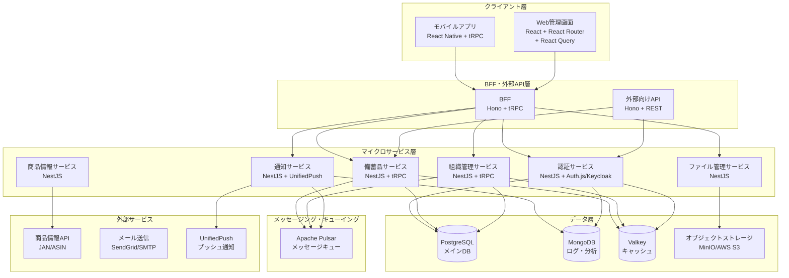
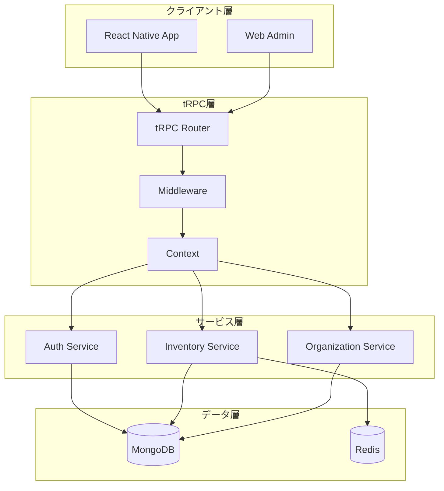
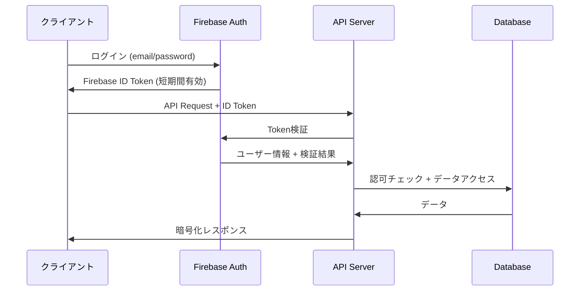

# 設計書

## 概要

備蓄管理用クロスプラットフォームアプリケーションの技術設計書。Android・iOS対応のモバイルアプリ、Web管理画面、バックエンドAPI、クラウドインフラストラクチャを含む包括的なシステム設計。

## アーキテクチャ

### システム全体構成



### 技術スタック選択理由

**フロントエンド:**
- **React Native (Expo) + Vite + TypeScript**: クロスプラットフォーム開発効率、高速ビルド、型安全性
- **React + Vite + React Router + React Query + TypeScript**: Web管理画面、高速ビルド、宣言的ルーティング、強力なキャッシュ機能

**BFF・API層:**
- **Hono**: 軽量高速、Edge Runtime対応、Tyme対応、高速ビルド
- **tRPC**: エンドツーエンド型安全性、優れた開発体験

**マイクロサービス:**
- **NestJS + TypeScript + SWC**: エンタープライズ級アーキテクチャ、高速ビルド、依存性注入
- **モジュラー設計**: サービス間疎結合、独立デプロイ可能

**認証:**
- **Auth.js (NextAuth.js)**: 多様なプロバイダー対応、セキュア、オープンソース
- **Keycloak**: エンタープライズ認証、OIDC/SAML対応、自己ホスト可能

**データベース:**
- **PostgreSQL + Prisma + Kysely**: ACID準拠、データ整合性保証、型安全なクエリ
- **MongoDB**: ログ・分析データ、柔軟なスキーマ

**キャッシュ・メッセージング:**
- **Valkey**: Redis互換、オープンソース、高性能
- **Apache Pulsar**: 多テナント、地理的レプリケーション、高可用性

**通知:**
- **UnifiedPush**: オープンスタンダード、プライバシー重視、ベンダーロックイン回避

**型安全性・開発ツール:**
- **TypeScript + tsgo**: 高速コンパイル、Go言語ベースの次世代TypeScriptコンパイラ
- **tsgolint**: tsgo専用リンター、高速静的解析
- **Biome**: 統一フォーマッター・リンター、Rust製高速ツール
- **Prisma**: データベーススキーマからの型生成
- **tRPC**: API契約の型レベル保証

## コンポーネントとインターフェース

### モバイルアプリ構成

```
src/
├── components/           # 再利用可能コンポーネント
│   ├── common/          # 共通UI部品
│   ├── forms/           # フォーム関連
│   └── lists/           # リスト表示
├── screens/             # 画面コンポーネント
│   ├── auth/            # 認証関連画面
│   ├── inventory/       # 備蓄品管理画面
│   ├── organization/    # 組織管理画面
│   └── settings/        # 設定画面
├── services/            # API通信・外部サービス
├── store/               # 状態管理 (Redux Toolkit)
├── utils/               # ユーティリティ関数
└── navigation/          # ナビゲーション設定
```

### API通信プロトコル選択

#### プロトコル比較分析

**tRPC (推奨選択)**
- **型安全性**: TypeScriptネイティブ、エンドツーエンド型安全性
- **開発効率**: 自動型生成、優れたDX
- **パフォーマンス**: HTTP/JSON、適度な軽量性
- **エコシステム**: React Query統合、豊富なミドルウェア

**GraphQL**
- **柔軟性**: クエリの柔軟性、Over/Under-fetching解決
- **型安全性**: スキーマファースト、コード生成必要
- **複雑性**: 学習コスト高、キャッシュ戦略複雑
- **オーバーヘッド**: 小規模アプリには過剰

**gRPC**
- **パフォーマンス**: Protocol Buffers、高速バイナリ通信
- **型安全性**: .protoファイルからの型生成
- **制約**: ブラウザサポート限定、HTTP/2必須
- **複雑性**: 設定・デバッグが複雑

**REST API**
- **シンプル性**: 理解しやすい、標準的
- **型安全性**: 手動型定義、同期が困難
- **柔軟性**: 低い、Over-fetching問題

#### tRPC アーキテクチャ設計



#### tRPC ルーター定義

**サーバーサイド (server/trpc/router.ts)**
```typescript
import { z } from 'zod';
import { router, publicProcedure, protectedProcedure } from './trpc';
import { TRPCError } from '@trpc/server';

// 入力バリデーションスキーマ
const createInventoryItemSchema = z.object({
  name: z.string().min(1).max(100),
  brand: z.string().optional(),
  category: z.enum(['food', 'daily_goods', 'medicine', 'other']),
  quantity: z.number().min(0),
  unit: z.string().min(1),
  minQuantity: z.number().min(0).optional(),
  expiryDate: z.date().optional(),
  bestBeforeDate: z.date().optional(),
  expiryType: z.enum(['expiry', 'bestBefore', 'both']),
  storageLocation: z.string().optional(),
  price: z.object({
    amount: z.number().min(0),
    currency: z.enum(['JPY', 'USD', 'EUR'])
  }).optional(),
  barcode: z.string().optional(),
  asin: z.string().optional(),
  tags: z.array(z.string()).default([]),
  notes: z.string().optional()
});

const inventorySearchSchema = z.object({
  query: z.string().optional(),
  category: z.enum(['food', 'daily_goods', 'medicine', 'other']).optional(),
  storageLocation: z.string().optional(),
  expiryType: z.enum(['expiry', 'bestBefore', 'both']).optional(),
  tags: z.array(z.string()).optional(),
  expiryDateFrom: z.date().optional(),
  expiryDateTo: z.date().optional(),
  page: z.number().min(1).default(1),
  limit: z.number().min(1).max(100).default(20),
  sortBy: z.enum(['name', 'expiryDate', 'createdAt', 'quantity']).default('createdAt'),
  sortOrder: z.enum(['asc', 'desc']).default('desc')
});

// メインルーター
export const appRouter = router({
  // 認証関連
  auth: router({
    register: publicProcedure
      .input(z.object({
        email: z.string().email(),
        password: z.string().min(8),
        displayName: z.string().min(1)
      }))
      .mutation(async ({ input, ctx }) => {
        // Firebase認証 + ユーザー作成
        const user = await ctx.authService.register(input);
        return { user, message: 'Registration successful' };
      }),

    login: publicProcedure
      .input(z.object({
        email: z.string().email(),
        password: z.string()
      }))
      .mutation(async ({ input, ctx }) => {
        const result = await ctx.authService.login(input);
        return result;
      }),

    refresh: protectedProcedure
      .mutation(async ({ ctx }) => {
        const tokens = await ctx.authService.refreshTokens(ctx.user.id);
        return tokens;
      })
  }),

  // 組織管理
  organization: router({
    list: protectedProcedure
      .query(async ({ ctx }) => {
        const organizations = await ctx.organizationService.getUserOrganizations(ctx.user.id);
        return organizations;
      }),

    create: protectedProcedure
      .input(z.object({
        name: z.string().min(1).max(50),
        description: z.string().optional(),
        privacy: z.enum(['public', 'private']).default('private')
      }))
      .mutation(async ({ input, ctx }) => {
        const organization = await ctx.organizationService.create({
          ...input,
          createdBy: ctx.user.id
        });
        return organization;
      }),

    invite: protectedProcedure
      .input(z.object({
        organizationId: z.string(),
        email: z.string().email(),
        role: z.enum(['admin', 'editor', 'viewer']).default('editor')
      }))
      .mutation(async ({ input, ctx }) => {
        // 権限チェック
        await ctx.organizationService.checkPermission(
          input.organizationId, 
          ctx.user.id, 
          'invite'
        );
        
        const invitation = await ctx.organizationService.inviteMember(input);
        return invitation;
      })
  }),

  // 備蓄品管理
  inventory: router({
    list: protectedProcedure
      .input(z.object({
        organizationId: z.string()
      }))
      .query(async ({ input, ctx }) => {
        // 組織アクセス権チェック
        await ctx.organizationService.checkMembership(input.organizationId, ctx.user.id);
        
        const items = await ctx.inventoryService.getItems(input.organizationId);
        return items;
      }),

    search: protectedProcedure
      .input(inventorySearchSchema.extend({
        organizationId: z.string()
      }))
      .query(async ({ input, ctx }) => {
        await ctx.organizationService.checkMembership(input.organizationId, ctx.user.id);
        
        const result = await ctx.inventoryService.search(input);
        return result;
      }),

    create: protectedProcedure
      .input(createInventoryItemSchema.extend({
        organizationId: z.string()
      }))
      .mutation(async ({ input, ctx }) => {
        // 書き込み権限チェック
        await ctx.organizationService.checkPermission(
          input.organizationId, 
          ctx.user.id, 
          'write'
        );

        const item = await ctx.inventoryService.create({
          ...input,
          createdBy: ctx.user.id,
          updatedBy: ctx.user.id
        });
        
        // 活動ログ記録
        await ctx.activityService.log({
          organizationId: input.organizationId,
          userId: ctx.user.id,
          action: 'add',
          targetType: 'inventory',
          targetId: item._id,
          details: { name: item.name }
        });

        return item;
      }),

    update: protectedProcedure
      .input(createInventoryItemSchema.partial().extend({
        id: z.string(),
        organizationId: z.string()
      }))
      .mutation(async ({ input, ctx }) => {
        await ctx.organizationService.checkPermission(
          input.organizationId, 
          ctx.user.id, 
          'write'
        );

        const { id, organizationId, ...updateData } = input;
        const item = await ctx.inventoryService.update(id, {
          ...updateData,
          updatedBy: ctx.user.id
        });

        await ctx.activityService.log({
          organizationId,
          userId: ctx.user.id,
          action: 'update',
          targetType: 'inventory',
          targetId: id,
          details: updateData
        });

        return item;
      }),

    consume: protectedProcedure
      .input(z.object({
        itemId: z.string(),
        organizationId: z.string(),
        quantity: z.number().min(0.1),
        reason: z.string().optional()
      }))
      .mutation(async ({ input, ctx }) => {
        await ctx.organizationService.checkPermission(
          input.organizationId, 
          ctx.user.id, 
          'write'
        );

        const result = await ctx.inventoryService.consume({
          ...input,
          userId: ctx.user.id
        });

        await ctx.activityService.log({
          organizationId: input.organizationId,
          userId: ctx.user.id,
          action: 'consume',
          targetType: 'inventory',
          targetId: input.itemId,
          details: { quantity: input.quantity, reason: input.reason }
        });

        return result;
      }),

    getExpiring: protectedProcedure
      .input(z.object({
        organizationId: z.string(),
        days: z.number().min(1).max(365).default(30)
      }))
      .query(async ({ input, ctx }) => {
        await ctx.organizationService.checkMembership(input.organizationId, ctx.user.id);
        
        const items = await ctx.inventoryService.getExpiringItems(
          input.organizationId, 
          input.days
        );
        return items;
      })
  }),

  // 商品情報・バーコード
  product: router({
    getByBarcode: protectedProcedure
      .input(z.object({
        barcode: z.string().min(8).max(13)
      }))
      .query(async ({ input, ctx }) => {
        const product = await ctx.productService.getByBarcode(input.barcode);
        return product;
      }),

    getByAsin: protectedProcedure
      .input(z.object({
        asin: z.string().length(10)
      }))
      .query(async ({ input, ctx }) => {
        const product = await ctx.productService.getByAsin(input.asin);
        return product;
      })
  }),

  // 画像管理
  image: router({
    getUploadUrl: protectedProcedure
      .input(z.object({
        fileName: z.string(),
        contentType: z.string(),
        organizationId: z.string()
      }))
      .mutation(async ({ input, ctx }) => {
        await ctx.organizationService.checkPermission(
          input.organizationId, 
          ctx.user.id, 
          'write'
        );

        const uploadUrl = await ctx.imageService.getUploadUrl(input);
        return uploadUrl;
      }),

    delete: protectedProcedure
      .input(z.object({
        imageId: z.string(),
        organizationId: z.string()
      }))
      .mutation(async ({ input, ctx }) => {
        await ctx.organizationService.checkPermission(
          input.organizationId, 
          ctx.user.id, 
          'delete'
        );

        await ctx.imageService.delete(input.imageId);
        return { success: true };
      })
  })
});

export type AppRouter = typeof appRouter;
```

#### クライアントサイド統合

**React Native クライアント (client/trpc.ts)**
```typescript
import { createTRPCReact } from '@trpc/react-query';
import { createTRPCMsw } from 'msw-trpc';
import type { AppRouter } from '../server/trpc/router';

// tRPC React フック
export const trpc = createTRPCReact<AppRouter>();

// MSW モック (テスト用)
export const trpcMsw = createTRPCMsw<AppRouter>();

// クライアント設定
import { httpBatchLink } from '@trpc/client';
import { createTRPCClient } from '@trpc/client';

export const trpcClient = createTRPCClient<AppRouter>({
  links: [
    httpBatchLink({
      url: 'https://api.inventory-app.com/trpc',
      headers: async () => {
        const token = await getAuthToken();
        return {
          authorization: token ? `Bearer ${token}` : '',
        };
      },
    }),
  ],
});
```

**React Native コンポーネント使用例**
```typescript
import React from 'react';
import { View, Text, Button } from 'react-native';
import { trpc } from '../trpc';

export const InventoryList: React.FC<{ organizationId: string }> = ({ organizationId }) => {
  // 型安全なクエリ
  const { data: items, isLoading, error } = trpc.inventory.list.useQuery({
    organizationId
  });

  // 型安全なミューテーション
  const createMutation = trpc.inventory.create.useMutation({
    onSuccess: () => {
      // キャッシュ無効化
      trpc.inventory.list.invalidate({ organizationId });
    }
  });

  const handleCreate = () => {
    createMutation.mutate({
      organizationId,
      name: '新しい商品',
      category: 'food',
      quantity: 1,
      unit: '個',
      expiryType: 'bestBefore'
    });
  };

  if (isLoading) return <Text>Loading...</Text>;
  if (error) return <Text>Error: {error.message}</Text>;

  return (
    <View>
      {items?.map(item => (
        <Text key={item._id}>{item.name} - {item.quantity}{item.unit}</Text>
      ))}
      <Button title="商品追加" onPress={handleCreate} />
    </View>
  );
};
```

#### 型安全性の利点

**コンパイル時保証**
- API契約の自動同期
- 型不整合の即座検出
- リファクタリング安全性

**開発体験向上**
- 自動補完・IntelliSense
- エラーの早期発見
- ドキュメント不要

## データベース設計

### Prisma スキーマ定義 (prisma/schema.prisma)

```prisma
generator client {
  provider = "prisma-client-js"
}

generator kysely {
  provider = "prisma-kysely"
}

datasource db {
  provider = "postgresql"
  url      = env("DATABASE_URL")
}

// ユーザー
model User {
  id          String   @id @default(cuid())
  email       String   @unique
  displayName String
  authId      String   @unique // Auth.js/Keycloak ID
  profileImage String?
  isActive    Boolean  @default(true)
  createdAt   DateTime @default(now())
  updatedAt   DateTime @updatedAt

  // リレーション
  organizationMembers OrganizationMember[]
  createdOrganizations Organization[] @relation("OrganizationCreator")
  createdInventoryItems InventoryItem[] @relation("InventoryItemCreator")
  updatedInventoryItems InventoryItem[] @relation("InventoryItemUpdater")
  consumptionLogs ConsumptionLog[]
  activityLogs    ActivityLog[]

  @@map("users")
}

// 組織
model Organization {
  id          String   @id @default(cuid())
  name        String
  description String?
  inviteCode  String   @unique @default(cuid())
  privacy     Privacy  @default(PRIVATE)
  isActive    Boolean  @default(true)
  createdById String
  createdAt   DateTime @default(now())
  updatedAt   DateTime @updatedAt

  // リレーション
  createdBy     User                 @relation("OrganizationCreator", fields: [createdById], references: [id])
  members       OrganizationMember[]
  inventoryItems InventoryItem[]
  consumptionLogs ConsumptionLog[]
  activityLogs  ActivityLog[]

  @@map("organizations")
}

// 組織メンバー
model OrganizationMember {
  id             String   @id @default(cuid())
  organizationId String
  userId         String
  role           UserRole @default(EDITOR)
  permissions    Permission[]
  joinedAt       DateTime @default(now())
  isActive       Boolean  @default(true)

  // リレーション
  organization Organization @relation(fields: [organizationId], references: [id], onDelete: Cascade)
  user         User         @relation(fields: [userId], references: [id], onDelete: Cascade)

  @@unique([organizationId, userId])
  @@map("organization_members")
}

// 備蓄品
model InventoryItem {
  id             String            @id @default(cuid())
  organizationId String
  name           String
  brand          String?
  category       InventoryCategory
  quantity       Decimal           @db.Decimal(10, 3)
  unit           String
  minQuantity    Decimal?          @db.Decimal(10, 3)
  
  // 期限管理
  expiryDate     DateTime?
  bestBeforeDate DateTime?
  expiryType     ExpiryType
  
  // 保管・価格情報
  storageLocation String?
  priceAmount     Decimal?  @db.Decimal(10, 2)
  priceCurrency   Currency?
  
  // 商品識別
  barcode        String?
  asin           String?
  
  // メタデータ
  tags           String[]
  images         String[]
  notes          String?
  
  // 履歴
  createdById    String
  updatedById    String
  createdAt      DateTime @default(now())
  updatedAt      DateTime @updatedAt

  // リレーション
  organization    Organization     @relation(fields: [organizationId], references: [id], onDelete: Cascade)
  createdBy       User             @relation("InventoryItemCreator", fields: [createdById], references: [id])
  updatedBy       User             @relation("InventoryItemUpdater", fields: [updatedById], references: [id])
  consumptionLogs ConsumptionLog[]

  // インデックス
  @@index([organizationId, name])
  @@index([organizationId, expiryDate])
  @@index([organizationId, category])
  @@index([barcode])
  @@map("inventory_items")
}

// 消費履歴
model ConsumptionLog {
  id              String    @id @default(cuid())
  inventoryItemId String
  organizationId  String
  userId          String
  quantity        Decimal   @db.Decimal(10, 3)
  reason          String?
  consumedAt      DateTime
  createdAt       DateTime  @default(now())

  // リレーション
  inventoryItem InventoryItem @relation(fields: [inventoryItemId], references: [id], onDelete: Cascade)
  organization  Organization  @relation(fields: [organizationId], references: [id], onDelete: Cascade)
  user          User          @relation(fields: [userId], references: [id])

  @@index([organizationId, consumedAt])
  @@index([inventoryItemId, consumedAt])
  @@map("consumption_logs")
}

// 活動ログ (MongoDB用は別途定義)
model ActivityLog {
  id             String       @id @default(cuid())
  organizationId String
  userId         String
  action         ActivityAction
  targetType     String
  targetId       String
  details        Json
  createdAt      DateTime     @default(now())

  // リレーション
  organization Organization @relation(fields: [organizationId], references: [id], onDelete: Cascade)
  user         User         @relation(fields: [userId], references: [id])

  @@index([organizationId, createdAt])
  @@index([userId, createdAt])
  @@map("activity_logs")
}

// 列挙型定義
enum UserRole {
  ADMIN
  EDITOR
  VIEWER
}

enum Permission {
  READ
  WRITE
  DELETE
  INVITE
  MANAGE
}

enum Privacy {
  PUBLIC
  PRIVATE
}

enum ExpiryType {
  EXPIRY      // 消費期限
  BEST_BEFORE // 賞味期限
  BOTH        // 両方
}

enum InventoryCategory {
  FOOD
  DAILY_GOODS
  MEDICINE
  OTHER
}

enum Currency {
  JPY
  USD
  EUR
}

enum ActivityAction {
  ADD
  UPDATE
  DELETE
  CONSUME
}
```

### Kysely 型安全クエリ

**データベースアクセス層 (db/kysely.ts)**
```typescript
import { Kysely, PostgresDialect } from 'kysely';
import { Pool } from 'pg';
import { DB } from './types'; // Prisma生成型

const dialect = new PostgresDialect({
  pool: new Pool({
    connectionString: process.env.DATABASE_URL,
    max: 20,
  }),
});

export const db = new Kysely<DB>({
  dialect,
  log: process.env.NODE_ENV === 'development' ? ['query'] : [],
});

// 型安全なクエリ例
export class InventoryRepository {
  async findByOrganization(organizationId: string) {
    return await db
      .selectFrom('inventory_items')
      .selectAll()
      .where('organizationId', '=', organizationId)
      .where('quantity', '>', 0)
      .orderBy('expiryDate', 'asc')
      .execute();
  }

  async findExpiring(organizationId: string, days: number) {
    const futureDate = new Date();
    futureDate.setDate(futureDate.getDate() + days);

    return await db
      .selectFrom('inventory_items')
      .selectAll()
      .where('organizationId', '=', organizationId)
      .where((eb) => eb.or([
        eb('expiryDate', '<=', futureDate),
        eb('bestBeforeDate', '<=', futureDate)
      ]))
      .orderBy('expiryDate', 'asc')
      .execute();
  }

  async searchItems(params: {
    organizationId: string;
    query?: string;
    category?: string;
    storageLocation?: string;
    limit: number;
    offset: number;
  }) {
    let query = db
      .selectFrom('inventory_items')
      .selectAll()
      .where('organizationId', '=', params.organizationId);

    if (params.query) {
      query = query.where((eb) => eb.or([
        eb('name', 'ilike', `%${params.query}%`),
        eb('brand', 'ilike', `%${params.query}%`)
      ]));
    }

    if (params.category) {
      query = query.where('category', '=', params.category as any);
    }

    if (params.storageLocation) {
      query = query.where('storageLocation', 'ilike', `%${params.storageLocation}%`);
    }

    

### API 型定義 (shared/api-type
      .execute();
  }

  async updateQuantity(id: string, quantity: number, updatedById: string) {
    return await db
      .updateTable('inventory_items')
      .set({
        quantity: quantity.toString(),
        updatedById,
        updatedAt: new Date()
      })
      .where('id', '=', id)
      .returningAll()
      .executeTakeFirstOrThrow();
  }
}
```

### MongoDB ログ・分析データ

**活動ログ・分析用 (MongoDB)**
```typescript
// MongoDB スキーマ (Mongoose)
import { Schema, model } from 'mongoose';

// 詳細活動ログ
const DetailedActivityLogSchema = new Schema({
  organizationId: { type: String, required: true, index: true },
  userId: { type: String, required: true, index: true },
  action: { type: String, required: true },
  targetType: { type: String, required: true },
  targetId: { type: String, required: true },
  details: { type: Schema.Types.Mixed },
  metadata: {
    userAgent: String,
    ipAddress: String,
    sessionId: String,
    deviceInfo: Schema.Types.Mixed
  },
  timestamp: { type: Date, default: Date.now, index: true }
}, {
  timeseries: {
    timeField: 'timestamp',
    metaField: 'organizationId',
    granularity: 'hours'
  }
});

// 使用統計
const UsageStatsSchema = new Schema({
  organizationId: { type: String, required: true },
  date: { type: Date, required: true },
  metrics: {
    itemsAdded: { type: Number, default: 0 },
    itemsConsumed: { type: Number, default: 0 },
    itemsExpired: { type: Number, default: 0 },
    activeUsers: { type: Number, default: 0 },
    totalValue: { type: Number, default: 0 }
  }
}, {
  index: { organizationId: 1, date: 1 }
});

export const DetailedActivityLog = model('DetailedActivityLog', DetailedActivityLogSchema);
export const UsageStats = model('UsageStats', UsageStatsSchema);
```s.ts)

**リクエスト・レスポンス型**
```typescript
// 共通レスポンス型
export interface ApiResponse<T> {
  readonly success: boolean;
  readonly data?: T;
  readonly error?: ApiError;
  readonly timestamp: string;
}

export interface ApiError {
  readonly code: string;
  readonly message: string;
  readonly details?: Record<string, unknown>;
}

// ページネーション
export interface PaginatedResponse<T> extends ApiResponse<T[]> {
  readonly pagination: {
    readonly page: number;
    readonly limit: number;
    readonly total: number;
    readonly hasNext: boolean;
    readonly hasPrev: boolean;
  };
}

// 認証関連
export interface LoginRequest {
  readonly email: string;
  readonly password: string;
}

export interface LoginResponse {
  readonly user: User;
  readonly accessToken: string;
  readonly refreshToken: string;
  readonly expiresIn: number;
}

// 備蓄品関連
export interface CreateInventoryItemRequest {
  readonly name: string;
  readonly brand?: string;
  readonly category: InventoryCategory;
  readonly quantity: number;
  readonly unit: string;
  readonly minQuantity?: number;
  readonly expiryDate?: string; // ISO date string
  readonly bestBeforeDate?: string;
  readonly expiryType: ExpiryType;
  readonly storageLocation?: string;
  readonly price?: Money;
  readonly barcode?: string;
  readonly asin?: string;
  readonly tags?: readonly string[];
  readonly notes?: string;
}

export interface UpdateInventoryItemRequest extends Partial<CreateInventoryItemRequest> {
  readonly _id: InventoryItemId;
}

export interface ConsumeInventoryRequest {
  readonly inventoryItemId: InventoryItemId;
  readonly quantity: number;
  readonly reason?: string;
}

// 検索・フィルタ
export interface InventorySearchRequest {
  readonly query?: string;
  readonly category?: InventoryCategory;
  readonly storageLocation?: string;
  readonly expiryType?: ExpiryType;
  readonly tags?: readonly string[];
  readonly expiryDateFrom?: string;
  readonly expiryDateTo?: string;
  readonly page?: number;
  readonly limit?: number;
  readonly sortBy?: 'name' | 'expiryDate' | 'createdAt' | 'quantity';
  readonly sortOrder?: 'asc' | 'desc';
}
```

### Mongoose スキーマ型安全性

**型安全なスキーマ定義**
```typescript
import { Schema, model, Document } from 'mongoose';
import { User, Organization, InventoryItem } from '../shared/types';

// Document型の拡張
export interface UserDocument extends User, Document {}
export interface OrganizationDocument extends Organization, Document {}
export interface InventoryItemDocument extends InventoryItem, Document {}

// スキーマ定義
const UserSchema = new Schema<UserDocument>({
  email: { type: String, required: true, unique: true },
  displayName: { type: String, required: true },
  firebaseUid: { type: String, required: true, unique: true },
  profileImage: { type: String },
}, {
  timestamps: true,
  toJSON: { virtuals: true },
  toObject: { virtuals: true }
});

const InventoryItemSchema = new Schema<InventoryItemDocument>({
  organizationId: { type: Schema.Types.ObjectId, required: true, ref: 'Organization' },
  name: { type: String, required: true },
  brand: { type: String },
  category: { 
    type: String, 
    required: true, 
    enum: Object.values(InventoryCategory) 
  },
  quantity: { type: Number, required: true, min: 0 },
  unit: { type: String, required: true },
  minQuantity: { type: Number, min: 0 },
  expiryDate: { type: Date },
  bestBeforeDate: { type: Date },
  expiryType: { 
    type: String, 
    required: true, 
    enum: Object.values(ExpiryType) 
  },
  storageLocation: { type: String },
  price: {
    amount: { type: Number, min: 0 },
    currency: { type: String, enum: ['JPY', 'USD', 'EUR'] }
  },
  barcode: { type: String },
  asin: { type: String },
  tags: [{ type: String }],
  images: [{ type: String }],
  notes: { type: String },
  createdBy: { type: Schema.Types.ObjectId, required: true, ref: 'User' },
  updatedBy: { type: Schema.Types.ObjectId, required: true, ref: 'User' }
}, {
  timestamps: true
});

// インデックス定義
InventoryItemSchema.index({ organizationId: 1, name: 1 });
InventoryItemSchema.index({ organizationId: 1, expiryDate: 1 });
InventoryItemSchema.index({ organizationId: 1, category: 1 });
InventoryItemSchema.index({ barcode: 1 });

export const UserModel = model<UserDocument>('User', UserSchema);
export const InventoryItemModel = model<InventoryItemDocument>('InventoryItem', InventoryItemSchema);
```

### API エンドポイント型安全性

**Express + TypeScript 型安全なルーター**
```typescript
import { Request, Response } from 'express';
import { CreateInventoryItemRequest, ApiResponse, InventoryItem } from '../shared/api-types';

// 型安全なリクエストハンドラー
export interface TypedRequest<T = {}> extends Request {
  body: T;
}

export interface TypedResponse<T = {}> extends Response {
  json(body: ApiResponse<T>): this;
}

// 備蓄品作成エンドポイント
export const createInventoryItem = async (
  req: TypedRequest<CreateInventoryItemRequest>,
  res: TypedResponse<InventoryItem>
): Promise<void> => {
  try {
    // リクエストボディは型安全
    const { name, category, quantity, expiryType } = req.body;
    
    // バリデーション（コンパイル時に型チェック）
    if (!name || !category || quantity < 0) {
      res.status(400).json({
        success: false,
        error: {
          code: 'VALIDATION_ERROR',
          message: 'Invalid request data'
        },
        timestamp: new Date().toISOString()
      });
      return;
    }

    // データベース操作も型安全
    const item = new InventoryItemModel({
      ...req.body,
      organizationId: req.user.organizationId,
      createdBy: req.user.id,
      updatedBy: req.user.id
    });

    await item.save();

    // レスポンスも型安全
    res.json({
      success: true,
      data: item.toObject(),
      timestamp: new Date().toISOString()
    });
  } catch (error) {
    res.status(500).json({
      success: false,
      error: {
        code: 'INTERNAL_ERROR',
        message: 'Internal server error'
      },
      timestamp: new Date().toISOString()
    });
  }
};
```

### フロントエンド型安全性

**React Native + TypeScript**
```typescript
import React from 'react';
import { InventoryItem, CreateInventoryItemRequest } from '../shared/api-types';
import { useCreateInventoryItem } from '../hooks/useInventoryApi';

interface InventoryFormProps {
  onSuccess: (item: InventoryItem) => void;
}

export const InventoryForm: React.FC<InventoryFormProps> = ({ onSuccess }) => {
  const createMutation = useCreateInventoryItem();

  const handleSubmit = (formData: CreateInventoryItemRequest) => {
    // フォームデータは型安全
    createMutation.mutate(formData, {
      onSuccess: (response) => {
        // レスポンスも型安全
        if (response.success && response.data) {
          onSuccess(response.data);
        }
      }
    });
  };

  // JSX内でも型安全な補完が効く
  return (
    <View>
      {/* フォームコンポーネント */}
    </View>
  );
};
```

## エラーハンドリング

### エラー分類と対応

**認証エラー (4xx)**
- 401 Unauthorized: トークン無効・期限切れ → 再ログイン促進
- 403 Forbidden: 権限不足 → 適切な権限レベル表示

**バリデーションエラー (400)**
- 必須フィールド不足
- データ形式不正
- 業務ルール違反

**サーバーエラー (5xx)**
- 500 Internal Server Error: 一般的なサーバーエラー
- 503 Service Unavailable: メンテナンス中

### オフライン対応

**データ同期戦略:**
1. **楽観的更新**: ローカル変更を即座に反映
2. **バックグラウンド同期**: 接続復旧時に自動同期
3. **競合解決**: タイムスタンプベースの最新優先

**ローカルストレージ:**
- SQLite (React Native): オフラインデータ保存
- Redux Persist: アプリ状態の永続化

## テスト戦略

### テスト階層

**Unit Tests (単体テスト)**
- ユーティリティ関数
- データ変換ロジック
- バリデーション関数

**Integration Tests (統合テスト)**
- API エンドポt Naイントtive E2Eテスト
- **Testcontainers**: PostgreSQL/MongoDB テスト環境
- データベース操作
- 外部サービス連携

**E2E Tests (エンドツーエンドテスト)**
- 主要ユーザーフロー
- 認証・組織作成・備蓄品管理

### テストツール
- **Jest**: JavaScript単体テスト
- **Supertest**: API統合テスト
- **Detox**: React Native E2Eテスト
- **MongoDB Memory Server**: テスト用DB

### テストデータ管理
- **Fixtures**: 標準テストデータセット
- **Factory Pattern**: 動的テストデータ生成
- **Database Seeding**: 開発環境データ投入

## セキュリティ考慮事項

### 通信セキュリティ

**HTTPS/TLS 1.3 強制**
- 全ての通信でTLS 1.3を強制
- Certificate Pinning: アプリに証明書を埋め込み、中間者攻撃を防止
- HSTS (HTTP Strict Transport Security) ヘッダーで強制HTTPS

**API認証フロー**


**トークン管理戦略**
- **Access Token**: 15分有効期限、API認証用
- **Refresh Token**: 7日有効期限、セキュアストレージ保存
- **Token Rotation**: リフレッシュ時に新しいRefresh Tokenを発行
- **Revocation**: 不正アクセス検知時の即座トークン無効化

### 認証・認可

**多層認証システム**
1. **Firebase Authentication**: 初期認証
2. **Custom Claims**: 組織・権限情報をトークンに埋め込み
3. **API Level Authorization**: エンドポイント毎の権限チェック
4. **Resource Level Authorization**: データレベルでの所有権確認

**権限管理モデル**
```javascript
// Custom Claims 構造
{
  organizations: {
    "org_id_1": {
      role: "admin",        // admin/editor/viewer
      permissions: ["read", "write", "delete", "invite"]
    },
    "org_id_2": {
      role: "viewer",
      permissions: ["read"]
    }
  }
}
```

### データ保護

**エンドツーエンド暗号化**
- **AES-256-GCM**: 機密データの暗号化
- **Key Derivation**: PBKDF2 + Salt でユーザー固有キー生成
- **Key Management**: AWS KMS でマスターキー管理

**データ分類と保護レベル**
```javascript
// データ分類例
const DATA_CLASSIFICATION = {
  PUBLIC: {
    encryption: false,
    examples: ["商品カテゴリ", "公開統計"]
  },
  INTERNAL: {
    encryption: "transit",
    examples: ["商品名", "保管場所"]
  },
  CONFIDENTIAL: {
    encryption: "end-to-end",
    examples: ["個人メモ", "価格情報"]
  },
  RESTRICTED: {
    encryption: "end-to-end",
    audit: true,
    examples: ["ユーザー個人情報", "組織招待コード"]
  }
};
```

**入力検証・サニタイゼーション**
- **Schema Validation**: Joi/Yup による厳密な入力検証
- **SQL Injection 防止**: Parameterized Queries
- **XSS 防止**: Content Security Policy + 入力エスケープ
- **File Upload 検証**: ファイル形式・サイズ・内容検証

### API セキュリティ

**レート制限・DDoS対策**
```javascript
// レート制限設定例
const RATE_LIMITS = {
  authentication: "5 requests per minute",
  search: "100 requests per minute",
  upload: "10 requests per minute",
  general: "1000 requests per hour"
};
```

**API セキュリティヘッダー**
```javascript
// セキュリティヘッダー設定
const SECURITY_HEADERS = {
  "Strict-Transport-Security": "max-age=31536000; includeSubDomains",
  "Content-Security-Policy": "default-src 'self'",
  "X-Frame-Options": "DENY",
  "X-Content-Type-Options": "nosniff",
  "Referrer-Policy": "strict-origin-when-cross-origin",
  "Permissions-Policy": "camera=(), microphone=(), geolocation=()"
};
```

**リクエスト署名検証**
- **HMAC-SHA256**: リクエストボディの署名検証
- **Timestamp Validation**: リプレイ攻撃防止 (5分以内の有効期限)
- **Nonce**: 一意性保証でリプレイ攻撃防止

### 監査・ログ

**セキュリティ監査ログ**
```javascript
// 監査ログ構造
{
  timestamp: "2024-01-01T00:00:00Z",
  userId: "user_id",
  organizationId: "org_id",
  action: "inventory.delete",
  resource: "item_id",
  ipAddress: "192.168.1.1",
  userAgent: "...",
  result: "success|failure",
  riskScore: 0.2,        // 0-1 のリスクスコア
  metadata: {
    previousValue: "...",
    newValue: "..."
  }
}
```

**異常検知・アラート**
- **ログイン異常**: 地理的位置・時間・デバイスの変化
- **大量操作**: 短時間での大量データ変更
- **権限昇格**: 通常と異なる権限での操作
- **データ流出**: 大量データダウンロード

### プライバシー・コンプライアンス

**GDPR/個人情報保護法対応**
- **データ最小化**: 必要最小限のデータ収集
- **同意管理**: 明示的な同意取得・管理
- **忘れられる権利**: 完全なデータ削除機能
- **データポータビリティ**: データエクスポート機能

**データ保持ポリシー**
```javascript
const DATA_RETENTION = {
  userAccount: "アカウント削除後30日で完全削除",
  inventoryData: "組織退会後90日で匿名化",
  auditLogs: "7年間保持（法的要件）",
  images: "参照されなくなった後1年で削除"
};
```

### セキュリティテスト

**ペネトレーションテスト**
- **OWASP Top 10**: 定期的な脆弱性スキャン
- **API Security**: 認証・認可の抜け穴チェック
- **Mobile Security**: アプリの逆解析・改ざん対策

**セキュリティ監視**
- **SIEM**: セキュリティ情報・イベント管理
- **WAF**: Web Application Firewall
- **IDS/IPS**: 侵入検知・防止システム

## パフォーマンス最適化

### フロントエンド最適化
- **画像最適化**: WebP形式、適切なサイズ変換
- **遅延読み込み**: 大量リストの仮想化
- **キャッシュ戦略**: API レスポンスキャッシュ

### バックエンド最適化
- **データベースインデックス**: 検索・ソート性能向上
- **Redis キャッシュ**: 頻繁アクセスデータ
- **CDN**: 画像配信最適化

### モニタリング
- **APM**: アプリケーション性能監視
- **ログ集約**: 構造化ログ、エラー追跡
- **メトリクス**: レスポンス時間、エラー率

## デプロイメント・インフラ

### 開発環境
- **Docker**: 開発環境統一
- **Docker Compose**: ローカル開発スタック

### 本番環境 (AWS)
- **ECS Fargate**: コンテナオーケストレーション
- **Application Load Balancer**: 負荷分散
- **RDS MongoDB**: マネージドデータベース
- **S3**: 画像ストレージ
- **CloudFront**: CDN
- **Route 53**: DNS管理

### CI/CD パイプライン
- **GitHub Actions**: 自動テスト・デプロイ
- **Staging環境**: 本番前検証
- **Blue-Green デプロイ**: ゼロダウンタイム更新
## ビルドツ
ール・モノレポ構成

### Turborepo モノレポ構成

```
inventory-app/
├── apps/
│   ├── mobile/                 # React Native アプリ
│   ├── web-admin/             # React 管理画面
│   ├── bff/                   # Hono BFF
│   ├── external-api/          # Hono 外部API
│   └── services/
│       ├── auth-service/      # NestJS 認証サービス
│       ├── inventory-service/ # NestJS 備蓄品サービス
│       ├── org-service/       # NestJS 組織サービス
│       ├── notify-service/    # NestJS 通知サービス
│       ├── file-service/      # NestJS ファイルサービス
│       └── product-service/   # NestJS 商品情報サービス
├── packages/
│   ├── shared-types/          # 共有型定義
│   ├── trpc-router/          # tRPC ルーター定義
│   ├── database/             # Prisma スキーマ・マイグレーション
│   ├── ui-components/        # 共有UIコンポーネント
│   ├── utils/                # 共通ユーティリティ
│   └── config/               # 共通設定
├── tools/
│   ├── biome-config/         # Biome 設定
│   ├── tsgo-config/          # tsgo TypeScript 設定
│   ├── tsgolint-config/      # tsgolint 設定
│   └── vitest-config/        # Vitest 設定
└── turbo.json                # Turborepo 設定
```

### Turborepo 設定 (turbo.json)

```json
{
  "$schema": "https://turbo.build/schema.json",
  "globalDependencies": ["**/.env.*local"],
  "pipeline": {
    "build": {
      "dependsOn": ["^build"],
      "outputs": ["dist/**", ".next/**", "build/**"]
    },
    "test": {
      "dependsOn": ["^build"],
      "outputs": ["coverage/**"]
    },
    "test:unit": {
      "dependsOn": ["^build"]
    },
    "test:integration": {
      "dependsOn": ["^build", "db:migrate"]
    },
    "test:e2e": {
      "dependsOn": ["^build", "db:migrate", "dev"]
    },
    "lint": {
      "outputs": []
    },
    "lint:tsgolint": {
      "outputs": []
    },
    "format": {
      "outputs": []
    },
    "format:check": {
      "outputs": []
    },
    "type-check": {
      "dependsOn": ["^build"],
      "outputs": []
    },
    "dev": {
      "cache": false,
      "persistent": true
    },
    "db:migrate": {
      "cache": false
    },
    "db:generate": {
      "dependsOn": ["^db:generate"],
      "outputs": ["node_modules/.prisma/**"]
    }
  }
}
```

### ビルドツール統合

**tsgo + Biome 設定**

```json
// tools/tsgo-config/tsconfig.base.json
{
  "compilerOptions": {
    "target": "ES2022",
    "module": "ESNext",
    "moduleResolution": "bundler",
    "strict": true,
    "exactOptionalPropertyTypes": true,
    "noUncheckedIndexedAccess": true,
    "noImplicitOverride": true,
    "declaration": true,
    "declarationMap": true,
    "sourceMap": true,
    "composite": true,
    "skipLibCheck": true,
    "allowSyntheticDefaultImports": true,
    "esModuleInterop": true,
    "forceConsistentCasingInFileNames": true
  },
  "exclude": ["node_modules", "dist", "build"]
}
```

```json
// tools/biome-config/biome.json
{
  "$schema": "https://biomejs.dev/schemas/1.4.1/schema.json",
  "organizeImports": {
    "enabled": true
  },
  "linter": {
    "enabled": true,
    "rules": {
      "recommended": true,
      "complexity": {
        "noExtraBooleanCast": "error",
        "noMultipleSpacesInRegularExpressionLiterals": "error",
        "noUselessCatch": "error",
        "noUselessTypeConstraint": "error"
      },
      "correctness": {
        "noConstAssign": "error",
        "noConstantCondition": "error",
        "noEmptyCharacterClassInRegex": "error",
        "noEmptyPattern": "error",
        "noGlobalObjectCalls": "error",
        "noInvalidConstructorSuper": "error",
        "noInvalidNewBuiltin": "error",
        "noNonoctalDecimalEscape": "error",
        "noPrecisionLoss": "error",
        "noSelfAssign": "error",
        "noSetterReturn": "error",
        "noSwitchDeclarations": "error",
        "noUndeclaredVariables": "error",
        "noUnreachable": "error",
        "noUnreachableSuper": "error",
        "noUnsafeFinally": "error",
        "noUnsafeOptionalChaining": "error",
        "noUnusedLabels": "error",
        "noUnusedVariables": "error",
        "useIsNan": "error",
        "useValidForDirection": "error",
        "useYield": "error"
      },
      "suspicious": {
        "noAsyncPromiseExecutor": "error",
        "noCatchAssign": "error",
        "noClassAssign": "error",
        "noCompareNegZero": "error",
        "noControlCharactersInRegex": "error",
        "noDebugger": "error",
        "noDuplicateCase": "error",
        "noDuplicateClassMembers": "error",
        "noDuplicateObjectKeys": "error",
        "noDuplicateParameters": "error",
        "noEmptyBlockStatements": "error",
        "noExplicitAny": "warn",
        "noExtraNonNullAssertion": "error",
        "noFallthroughSwitchClause": "error",
        "noFunctionAssign": "error",
        "noGlobalAssign": "error",
        "noImportAssign": "error",
        "noMisleadingCharacterClass": "error",
        "noPrototypeBuiltins": "error",
        "noRedeclare": "error",
        "noShadotedNames": "error",
        "noUnsafeNegation": "error",
        "useGetterReturn": "error",
        "useValidTypeof": "error"
      }
    }
  },
  "formatter": {
    "enabled": true,
    "formatWithErrors": false,
    "indentStyle": "space",
    "indentWidth": 2,
    "lineWidth": 100,
    "lineEnding": "lf"
  },
  "javascript": {
    "formatter": {
      "jsxQuoteStyle": "double",
      "quoteProperties": "asNeeded",
      "trailingComma": "es5",
      "semicolons": "always",
      "arrowParentheses": "always",
      "bracketSpacing": true,
      "bracketSameLine": false,
      "quoteStyle": "single",
      "attributePosition": "auto"
    }
  },
  "json": {
    "formatter": {
      "trailingCommas": "none"
    }
  }
}
```

```yaml
# tools/tsgolint-config/.tsgolint.yml
rules:
  # TypeScript specific rules
  no-any: error
  no-explicit-any: warn
  prefer-readonly: error
  prefer-readonly-parameter-types: error
  
  # Import/Export rules
  no-default-export: warn
  prefer-namespace-keyword: error
  
  # Function rules
  prefer-function-type: error
  no-unnecessary-type-assertion: error
  
  # Class rules
  no-parameter-properties: off
  prefer-readonly-array: error
  
  # Generic rules
  no-inferrable-types: error
  no-unnecessary-qualifier: error
  
  # Promise rules
  no-floating-promises: error
  prefer-promise-shorthand: error

extends:
  - "@tsgolint/recommended"
  - "@tsgolint/strict"
```

**Vite (BFF・外部API)**
```typescript
// apps/bff/vite.config.ts
import { defineConfig } from 'vite';
import { resolve } from 'path';

export default defineConfig({
  build: {
    lib: {
      entry: resolve(__dirname, 'src/index.ts'),
      name: 'BFF',
      fileName: 'index'
    },
    rollupOptions: {
      external: ['hono', '@trpc/server']
    }
  },
  test: {
    globals: true,
    environment: 'node'
  },
  esbuild: false, // tsgoを使用するためesbuildを無効化
  plugins: [
    // tsgo plugin for Vite
    {
      name: 'tsgo',
      buildStart() {
        // tsgo compilation logic
      }
    }
  ]
});
```

**Metro (React Native)**
```javascript
// apps/mobile/metro.config.js
const { getDefaultConfig } = require('expo/metro-config');
const path = require('path');

const config = getDefaultConfig(__dirname);

// モノレポ対応
const projectRoot = __dirname;
const workspaceRoot = path.resolve(projectRoot, '../..');

config.watchFolders = [workspaceRoot];
config.resolver.nodeModulesPaths = [
  path.resolve(projectRoot, 'node_modules'),
  path.resolve(workspaceRoot, 'node_modules'),
];

module.exports = config;
```

**SWC (NestJS サービス)**
```typescript
// apps/services/auth-service/nest-cli.json
{
  "collection": "@nestjs/schematics",
  "sourceRoot": "src",
  "compilerOptions": {
    "deleteOutDir": true,
    "builder": "swc",
    "typeCheck": true
  }
}
```

```json
// apps/services/auth-service/.swcrc
{
  "jsc": {
    "parser": {
      "syntax": "typescript",
      "decorators": true,
      "dynamicImport": true
    },
    "target": "es2022",
    "keepClassNames": true,
    "transform": {
      "legacyDecorator": true,
      "decoratorMetadata": true
    }
  },
  "module": {
    "type": "commonjs"
  },
  "sourceMaps": true
}
```

**Vite (React Web管理画面)**
```typescript
// apps/web-admin/vite.config.ts
import { defineConfig } from 'vite';
import react from '@vitejs/plugin-react-swc';
import { resolve } from 'path';

export default defineConfig({
  plugins: [react()],
  resolve: {
    alias: {
      '@': resolve(__dirname, 'src'),
      '@shared': resolve(__dirname, '../../packages/shared-types/src')
    }
  },
  build: {
    outDir: 'dist',
    sourcemap: true,
    rollupOptions: {
      output: {
        manualChunks: {
          vendor: ['react', 'react-dom'],
          router: ['react-router-dom'],
          query: ['@tanstack/react-query']
        }
      }
    }
  },
  test: {
    globals: true,
    environment: 'jsdom',
    setupFiles: ['./src/test/setup.ts']
  }
});
```

### 開発環境・CI/CD

**開発環境**
- **Docker Compose**: ローカル開発スタック（PostgreSQL, MongoDB, Valkey, Pulsar）
- **Turborepo**: 並列ビルド・テスト実行
- **Hot Reload**: 全サービス対応

**CI/CD パイプライン**
```yaml
# .github/workflows/ci.yml
name: CI
on: [push, pull_request]

jobs:
  test:
    runs-on: ubuntu-latest
    steps:
      - uses: actions/checkout@v3
      - uses: actions/setup-node@v3
        with:
          node-version: '18'
          cache: 'npm'
      
      - run: npm ci
      - run: npx turbo run build
      - run: npx turbo run test
      - run: npx turbo run lint
      - run: npx turbo run type-check

  e2e:
    runs-on: ubuntu-latest
    needs: test
    steps:
      - uses: actions/checkout@v3
      - run: npm ci
      - run: npx turbo run test:e2e
```

## デプロイメント・インフラ

### 開発環境
- **Docker Compose**: ローカル開発スタック統一
- **Turborepo**: モノレポ管理・並列実行
- **Testcontainers**: 統合テスト環境

### 本番環境 (Kubernetes)
- **Kubernetes**: マイクロサービスオーケストレーション
- **Helm Charts**: デプロイメント管理
- **Istio**: サービスメッシュ、トラフィック管理
- **PostgreSQL Operator**: データベース管理
- **MinIO**: オブジェクトストレージ

### CI/CD パイプライン
- **GitHub Actions**: 自動テスト・ビルド・デプロイ
- **Staging環境**: 本番前検証
- **Blue-Green デプロイ**: ゼロダウンタイム更新
- **Canary デプロイ**: 段階的リリース