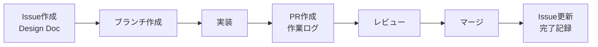

# 開発ワークフロー

## GitHub Issues を Design Doc として活用

本プロジェクトでは、GitHub IssuesをDesign Documentとして活用し、実装前の設計と計画を明確にします。

### Issue作成のガイドライン

#### 1. タイトル規則
```
[Phase X] 機能名/サービス名
```

例：
- `[Phase 1] プロジェクト基盤セットアップ`
- `[Phase 2] 認証サービス実装（Hono + Auth.js）`
- `[Phase 3] React Native モバイルアプリ基盤構築`

#### 2. Design Doc の構成

各Issueは以下の構成で作成します：

1. **概要** - 何を実装するか
2. **背景と目的** - なぜ必要か
3. **技術的設計** - どのように実装するか
   - アーキテクチャ図
   - コード例
   - API設計
4. **実装タスク** - 具体的な作業項目
5. **成功基準** - 完了条件
6. **参考資料** - 関連ドキュメント

#### 3. ラベル管理

フェーズとカテゴリでラベル付けします：

**フェーズラベル：**
- `Phase1` - 基盤構築
- `Phase2` - コアサービス
- `Phase3` - UI/UX
- `Phase4` - 品質・運用

**カテゴリラベル：**
- `Infrastructure` - インフラ・DevOps
- `Backend` - バックエンドサービス
- `Frontend` - フロントエンドアプリ
- `Mobile` - モバイルアプリ
- `Database` - データベース関連
- `Testing` - テスト・品質保証

### Pull Request を作業ログとして活用

#### PR作成時の記載事項

1. **何を実装したか** - 具体的な変更内容
2. **どのように実装したか** - アプローチと技術的決定
3. **なぜその方法を選んだか** - 判断理由
4. **テスト内容** - 動作確認方法
5. **残課題** - 今後の改善点

#### PR テンプレート例

```markdown
## 関連Issue
Closes #XX

## 実装内容
- [ ] 機能Aの実装
- [ ] テストの追加
- [ ] ドキュメント更新

## 技術的決定事項
- XXXライブラリを選択した理由：
- アーキテクチャの変更点：

## テスト結果
- 単体テスト：✅
- 統合テスト：✅
- 動作確認環境：

## スクリーンショット/動作確認
[必要に応じて]

## 今後の課題
- [ ] パフォーマンス最適化
- [ ] エラーハンドリング改善
```

### ワークフローの流れ



### コミットメッセージ規約

[Conventional Commits](https://www.conventionalcommits.org/)に従います：

```
<type>(<scope>): <subject>

<body>

<footer>
```

**Type:**
- `feat`: 新機能
- `fix`: バグ修正
- `docs`: ドキュメント
- `style`: フォーマット修正
- `refactor`: リファクタリング
- `test`: テスト追加・修正
- `chore`: ビルド・補助ツール

**例:**
```
feat(auth): add JWT refresh token rotation

Implement token rotation for enhanced security.
Old refresh tokens are invalidated after use.

Closes #7
```

### ブランチ戦略

```
main
├── feature/[issue-number]-[feature-name]
├── fix/[issue-number]-[bug-description]
└── chore/[task-description]
```

**例:**
- `feature/7-auth-service`
- `fix/15-login-validation`
- `chore/update-dependencies`

### 実装の優先順位

1. **Phase 1** - 基盤構築（必須）
2. **Phase 2** - コアサービス（並行実装可能）
3. **Phase 3** - UI/UX（Phase 2依存）
4. **Phase 4** - 品質・運用（継続的）

### レビューチェックリスト

- [ ] コーディング規約に準拠
- [ ] テストが追加されている
- [ ] ドキュメントが更新されている
- [ ] 型安全性が保たれている
- [ ] エラーハンドリングが適切
- [ ] パフォーマンスへの影響を考慮